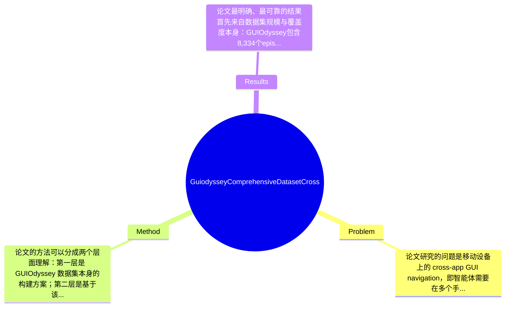

## Summary
这篇论文聚焦于移动端 cross-app GUI navigation 问题，提出了一个大规模跨应用数据集 GUIOdyssey，并基于该数据集构建了带有 history resampler 的多模态代理 OdysseyAgent，以提升长步骤、多应用切换任务中的决策与推理能力。GUIOdyssey包含8,334个episodes、平均15.3步、覆盖6种设备、212个apps和1,357种app组合，并为每一步提供semantic reasoning annotations。实验表明，该数据集和历史信息建模对in-domain与out-of-domain的复杂跨应用任务都有明显帮助，但从论文给出的信息看，其贡献更偏向“数据集+任务定义+工程化代理验证”，而不是全新agent范式突破。

## Problem & Motivation
论文研究的问题是移动设备上的 cross-app GUI navigation，即智能体需要在多个手机应用之间连续执行操作，完成包含上下文迁移、跨应用信息传递和长时依赖决策的复杂任务。这属于 GUI agent / multimodal agent / embodied decision making 的交叉领域。与传统单应用GUI任务不同，cross-app任务往往不能简单拆解成若干独立子任务，因为前一应用中的内容选择、状态变化和中间结果，会直接决定下一应用中的操作路径，因此它本质上是一个部分可观测、长序列、多界面状态迁移的问题。这个问题很重要，因为现实中的手机使用场景大量依赖跨应用流程，例如分享内容、复制地址、发送日程、打开地图、保存图片再转发等，尤其对自动化助理、无障碍交互和生产力工具有直接价值。

现有方法的局限，论文指出且从背景中也能看出至少有三点。第一，现有数据集如 AITW、AndroidControl 主要是 single-app 任务，导致模型虽然能学会点击、滑动等局部动作，但难以学习跨应用上下文迁移。第二，已有数据多强调操作轨迹，而缺乏细粒度 semantic reasoning annotations，因此模型容易学成“视觉-动作模板匹配器”，而非真正具备任务级推理能力。第三，长历史建模是个瓶颈：cross-app任务平均步数更长，若把所有历史截图直接送入模型，推理成本会迅速上升，实际部署困难。

在这种背景下，作者提出 GUIOdyssey 的动机是合理的：如果训练数据本身不包含多应用流程、多设备变化和语义级推理监督，那么再强的 foundation model 也难以在复杂手机任务上稳定泛化。论文的关键洞察有两个：一是“数据分布决定能力边界”，要提升 cross-app agent，就需要专门构造跨应用、多步、带语义标注的数据；二是“历史信息是必要但昂贵的”，因此需要用 history resampler 在性能与速度之间做折中。这一动机总体成立，不过论文也隐含假设：只要扩充跨应用数据并加入历史建模，就能显著缓解真实世界复杂GUI任务，这一点还需要更强的开放环境验证。

## Method
论文的方法可以分成两个层面理解：第一层是 GUIOdyssey 数据集本身的构建方案；第二层是基于该数据集训练和评估的 OdysseyAgent。整体框架上，作者先定义跨应用任务元数据、动作空间、细粒度episode标注与采集流程，形成一个覆盖多设备、多应用组合、长轨迹任务的数据集；再在此基础上构建一个 exploratory multimodal agent，让模型结合当前截图、任务指令、历史动作、历史截图以及上下文语义注释来预测下一步GUI操作。其核心目标不是发明全新的基础模型，而是验证“专门的数据分布 + 历史信息建模”对长步骤cross-app导航是否有效。

1. 数据集构建与任务定义
该组件的作用是建立一个能真实反映 cross-app 操作复杂性的训练/评测基准。GUIOdyssey包含8,334个episodes，平均每个episode 15.3步，覆盖6个移动设备、212个app和1,357种app组合。这样的设计动机很明确：单应用数据无法覆盖真实手机工作流，因此必须显式采集跨应用链路。与已有数据集相比，它的差异在于任务不是停留在单页面操作，而是强调跨应用切换、状态继承和信息流转。论文还定义了metadata、task categories、action set和episode annotation generation流程，说明其并不是简单录制轨迹，而是试图系统化地表示任务结构。

2. 细粒度 semantic reasoning annotations
该组件是GUIOdyssey的重要特色。每一步除了动作标签外，还带有语义推理信息，用于帮助模型形成“为什么此时要这样操作”的中间认知过程。设计动机是：cross-app任务往往不能仅靠当前界面视觉线索决策，还需要理解历史上下文、子目标与信息迁移关系。与现有偏重action supervision的数据相比，这种annotation更接近 chain-of-thought 式的过程监督，虽然论文未必将其显式命名为CoT，但作用类似。区别在于它服务于GUI决策，而不是纯文本推理。这里的潜在优势是提高长任务上的稳定性；但也意味着标注成本高，而且语义标注质量可能直接影响学习效果。

3. OdysseyAgent 的多模态决策框架
OdysseyAgent被描述为 exploratory multimodal agent，用于长步骤 cross-app navigation。它应当接收当前screen observation、instruction以及历史信息，输出GUI动作。其作用是作为一个验证平台，证明GUIOdyssey能训练出比传统设置更强的代理。设计动机是跨应用任务天然需要多模态融合：视觉界面告诉模型“现在在哪”，文本指令告诉模型“最终做什么”，历史动作和上下文告诉模型“已经做过什么、接下来该衔接什么”。与仅使用当前截图的reactive agent不同，OdysseyAgent强调长期上下文。论文从章节设置看，还专门分析了不同历史信息的效果，说明其架构中的历史建模是核心而非附属。

4. History Resampler 模块
这是方法里最值得注意的技术点。其作用是高效关注历史 screenshot tokens，在保留长期视觉上下文的同时控制推理开销。设计动机非常直接：cross-app episode平均步数高，若将所有历史screenshots完整编码并全量attention，计算量和延迟都难以接受。history resampler 的思路是对历史视觉token做压缩/重采样，让模型只保留对决策最关键的历史信息。与简单截断历史、只保留最后几步、或把历史截图粗暴拼接的方案相比，这种设计更有针对性，也更符合长序列多模态建模需求。不过从摘要信息看，论文未完整展开其底层实现细节，如是否采用 learned queries、cross-attention resampling 或固定采样策略；因此我们只能确认其目标和功能，部分算法细节论文摘录中未提及。

5. 历史信息注入与训练设置
论文专门研究 actions、screenshots、context 等不同历史信息对性能的影响，还比较了 History Resampler 与 Multi-Image Training。这说明训练时并非只依赖当前状态监督，而是显式构造多种历史输入配置。设计上，哪些部分是“必须的”？从论文论证来看，跨应用任务中的历史动作与上下文几乎是必须的，因为没有它们就无法恢复多应用任务链条；history screenshot虽然不是理论上唯一选择，但对消解界面歧义很关键。哪些部分可以替代？history resampler本身并非唯一方案，也可以考虑 memory bank、state summarization、retrieval-based history selection等替代设计。

总体评价上，这个方法的优点是目标清晰、工程路径合理：先补齐数据缺口，再设计一个与任务需求匹配的agent。它并不属于极度简洁优雅的“一个新模块解决一切”式方法，而更像一个务实的系统性方案：数据、标注、历史建模三者配合完成任务。若从研究创新密度看，数据集贡献明显强于agent算法贡献；OdysseyAgent更多是在现有多模态agent范式上做了适配和增强，而不是提出根本性新架构。

## Key Results
论文最明确、最可靠的结果首先来自数据集规模与覆盖度本身：GUIOdyssey包含8,334个episodes，平均15.3 steps/episode，覆盖6种移动设备、212个distinct apps与1,357个app combinations。这些数字说明该benchmark的复杂度明显高于传统single-app数据集，也支持作者“cross-app需要专门数据分布”的核心主张。

在实验设置上，论文声明进行了 in-domain 和 out-of-domain 两类评测，并有一组“Comprehensive evaluation on the GUIOdyssey”，以及多组附加实验：不同历史信息的影响、History Resampler vs. Multi-Image Training、不同semantic annotations的作用、不同粒度instruction的迁移性、跨设备迁移、cross-app任务对single-app任务的帮助等。这些实验设计本身是比较完整的，至少覆盖了泛化、组件价值和训练信号来源几个关键方面。

但需要非常批判地指出：从你提供的论文摘录中，绝大多数核心benchmark结果的具体数值并未出现，因此无法严格列出“在某个benchmark上达到多少success rate、比baseline提升多少百分点”的完整表格。能够明确确认的只有数据集统计数字；至于 OdysseyAgent 在 GUIOdyssey 上相较 baseline 的具体提升、out-of-domain 的绝对性能、history信息分别带来的增益、History Resampler 相对 Multi-Image Training 的精确差值，当前材料均显示为“论文有做实验，但摘录未提供具体数字”。因此这里不能捏造任何百分比或分数，只能写明：论文声称 extensive experiments validate effectiveness，并指出历史信息（actions、screenshots、context）可显著增强复杂cross-app任务表现。

从实验充分性看，论文优点在于实验维度丰富，不仅看主结果，还研究历史模态、语义注释、设备迁移和任务迁移，这比只报一个总分更有说服力。但不足也明显：第一，如果没有与更强闭源或最新VLM-based GUI agent充分对比，结论可能偏保守；第二，若真实用户环境中的噪声、弹窗、权限请求、网络波动未被纳入评测，则benchmark仍可能偏理想化；第三，作者是否存在 cherry-picking，目前无法从摘录判断，因为缺少完整失败案例统计和每类任务的详细分布结果。总之，这篇论文的实验框架是有研究价值的，但依据现有材料，定量证据仍不够完整，结论可信但需要回到原文表格逐项核实。

## Strengths & Weaknesses
这篇论文的最大亮点首先在于问题选得准。已知事实是，作者明确把研究焦点从 single-app GUI navigation 推进到 cross-app mobile navigation，并构建了一个覆盖212个apps、1,357种组合、平均15.3步的专门数据集。这个贡献很实际，因为很多移动端真实任务确实天然跨应用。第二个亮点是细粒度 semantic reasoning annotations。已知是数据集中每一步都有语义级推理标注，这使得模型训练不再只是“看图点按钮”，而是可以学习中间意图与上下文衔接。第三个亮点是 history resampler 的引入，它抓住了长序列GUI代理的真实痛点：历史信息有用，但全量保留太贵，因此要做高效压缩。

局限性也很明显。第一，技术上 OdysseyAgent 的创新幅度可能有限。已知它是一个 multimodal agent 加上 history resampler，但从当前信息看，更像对现有VLM/GUI agent范式的任务适配，而非根本性架构突破。第二，数据集虽然大，但适用范围仍可能受限。推测其主要覆盖Android或特定采集环境中的可控任务，面对真实世界中的动态内容、账号状态变化、地区差异、异常弹窗和网络失败，性能可能明显下降；这一点论文摘录未给出充分开放环境验证。第三，数据依赖和标注成本较高。已知每步都有细粒度annotation，这意味着扩展到更多app、更多语言和更复杂任务时，采集与标注开销不小。

潜在影响方面，已知这项工作会对 mobile agent、GUI grounding、multimodal planning 和 accessibility assistant 方向提供更贴近真实工作流的benchmark。推测未来它可能被用来训练更强的手机操作代理，或作为评测集检验大模型是否真正具备长期跨界面执行能力。

严格区分信息来源：已知——数据集规模、设备数、app数、app组合数、平均步数、存在semantic annotations、存在history resampler、做了in-domain/out-of-domain和多组消融。推测——该方法在真实开放环境中可能仍不稳，history resampler可能采用某种token压缩式cross-attention机制，cross-app训练可能帮助学习更抽象的界面迁移能力。不知道——主实验的具体success rate数值、与哪些baseline对比最强、训练成本、annotation一致性、不同任务类别失败模式、是否支持iOS或仅Android、实际推理延迟与资源消耗的精确指标。综合来看，这是一篇有参考价值的数据集论文，尤其适合做GUI agent的人阅读，但如果目标是寻找全新的agent算法突破，它的重要性略低于里程碑式方法论文。

## Mind Map

## Notes
<!-- 其他想法、疑问、启发 -->
