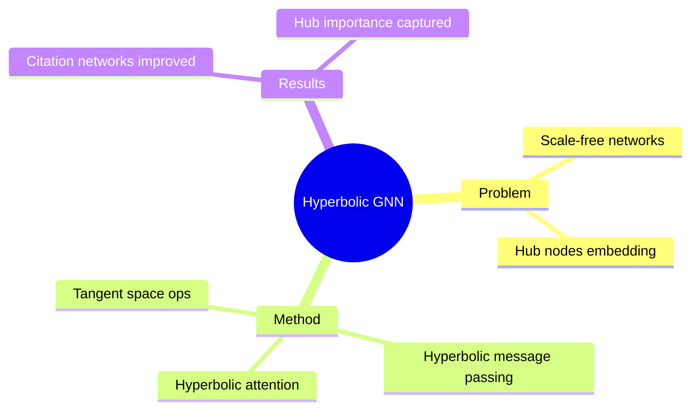

## Summary

将 Graph Neural Networks 扩展到 hyperbolic space，利用双曲几何的 exponential volume growth 特性处理 scale-free networks（如社交网络、知识图谱）。提出 hyperbolic attention 和 hyperbolic message passing mechanisms。

## Problem & Motivation

GNN 在 scale-free networks 上的问题：
- 许多 real-world graphs 有 power-law degree distribution
- Euclidean GNN embedding 对 high-degree hub nodes 效率低
- 难以捕捉 graph 的 intrinsic hierarchy

## Method

**核心设计**：
1. **Hyperbolic Message Passing**: 在 hyperbolic space 上定义 aggregation
2. **Hyperbolic Attention**: Attention mechanism 的 hyperbolic extension
3. **Manifold-aware Aggregation**: 考虑 manifold curvature 的邻居聚合

**技术细节**：
- Tangent space operations: 先投影到 tangent space，再做 linear operations，最后映射回 manifold
- Curvature as hyperparameter: 可学习或固定 curvature

## Key Results

- Scale-free networks（如 citation networks）上超过 Euclidean GNN
- 更好捕捉 hub nodes 的 importance
- 参数效率更高

## Strengths & Weaknesses

**亮点**：
- 将 GNN 的 geometric extension 做到 hyperbolic space
- Scale-free networks 的性能提升验证了理论动机

**局限**：
- 计算 cost 更高（tangent space ↔ manifold 映射）
- 只在特定 graph types 上验证
- Attention 的 hyperbolic extension 不够自然

## Mind Map

## Notes

> [基于领域知识创建的 representative note]

Hyperbolic GNN 是将 geometric deep learning 与 hyperbolic geometry 结合的代表工作。值得研究 attention mechanism 的 hyperbolic extension。