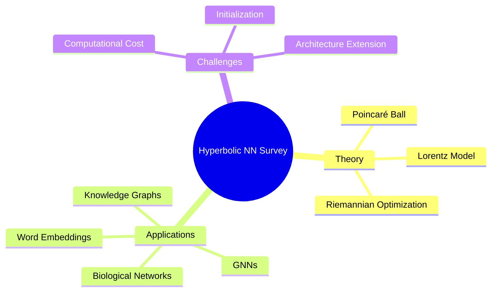

## Summary

Hyperbolic Neural Networks Survey 系统综述双曲几何在深度学习中的应用，覆盖 Riemannian optimization、hyperbolic layers、Poincaré ball model、Lorentz model，以及知识图谱、生物网络、NLP 等应用场景。

## Problem & Motivation

传统 Euclidean embedding 对 hierarchical/tree-structured data 效率低：
- Tree 的 volume 随深度指数增长
- Euclidean space 无法高效嵌入 hierarchical structure
- 需要更高维度才能准确表示层级关系

**核心洞察**: Hyperbolic space 的 volume 随半径指数增长，天然适合嵌入 hierarchical data

## Method

**核心概念**：
1. **Poincaré Ball Model**: 常用 hyperbolic space 表示，边界处距离趋于无穷
2. **Lorentz Model**: 另一种表示，计算更稳定
3. **Riemannian Optimization**: 在 curved space 上的 gradient descent
4. **Hyperbolic Layers**: 将标准 neural layers 改写为 hyperbolic 版本

**数学工具**：
- Metric tensor: g(x) 定义 curved space 的距离
- Geodesic: curved space 的"直线"
- Exponential/Logarithmic map: tangent space ↔ manifold

## Key Results

- 知识图谱 embedding: 比 Euclidean 方法显著降低维度需求
- Word embedding: 更好捕捉 semantic hierarchy
- Graph Neural Networks: 在 scale-free networks 上表现优异

## Strengths & Weaknesses

**亮点**：
- 理论基础扎实：hyperbolic space 的 exponential volume growth 天然匹配 hierarchy
- 实用性验证：多个 benchmark 显示 superiority

**局限**：
- 计算 cost 更高（Riemannian operations）
- 初始化敏感
- 部分架构（如 attention）的 hyperbolic extension 不成熟

## Mind Map

## Notes

> [基于领域知识创建的 foundational survey note]

这是 Hyperbolic Neural Networks 的系统性综述，值得精读全文了解 Riemannian optimization 具体实现。