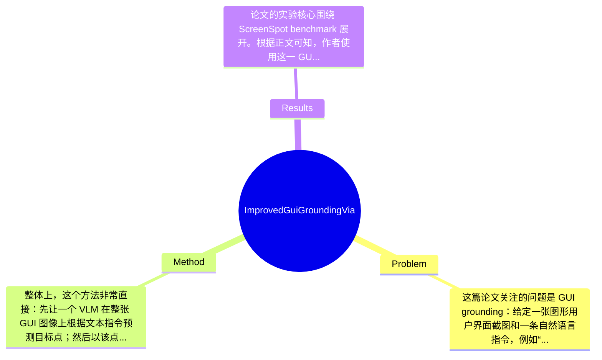

## Summary
该论文研究 GUI grounding，即根据自然语言在界面截图中定位目标控件，提出一种无需额外训练的 iterative narrowing visual prompting 方法，通过对模型初始预测位置反复裁剪放大并再次定位来逐步精修坐标。作者在 ScreenSpot benchmark 上评估，声称该方法能同时提升通用 VLM 与已微调 grounding 模型的定位效果，说明简单的推理时迭代也能弥补 GUI grounding 精度不足的问题。

## Problem & Motivation
这篇论文关注的问题是 GUI grounding：给定一张图形用户界面截图和一条自然语言指令，例如“点击搜索框”或“找到发送按钮”，模型需要输出对应界面元素的位置坐标。这个问题属于 multimodal grounding、GUI understanding 与 agent planning/execution 的交叉领域，是 GUI agent 能否真正执行点击、输入、导航等操作的基础能力。若 grounding 不准，后续再强的规划或语言理解也无法落地，因为 agent 会在错误位置点击，导致任务链条整体失败。现实中，这直接关系到桌面自动化、移动端助手、网页操作代理、无障碍辅助系统等应用场景的可靠性。

现有方法主要有两类不足。第一类是通用 VLM，如 GPT-4V，虽然具备较强视觉语言能力，但对 GUI 这种高度结构化、密集、小目标、文本与图标混杂的场景定位不够稳定，尤其难以精确点击小组件。第二类是专门微调的 grounding 模型，例如 SeeClick、OS-Atlas 一类，虽然性能更强，但通常依赖大规模 GUI 元素标注数据和额外训练成本，不利于快速迁移，也增加部署门槛。第三，单次前向预测通常给出粗略位置，但缺乏后续精修机制，这在高分辨率截图或密集布局场景中尤其明显。

作者的动机是：如果模型第一次预测已经能落在“大致正确区域”，那么不一定非要重新训练模型，只需把该预测当作近似锚点，对局部区域进行裁剪、放大、再次询问模型，可能就能逐步收敛到更精确的位置。这个动机是合理的，因为 GUI 元素往往局部结构清晰，放大局部后可减少全局干扰。论文的关键洞察在于，把 GUI grounding 看成 coarse-to-fine 的迭代定位过程，而不是一次性完成的单步回归问题；通过 inference-time visual prompting，就有机会提升基座模型和已微调模型的精度。

## Method
整体上，这个方法非常直接：先让一个 VLM 在整张 GUI 图像上根据文本指令预测目标点；然后以该点为中心裁剪出一个更小的局部区域，把这个局部区域重新输入同一个模型，请它再次输出目标位置；再把局部坐标映射回原图坐标。如此重复若干轮，逐步缩小搜索范围，从而形成 iterative narrowing。它本质上不是新模型，而是一种推理时 refinement 框架。

关键组件可以拆成以下几部分：

1. 初始全局 grounding
- 作用：在整张界面图上给出第一步粗定位，作为后续迭代的起点。
- 设计动机：如果没有初始落点，就无法决定后续裁剪区域；作者默认 VLM 虽然不够精确，但通常具备一定粗定位能力。
- 与现有方法区别：很多 grounding 方法只做单次输出，而这里明确把第一次输出视为 approximation，而非最终答案。

2. 基于预测点的局部裁剪
- 作用：根据上一轮预测点，在其周围截取更小的图像窗口，并将目标搜索范围限制在该局部区域内。
- 设计动机：GUI 场景常有大量相似按钮、文本与容器，整图推理会引入干扰；裁剪后，模型可在更高相对分辨率下观察候选区域，提升小目标辨识度。
- 与现有方法区别：不同于需要额外 detector、region proposal network 或外部搜索模块的方法，这里没有引入额外模型，只靠图像裁剪实现 attention reallocation。

3. 迭代 narrowing 机制
- 作用：重复执行“预测—裁剪—再预测”，让定位逐轮收缩到更精细位置。
- 设计动机：单次裁剪仍可能包含较大误差，尤其当第一轮预测只落在目标附近而非目标上时，多轮 refinement 可以逐步消除误差。
- 与现有方法区别：相比 reinforcement learning 决策 shrinking policy，或带显式 memory/search 的复杂系统，该方法不学习策略，流程固定、训练无关。

4. 坐标映射与结果更新
- 作用：每一轮在 crop 上得到的是局部坐标，需要准确换算回原图坐标，才能作为下一轮中心或最终输出。
- 设计动机：若映射不严谨，多轮后误差会累积；因此几何变换是这个简单框架能否成立的关键工程细节。
- 与现有方法区别：论文更像是在利用标准 VLM 的 point prediction 接口，外部包一层几何迭代壳，而不是修改模型内部 head。

5. 训练无关的 visual prompting
- 作用：保持对不同 VLM 的兼容性，使框架可叠加到 base model 或 finetuned grounding model 上。
- 设计动机：作者想强调低成本、高可复用，不需要大规模 GUI 标注或额外训练。
- 与现有方法区别：重点不是学到新表示，而是在 inference stage 通过输入重构提升性能。

技术细节方面，论文从现有描述看包含伪代码，说明流程较为程序化：输入 screenshot 与 query，得到预测点；围绕该点选择预定义大小的裁剪框；对裁剪图重复查询模型；最后输出精修后的位置。具体裁剪比例、迭代次数、边界越界处理、是否保留上下文边缘等，摘要中未给出完整数值，属于“论文未提及或节选未展示”。训练策略方面，该方法核心上不需要训练；若叠加在 finetuned model 上，则训练部分继承原模型。

从设计选择看，“迭代 refinement”是必要设计；但“固定裁剪尺度”未必唯一，也可以采用自适应窗口、multi-scale pyramid、置信度驱动停止条件，甚至结合 OCR 或 DOM 信息。简洁性上，这篇工作的优点正是足够简洁优雅：它利用已有模型能力，通过外部循环实现 coarse-to-fine 精修，避免了复杂工程堆叠。不过也正因为过于简单，其效果高度依赖初始预测是否足够接近目标，一旦第一步偏差太大，后续可能会在错误区域越缩越偏。

## Key Results
论文的实验核心围绕 ScreenSpot benchmark 展开。根据正文可知，作者使用这一 GUI grounding 基准测试 iterative narrowing 对不同模型的提升效果，并强调 benchmark 覆盖了多种 UI 平台。ScreenSpot 本身是近期 GUI grounding 领域较常用的评测集，通常关注点级别定位是否命中目标区域或接近真实位置。作者声称其方法对 general VLM 和 finetuned grounding model 都带来“substantial performance gains”，这是论文最主要的实验结论。

但需要非常明确地说：在用户提供的节选文本中，论文的具体数字结果并没有完整展示，因此无法可靠填写每个模型在 ScreenSpot 上的准确率、提升幅度、各平台子集结果、以及与 SeeClick、OS-Atlas 或 GPT-4V baseline 的精确差值。按照“不捏造信息”的原则，这些具体数值应标注为“论文节选未提供”。因此能够确认的 benchmark 只有 ScreenSpot，能够确认的对比对象类别是 base VLM 与 finetuned grounding models，能够确认的结论是 iterative narrowing 带来正向提升。

从结果分析角度看，这种实验设计是合理的，因为它直接验证了方法是否具备 model-agnostic 的增益，而不是只对某个特定模型有效。如果论文正文含有多轮迭代对比，那么最关键的消融应包括：0 次迭代（单步预测）、1 次 refinement、2 次 refinement 乃至更多轮的变化，以及不同 crop size 的影响。节选中提到有“Weaknesses & Observations”和“Potential Solutions and Future Work”，说明作者并未完全回避失败案例，这是一个积极信号。但就目前可见信息而言，实验充分性仍有限：缺少我们能直接读取的具体数字、方差、统计显著性、运行时成本，以及失败类型细分。也无法判断是否存在 cherry-picking，因为示例图通常更容易展示成功案例，而完整失败分布在节选里没有展开。

## Strengths & Weaknesses
这篇论文的主要亮点有三点。第一，方法非常轻量且具有现实可用性。它不需要重新训练模型，也不依赖额外大规模 GUI 数据，只通过 inference-time 的裁剪与重复查询就能提升 grounding，这对实际系统集成很有吸引力。第二，它抓住了 GUI grounding 的一个关键性质：很多模型其实不是“完全不会找”，而是“找得不够准”，因此 coarse-to-fine refinement 比从零学一个全新模型更高效。第三，方法具有较强兼容性，既可叠加在通用 VLM 上，也可叠加在专门 finetuned 模型上，说明它更像一种通用增强策略而非封闭系统。

局限性也很明显。第一，技术上它强依赖初始预测质量。如果第一轮落点偏离目标较远，后续迭代会不断缩小到错误区域，出现 error amplification，这是一种典型 failure case。第二，适用范围可能受限于上下文需求。某些 GUI 元素需要结合全局语义才能区分，例如多个相似“设置”图标、重复按钮、或依赖页面结构关系的目标；过度裁剪可能丢失辨别所需的全局上下文。第三，计算成本虽然低于训练新模型，但推理成本会线性增加，因为每次 refinement 都要再次调用 VLM；若底层模型是昂贵 API，这个额外成本在真实 agent 循环中并不便宜。

潜在影响方面，这项工作对 GUI agent 领域的贡献在于提供了一个非常实用的 baseline enhancer：即便没有资源训练专门 grounding 模型，也可以先用 iterative narrowing 改善点击精度。未来可结合自适应 crop、置信度估计、多候选搜索、OCR/DOM 信息，进一步增强稳健性。

严格区分信息来源：已知——论文提出 training-free iterative narrowing，并在 ScreenSpot 上进行评估，且声称有明显提升；推测——该方法对小目标、密集控件页面应更有效，但对重复元素页面可能较弱；不知道——具体最佳迭代次数、各模型详细增益、API 成本、失败率分布、是否对移动端/桌面端/web 各子集一致有效，节选中均未明确给出。

## Mind Map

## Notes
<!-- 其他想法、疑问、启发 -->
