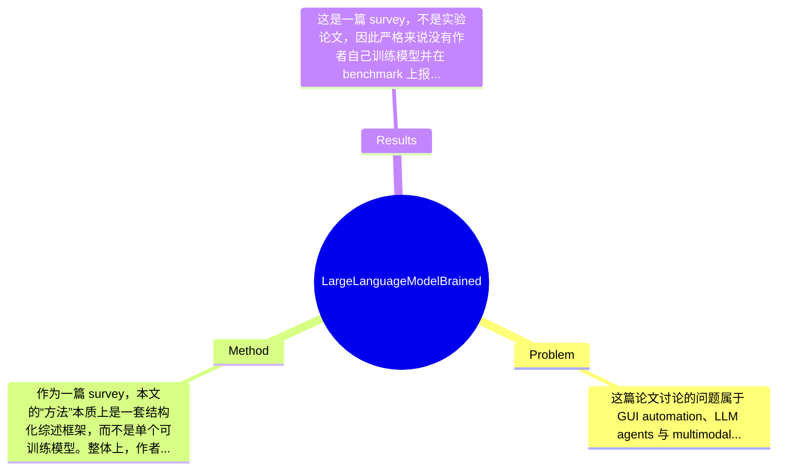

## Summary
这篇综述系统梳理了 Large Language Model-Brained GUI Agents 这一新兴方向，试图回答 GUI 自动化如何从 rule/script-based 方法演进到以 LLM/VLM 为核心的智能 agent，并总结其架构、数据、模型、评测与应用全景。方法上，它不是提出单一新算法，而是构建了一套覆盖 web、mobile、desktop 和 cross-platform 场景的统一分析框架，并比较 GUI agent 与 API-based agent 的差异。效果上，该工作为研究者提供了较完整的领域地图与未来路线图，但作为 survey，其“结果”主要体现为系统整理与问题归纳，而非在 benchmark 上创造新的 SOTA 数值。

## Problem & Motivation
这篇论文讨论的问题属于 GUI automation、LLM agents 与 multimodal intelligence 的交叉领域，核心任务是：如何让以 LLM 为“大脑”的 agent 理解图形用户界面中的视觉元素、文本线索、交互状态和任务目标，并据此执行多步操作。这个问题重要，是因为现实世界中大量数字任务并没有良好的 API 接口，真正面向普通用户的入口仍然是网页、手机 App 和桌面软件的 GUI；如果 agent 只能调用 API 而不能操作 GUI，它的可用范围会被严重限制。现实意义非常直接，例如自动网页导航、办公流程自动化、移动端任务执行、软件测试、个人助理和辅助无障碍交互等。现有方法主要有几类不足：第一，rule-based/script-based 自动化高度依赖预定义流程，遇到页面布局变化、控件重命名、弹窗干扰或跨应用任务时非常脆弱；第二，传统 CV/ML GUI automation 往往聚焦局部能力，如 element detection 或 action prediction，但缺少强任务规划、自然语言理解与长程推理能力；第三，许多 agent 工作分散在 web、mobile、desktop 各自社区，评测、数据和模型设定不统一，导致研究者难以把握全局。论文的动机因此是合理的：领域发展太快、子方向割裂、术语混杂且工业界与学术界同时推进，需要一篇系统综述统一背景、框架、数据、模型与 benchmark。其关键洞察在于，GUI agent 不应只被视为“视觉点击器”，而应被理解为一个由环境感知、prompt engineering、planning、action inference、memory、execution、feedback 和 self-improvement 共同构成的闭环系统；同时，不同平台虽然界面形态不同，但底层设计维度具有相当的一致性。

## Method
作为一篇 survey，本文的“方法”本质上是一套结构化综述框架，而不是单个可训练模型。整体上，作者从历史演进出发，将 GUI automation 划分为 random/rule/script-based 阶段、ML/CV/NLP/RL 驱动阶段，以及 LLM-brained agent 阶段；随后围绕一个统一 agent workflow 展开：感知环境状态，借助 prompt 与模型推理形成计划和动作，通过执行模块与 GUI 或 API 交互，并结合 memory、reflection、RL 等机制持续优化。这个框架的价值在于，它把分散于 web、mobile、computer、industry systems 的工作放进同一坐标系中讨论。

1. 整体架构与工作流
该综述提出的核心组织方式是“环境—推理—执行—反馈”的闭环。agent 首先从 operating environment 获得 state，包括 screenshot、accessibility tree、DOM、OCR 文本、历史动作和用户指令；随后通过 prompt engineering 将任务、上下文、约束和候选操作编码给 LLM/VLM；模型侧再分成 planning 与 action inference 两步，前者负责多步任务分解，后者输出具体 GUI 操作，如 click、type、scroll、select 等；最后由 action execution 模块真正作用于网页、手机或桌面系统，并接收 environment feedback 进入下一轮迭代。这样设计的动机是 GUI 任务天然是 sequential decision making，而不是单轮问答。与许多只强调“看图点按钮”的工作不同，这篇综述更强调 agent 的闭环属性。

2. 环境建模与状态感知
作者把 operating environment 拆成 platform、environment state perception 和 environment feedback。作用是明确 agent 的输入不是单一截图，而可能是多源异构信号的组合。设计动机在于 GUI 中纯视觉信息往往不足，例如同样的按钮可能在视觉上相似，但 accessibility tree 或 DOM 能提供 role、label、id 等关键信息。与早期方法相比，这里最大的区别是强调 multimodal state representation，而不是只依赖像素或固定脚本定位。论文还讨论 web、mobile、desktop 的差异：web 常有 DOM 支持，mobile/desktop 更依赖 screenshot、OCR 与 accessibility metadata。这个抽象很有价值，因为它指出 agent 性能上限很大程度取决于 state representation 的质量，而不只取决于底层 LLM。

3. Prompt engineering 与模型推理
综述将 prompt engineering 单列，说明其在 GUI agent 中不是外围技巧，而是系统设计核心。其作用包括约束输出格式、注入任务分解模板、提供历史轨迹、强调安全边界以及构造 few-shot demonstrations。设计动机是当前很多 GUI agent 仍高度依赖 in-context learning，而未完全依赖专门训练的 policy model。作者进一步把 model inference 分为 planning、action inference 与 complementary outputs。planning 负责决定先后步骤和中间子目标；action inference 决定当下可执行动作；complementary outputs 则可能包括理由解释、失败诊断、结构化坐标或代码片段。与传统 RL 或 supervised action predictor 不同，这种拆分保留了 LLM 的推理灵活性，但也暴露了 latency 和 error propagation 问题。

4. 动作执行、memory 与增强模块
在 execution 部分，论文区分 UI operations、native API calls 和 AI tools。其作用是把“语言层决策”映射为“系统层行动”。设计动机是纯 GUI 点击并不总是最优，有些场景调用原生 API 更稳定，有些则需要借助外部工具完成 OCR、检索或代码执行。memory 模块又被分成 short-term 和 long-term：前者保留当前任务上下文、历史 observation-action 轨迹，后者用于跨任务经验积累、用户偏好与界面知识。进一步，作者总结 advanced enhancements，包括 CV-based grounding、multi-agent framework、self-reflection、self-evolution 和 reinforcement learning。这些组件的共同目标是缓解 grounding error、规划失败和泛化不足。与已有零散论文相比，这篇综述的贡献在于把这些增强机制视为可组合设计维度，而非彼此孤立的 trick。

5. 设计选择与简洁性评价
哪些设计是“必须”的？至少包括环境感知、任务指令建模、动作输出与执行反馈闭环；否则就不能称为 GUI agent。哪些是可替代的？例如状态可以是 screenshot-only，也可以融合 DOM/accessibility tree；规划既可隐式由单个 LLM 完成，也可显式采用 planner-actor 两阶段；memory 可由上下文窗口承载，也可由外部数据库支持。简洁性上，这篇 survey 组织得相当系统，框架也较统一，不显得杂乱；但由于覆盖面极广，难免出现“面面俱到但深度不均”的问题，尤其在某些技术设计上更像 taxonomy，而不是机制级批判分析。

## Key Results
这是一篇 survey，不是实验论文，因此严格来说没有作者自己训练模型并在 benchmark 上报告新 SOTA 的“主要实验结果”。从你提供的内容看，论文第 9 章系统整理了 evaluation，包括 evaluation metrics、measurements、platforms，以及 web/mobile/computer/cross-platform benchmarks；但在当前摘录中，并没有给出具体 benchmark 名称下的统一数字表，也没有出现作者自建模型在某个数据集上取得 xx% success rate 的结果。因此若按研究论文标准要求“2-3 个核心实验及其结果（具体数字）”，这里必须明确标注：论文未提及作者自身实验数值，现有材料也无法可靠抽取具体 benchmark 数字。

不过，作为综述，其“结果”主要体现在三方面。第一，作者建立了一个较完整的 benchmark 版图，将 GUI agent 的评测分为 web、mobile、computer 与 cross-platform 四类，而不是混在一起讨论，这有助于研究者理解不同平台的难点和指标差异。第二，论文把评测对象从单纯 task success 扩展到 evaluation metrics、evaluation measurements 与 evaluation platforms，说明作者意识到 GUI agent 不仅要看最终是否完成任务，还要看步骤正确性、效率、稳定性、安全性和交互成本。第三，论文将数据、模型和评测三部分并列成独立章节，形成较清晰的研究闭环：数据决定训练上限，模型决定策略表达，benchmark 决定研究方向。

批判性看，实验充分性是这篇 survey 相对薄弱的地方。因为它覆盖广，但从给定材料看，缺少统一再评测或元分析式比较，例如在相同 benchmark、相同模型规模、相同 perception setting 下比较不同 GUI agent framework 的真实差异。也看不出是否对 benchmark 存在 label leakage、任务污染、closed-source model 优势等问题做了定量审查。至于 cherry-picking，从摘要和目录结构看，论文专门设置了 limitations、challenges and future roadmap 章节，这说明作者并非只展示积极结果；但由于没有看到完整对比表，是否在案例选择上偏向成功范式，目前无法确定。

## Strengths & Weaknesses
这篇论文的亮点首先在于系统性强。它没有把 LLM-brained GUI agents 简单当作“VLM + click”的窄问题，而是从历史演进、系统架构、数据、模型、评测、应用到挑战形成完整研究图谱，这对于新进入领域的研究者非常有价值。第二个亮点是统一视角。作者把 web、mobile、desktop、cross-platform 放进同一框架讨论，同时比较 GUI agent 与 API-based agent，帮助读者理解 GUI 交互的独特价值与局限。第三个亮点是工程意识与研究意识并重。目录中不仅有 prompt、memory、grounding、multi-agent、reflection、RL，也包含 privacy、latency、safety、customization、ethical/regulatory 等现实部署问题，这使其更接近“领域路线图”而不只是文献罗列。

局限性也很明显。第一，作为 survey，它更多是在归纳已有工作，而非提出可验证的新理论或新方法，因此对核心争议点的因果解释能力有限。比如哪些模块真正带来增益、哪些只是随着 foundation model 提升而被动变好，单靠综述很难说清。第二，覆盖面广导致深度不均。像 prompt engineering、self-reflection、RL、large action models 都是大主题，但在综述中往往只能做 taxonomy 式总结，难以深入讨论 failure cases、数据偏置、训练细节与复现难点。第三，评测统一性仍是问题。论文虽然整理 benchmark，但从给定材料看没有提供一套标准化、可横向公平比较的 meta-evaluation，因此读者仍可能难以判断不同工作之间的真实性能差异。

潜在影响方面，这篇综述有望成为 GUI agent 方向的入门与检索型参考文献，尤其适合做课题调研、系统设计和 benchmark 选型。对工业界而言，它也能帮助团队识别从 prototype 到 production 之间的关键瓶颈。

已知：论文系统覆盖 architecture、framework、data、models、evaluation、applications 与 limitations。推测：作者希望通过“LLM-brained GUI agents”这一命名整合原本分散的 web agent、mobile agent、desktop agent 社区。论文未提及/当前材料无法确认：是否进行了统一复现实验、是否给出了严格的定量排名、是否分析不同 closed-source models 的成本—性能权衡。

## Mind Map

## Notes
<!-- 其他想法、疑问、启发 -->
