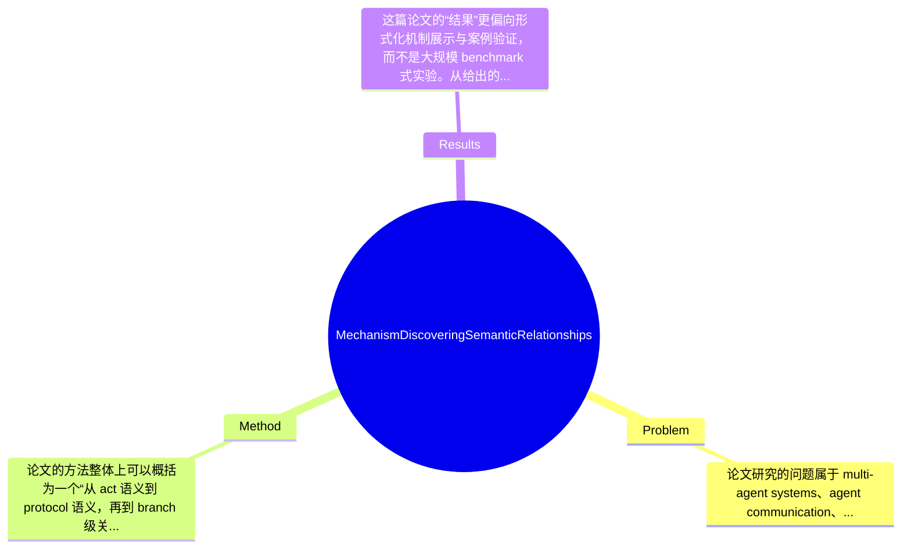

## Summary
这篇论文关注多智能体系统中“不同 agent communication protocols 之间如何在语义层面发现关系”的问题，提出了一种基于 ontology + Event Calculus + fluent 集合比较的机制，把 communication acts 与 social commitment semantics 统一表示，并通过分支级比较自动识别 equivalence、specialization、restriction、prefix、suffix、infix 和 complement_to_infix 等协议关系。论文的主要贡献不在于提出新的学习模型或 benchmark SOTA，而在于给出一种可形式化、可推理、可证明若干关系性质的协议语义比较框架，用于支持异构协议之间的互操作分析。

## Problem & Motivation
论文研究的问题属于 multi-agent systems、agent communication、Semantic Web 与 ontology-based interoperability 的交叉领域。更具体地说，它试图解决这样一个核心问题：当不同信息系统独立开发、各自采用不同的 Agent Communication Language 和 interaction protocol 时，agent 之间如何不仅在消息格式层面、而且在“语义层面”理解彼此协议，并判断两个协议之间是否等价、是否一种是另一种的特化、是否存在前缀/后缀/中间片段等结构性语义关系。这个问题的重要性在于，真实开放环境中的 agent 不可能都遵循单一 universal protocol；如果缺乏跨协议语义映射，系统集成就会退化为大量人工适配，严重限制自动协作、协议选择、协议替换与系统复用。

现实意义上，这类机制可用于开放式 agent 平台中的协议发现、协议仓库检索、系统迁移、异构信息系统对接、agent 与 Web Services 互联时的交互兼容性分析。尤其在标准协议共存、历史系统难以改造的情况下，能自动发现协议之间的语义关系，比强制所有参与方改用同一协议更现实。

现有方法的局限，论文隐含地指出了几类。第一，许多工作只描述 communication acts 的静态语义或语法结构，却缺少对交互过程动态语义的统一建模，因此难以比较完整 protocol 的行为后果。第二，已有协议匹配方法往往依赖表层 message pattern 或状态迁移形式，无法表达 social commitments 这类更高层语义含义，导致“形式相似但语义不同”或“形式不同但语义相近”时判断失真。第三，一些协议工程方法强调设计和执行，却不提供严格的跨协议关系定义与可证明性质，因而难以作为协议仓库管理和自动互操作的基础。

论文的动机总体是合理的：如果将 communication act 的语义表示为 ontology 中的类，并进一步把其动态效果形式化为 Event Calculus fluents，那么 protocol 的比较就可以从“消息序列比较”提升到“分支语义效果集合比较”。其关键洞察是：不同协议是否相关，不必先寻求逐条消息的一一对应，而可以看每个 protocol branch 最终诱发的 fluent 集合之间的包含、相等等关系，从而得到更抽象、更稳定的 semantic relationship 定义。

## Method
论文的方法整体上可以概括为一个“从 act 语义到 protocol 语义，再到 branch 级关系与 protocol 级关系”的分层机制。首先，作者用 CommOnt ontology 对 communication acts 进行概念化描述；其次，为每类 act 赋予基于 social commitments 的动态语义，并用 Event Calculus 谓词刻画 act 对 fluents 的生成、终止与条件依赖；然后，将一个 protocol 形式化为由多个可能分支构成的交互结构，对每个 branch 计算其可导出的 fluent 集合；最后，利用分支之间 fluent 集合的语义比较，归纳出 protocol 之间的 equivalence、specialization、restriction、prefix、suffix、infix、complement_to_infix 等关系。这个框架的核心不是复杂算法本身，而是“表示—推理—比较”的统一链条。

关键组件可以分为以下几部分：

1. CommOnt ontology：communication acts 的静态语义表示。
该组件的作用是为不同协议中的 communication acts 提供统一的语义词汇表与分类框架，使 act 不再只是字符串或消息模板，而是 ontology 中可继承、可约束、可映射的类。设计动机在于，不同系统往往使用不同命名和局部约定，如果没有一个共享语义层，就很难谈跨协议比较。与仅靠 ACL performative 或 protocol state diagram 的方法相比，这里强调 act 的概念层对齐。其区别在于，作者不是只建 protocol graph，而是先把图上的节点提升为 ontology-aware entities。

2. 基于 Event Calculus 的动态语义：把 social commitment semantics 落到 fluents。
该组件负责描述每个 communication act 执行后，世界中哪些社会状态被建立、延续或终止。论文采用 social commitments 作为语义核心，并用 Event Calculus predicate 表达动态变化，这使 protocol 语义不仅是“允许下一步什么消息”，而是“执行后对承诺关系造成什么影响”。设计动机很明确：protocol 真正决定互操作性的，常常不是表面顺序，而是交互后的规范性后果。与传统有限状态自动机式 protocol 建模相比，这种方法更接近语用/制度层面的语义。

3. protocol 的双重表示：OWL-DL 描述 + fluent-based semantics。
论文在 protocol 层面同时给出 OWL-DL description 和 fluent-based semantics。前者更适合结构化定义 protocol 组成、分支与 act 关系；后者则承载真正的可比较语义结果。这样设计的原因是，仅有 ontology 描述不足以比较动态后果，仅有 fluents 又缺少清晰的 protocol 结构来源。与只做规则推理或只做本体建模的工作不同，这里试图把 Description Logic 与 rule-based dynamic semantics 结合起来。这个选择是方法中的关键，因为协议关系最终依赖 branch 的 fluent 集合，而 fluent 又来自 protocol 结构和 act 语义的联动推导。

4. branch 分解与 trace 生成。
算法部分首先将 protocol 分解为 branches，再为每个 branch 生成 traces，并据此导出对应的 fluent 集。该组件的作用是把可能存在分支、循环或多路径的 protocol，拆解成可比较的语义单元。设计动机在于，直接比较整个 protocol graph 很难精确定义 relationship；分支粒度更细，既可保留局部行为差异，也便于把 protocol relationship 建立在 branch relationship 之上。与整体图同构或路径模式匹配不同，这里用 branch 作为基本比较对象，更适合语义集合运算。

5. branch pairing 与 relationship discovery。
在得到两个协议各自的 branches 及 fluent 集后，算法对不同协议的分支进行配对，判断 fluent 集之间的相等、包含或片段式关系，并进一步上升为 protocol 级关系。论文不仅定义了 equivalence、specialization、restriction 等常见语义关系，还定义 prefix、suffix、infix、complement_to_infix 这类更具结构意味的关系，并讨论其性质与证明。这一点区别于仅做“是否兼容”的粗粒度判断，显示作者试图构建一套关系代数式的协议比较语言。

技术细节上，论文明确依赖 Semantic Web rules 生成 fluents，说明其不是手工逐分支标注，而是利用规则推理从 communication act 的语义与 protocol 结构中自动导出结果。附录 “Generation of fluents” 也表明 fluent 生成机制是方法闭环中的关键环节。设计选择上，social commitment + Event Calculus 应属“核心必需”，因为协议关系正是围绕动态社会状态定义；而 OWL-DL、具体 rule 实现方式、branch pairing 策略可能存在替代方案，例如也可考虑 situation calculus、institutional semantics 或 process algebra。就简洁性而言，这个方法概念上比较统一，表示层次清楚，属于“形式化驱动”的优雅方案；但工程落地上并不轻量，需要 ontology 建设、规则编写、协议形式化和推理基础设施，因而也带有一定 knowledge engineering 成本，不算特别轻巧。

## Key Results
这篇论文的“结果”更偏向形式化机制展示与案例验证，而不是大规模 benchmark 式实验。从给出的内容看，论文包含一组 algorithm、relationship 定义、性质证明，以及第 6 节 “One scenario of the proposed mechanism at work” 的示例性场景演示。也就是说，它的主要证据链是：先构造 protocol 的双重语义表示，再通过 branch 分解、trace 生成和 fluent 推理，最后在案例中发现若干协议关系，并在第 5.2.1 和 5.2.2 节讨论这些关系的性质和证明。

需要强调的是，用户提供的论文摘录与摘要中没有给出标准 benchmark 名称、样本规模、运行时间、准确率、召回率、F1、success rate 等具体量化数字，因此无法像分析 machine learning 论文那样列出“在某 benchmark 上提升 x%”。按照论文信息，能明确写出的结果只有：该机制能够识别的关系类型包括 equivalence、specialization、restriction、prefix、suffix、infix 和 complement_to_infix；论文还声称该机制是 efficient，但当前提供文本中没有看到时间复杂度分析数字、协议库规模实验或效率对比表，因此“高效”更多是作者主张，缺少量化支撑。

如果把“主要实验”理解为验证模块，则可以概括为三类：第一，communication act 到 fluent 的推理生成，证明动态语义表示可计算；第二，branch pairing 后发现 branch-level relationships，并聚合为 protocol-level relationships；第三，通过一个具体 scenario 展示机制如何工作。但这些实验更像 illustrative case study，而非系统评测。与 baseline/previous work 的直接数值对比，论文摘录中未见，无法确认是否存在传统协议匹配算法、ontology matching 方法或 ACL compatibility 方法作为基线。

从实验充分性角度看，论文的不足比较明显：缺少公开 benchmark，缺少多协议仓库上的规模化测试，缺少对错误匹配/歧义匹配的 failure cases 分析，也缺少人工标注 gold standard 来验证发现关系的正确性。消融实验同样未在摘录中体现，例如没有看到“去掉 Event Calculus / 去掉 ontology / 去掉 branch decomposition 后性能变化”的量化研究。因此，论文更像一个有形式化深度的机制论文，而不是严格经验主义评测论文。至于 cherry-picking，现有信息不足以断言，但由于只有一个 scenario 展示、没有系统性负例或困难案例，很难排除作者主要展示了适合该框架的正面示例。

## Strengths & Weaknesses
这篇论文的亮点主要有三点。第一，它把 communication act 的静态语义与 protocol 的动态语义统一起来，不停留在消息标签或状态图层面，而是引入 social commitment semantics 与 Event Calculus，使协议比较具备更强的语义解释力。第二，它提出的关系类型比较丰富，不只判断“是否等价/兼容”，还定义 specialization、restriction、prefix、suffix、infix、complement_to_infix 等关系，这对协议检索、复用和替换很有帮助。第三，论文包含 relationship properties 与 proofs，说明作者并非只给启发式算法，而是在建立一个相对严谨的形式体系，这在 agent communication 领域是有价值的。

但局限性也很明显。第一，技术上它高度依赖手工知识工程：需要构建 CommOnt ontology、为 communication acts 指定 social commitment 语义、编写 Semantic Web rules、将 protocol 形式化为可推理结构。这种前期建模成本在开放环境中可能很高，一旦 ontology 不完整或 act 语义标注不一致，后续关系发现就会失真。第二，适用范围可能受限于“协议能被明确离散为 act 和 branch，且其核心语义能用 commitment fluents 表达”的场景；对于包含概率策略、隐式上下文、学习型 agent policy、自然语言协商或连续控制交互的协议，该框架未必合适。第三，论文当前缺少大规模实证评测，因此其可扩展性、错误鲁棒性、推理开销以及在真实异构协议库中的表现仍不明确。

潜在影响方面，这项工作对 protocol interoperability、agent protocol repository management、heterogeneous MAS integration 有一定启发意义。它可能为今后的协议发现、协议自动转换、agent/Web Service 对接提供语义基础，也可能与 process mining、multi-agent planning、institutional semantics 结合。

严格区分信息来源：已知：论文明确提出 ontology + Event Calculus + fluents 的机制，定义多种 protocol relationships，并包含性质证明与场景示例。推测：如果将其扩展到协议仓库检索或自动适配，可能能提升异构系统互操作效率；但论文摘录未直接验证。不知道：协议库规模上限、推理运行时间、与其他方法相比的准确性、对噪声/不完整语义标注的鲁棒性、是否已有开源实现，这些在提供材料中均未提及。综合来看，这篇论文有形式化参考价值，但距离“经过大规模验证的通用解决方案”还有明显距离。

## Mind Map

## Notes
<!-- 其他想法、疑问、启发 -->
