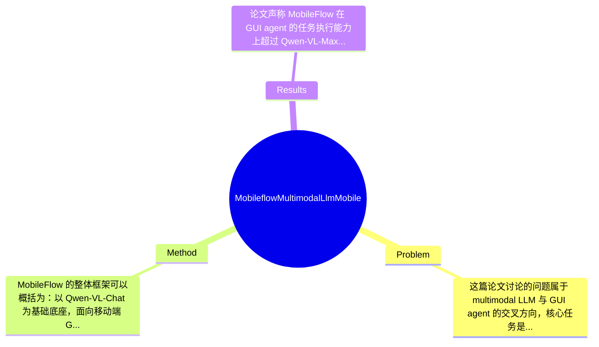

## Summary
MobileFlow 针对移动端 GUI agent 在纯视觉感知、中文/多语言界面理解以及高分辨率细粒度页面解析上的不足，基于 Qwen-VL-Chat 提出一个约 21B 参数的 multimodal LLM，并引入 hybrid visual encoder、MoE 扩展与专门的 alignment training；论文声称其在 GUI 任务执行上超过 Qwen-VL-Max 和 GPT-4v，并已落地到软件测试、广告审核和电商运营等场景，但公开材料中许多关键实验数字与细节披露有限。

## Problem & Motivation
这篇论文讨论的问题属于 multimodal LLM 与 GUI agent 的交叉方向，核心任务是：让模型仅凭屏幕截图和用户指令，在移动端图形界面中理解页面结构、识别可交互元素、规划下一步操作，并最终完成多步任务。这类问题的重要性很高，因为手机 app 已是用户日常生活中的主要交互入口，若 agent 能稳定完成点按、输入、滚动、页面跳转等动作，就可用于智能助手、自动化测试、业务巡检、广告预览和电商运营等多个场景。相比传统依赖 DOM、控件树、Accessibility API 或系统接口的方法，纯视觉 GUI agent 更接近人类使用方式，也更容易跨平台泛化。

论文指出现有方法有几个具体不足。第一，不少 GUI agent 依赖系统 API、页面布局树或 HTML 解析来获得元素位置与属性，这虽能简化决策，但会带来隐私与部署限制：真实商业 app 不一定开放这些接口，且平台权限控制严格。第二，许多 VLM 的视觉编码器建立在固定分辨率输入之上，面对长页面、小字号文本、密集按钮和复杂布局时，缩放会损失细粒度信息，尤其影响移动端 GUI 的文本与 icon 识别。第三，现有通用多模态模型在中文尤其是 Mandarin-heavy app 上理解和决策能力不足，这对中国 app 生态是实质障碍，而不是边缘问题。

作者提出 MobileFlow 的动机总体合理：如果希望 GUI agent 真正进入大规模商业落地，就不能过度依赖外部结构化接口，也不能只在英文、低分辨率、简化 benchmark 上有效。其关键洞察是，移动 GUI 不是自然图像，界面理解更依赖文本密度、布局结构、组件层级和局部细节，因此需要面向 GUI 专门设计的视觉编码、跨模态对齐和行动建模，而不是直接套用通用 VLM。换言之，论文的创新逻辑不是“把大模型拿来做 GUI”，而是“把 GUI 当成一种特殊视觉语言环境，重构视觉编码与决策训练方式”。

## Method
MobileFlow 的整体框架可以概括为：以 Qwen-VL-Chat 为基础底座，面向移动端 GUI 场景进行领域化改造，在视觉侧引入 hybrid visual encoder 以支持 variable resolution 和细粒度界面解析，在语言/决策侧通过 MoE 扩展增强任务建模能力，并通过专门的 alignment training 让模型把“截图理解—指令解析—动作预测”串成一个统一的 GUI agent 推理流程。其目标不是单纯回答页面内容，而是输出可执行的交互动作。

1. Hybrid visual encoder
- 作用：这是全文最核心的组件之一，负责从移动 GUI 截图中提取既包含全局布局、又保留局部细节的视觉表示，以支持小文本、图标、按钮、输入框、列表项等元素识别。
- 设计动机：GUI 图像与自然场景差别很大。自然图像更关注语义物体，GUI 更依赖文本、边框、对齐关系和控件密度；如果使用固定低分辨率输入，模型容易错过关键字、金额、商品名、tab 文案等细节。作者因此强调 variable resolutions，而不是把所有页面压到单一尺寸。
- 与现有方法区别：相比基于 CLIP 类自然图像预训练视觉塔的方案，MobileFlow 更强调 GUI domain training；相比依赖 API 读取 layout tree 的方法，它试图完全从像素恢复页面结构信息。

2. 基于 Qwen-VL-Chat 的领域迁移
- 作用：利用已有强大的视觉-语言对齐能力作为起点，再将其迁移到 GUI agent 场景，避免从零训练超大模型。
- 设计动机：通用 VLM 已具备一定 OCR、图文对齐和指令跟随能力，但缺少 GUI-specific action grounding。以开源底座为基础更具工程可行性，也利于后续扩展中文能力。
- 区别：论文不是只做 prompting，而是强调“transforming from Qwen-VL-Chat into GUI domain”，说明其进行了较系统的结构或训练级适配，而非外挂式 agent pipeline。

3. MoE 扩展
- 作用：增强模型参数容量与任务适配能力，提升对复杂 GUI 任务、中文场景以及多类页面模式的决策表现。
- 设计动机：GUI agent 不只是视觉问答，它要同时处理 OCR、元素定位、意图理解、动作规划、多步状态跟踪等异质子任务。MoE 的隐含假设是，不同 expert 可在这些子能力上形成分工，从而在不完全线性增加推理成本的情况下提高表现。
- 与现有方法区别：不少 GUI agent 依赖外部模块分拆任务，例如 OCR 模块、detector 模块、planner 模块；MobileFlow 更倾向于把能力内化到统一模型中。论文未在摘要中详细说明 expert 数量、路由策略、激活开销，这部分细节公开有限。

4. Alignment training strategy
- 作用：把 GUI 视觉理解与动作决策对齐，使模型不仅“看懂”页面，还能输出正确 action。
- 设计动机：通用图文对话训练只优化回答质量，不直接优化 GUI action selection。若不做专门对齐，模型可能会描述页面却无法稳定点击正确区域或执行正确顺序。
- 技术形式：从目录可知论文有 Training Formulation、Action Space、Prompt structure 等部分，说明作者定义了专门动作空间，并通过特定 prompt 将当前页面、用户指令、历史轨迹和候选动作组织起来训练。合理推测训练目标包括动作类别预测、目标区域选择或文本化 action generation，但精确 loss 组成在给定材料中未完全展开，应标注为论文未提及完整公式。

5. 纯视觉 GUI agent 设定
- 作用：避免依赖系统 API、HTML、Accessibility tree 等结构化辅助，提升隐私友好性和跨 app 可部署性。
- 设计动机：真实商业环境中接口可用性和权限往往不可控，纯视觉方案更通用。
- 代价与边界：这种设计更具通用性，但也更困难，因为所有布局、文字、可点击性都要从截图中隐式恢复；因此模型对分辨率、页面遮挡、动画状态、弹窗瞬时变化会更敏感。

从设计选择看，hybrid visual encoder 和 alignment training 基本属于“必须项”，因为它们直接对应 GUI 的分辨率问题和 action grounding 问题；而 MoE 更像是“增强项”，也许可以由更强 dense model、分阶段训练或外部 planner 替代。整体上，方法思路是相对完整的：针对 GUI 特性逐层改造，而不是简单堆叠模块。但从论文公开摘要与提取内容来看，工程细节较多，如数据构造、prompt 结构、评测定义、部署策略等都占较大篇幅，因此它更像一个面向落地的系统性模型方案，而非单一极简算法。简洁性上属于“合理工程化”，不算优雅到极致，但问题本身也确实不适合过于理想化的轻量设计。

## Key Results
论文声称 MobileFlow 在 GUI agent 的任务执行能力上超过 Qwen-VL-Max 与 GPT-4v，并同时在 public benchmark 和作者自建评测指标上取得更好结果，这是其最核心的实验结论。不过，需要批判性指出：在当前提供的论文节选中，并未包含完整结果表格，因此很多 benchmark 名称、指标定义和具体数值无法被准确还原，只能依据论文结构做有限分析，不能捏造数字。

从目录看，实验部分包括 Metrics、Quantitative Results、Ablation Study，附录还单列了 Evaluation Details、Positive Sample Determination、Dataset、Definition of Metrics，说明作者构建了较完整的评测体系，而不只是展示几个案例。摘要明确给出的定性结论是：MobileFlow outperform Qwen-VL-Max and GPT-4v in task execution by GUI agents。这意味着评测重点不是单轮 caption 或 OCR，而是更接近 end-to-end action success。论文还强调其支持 Mandarin app，并已用于真实业务场景，这间接说明实验应覆盖中文 GUI 或至少部分中文高密度页面。

就 benchmark 而言，公开材料仅能确认存在“public metrics”和“our proposed evaluation metrics”，但具体 benchmark 名称、指标如 success rate、action accuracy、step accuracy、episode success、positive sample hit rate 等，在当前摘录中均未完整列出，因此应明确写为“论文未提及具体表格内容”。如果论文正文中确有这些数字，则当前输入没有提供，不能臆造。消融实验方面，从方法设计推断，作者大概率比较了 hybrid visual encoder、MoE、alignment training 等组件的贡献；但每项带来多少提升、是否统计显著、是否跨数据集稳定，目前同样缺少原始数字。

实验充分性方面，这篇论文的优点是显然不仅有离线评测，还有 deployment/application 章节，展示软件测试、广告预览审核、电商运营监控等应用，这比单纯 benchmark 分数更有说服力。但不足也明显：若缺少跨 app 泛化、失败案例统计、复杂长链任务分解、中文/英文分场景对照、分辨率鲁棒性测试、与 API-assisted agent 的公平比较，那么“纯视觉更优”的结论仍存在边界。就 cherry-picking 风险看，论文展示真实应用是加分项，但如果未同时给出系统性失败样本与误差分布，就仍有可能偏向呈现好的案例。

## Strengths & Weaknesses
这篇论文的主要亮点有三点。第一，它抓住了 GUI agent 的真实痛点，而不是停留在通用 VLM demo 层面：隐私受限下的纯视觉感知、中文 app 支持、以及移动界面的高分辨率细节保留，这些都很贴近实际部署。第二，方法上将 hybrid visual encoder、MoE 和 alignment training 结合起来，体现出一种“面向 GUI 的整体模型化”思路，而不是简单依赖外部 OCR、检测器和规则系统拼接。第三，论文强调真实业务落地，这一点对 agent 论文尤其重要，因为很多工作在 benchmark 上有效，但在商业 app 的复杂页面、频繁改版和长尾文案下并不稳定。

局限性也很明显。第一，技术上它仍是一个重模型方案，约 21B 参数且带有 MoE，训练与部署成本都不低；如果目标是端侧或大规模在线低延迟调用，其资源压力不可忽视。第二，纯视觉设定虽然通用，但也天然脆弱：页面动画、遮挡、弹窗、滚动后状态变化、相似按钮歧义、输入法干扰等都可能导致错误，尤其在多步任务中误差会累积。第三，论文对“超越 GPT-4v / Qwen-VL-Max”的论证是否足够公平，取决于评测设置；若任务 prompt、截图分辨率、动作空间定义、中文场景占比都更偏向作者方案，那么领先幅度未必完全可迁移到其他环境。

潜在影响方面，MobileFlow 代表了一条重要路线：让 multimodal LLM 直接成为 mobile GUI 的感知与决策核心。这对自动化测试、智能客服、运营助手、可访问性工具、商家自动运营等都有现实价值。若其数据与训练范式可复用，也可能推动 GUI foundation model 的形成。

严格区分信息来源：已知：论文明确说明基于 Qwen-VL-Chat，约 21B 参数，含 hybrid visual encoder、MoE、alignment training，强调 Mandarin GUI 支持，并声称优于 Qwen-VL-Max 和 GPT-4v，且已用于真实业务。推测：其训练应包含 GUI screenshot-instruction-action 对齐数据，并可能采用文本化动作预测或区域 grounding 机制；真实业务中的价值很可能主要体现在半自动流程而非完全无人值守。 不知道：具体 benchmark 名称、完整数值、训练数据规模、MoE 路由细节、推理延迟、失败率分布、与 API-based 方法的严格公平对比，这些在当前提供材料中均未完整披露。

## Mind Map

## Notes
<!-- 其他想法、疑问、启发 -->
