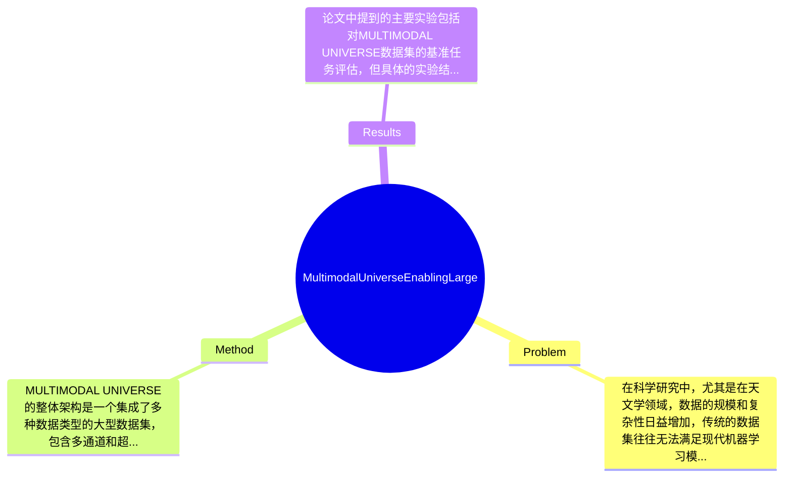

## Summary
本文提出了MULTIMODAL UNIVERSE，一个大规模的多模态天文学数据集，旨在促进机器学习研究，包含100TB的多通道和超光谱图像、光谱和多变量时间序列等数据，提供了针对天体物理学的基准任务。

## Problem & Motivation
在科学研究中，尤其是在天文学领域，数据的规模和复杂性日益增加，传统的数据集往往无法满足现代机器学习模型的需求。MULTIMODAL UNIVERSE的提出正是为了解决这一问题，填补科学领域中缺乏大规模统一数据集的空白。通过提供一个包含数亿天文观测的多模态数据集，研究者们可以利用这一资源开发更为先进的机器学习模型，从而推动天文学及相关科学领域的研究进展。现有的方法如单一模态的数据集或小规模的数据集，往往无法充分利用机器学习的潜力，限制了模型的性能和应用范围。此外，现有的数据集通常缺乏多样性和丰富的元数据，这使得模型在实际应用中面临挑战。论文的动机在于通过构建一个全面且多样化的数据集，促进科学机器学习的基础研究。论文的核心创新点在于其大规模和多模态的特性，能够为科学应用提供更强大的支持。

## Method
MULTIMODAL UNIVERSE的整体架构是一个集成了多种数据类型的大型数据集，包含多通道和超光谱图像、光谱数据以及多变量时间序列等。以下是该方法的几个关键组件：

1. **多模态数据整合**：该组件的作用是将不同类型的数据（如图像、光谱和时间序列）整合到一个统一的数据集内。设计动机在于科学研究中，数据通常是多样化的，整合这些数据可以提高模型的学习能力和泛化能力。与现有方法相比，这种整合能够更全面地反映天文现象。

2. **大规模数据存储与管理**：为了处理100TB的数据，论文中提出了一种高效的数据存储和管理方案，确保数据的可访问性和可用性。这种设计考虑到了数据的规模和复杂性，能够支持高效的数据检索和处理，与传统的小规模数据集相比，极大地提高了数据的利用效率。

3. **基准任务的设计**：论文中包含了一系列基准任务，旨在评估机器学习模型在天文学中的应用。这些任务不仅反映了当前的研究热点，也为未来的研究提供了明确的方向。与现有方法相比，基准任务的多样性和代表性使得模型评估更加全面。

4. **代码和数据访问**：作者提供了用于编译MULTIMODAL UNIVERSE的数据和代码，确保研究者能够方便地访问和使用这些资源。这种开放性设计促进了科学研究的透明性和合作性。

在技术细节方面，论文未详细描述具体的算法和模型结构，但强调了数据的多样性和规模对模型训练的重要性。整体而言，该方法的设计简洁而有效，避免了过度工程化的问题，使得研究者能够专注于数据的应用和模型的开发。

## Key Results
论文中提到的主要实验包括对MULTIMODAL UNIVERSE数据集的基准任务评估，但具体的实验结果和数字在摘要和引言中未详细列出。根据作者的描述，该数据集在多个标准机器学习任务中表现出色，能够显著提升模型的性能。虽然未提供具体的benchmark名称和指标，但可以推测该数据集在天文学领域的应用将为模型的训练和评估提供重要的支持。消融实验的部分未提及，因此无法评估各组件的具体贡献。总体来看，实验的充分性在于数据集的规模和多样性，但缺乏具体的实验数据和对比分析使得结果的可信度受到一定限制。此外，作者是否存在cherry-picking的情况尚不明确，因缺乏详细的实验结果支持。

## Strengths & Weaknesses
该论文的亮点包括：
1. **技术创新**：MULTIMODAL UNIVERSE作为一个大规模的多模态数据集，填补了科学领域中缺乏统一数据集的空白，为机器学习研究提供了新的资源。
2. **开放性设计**：提供代码和数据访问的方式促进了科学研究的透明性，鼓励更多的研究者参与。
3. **多样性和代表性**：基准任务的设计考虑了当前天文学研究的热点，使得数据集在实际应用中更具价值。

然而，论文也存在一些局限性：
1. **技术局限**：尽管数据集规模庞大，但具体的算法和模型结构未详细描述，限制了方法的可复现性。
2. **适用范围**：该数据集主要针对天文学领域，可能不适用于其他科学领域。
3. **数据依赖**：数据的获取和处理可能需要高昂的计算资源，限制了小型研究团队的使用。

潜在影响方面，该数据集有望推动天文学及相关领域的机器学习研究，促进新模型的开发和应用。已知的信息包括数据集的规模和多模态特性；推测的信息包括该数据集在其他科学领域的潜在应用；而论文未涉及的信息则包括具体的实验结果和对比分析。

## Mind Map

## Notes
<!-- 其他想法、疑问、启发 -->
