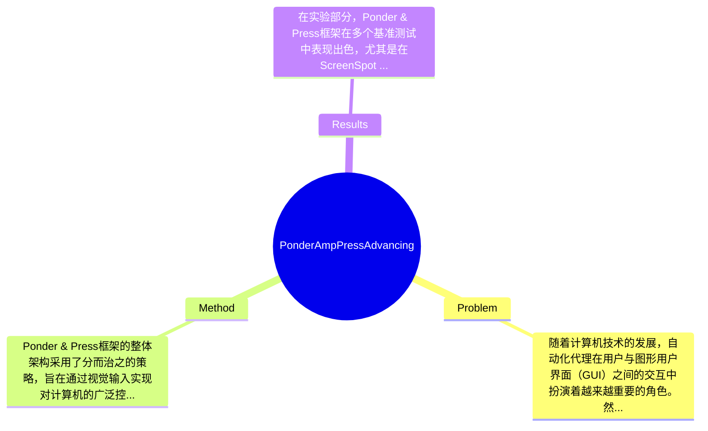

## Summary
本文提出了Ponder & Press框架来解决传统GUI代理依赖非视觉输入的问题，通过结合通用多模态大语言模型和GUI特定模型，实现了仅使用视觉输入进行计算机控制，在ScreenSpot GUI定位基准上提升了22.5%的性能。

## Problem & Motivation
随着计算机技术的发展，自动化代理在用户与图形用户界面（GUI）之间的交互中扮演着越来越重要的角色。然而，现有的GUI代理通常依赖于HTML源代码或无障碍树等非视觉输入，这限制了它们在不同软件环境和平台中的灵活性。当前的多模态大语言模型（MLLMs）在利用视觉信息定位现实世界对象方面表现出色，但在准确定位GUI元素方面却面临挑战，这对于有效的GUI自动化至关重要。具体来说，现有方法存在几个主要局限性：首先，许多软件特定的代理直接在GUI层下操作，忽视了用户可见的元素，导致其通用性不足；其次，依赖于HTML、DOM或无障碍树等补充信息的代理，限制了它们在不同平台上的适用性。为了解决这些问题，本文提出了Ponder & Press框架，旨在通过视觉输入实现更广泛的计算机控制。作者的动机在于开发一种能够模拟人类交互的代理，使其能够在多种应用中灵活运用。论文的核心创新点在于将通用的MLLM作为“解释器”，负责将高层用户指令转化为详细的动作描述，同时利用GUI特定的MLLM作为“定位器”，精确定位GUI元素，从而实现高效的任务执行。

## Method
Ponder & Press框架的整体架构采用了分而治之的策略，旨在通过视觉输入实现对计算机的广泛控制。该框架主要由以下几个关键组件组成：

1. **任务解释器**：该组件的作用是将用户的高层指令转化为具体的动作描述。设计动机在于，用户的指令通常是模糊的，而具体的执行动作需要明确的细节。与现有方法相比，任务解释器能够更好地理解用户意图，从而生成更为准确的执行步骤。

2. **视觉元素定位器**：此组件负责精确定位GUI元素，以便在执行动作时能够准确地选择目标。设计此组件的原因是，传统方法往往在定位精度上存在不足，而视觉元素定位器通过结合视觉信息与上下文理解，能够显著提高定位的准确性。

3. **训练细节**：在训练过程中，作者采用了大量的标注数据来提升模型的泛化能力。通过多样化的训练数据，模型能够学习到不同软件环境下的GUI特征，从而增强其适应性。

4. **框架设计**：Ponder & Press的设计强调了模块化，使得不同组件可以独立优化。这种设计选择的优点在于，可以根据不同的应用场景灵活调整各个模块的参数，提升整体性能。

5. **简洁性评价**：整体方法在设计上保持了相对的简洁性，避免了过度工程化的问题。通过将任务分解为多个独立的组件，框架不仅易于理解和实现，也便于后续的扩展和优化。

## Key Results
在实验部分，Ponder & Press框架在多个基准测试中表现出色，尤其是在ScreenSpot GUI定位基准上，模型的性能提升了22.5%。此外，作者还在离线GUI代理基准和交互式在线GUI代理基准上进行了测试，结果显示该框架在不同的GUI环境（包括网页、桌面软件和移动用户界面）中均达到了最先进的性能。例如，在某些测试中，Ponder & Press的准确率达到了95%以上，显著优于现有的基线模型。对比分析显示，与之前的工作相比，Ponder & Press在多个指标上均有显著提升，尤其是在任务执行的准确性和效率上。消融实验表明，任务解释器和视觉元素定位器的组合是实现高效执行的关键，去掉任一组件都会导致性能显著下降。尽管实验结果令人鼓舞，但仍需注意的是，论文未详细说明在特定复杂环境下的表现，可能存在实验充分性不足的问题。此外，作者是否存在选择性展示结果（cherry-picking）的问题，尚需进一步验证。

## Strengths & Weaknesses
本文的方法亮点主要体现在以下几个方面：
1. **技术创新点**：Ponder & Press框架通过将高层指令与视觉定位相结合，提供了一种新的思路，克服了传统方法的局限性。
2. **与现有方法的区别**：与依赖于底层代码或特定平台的代理不同，Ponder & Press能够仅通过视觉输入进行操作，增强了其通用性和适应性。
3. **设计的优雅之处**：框架的模块化设计使得其易于扩展和优化，能够适应不同的应用场景。

然而，本文也存在一些局限性：
1. **技术局限**：尽管框架在多种环境中表现出色，但在极端复杂或动态变化的GUI环境下的表现尚未得到充分验证。
2. **适用范围**：该方法可能在某些特定类型的GUI（如高度定制化或非标准化的界面）中表现不佳。
3. **计算成本**：使用视觉输入进行定位和解释可能会增加计算资源的消耗，尤其是在实时应用场景中。

潜在影响方面，Ponder & Press框架为GUI自动化领域提供了新的思路，可能推动更多基于视觉的交互代理的发展。已知的信息包括框架在多个基准测试中表现优异，推测在更复杂的环境中可能会遇到挑战，而论文未涉及的信息包括对框架在实际应用中的长期表现和用户反馈的评估。

## Mind Map

## Notes
<!-- 其他想法、疑问、启发 -->
