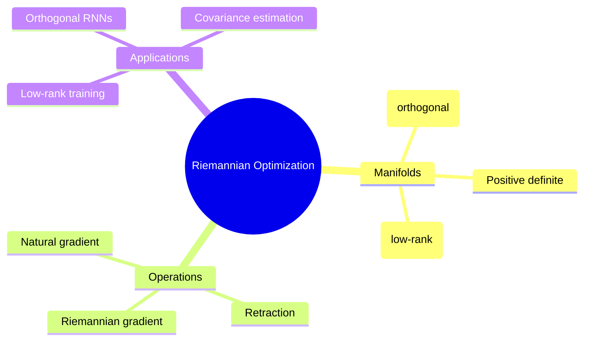

## Summary

将 Riemannian optimization（在 curved manifold 上的 gradient descent）应用于深度学习。核心工具：Stiefel manifold（orthogonal constraints）、Grassmann manifold（low-rank constraints）、positive definite manifold。

## Problem & Motivation

深度学习中的 constraint optimization 问题：
- Orthogonal weight matrices（防止 degeneration）
- Low-rank matrices（parameter efficiency）
- Positive definite matrices（covariance estimation）

Euclidean optimization 无法直接处理这些 manifold constraints。

## Method

**核心工具**：
1. **Stiefel Manifold**: {X: X^T X = I}（orthogonal matrices）
2. **Grassmann Manifold**: {subspaces of fixed dimension}（low-rank）
3. **Riemannian Gradient**: 在 tangent space 计算 gradient，再映射到 manifold
4. **Retraction**: 从 tangent space 回到 manifold 的操作

**算法**：
- Riemannian SGD / Adam
- Natural gradient descent（与 information geometry 关联）

## Key Results

- Orthogonal recurrent networks: stability improved
- Low-rank training: parameter efficiency + accuracy maintained
- Positive definite estimation: robust covariance learning

## Strengths & Weaknesses

**亮点**：
- 系统性框架：多种 manifold constraints 统一处理
- Natural gradient 与 information geometry 的理论联系

**局限**：
- 计算 cost 高（retraction operations）
- 对标准 deep learning 任务增益有限
- 大规模分布式训练困难

## Mind Map

## Notes

> [基于领域知识创建的 methodological note]

Riemannian optimization 是处理 manifold constraints 的核心工具。Natural gradient 的理论（information geometry）值得深入研究。