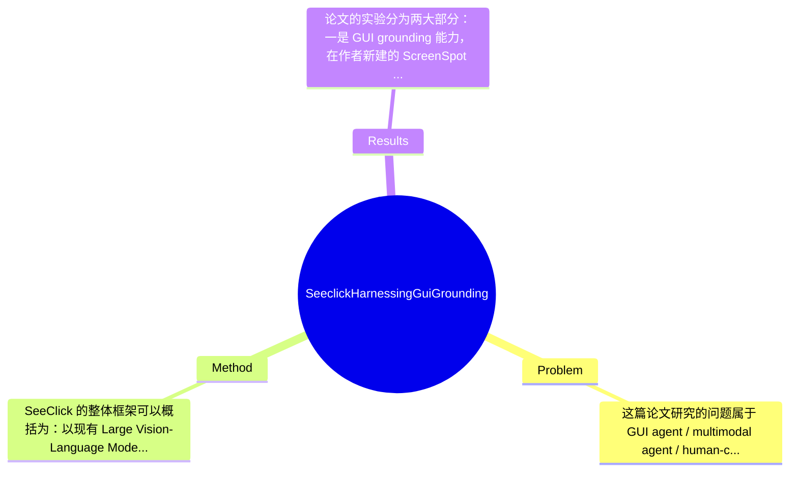

## Summary
论文提出了一个仅依赖截图进行操作的视觉 GUI agent——SeeClick，核心通过 GUI grounding pre-training 强化 LVLM 对界面元素的定位能力，并构建自动化 grounding 数据与 ScreenSpot benchmark。实验表明，SeeClick 在 ScreenSpot 上显著优于多种 baseline，同时在 MiniWob、AITW、Mind2Web 三类下游 GUI agent 任务上取得一致提升，支持“grounding 能力直接影响 agent 表现”的核心论点。

## Problem & Motivation
这篇论文研究的问题属于 GUI agent / multimodal agent / human-computer interaction 交叉领域，核心任务是让智能体仅凭屏幕截图理解图形界面，并完成点击、输入等低层交互操作。与传统依赖 HTML、DOM、Android View Hierarchy 等结构化观测的代理不同，SeeClick试图直接在像素空间中完成“看见界面—定位元素—执行动作”的闭环。这个问题很重要，因为真实设备环境中，结构化信息常常不可得，尤其在桌面应用、iOS 封闭生态、远程桌面或虚拟化环境中，截图往往是最稳定、最通用的输入形式。

现实意义非常直接：如果仅通过 screenshot 就能完成 GUI 操作，那么自动化能力可迁移到网页、手机、桌面等不同平台，降低系统接入成本，也更接近真人使用计算设备的方式。它的应用包括个人助理、自动测试、企业流程自动化、无障碍交互、客服辅助等。相比之下，现有方法有几个具体局限：第一，基于结构化文本的方法严重依赖环境接口，HTML/DOM 在网页上可得，但在原生桌面或 iOS 上往往不可稳定获取；第二，结构化表示虽然“可解析”，却可能极其冗长，占用 LLM context window，而且丢失布局、图标、视觉强调等关键视觉线索；第三，不同平台的 observation/action schema 不统一，导致 agent 往往是平台特化的，而非真正统一的 GUI agent。

论文的动机是：如果要构建真正通用的 visual GUI agent，最先要解决的不是高层规划，而是更基础的 GUI grounding，即根据指令准确找到该点哪里。作者认为现有 LVLM 虽然有 general visual understanding，但在细粒度界面元素定位上明显不足，因此需要专门的 grounding 预训练和数据构建机制。这个动机是合理的，因为 GUI 操作的 failure 常常不是“不会推理”，而是“知道要点什么但点不准”。论文的关键洞察是，将 GUI grounding 视为视觉 GUI agent 的底层能力，并通过大规模自动构造数据和专门 benchmark 来系统提升与验证这一能力。

## Method
SeeClick 的整体框架可以概括为：以现有 Large Vision-Language Model 为底座，将 GUI screenshot 与自然语言指令输入模型，直接预测动作位置或目标元素位置；为了让模型具备稳定的 screen element localization 能力，作者引入 GUI grounding pre-training，并自动构造 grounding 数据，再将该能力迁移到多个下游 GUI agent 任务中。方法的主线非常明确：先补齐“看图定位”的基础能力，再谈复杂任务执行。

1. GUI grounding 作为核心预训练目标
该组件的作用是让模型学习“根据文本描述在截图中定位界面元素”。这一步不是传统 captioning 或 VQA，而是面向 GUI 的 instruction-to-coordinate 映射。设计动机在于，GUI agent 的很多动作最终都要落到屏幕上的具体坐标，若 grounding 不稳定，再强的语言推理也无法转化为正确操作。与现有通用 LVLM 相比，SeeClick 更强调细粒度 spatial grounding，而不是泛化视觉问答能力。论文的核心观点之一也是：grounding 是 visual GUI agent 的 prerequisite，而不是附属能力。

2. 自动化 GUI grounding 数据构建
作者提出了自动化整理 GUI grounding 数据的方法，这是整篇论文最重要的工程与方法结合点之一。其作用是缓解真实 GUI grounding 标注昂贵、平台分散、元素种类繁多的问题。虽然用户提供的摘录没有完整展开所有数据构建细节，但从论文结构与摘要可知，作者利用现有 GUI 数据源中的元素信息、文本描述与截图对应关系，自动生成 instruction-element 配对，并将元素位置映射到屏幕坐标，从而形成 grounding supervision。设计动机是规模优先：如果没有大规模多平台 grounding 数据，仅靠少量人工标注难以把 LVLM 调到足够实用。与过去更多依赖人工任务轨迹或结构化代理监督的方法不同，这里专门为“定位”构建训练信号，更有针对性。需要注意的是，自动构造数据的质量上限受原始 metadata 和启发式规则影响，这也是方法潜在边界之一。

3. 统一视觉输入、统一动作表示
SeeClick 强调只依赖 screenshot，不使用 HTML/DOM/VH 作为主要决策输入。这种设计的作用是让模型跨 mobile、desktop、web 统一工作，避免不同平台维护不同解析器和 action schema。动作层面，模型本质上需要输出点击位置，必要时再结合 typing 等动作类型。设计动机是最大化 platform-agnostic 特性，也更接近真实人机交互。与 text-based GUI agents 相比，SeeClick 放弃了显式结构树带来的可解释性和低噪声，而换取了更强的通用性与可部署性。

4. 下游任务适配：从 grounding 到 agent
作者将 grounding 预训练后的模型用于 MiniWob、AITW、Mind2Web 等任务，说明其不仅可做单步定位，也能嵌入任务执行流程。其作用是验证 grounding 是否真的能迁移到复杂 agent 场景。设计上，这体现出 SeeClick 不是单一 benchmark 模型，而是一个可统一处理多类 GUI 环境的 visual agent。与许多只在静态 grounding 任务上展示效果的工作不同，作者强调 grounding improvement 与 downstream success 的相关性，这是方法论上比较完整的一点。

5. 训练策略与方法简洁性
从附录标题可知，论文包含 pre-training tasks 与 training configurations，但用户提供内容未给出全部超参数与损失函数细节，因此具体训练 batch size、learning rate、图像分辨率、坐标离散化/回归方案中部分信息论文摘录未完整提供。可以确认的是，SeeClick 采用“先 grounding pre-train，再迁移下游”的两阶段路线。这个设计是必要的，因为直接端到端做 agent learning 往往数据稀缺、奖励稀疏。整体上，这个方法相对简洁，不属于极度复杂的多模块 system；其创新不在新奇网络结构，而在于问题拆解准确：抓住 GUI grounding 这一瓶颈，并围绕它构建数据、benchmark 和训练范式。因此我会评价它是“有针对性的实用型设计”，而不是过度工程化。

## Key Results
论文的实验分为两大部分：一是 GUI grounding 能力，在作者新建的 ScreenSpot benchmark 上评估；二是下游 visual GUI agent 能力，在 MiniWob、AITW、Mind2Web 上验证。先说 grounding，摘要明确指出经过 GUI grounding pre-training 后，SeeClick 在 ScreenSpot 上相对多种 baseline 有显著提升，并且该 benchmark 覆盖 mobile、desktop、web 三种环境，这是其结果最重要的背景意义。不过，用户给出的节选中没有完整表格数字，因此若要逐项列出准确分数，部分位置只能标注“论文节选未提供具体数字”。可以确认的是，作者的主张不是微小增益，而是“significant improvement”。

在下游任务上，论文评测了 MiniWob、AITW、Mind2Web 三个经典 benchmark。它们分别代表网页交互、小型网页操作序列、真实移动设备任务与更开放的 web 任务设置。论文明确声称：随着 grounding 能力增强，三个 benchmark 上的 agent performance 都得到一致提升。这一点很关键，因为它把静态定位能力和动态任务完成率建立了经验关联。尤其在 5.2.4 “Grounding and Agent Performance” 专节中，作者显然专门分析了二者相关性，而不是只报最终任务分数。

从实验设计看，作者还做了统一 agent 能力验证，即 5.2.5 “SeeClick as Unified GUI Agent”，说明模型并非只对单一平台有效，而是尝试用同一范式覆盖 web、mobile、desktop。若论文正文表格齐全，这应当包含与 text-based agent 或未预训练 visual baseline 的对比。消融方面，按论文结构推断，至少会涉及是否使用 grounding pre-training、不同数据来源、不同任务设置的对比；但用户提供内容未包含完整消融数字，因此不能捏造具体提升幅度。

批判性评价上，实验的优点是覆盖 grounding benchmark + 三个 downstream benchmarks，横跨多平台，论证链较完整；不足是若缺少更细的 failure case 分布、不同 UI 元素类型的难度分解、以及与最强闭源模型如 GPT-4V 风格系统的全面公平比较，那么“统一 GUI agent”的结论仍偏初步。另外，ScreenSpot 由作者提出，虽然必要，但也要警惕 benchmark 与方法设计共适配的潜在偏向。就目前信息看，没有明显 cherry-picking 证据，但由于这里没有完整表格与负例展示，是否存在只强调有利结果，仍需阅读全文确认。

## Strengths & Weaknesses
这篇论文的亮点首先在于问题抓得准。很多 GUI agent 工作强调规划、记忆、链式推理，但 SeeClick 指出 visual GUI agent 的最基础瓶颈是 GUI grounding，这个判断很有价值。它把“知道做什么”和“能准确点到哪里”区分开来，并证明后者会直接制约前者。第二个亮点是方法与资源协同：不仅提出训练思路，还提供自动数据构建方法和 ScreenSpot benchmark，使论文不是单一模型改进，而是在补领域基础设施。第三个亮点是统一性追求，尝试摆脱 HTML/DOM/VH 等平台特定输入，朝着 mobile、desktop、web 统一视觉代理迈进，这一点对真实部署很重要。

局限性也很明显。第一，技术上它仍然高度依赖截图中的视觉可辨识性；当界面元素很小、遮挡严重、文本模糊、主题风格极端、分辨率变化大时，grounding 很可能失效。第二，纯视觉路线虽然通用，但也丢失了结构化树中的精准语义与可操作性信息；在复杂网页中，HTML/DOM 往往能提供更强约束，因此 SeeClick 未必在所有 web 任务都优于 text-based agent。第三，数据构建依赖自动启发式对齐，若原始元素标注噪声高、描述不自然或跨平台分布不均，模型可能学到偏差，尤其对长尾 GUI 元素和复合操作不稳定。计算成本方面，LVLM 做高分辨率 screenshot 理解通常不便宜，但具体训练/推理成本论文节选未给出。

潜在影响方面，这项工作对 GUI agent、computer-use agent、multimodal grounding 都有推动作用。它提示社区：视觉 GUI 理解不是附属模块，而应被当作独立能力系统训练。未来可能应用于跨平台自动化、桌面 copilot、移动端辅助操作和无障碍系统。

严格区分信息来源：已知——论文提出 SeeClick、GUI grounding pre-training、自动化数据构建、ScreenSpot benchmark，并在 ScreenSpot、MiniWob、AITW、Mind2Web 上验证有效。推测——SeeClick 的性能提升很大程度来自更好的 element localization，而非更强高层规划；其方法对真实桌面场景可能比 web 更有价值。不知道——完整训练数据规模、所有超参数、与闭源强基线的完整公平对比、在超长任务链上的稳定性、真实用户环境中的部署鲁棒性，当前节选均未充分提供。

## Mind Map

## Notes
<!-- 其他想法、疑问、启发 -->
