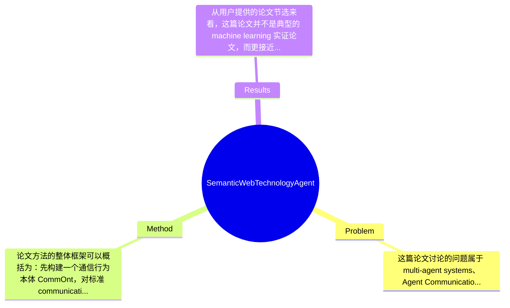

## Summary
该论文试图解决异构 agent 系统之间因 Agent Communication Language 与 protocol 表达不统一而无法语义互通的问题，提出用 Semantic Web 技术对标准通信协议进行形式化描述：以 OWL-DL/SWRL 表示协议结构，以自建通信行为本体 CommOnt 表示 communication acts，并用基于 social commitments 的 Event Calculus 语义来支持协议比较与推理；论文的主要产出不是传统 benchmark 上的性能提升，而是给出一个可用于判断 protocol equivalence 与 specialization 的统一知识表示与推理框架。

## Problem & Motivation
这篇论文讨论的问题属于 multi-agent systems、Agent Communication Protocols 与 Semantic Web 交叉领域，核心是：当不同信息系统由各自的 agent 代表进行交互时，它们虽然都“会通信”，却往往使用不同的 communication acts、不同的协议约束以及不同的语义假设，因此无法在语义层面真正理解彼此。问题的重要性在于，Web 上的异构信息系统若只做到接口互连，而做不到协议级、语义级互操作，就很难实现自动发现、自动协商与自动组合等高级能力。现实中，这类能力对于跨组织业务集成、Web Services 编排、自治软件代理协作都有直接价值。

现有方法的局限，论文至少隐含指出了三类。第一，很多 agent communication 方案只在 syntax 或 message format 层面标准化，例如规定 performative 名称，却没有提供可机器推理的统一语义，导致“同名不同义”或“异名同义”问题。第二，传统协议表示常依赖特定平台或预先协商，通信前需要繁重的人工对齐，这与开放 Web 环境中动态互操作的需求矛盾。第三，已有 protocol model 如 State Transition Systems 虽能描述流程，但对 communication acts 的语义基础和跨系统协议比较支持不足，难以判断两个协议是否等价、是否一个是另一个的特化。

作者提出新方法的动机总体是合理的：如果把协议、行为、语义都转化为可共享、可推理的知识表示对象，那么 agent 在相遇后就有可能自动比较彼此支持的协议，并进行替换或适配。论文的关键洞察在于把三个层次拼接起来：用 CommOnt 统一 communication acts 词汇；用 social commitments 捕获行为的 intended semantics；再借助 OWL-DL reasoner 与 SWRL/rule engine 对协议关系进行推理。这种思路的价值不在于提出新通信协议，而在于为“协议的语义化表示与比较”提供基础设施。

## Method
论文方法的整体框架可以概括为：先构建一个通信行为本体 CommOnt，对标准 communication acts 进行概念化建模；再把每个 communication act 的语义解释为对 social commitments 的创建、消解、满足或违背，并用 Event Calculus 中的 fluents 来形式化；在此基础上，将协议表示成由这些 communication acts 构成、并受交互规则约束的结构化对象，最终利用 OWL-DL reasoner 和 SWRL/rule engine 对不同 agent 所支持的协议之间的 equivalence、specialization 等比较关系进行自动推理。

1. CommOnt：communication acts ontology
   该组件的作用是提供统一词汇表，把不同系统中的 communication acts 放到一个共享语义空间中。论文认为协议由 communication acts 构成，如果最基本的交互动作都无法对齐，那么更高层的协议比较无从谈起。之所以设计成 ontology，而不是仅仅维护一个术语映射表，是因为 ontology 能显式表达 subclass、property restriction、等价关系等语义结构，适合在开放环境中扩展。与现有只给 performative 名称或接口文档的做法不同，CommOnt 的目标是把 communication acts 变成可被推理机理解的知识对象，而不是给人阅读的说明文本。

2. communication acts 的语义：social commitments + Event Calculus
   这是论文最核心的技术点。作者不满足于只说某个 act 是 request、inform 或 propose，而是进一步问：这个 act 在社会交互层面“意味着什么”？他们选择用 social commitments 来表达其 intended semantics，即一个 act 会导致参与方之间承诺关系的产生或变化。为了让这种变化可计算，论文把 commitments 形式化为 Event Calculus 中的 fluents。这样一来，发送某个 communication act 就对应某个 event，而 commitment 的生效、持续、终止可以由 Event Calculus 的规则系统跟踪。该设计的动机是获得时间化、状态化、可推理的语义表示，比单纯的标签语义更严格；与很多只建模消息顺序的协议工作相比，这里显式刻画了交互行为的规范后果。

3. 协议表示与组合
   论文把 protocol 看作对交互中允许 follow-up communication acts 的约束系统，也就是在某个阶段哪些 act 可以由哪个 agent 发出。文中提到标准协议可以从 repository 中选择，必要时还可以组合并定制后嵌入 agent。该设计说明作者关注的是开放环境中的协议重用，而不是为单一系统手工写死流程。与传统平台内置 protocol script 的区别在于，这里协议被提升为语义对象，可以被选择、比较和替换。遗憾的是，用户提供的节选中关于 protocol 形式结构、状态表示、组合操作的细节较少，因此具体 encoding 方式论文未完整展示。

4. 协议比较关系：equivalence 与 specialization
   作者定义了协议之间的比较关系，重点是 equivalence 和 specialization。其作用是让来自不同系统的 agent 在接触时，不只是检查“是否名字相同”，而是能判断两个协议是否语义等价，或者一个是否是另一个的受限版本/特化版本。设计动机很清晰：如果 A 支持的协议等价于 B 的协议，则可直接互通；若存在 specialization，则可能通过动态替换或适配实现交互。与现有大量关注 protocol enactment 的工作不同，这里更强调 meta-level reasoning，即“对协议本身做推理”。

5. 推理机制：OWL-DL reasoner + SWRL/rule engine
   OWL-DL 负责概念层分类与一致性检查，SWRL/规则引擎则补足更复杂的关系推导，特别是 protocol comparison 中难以仅靠 description logic 表达的规则。这种分层是合理的：ontology 负责静态语义结构，规则负责动态或复合关系。但也带来表达与计算复杂度问题。就设计选择而言，使用 OWL-DL/SWRL 并非唯一方案，也可以考虑 first-order logic、deontic logic、process algebra 或 model checking；作者之所以选 Semantic Web 技术，是为了强调开放标准、可共享表示和现成推理器支持。整体上方法概念上较统一，不算杂乱，但“CommOnt + social commitments + Event Calculus + SWRL”四层叠加也显示出一定工程复杂度，属于理论驱动的多层形式化方案，谈不上特别简洁优雅，但在目标问题上是相对自洽的。

## Key Results
从用户提供的论文节选来看，这篇论文并不是典型的 machine learning 实证论文，而更接近知识表示/形式化建模工作，因此没有看到标准 benchmark、数值指标、显著性检验或大规模实验表格。论文明确声称的“结果”主要是方法层面的：第一，构建了一个 communication acts ontology——CommOnt；第二，给出了基于 social commitments 与 Event Calculus 的 communication acts 语义表示；第三，定义了协议间的 comparison relationships，尤其是 equivalence 与 specialization，并说明可借助 OWL-DL reasoners 和 rule engines 对协议进行推理。

若按“主要实验”理解，当前可确认的只有概念验证式能力，而非量化性能实验。论文似乎展示了在 agent protocols 上进行语义比较和推理的可行性，但具体实验案例数量、参与的协议类型、是否覆盖 FIPA 常见协议、是否给出推理成功率、运行时间、知识库规模等，用户提供内容中均未提及。Benchmark 详情方面，论文未给出如 GLUE、SuperGLUE、MMLU 这类现代 benchmark，也未看到 agent communication 领域的标准数据集名称；指标层面亦未给出 precision、recall、latency、throughput 或 reasoning time 的具体数字，故不能捏造。

对比分析方面，作者在叙述中批评了现有方法在跨系统语义互操作和协议比较上的不足，但节选中没有看到与某个 baseline system 的定量比较，例如“比某方法多发现多少可互通协议”或“推理开销降低多少”。消融实验同样未见，例如拿掉 CommOnt、拿掉 Event Calculus、只用 OWL 不用 SWRL 后性能或表达能力如何变化，论文节选没有提供。

因此，实验充分性是这篇论文最明显的短板之一：如果这是 arXiv 上的理论性工作，那么给出若干详细 case study 仍然是必要的，至少应包含协议库规模、推理时间、复杂协议上的失败案例，以及 equivalence/specialization 判定与人工标注的一致性。就当前材料看，作者更像是在展示框架可行性，而不是系统地验证其实用性。是否存在 cherry-picking 很难定论；已知的是作者只展示了方法主张，没有展示反例、边界条件或失败情形，因此至少在证据呈现上偏乐观。

## Strengths & Weaknesses
这篇论文的亮点首先在于它把 agent communication 的“语义问题”摆到中心位置。很多工作只关心消息格式兼容或协议流程图，而本文试图回答 communication act 究竟在社会交互意义上做了什么，并用 social commitments 给予形式化定义，这是比纯流程建模更深一层的抽象。第二个亮点是技术整合较完整：CommOnt 负责共享词汇，OWL-DL/SWRL 提供知识表示与规则推理，Event Calculus 负责动态语义演化，三者共同支撑协议比较，而不是停留在单点方案。第三个亮点是它关注 protocol equivalence 与 specialization，这使框架不只是“描述协议”，还试图支持跨系统的协议替换与适配，这一点对开放 Web 环境很有实际吸引力。

但局限也很明显。第一，技术上该方案依赖多层形式化体系，表达力强但复杂度高。OWL-DL、SWRL、Event Calculus 的组合会带来建模门槛和推理成本问题，尤其在大规模开放环境中，规则冲突、可判定性边界和 reasoning latency 都可能成为障碍。第二，适用范围上，它更适合规范性较强、可明确定义 commitment 语义的标准协议；对于高度非规范、依赖隐式上下文、概率性或博弈性策略驱动的 agent interaction，未必好用。第三，数据与知识依赖较重：要发挥作用，需要预先构建较完整的 CommOnt、协议库和规则集，而这本身就是昂贵的知识工程工作，与作者想减少“a priori preparation”的愿景之间存在张力。

潜在影响方面，这项工作对语义互操作、agent middleware、service composition、协议发现与自适应协商都有启发意义。它未必能直接变成工业系统，但为“把协议当作可推理知识对象”提供了方向。

已知：论文明确提出 CommOnt、本体化 communication acts、用 social commitments 通过 Event Calculus 表达语义，并定义 protocol equivalence/specialization。推测：作者可能通过若干 case study 展示了协议比较，但当前节选未给出。还不知道：协议库规模、推理效率、失败案例、与现有系统的定量对比、在真实多 agent 平台上的部署结果，论文节选均未涉及。

综合评分给 3 分：有参考价值。它不是该方向的里程碑式实证论文，但在语义化协议表示和跨系统 protocol reasoning 上提供了有借鉴意义的形式化框架，值得做相关研究的人阅读其建模思想，不过是否“重要到必须细读”还取决于你是否正做 agent communication semantics 或 ontology-based interoperability。

## Mind Map

## Notes
<!-- 其他想法、疑问、启发 -->
