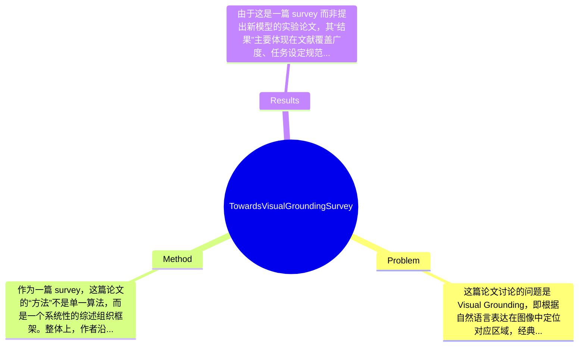

## Summary
这篇综述论文系统梳理了 Visual Grounding（含 Referring Expression Comprehension 与 Phrase Grounding）在过去十余年的研究进展，围绕任务定义、方法谱系、数据集、评测指标、应用场景与前沿方向构建了一个较完整的知识框架。其核心方法不是提出单一新模型，而是通过重新组织并标准化 fully supervised、weakly supervised、zero-shot、multi-task、generalized grounding 等多种研究设定，试图解决该领域概念混乱、比较不公平和研究碎片化的问题。论文声称自己是当前该方向最全面的综述之一，并通过数据集整理、趋势归纳和未来挑战分析，为后续研究提供系统参考。

## Problem & Motivation
这篇论文讨论的问题是 Visual Grounding，即根据自然语言表达在图像中定位对应区域，经典上也被称为 Referring Expression Comprehension（REC）或 Phrase Grounding（PG）。它处于计算机视觉与自然语言处理交叉的多模态学习领域，核心目标是建立“语言提及”与“视觉实体”之间的可计算对齐关系。这个问题之所以重要，是因为它比图文匹配更细粒度，比目标检测更语义化，是许多人机交互任务中的关键中间能力，例如视觉问答、机器人指令执行、视觉导航、辅助检索与自动标注。若机器无法准确理解“左边穿红衣服的男人”这类指代表达，就很难进一步完成复杂的多模态推理。

现实意义方面，Visual Grounding 直接服务于可解释的人机交互：用户用自然语言指定目标，系统需要在视觉场景中准确找到对象。它在机器人抓取、自动驾驶场景指代、辅助盲人系统、内容检索和智能监控中都有潜在价值。相比纯分类任务，grounding 更接近实际使用中的“定位+理解”需求。

现有研究的局限主要有三点。第一，任务设定长期不统一，REC、PG、grounded pre-training、generalized grounding 等概念边界模糊，导致不同论文往往在不同数据、不同假设、不同输出形式下比较，结论未必公平。第二，数据集分布和标注形式差异极大，例如 RefCOCO 系列偏日常对象指代，Flickr30k Entities 偏 phrase-level grounding，这使方法的泛化能力经常被高估。第三，2021 年后大量新方向涌现，如 grounding multimodal LLMs、giga-pixel grounding、zero-shot grounding，但缺少系统性总结，研究者难以把握主线。

论文的动机因此相当合理：作者并非要证明某个具体模型最强，而是要给出一个覆盖近年发展、能帮助领域建立共同语言的系统综述。其关键洞察在于，当前视觉定位研究的主要瓶颈已不只是模型精度，而是任务定义、评测协议与研究边界的不一致；因此，对各种 setting 做细致拆分和标准化，本身就是推动该领域进步的重要工作。

## Method
作为一篇 survey，这篇论文的“方法”不是单一算法，而是一个系统性的综述组织框架。整体上，作者沿着“概念定义—历史脉络—任务设定分类—代表方法总结—数据集与评测整理—应用与前沿问题—挑战与未来方向”的路线来重构 Visual Grounding 研究版图。其目标不是发明新模型，而是建立一套可复用的分析框架，使读者能够区分不同 grounding 子任务、理解主流技术路线，并在今后进行更公平的比较。

1. 概念与任务边界重定义
   该部分作用是澄清 VG、REC、PG 以及 generalized visual grounding 等概念。作者明确指出，经典 Visual Grounding 通常指依据文本描述在单张图像中定位目标区域；当表达较短且以 phrase 为主时更常称为 Phrase Grounding，而在 RefCOCO/RefCOCO+/RefCOCOg 相关语境中则更常称 REC。这样的设计动机是解决文献中术语混用的问题，因为同一类模型常被贴上不同标签，造成调研和比较困难。与既有综述相比，这篇论文更强调“dataset-related narrow definition”与“generalized definition”的区分，这一点有助于规范后续讨论。

2. 多研究设定的系统分类
   作者将现有方法按 fully supervised、weakly supervised、semi-supervised、unsupervised、zero-shot、multi-task、generalized grounding 等七类组织，这是全文最核心的结构组件之一。其作用是避免仅按模型结构分类导致的混乱，因为 grounding 的关键差异往往来自监督信号与任务假设，而不只是 backbone。这样设计的理由在于，同一个 Transformer 框架在全监督与零样本设定下的能力边界完全不同，直接横比并不合理。与早期 survey 更多按时间线或单一任务整理不同，这篇文章试图用“训练条件 + 输出目标 + 场景复杂度”的隐性坐标系来重排文献。

3. 数据集与评测体系整理
   该组件负责汇总相关 benchmark、标注形式和评价指标。论文摘要中提到作者不仅整理数据集，还尝试做“fair comparative analysis”与“ultimate performance prediction”。设计动机是回应该领域长期存在的数据碎片化问题：不同数据集在对象规模、表达复杂度、单目标/多目标设定、开放词汇程度上差异很大，导致 SOTA 结果往往不可直接迁移。与很多只列数据表的综述不同，作者显然想强调 benchmark 背后的偏置和标准化价值。不过由于给定文本未包含完整表格与具体 protocol，因此具体比较方法论文节选中未提及。

4. 前沿主题扩展：grounded pre-training、multimodal LLMs、giga-pixel grounding
   这一部分的作用是把 2021 年后的新增研究趋势纳入主框架，而不是停留在传统 REC/PG。作者显然认为，Visual Grounding 的边界已经从“小规模监督定位”扩展到更泛化的多模态理解，包括 grounding-aware pre-training、与大模型结合、超大分辨率场景中的定位等。这样的设计具有前瞻性，因为当前领域真正的研究增量往往出现在与 foundation models 结合的方向。与早期方法不同，这些新范式更依赖大规模预训练、开放词汇表达和跨任务迁移能力，而不仅仅是在 RefCOCO 上刷分。

5. 挑战归纳与未来方向
   该组件的功能是从 survey 走向 research agenda。作者总结当前挑战，并给出未来研究建议。设计上，这使论文不仅是“文献仓库”，而是带有领域判断的路线图。若仅从节选内容看，作者强调标准化、公平比较、新 benchmark 构建与更广泛场景推广，这是比较有现实针对性的。

从技术细节看，这篇综述主要通过分类框架、术语定义、数据集归纳和趋势抽象构成“方法”；它不涉及统一训练算法，但隐含的元方法论很清晰：先定义问题边界，再按监督设定与任务扩展维度组织方法谱系。整体上，这种设计相对简洁，不算过度工程化；但其质量高度依赖文献覆盖全面性、分类是否互斥清晰、以及作者是否真正做到公平比较。

## Key Results
由于这是一篇 survey 而非提出新模型的实验论文，其“结果”主要体现在文献覆盖广度、任务设定规范化、数据集梳理和趋势总结上，而不是单一 benchmark 上取得新的 SOTA 数值。从提供的摘要和节选看，论文明确声称系统回顾了过去十年的代表性工作，并重点补充了 2021 年后迅速发展的几个方向：grounded pre-training、grounding multimodal LLMs、generalized visual grounding、giga-pixel grounding。这种结果更偏“知识组织贡献”，而不是“性能提升贡献”。

Benchmark 方面，论文明确提到了经典数据集与任务语境，例如 Phrase Grounding 常与 ReferIt Game、Flickr30k Entities 关联，而 REC 常与 RefCOCO、RefCOCO+、RefCOCOg 关联。这说明作者至少在综述中试图建立 benchmark 与任务名称之间的对应关系，有助于减少文献中的概念混淆。评价指标方面，摘要提到会介绍基础概念和 evaluation metrics，但当前提供内容中未出现具体指标定义与公式；通常这类任务会使用 Acc@0.5、IoU-based accuracy、Recall 等，但就本次给定文本而言，具体数值“论文节选未提及”，因此不能捏造。

对比分析方面，论文的重要主张不是某方法比 baseline 高几个百分点，而是此前综述如 Qiao 等主要覆盖 2020 年前工作，已不足以覆盖近五年的发展，因此本论文在时间覆盖和主题完整性上具有补充价值。作者甚至提到会对数据集做 fair comparative analysis 和 ultimate performance prediction，这在 survey 中属于较有野心的部分。不过从现有节选无法判断其是否真的给出定量预测模型、统计拟合方法或趋势外推图，因此这部分只能说“论文声称提供，具体实现细节未提及”。

消融实验方面，survey 通常不会有传统意义的组件消融；若有，也更可能是统计性分析而非模型 ablation。当前材料中未看到针对综述框架本身的定量验证。实验充分性上，这篇文章作为综述的充分性主要取决于文献覆盖是否全面、分类是否一致、表格整理是否可复现。就节选来看，作者的野心较大，但也存在潜在风险：一旦某些新方向覆盖不足，或不同 setting 混放比较，所谓“全面综述”就会受到挑战。是否存在 cherry-picking，目前无法从给定内容确认；但因为作者主动强调 fair comparison，这至少说明其意识到了该问题。

## Strengths & Weaknesses
这篇论文的主要亮点首先在于系统性强。它不是简单罗列文献，而是试图重新定义 Visual Grounding 的任务边界，并将 fully supervised、weakly supervised、zero-shot、multi-task、generalized grounding 等不同设定纳入统一框架中。对于一个近几年快速扩张、术语混乱的方向，这种结构化整理本身就具有较高价值。第二个亮点是前沿覆盖较新。作者明确把 grounded pre-training、grounding multimodal LLMs、giga-pixel grounding 等 2021 年后兴起的话题纳入综述，相比只停留在传统 RefCOCO 范式的旧综述，更符合当前研究现实。第三个亮点是重视 benchmark 与公平比较，这一点尤其重要，因为 grounding 领域长期受到数据集偏置与评测协议不统一的困扰。

局限性也很明显。第一，它终究是一篇 survey，不提供新的可验证算法，因此其贡献主要依赖分类是否准确、覆盖是否全面、观点是否公允；这种贡献形式的影响力较难像方法论文那样直接量化。第二，作者提出 standardize future research 和 fair comparison 的目标很有价值，但要真正做到并不容易，因为不同论文的输入输出形式、预训练数据规模、开放词汇程度差异很大，仅靠综述中的框架未必足以消除不公平比较。第三，从当前节选看，论文虽然强调大量数据集和性能分析，但缺少我们此处可见的具体数字、统一表格和统计方法，因此其“ultimate performance prediction”听起来很吸引人，但可信度仍需看完整正文支撑。

潜在影响方面，这篇论文对入门者和做方向判断的研究者都很有帮助：它能作为视觉-语言定位领域的地图，帮助识别哪些问题已经趋于饱和，哪些新设定仍有空白。对后续工作而言，其最大价值可能不是提供答案，而是帮助社区统一问题表述和比较标准。

严格区分三类信息：已知：论文明确是 2024 年 arXiv survey，覆盖 Visual Grounding 历史、方法分类、数据集、应用、挑战与未来方向，并强调 recent advances 与 standardization。推测：其完整正文中大概率包含大规模方法表格、benchmark 汇总与分类图谱，并尝试对未来趋势作经验性判断。 不知道：完整文献覆盖数量、具体 benchmark 数字、是否对各子方向给出严格纳入标准、以及其性能预测是否基于统计模型，这些在当前提供内容中均未充分说明。

## Mind Map

## Notes
<!-- 其他想法、疑问、启发 -->
