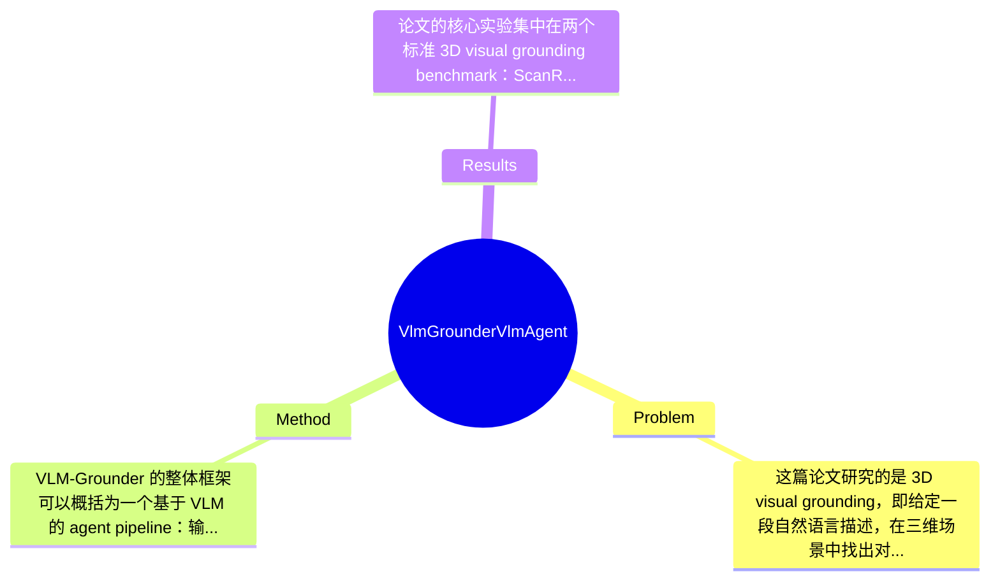

## Summary
VLM-Grounder 关注 zero-shot 3D visual grounding 问题，试图仅依赖 2D 图像和现成 vision-language models 来根据自然语言在三维场景中定位目标物体；其核心方法是动态拼接多视角图像、通过 grounding-and-feedback agent 式交互逐步缩小候选区域，并结合 multi-view ensemble projection 估计最终 3D bounding box。在 ScanRefer 和 Nr3D 上，该方法分别达到 51.6% Acc@0.25 和 48.0% Acc，优于先前 zero-shot 方法，且不依赖显式 3D 几何建模或训练好的 3D object priors。

## Problem & Motivation
这篇论文研究的是 3D visual grounding，即给定一段自然语言描述，在三维场景中找出对应目标物体的位置与边界框。它属于 3D vision、vision-language understanding 与 embodied AI 的交叉领域，也是机器人感知中的关键能力之一。这个问题的重要性在于，真实机器人或智能体面对的交互指令通常不是分类式标签，而是包含属性、空间关系、参照物和语义上下文的自然语言，例如“桌子旁边靠窗的蓝色椅子”。如果系统不能把语言精确对齐到三维空间，就难以完成抓取、导航、人机协作等任务。

现实应用上，3D grounding 是服务机器人、AR/VR、室内导航、智能监控和数字孪生的重要基础模块。尤其在机器人场景中，指令执行的最终落点必须是空间中的具体对象，而不只是图像中的 2D 区域，因此从语言到 3D 位置的映射具有直接工程价值。

现有方法主要有两类局限。第一类是监督式 3D 方法，通常基于 point cloud、object proposals 或 3D detector 训练，需要大规模标注数据，但 3D grounding 标注昂贵、数据集规模有限，导致泛化能力不足。第二类是近期 zero-shot/LLM 方法，虽然减少了训练依赖，但多基于 object-centric 的文本或检测结果进行推理，本质上只在“候选对象列表”上做语言匹配，难以处理复杂查询中的全局上下文、细粒度属性和多对象关系。换言之，它们知道“场景里有哪些物体”，却不一定真正“看见了整个场景”。

因此，作者提出新方法的动机是合理的：既要摆脱 3D 标注依赖，又要让模型利用原始视觉证据而不是仅依赖对象元数据。论文的关键洞察在于，把大模型从“对象匹配器”变成“多视图视觉代理”：通过动态组织图像输入，让 VLM 直接观察场景、逐步缩小目标范围，并把多视角 2D grounding 结果反投影到 3D，从而以较低系统复杂度实现 zero-shot 3D grounding。

## Method
VLM-Grounder 的整体框架可以概括为一个基于 VLM 的 agent pipeline：输入是一个三维场景对应的多视角 RGB 图像以及自然语言查询，系统先通过动态图像拼接把长序列图像压缩成适合 VLM 感知的上下文表示，再借助 grounding and feedback 机制让 VLM 在“观察—定位—再观察”的迭代过程中逐步确定目标所在视角和图像区域，最后将多个视角中的 2D grounding 结果通过 multi-view ensemble projection 映射回三维空间，输出最终 3D bounding box。它不是训练一个新的 3D grounding 网络，而是把成熟的 2D 感知能力、VLM 推理能力和几何投影模块组合起来，形成一个 zero-shot 系统。

1. 动态拼接（Dynamic Stitching）
- 作用：把一个场景中的大量图像帧组织成 VLM 可处理的输入，避免逐帧查询导致的高成本和上下文碎片化。
- 设计动机：VLM 通常存在输入分辨率、token 数和上下文长度限制，直接输入完整图像序列不现实；若只采样少量视角，又可能漏掉目标。动态拼接的目的是在覆盖场景信息与控制计算开销之间取得平衡。
- 与现有方法区别：相比只用 object list 或固定拼图，这里强调“动态”地组织图像，说明它会根据任务需要选择和拼接视角，而不是静态模板式输入。这使 VLM 能看到更完整的上下文，尤其有助于处理带空间关系的复杂描述。

2. Grounding and Feedback 机制
- 作用：让 VLM 先在粗粒度上判断目标可能出现在哪些图像或区域，再根据反馈继续缩小搜索范围，形成类似 agent 的迭代定位流程。
- 设计动机：单次提示往往不够可靠，尤其面对遮挡、远距离目标或复杂描述时，VLM 可能给出模糊响应。引入反馈回路可以利用上一步结果筛选更有信息量的图像，再进行细化 grounding，提高鲁棒性。
- 与现有方法区别：传统 zero-shot 方法更多是一轮式匹配；这里更接近主动感知/多轮推理，不把 VLM 当成被动分类器，而是当作具备搜索策略的代理。这个设计对复杂 referring expression 特别重要，因为目标识别往往依赖上下文排除而不是单物体识别。

3. 基于 2D 图像的目标定位
- 作用：在选定视角中由 VLM 或配套 2D grounding 模块确定目标的 2D 位置，为后续 3D 恢复提供观测依据。
- 设计动机：作者明确避免依赖 3D point cloud encoder 或 3D object priors，转而充分利用当前通用 VLM 在 2D 图像理解上的强项。这样可直接继承大规模图文预训练的泛化能力。
- 与现有方法区别：很多 3D grounding 方法从一开始就在 3D proposal 空间里做推理；本文则把问题分解为“多视角 2D grounding + 几何融合”，是一种工程上更现实、数据依赖更低的路线。

4. 多视图集成投影（Multi-View Ensemble Projection）
- 作用：将多个视角中的 2D grounding 结果反投影并融合，最终估计 3D bounding box。
- 设计动机：单视角 2D 框到 3D 的映射存在严重深度不确定性，而且容易受遮挡、视角偏差影响。多视角集成可以利用交叉约束减少歧义，提高三维定位精度。
- 与现有方法区别：不是直接依赖一个训练好的 3D detector 给出候选框，而是把几何一致性作为 zero-shot 系统中的核心补偿机制，用几何替代部分监督。

5. 提示工程与模块协同
- 作用：通过 carefully designed prompts 指导 VLM 执行场景理解、候选筛选和目标确认等子任务。
- 设计动机：由于系统不进行端到端训练，性能高度依赖任务分解是否清晰、提示是否稳定。附录单独给出 prompts，说明这部分是方法的重要组成。
- 其他选择：理论上也可以用更强的 grounding-specific VLM、区域级 captioner 或 segmentation 模块替代当前子模块；因此提示与模块组合并非唯一选择。

技术细节上，论文强调仅依赖 2D 图像，不依赖 3D geometry priors 或 object priors；但最终 3D box 的恢复必然需要相机参数和多视图几何关系，这说明作者回避的是“学习式 3D 表征依赖”，而非完全不使用几何。这个 distinction 很重要。就设计评价而言，方法总体上相当巧妙：它利用现成 VLM 能力，通过任务分解把困难的 3D grounding 问题转化为 VLM 更擅长的 2D reasoning 加几何融合，思路是简洁而务实的。不过从系统实现角度看，它包含动态图像拼接、交互式反馈、2D grounding、跨视角投影等多个子模块，也带有明显 pipeline 工程特征，不是那种单一模型、端到端且极简的优雅方案。它的优势在于可落地和 zero-shot 泛化，代价则是误差可能层层传递。

## Key Results
论文的核心实验集中在两个标准 3D visual grounding benchmark：ScanRefer 和 Nr3D。根据摘要中给出的主要数字，VLM-Grounder 在 ScanRefer 上达到 51.6% Acc@0.25，在 Nr3D 上达到 48.0% Acc。这里 ScanRefer 使用 Acc@0.25 作为主要指标，即预测 3D box 与真值框的 IoU 超过 0.25 的比例；Nr3D 的摘要中写作 Acc，通常表示 grounding 正确率，但更细的定义在用户提供内容中未完整展开，因此严格说具体评估细则需以论文正文为准。

从对比结论看，作者明确声称该方法优于 previous zero-shot methods，而且是在“不依赖 3D geometry or object priors”的设定下获得的。这一点很关键，因为它说明提升并非来自更强的 3D 监督或更丰富的候选物体先验，而是来自 VLM 驱动的视觉推理与多视图融合。遗憾的是，用户提供的节选中没有列出具体 baseline 名称与逐项数值，因此无法在这里精确计算相对提升百分比；按照要求，这部分只能标注为“论文节选未提及具体数值”。

实验部分还包含 Visual-Retrieval Benchmark、Ablation Studies，以及附录中的 2D detectors 消融、250 样本子集结果、推理时间、成功率与错误分析等，说明作者试图从多个维度验证系统，而不只是报告单一主结果。尤其是对 2D detector 的消融和 inference time 分析，能够帮助判断系统性能到底来自 VLM reasoning 还是底层检测器质量，以及其实际部署成本。

从实验充分性角度看，这篇论文比只做主 benchmark 汇报的工作更完整，但仍存在两个可能缺口。第一，若方法强调处理复杂 query，则应更系统地按 referring expression 类型分组评测，例如属性型、关系型、视角依赖型、遮挡型描述；节选中只看到 error analysis，具体是否有细粒度拆分论文未提及。第二，作为多阶段 pipeline，最好报告各阶段失败传播情况与稳定性。关于 cherry-picking，目前看作者不仅给了主 benchmark，也提供附录分析和失败案例总结，因此主观上不像只展示最好结果，但完整判断仍需查看全文表格和可视化。

## Strengths & Weaknesses
这篇论文的亮点首先在于问题设定非常有现实意义：它不是继续在小规模 3D 标注数据上堆模型，而是直接探索 zero-shot 3D grounding，契合当前基础模型驱动机器人感知的发展方向。相比依赖 object-centric metadata 的 zero-shot 方法，VLM-Grounder 让模型直接“看”多视角图像，这一转变很重要，因为很多复杂 referring expression 本质上需要场景级视觉上下文，而不是对象名词匹配。

第二个亮点是方法设计有较强系统洞察。dynamic stitching、grounding-and-feedback、multi-view ensemble projection 三者分别解决了 VLM 输入受限、单轮推理不稳、2D 到 3D 不确定性高这三个关键瓶颈，模块间分工清楚，体现出作者对 VLM 能力边界和几何约束作用的准确把握。

第三个亮点是它最大化复用了现有 VLM 的 2D 理解能力，而没有强行训练一个新的 3D 大模型。这种思路在数据稀缺场景中尤其务实，也更容易随着底层 VLM 升级而持续受益。

但局限也很明显。第一，技术上这是典型 pipeline 系统，误差传播不可避免：图像拼接选错视角、VLM 初始判断偏移、2D grounding 不准、几何投影噪声，任何一环都可能导致最终 3D box 失败。第二，适用范围可能受场景采样质量影响较大；若多视角图像覆盖不足、相机位姿不准、目标高度遮挡，方法性能大概率明显下降。第三，虽然避免了 3D 监督训练，但推理时可能计算开销不低，因为需要多视角处理和多轮 VLM 调用；附录虽有 inference time，但节选未给出具体数字。

潜在影响方面，这项工作对 embodied AI 和机器人感知具有示范意义：它表明在不重新训练 3D foundation model 的前提下，也能通过 VLM agent + 几何融合完成较强的 3D grounding，为后续 zero-shot manipulation、language-guided navigation 提供了可复用范式。

已知：论文在 ScanRefer 和 Nr3D 上分别达到 51.6% Acc@0.25 和 48.0% Acc，并优于先前 zero-shot 方法；方法包含 dynamic stitching、grounding and feedback、multi-view ensemble projection。推测：性能较大程度依赖底层 VLM 和 2D detector 质量，且在复杂关系描述中比 object-centric 方法更有优势。未知：完整 baseline 数值、不同 query 类型上的细分表现、极端遮挡场景鲁棒性、部署所需具体算力成本，在当前提供节选中均未完整说明。综合来看，这是一篇有参考价值、方法思路值得借鉴但尚未达到领域里程碑级别的工作。

## Mind Map

## Notes
<!-- 其他想法、疑问、启发 -->
