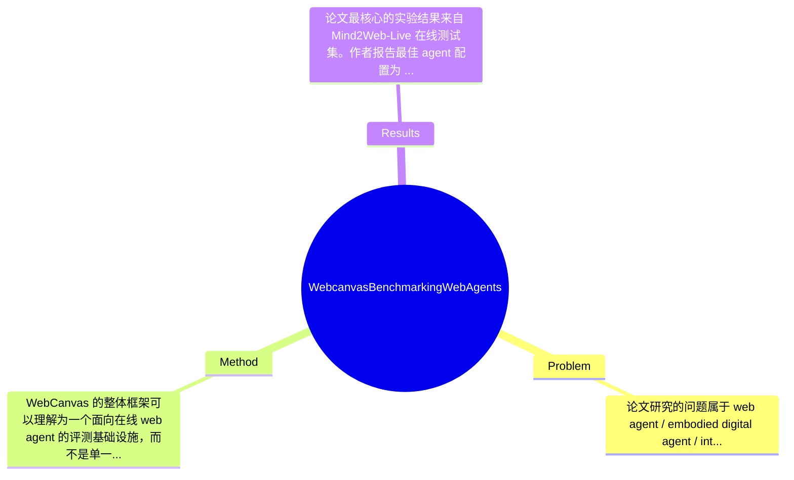

## Summary
这篇论文针对现有 web agent benchmark 主要停留在静态离线网页、无法反映真实在线网页动态变化的问题，提出了一个在线评测框架 WebCanvas，并构建了包含 542 个任务、2439 个中间评估状态的 Mind2Web-Live 数据集，同时配套 keynode 驱动的新评测指标、标注工具和测试流水线。基于该框架，作者评测了多种 agent 配置，发现离线表现好的方法未必能迁移到在线场景，其中最佳 agent 在 Mind2Web-Live 测试集上达到 23.1% task success rate 和 48.8% task completion rate。总体上，这项工作更像是“评测基础设施”创新，而不是提出新的 web agent 算法本身。

## Problem & Motivation
论文研究的问题属于 web agent / embodied digital agent / interactive AI evaluation 方向，核心是：如何在真实、持续变化的在线网页环境中，对 autonomous web agents 进行可靠、可复现、低维护成本的评测。这个问题重要，因为真实网页并不是静态 HTML 快照，而是会频繁发生 UI 改版、DOM 结构变化、内容刷新、地区差异、登录状态变化甚至网络抖动；如果 benchmark 仅在离线快照上评测，模型很可能学会“适配数据集格式”，却无法在真实网页上稳定执行任务。现实意义很直接：电商检索、在线表单填写、旅游预订、后台管理、信息采集等自动化场景都依赖 agent 在开放网页中的鲁棒操作能力，因此没有可信的在线评测，就很难判断这些系统是否真的可部署。

现有方法的局限，论文实际上抓住了几个比较具体的问题。第一，很多 benchmark 基于静态页面或固定轨迹，只检查最终答案或单步匹配，无法反映任务执行过程中必要中间步骤是否达成，也不能容忍网页细微变化。第二，传统 evaluation function 往往过于脆弱，页面元素一旦换位置、文案稍改、广告插入，就可能导致评测失效，甚至把正确行为判错。第三，在线数据维护成本高，网页会过期，人工重标的代价大，因此社区缺少可持续维护的 live benchmark。作者提出 WebCanvas 的动机是合理的：如果不先解决“如何评”，就无法系统推进“如何做出更好的 web agent”。其关键洞察是引入 keynodes 概念——不要求完全复现某一条固定轨迹，而是评估任务完成所必经的关键中间状态/动作，从而在动态网页中兼顾鲁棒性与可操作性。这一点本质上是在开放环境里寻找一种比终局成败更细粒度、又比逐步精确匹配更稳定的过程评价机制。

## Method
WebCanvas 的整体框架可以理解为一个面向在线 web agent 的评测基础设施，而不是单一模型。它把真实网页交互形式化为状态空间 S、动作空间 A、转移函数 T 和观察空间 O，并在此基础上加入 keynode 标注、在线执行、过程评测、数据维护和 agent 推理接口，目标是在动态网页环境中建立一个可持续更新、可比较、对网页变化相对鲁棒的 benchmark 体系。作者同时基于这一框架构建了 Mind2Web-Live，并开放了可扩展的 agent framework 供社区复用。

1. KeyNodes 定义与评测思想
该工作的核心组件是 keynodes。所谓 keynodes，是指完成一个网页任务时不可避免的关键中间步骤或状态，例如必须进入某个页面、必须触发某个操作、必须达到某个交互节点。它的作用是把任务评测从“只看最终成功/失败”转为“过程可检查的阶段性完成度评估”。这样设计的动机很明确：在真实网页中，完成同一任务常常存在多条路径，如果沿用静态 benchmark 中的固定轨迹匹配，评测会对路径差异极其敏感，导致大量误判。与现有方法相比，WebCanvas 不要求 agent 重放唯一 demo trajectory，而是检查是否经过必要关键点，因此对网页布局变化、非关键噪声事件、局部改版更稳健。

2. 新评测指标：task success + task completion
论文提出的评测并非只保留最终 success，而是引入基于 keynodes 的中间进度评价。task success rate 用于衡量任务是否真正完成；task completion rate 则反映 agent 覆盖了多少关键节点，因此可以捕捉“任务虽未完成，但过程部分正确”的情况。该设计的作用在于提高分析分辨率：很多在线任务失败并不是完全无效，而是卡在最后几步、表单验证、页面刷新等处。用 completion rate 可以更好地区分 agent 的能力边界。与传统单一成功率相比，这种设计更适合 online setting，因为网页环境中的失败往往混合了推理错误、环境噪声和工具执行误差。

3. Mind2Web-Live 数据集构建
作者基于原始 Mind2Web 静态数据集筛选并重构出 Mind2Web-Live，共 542 个任务、2439 个中间评估状态。该组件的作用是为在线 benchmark 提供真实、可执行、带过程监督的信息。设计动机在于：完全从零建设 live benchmark 成本太高，而直接沿用静态数据又无法适应网页变化，因此作者选择在已有任务基础上做“live refinement”。与原始 Mind2Web 的区别在于，这里不仅保留任务目标，还增加了 keynode 标注与可在线执行验证的评测逻辑，使其从 imitation/trajectory 数据变成可运行 benchmark。

4. 轻量标注工具与测试流水线
论文反复强调 annotation tools 和 testing pipelines 的“lightweight and generalizable”。这部分的作用是降低 benchmark 维护成本，因为网页会持续变化，如果评测框架依赖大量人工 hard-code，很快就会失效。设计上，它们应该支持重新校验页面、更新关键节点、统一执行 agent inference。与很多一次性发布的数据集不同，WebCanvas 想解决的是 benchmark 的长期存活问题，这是一个基础设施层面的贡献。可惜从给出的节选看，具体标注协议、自动化程度、人工校验成本的量化细节论文未提及。

5. Agent framework 与推理模块
基于 WebCanvas，作者还开源了一个 agent framework，支持可扩展 reasoning modules，并用其测试不同 agent 配置，例如 GPT-4-turbo、memory、ReAct 等组合。其作用是统一不同 agent 的在线运行方式，避免由于执行环境、工具接口不一致而导致比较不公平。设计动机是 benchmark 不应绑定某个特定模型，而应提供通用接入层。这一点与只发布数据集而不发布运行框架的工作不同。

从技术选择看，keynode 是必须设计，因为这是支撑在线动态评测鲁棒性的关键；但其具体形式未必唯一，也可以想象用程序化 goal checker、视觉 grounding verifier 或 learned reward model 替代。整体方法相对简洁，理念上是优雅的：用关键中间状态来替代脆弱的全轨迹匹配。不过工程上它仍然较重，因为在线评测天然涉及网站可达性、网络稳定性、地区差异、账号状态等复杂因素，所以“方法简洁”更多体现在评测抽象上，而非系统实现成本上。

## Key Results
论文最核心的实验结果来自 Mind2Web-Live 在线测试集。作者报告最佳 agent 配置为 GPT-4-turbo + memory + ReAct reasoning，其 task success rate 达到 23.1%，task completion rate 达到 48.8%。这两个数字本身很有信息量：一方面说明当前强大 LLM 驱动的 web agent 在真实在线环境中离可部署仍有显著距离；另一方面 completion rate 远高于 success rate，说明很多失败并非完全不会做，而是能到达部分关键步骤，却无法稳定完成全流程。

benchmark 方面，论文明确给出 Mind2Web-Live 包含 542 个任务、2439 个 intermediate evaluation states。评估指标至少包括 task success rate 和 task completion rate，前者偏最终结果，后者偏 keynode 覆盖程度。作者还分析了不同 websites、domains 和 experimental environments 下的性能差异，并特别指出 IP location variability 会显著影响在线评测结果，因此建议在框架中维持一致的实验设置。这一点非常关键，因为它说明在线 benchmark 的方差来源不只是模型，还有环境控制。

对比分析上，论文的一个重要结论不是“新 agent 超过旧 agent 多少”，而是“离线静态 benchmark 上竞争力强的方法，在在线动态环境中不一定依然有效”。这是本文比具体数值更重要的发现。不过就目前给出的摘录而言，除最佳配置的 23.1% / 48.8% 外，其他 baseline 的具体数字、提升幅度、是否统计显著，材料中未完整提供，因此不能捏造。消融方面，论文至少分析了 memory、ReAct，以及 keynode annotation 作为 intermediate reward 的作用，并指出人工提供的 keynode annotation 对 agent 有帮助，而让模型无参考地自动生成这类中间进度指示会出现较多错误，进而损害执行表现。但各组件的量化贡献，当前摘录未给出具体数值。

实验充分性上，这篇论文在“评测框架论文”语境下算比较扎实，因为它不只发布数据，还讨论网站、领域、IP、在线/离线差异等现实变量。但仍有缺口：第一，缺少更系统的重跑方差报告；第二，若没有足够多轮不同时间点测试，难以证明 benchmark 在长期网页漂移下的稳定性；第三，当前展示重点偏基础模型驱动 agent，是否覆盖更广泛 tool-use agent 或 multimodal agent，摘录中未提及。就 cherry-picking 而言，目前看作者没有只报成功率，而是同时报出并不高的在线结果，这反而增强了可信度；但若完整论文中只挑选部分网站分析，则仍需警惕。

## Strengths & Weaknesses
这篇论文的亮点首先在于，它把研究重点从“设计一个更强的 web agent”转向“建立更真实的在线评测基础设施”。这是非常有价值的，因为领域里很多进展其实受制于 benchmark 偏静态、偏离真实环境。第二，keynode 作为中间过程评价机制相当有启发性：它在严格性和鲁棒性之间取得了一个实用平衡，既不像 final-only metric 那样信息稀疏，也不像 exact trajectory matching 那样脆弱。第三，作者不仅提出概念，还配套提供了 Mind2Web-Live、标注工具、测试 pipeline 和 agent framework，使其更接近一个可被社区接手维护的平台，而不只是论文中的一次性实验。

局限性也很明显。第一，技术上 keynode 仍然依赖人工定义“哪些步骤是必需的”，而在开放网页中，不同用户路径可能高度多样，所谓 indispensable steps 未必总能稳定界定；若 keynode 设定不当，评测可能隐性偏向某类策略。第二，适用范围上，该框架更适合具有较清晰任务结构的导航与操作型网页任务；对于开放式信息探索、多轮交互、强个性化内容页面，评测设计可能更困难。第三，在线评测的计算和维护成本依然不低：需要真实网页可访问、环境受控、IP 一致、脚本长期维护，这些都意味着其复现门槛高于纯离线 benchmark。第四，数据规模目前只有 542 个任务，作为评测集够用，但若要覆盖 web 的长尾复杂性仍明显不足。

潜在影响方面，这项工作对领域的贡献更像“修路”而不是“造车”。它可能推动后续研究更重视 online generalization、process supervision、environmental robustness，也可能促进 reward design、curriculum learning、agent debugging 等方向的发展。

严格区分信息来源：已知——论文明确提出 WebCanvas、Mind2Web-Live、keynode metric，并报告最佳结果 23.1% success / 48.8% completion，也指出 IP location 等环境因素会影响结果。推测——该框架未来可能成为社区标准评测底座，keynode 也可能被用于训练时中间奖励，但论文并未证明其会大幅提升泛化。不知道——标注单个任务的平均人工成本、长期维护频率、不同时间窗口下 benchmark 漂移速度、与更多开源 agent 的系统对比，这些在给定材料中均未充分说明。

综合评分我给 3 分：有参考价值。它不是直接提升 agent 能力的里程碑算法论文，但对做 web agent evaluation、online benchmarking、process-level assessment 的研究者非常值得读，尤其适合作为构建实验平台和理解离线/在线鸿沟的参考。

## Mind Map

## Notes
<!-- 其他想法、疑问、启发 -->
