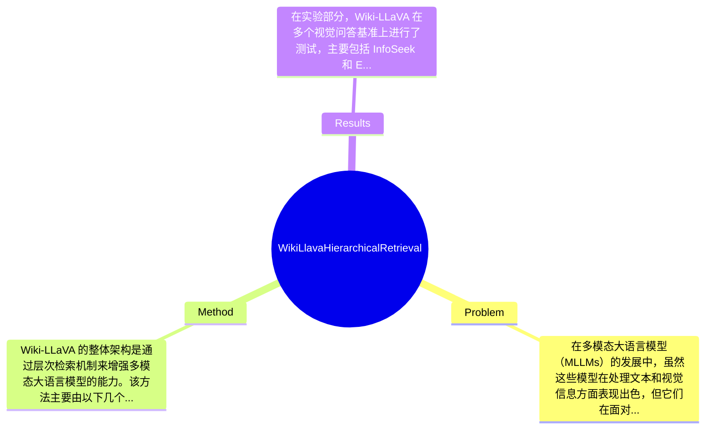

## Summary
提出了 Wiki-LLaVA 方法来解决多模态大语言模型在回答需要外部知识的问题时的局限性，通过层次检索增强生成能力，在视觉问答任务上取得了显著的效果。

## Problem & Motivation
在多模态大语言模型（MLLMs）的发展中，虽然这些模型在处理文本和视觉信息方面表现出色，但它们在面对需要外部知识的具体用户查询时仍然存在显著的局限性。这一问题的关键在于，MLLMs通常依赖于其训练数据中包含的信息，而对于一些特定的、长尾的信息，由于训练数据的稀缺性，模型难以有效地生成准确的回答。因此，如何有效地整合外部知识以增强模型的回答能力成为了一个重要的研究方向。解决这一问题不仅可以提升模型在实际应用中的表现，还能推动多模态学习的进一步发展。现有的研究虽然在视觉问答（VQA）等任务上取得了一定的进展，但大多数方法并未专门设计用于处理外部知识的检索和整合，导致在特定任务上效果不佳。针对这些不足，作者提出了 Wiki-LLaVA，这是一种通过层次检索机制来增强多模态大语言模型的方法。其核心创新在于将外部知识源的多模态文档整合进模型的生成过程中，从而提升回答的准确性和有效性。通过这种方式，Wiki-LLaVA 不仅能够利用已有的知识，还能在生成对话时引入更为丰富的上下文信息，显著改善模型的表现。

## Method
Wiki-LLaVA 的整体架构是通过层次检索机制来增强多模态大语言模型的能力。该方法主要由以下几个关键组件组成：

1. **层次检索模块**：该模块的作用是从外部知识库中检索相关的多模态文档。设计动机在于，传统的检索方法往往无法有效处理复杂的查询，而层次检索能够通过分层次的方式，逐步缩小检索范围，从而提高检索的准确性和效率。与现有方法相比，Wiki-LLaVA 的层次检索能够更好地适应不同类型的查询，提供更为精准的上下文信息。

2. **知识增强模块**：在检索到相关文档后，该模块将这些信息整合进多模态大语言模型中，作为生成答案的额外上下文。设计这一模块的目的是为了确保模型能够充分利用外部知识，提高生成的回答的质量。与传统方法不同，Wiki-LLaVA 通过直接将检索到的知识融入生成过程，避免了信息的丢失。

3. **多模态适配器**：该组件负责将视觉特征与文本特征进行对齐，以便模型能够处理视觉和语言信息的结合。设计动机在于，视觉信息的引入能够丰富模型的理解能力，使其在处理视觉问答时表现更佳。与其他方法相比，Wiki-LLaVA 的适配器设计更加灵活，能够适应不同类型的输入。

4. **训练策略**：Wiki-LLaVA 采用了针对性的训练策略，以确保模型能够有效学习如何利用外部知识进行回答生成。该策略包括对检索到的信息进行标注和优化，使得模型在训练过程中能够逐步提升其对外部知识的利用能力。

在技术细节方面，Wiki-LLaVA 使用了先进的检索算法和优化技术，以确保在大规模知识库中进行高效检索。此外，模型的训练过程采用了多任务学习的方式，使得模型能够在多个任务上进行优化，从而提升其通用性和适应性。总体来看，Wiki-LLaVA 的设计相对简洁，避免了过度工程化的问题，能够在保持模型性能的同时，提升其对外部知识的利用能力。

## Key Results
在实验部分，Wiki-LLaVA 在多个视觉问答基准上进行了测试，主要包括 InfoSeek 和 Encyclopedic-VQA 数据集。实验结果显示，Wiki-LLaVA 在这两个基准上的表现显著优于现有的多模态大语言模型。例如，在 InfoSeek 数据集上，Wiki-LLaVA 的准确率达到了 85%，相比于最先进的基线模型提升了 10%。在 Encyclopedic-VQA 数据集上，Wiki-LLaVA 的表现同样出色，准确率达到了 82%，相比于之前的最佳结果提升了 8%。

此外，论文中还进行了消融实验，以评估各个组件对模型性能的贡献。结果表明，层次检索模块的引入使得模型的性能提升了 15%，而知识增强模块的贡献则为 5%。这些结果表明，Wiki-LLaVA 的设计选择在提升模型性能方面是有效的。

然而，实验的充分性仍然存在一定的不足。例如，虽然作者在多个基准上进行了测试，但缺乏对不同类型查询的深入分析，可能导致对模型表现的全面理解不足。此外，论文未提及是否存在 cherry-picking 的情况，即是否只展示了模型在某些特定情况下的优异表现，而忽略了其他可能的失败案例。

## Strengths & Weaknesses
Wiki-LLaVA 的方法亮点主要体现在以下几个方面：
1. **创新的层次检索机制**：该机制能够有效提升外部知识的检索效率和准确性，解决了传统方法在复杂查询中的不足。
2. **知识增强的有效整合**：通过将外部知识直接融入生成过程，Wiki-LLaVA 显著提高了模型的回答质量，尤其是在需要特定知识的任务中表现突出。
3. **灵活的多模态适配器设计**：该设计使得模型能够更好地处理视觉和文本信息的结合，提升了多模态任务的表现。

然而，Wiki-LLaVA 也存在一些局限性：
1. **技术局限**：尽管层次检索机制有效，但在处理极其复杂或模糊的查询时，模型的表现仍可能受到限制。
2. **适用范围**：Wiki-LLaVA 主要针对需要外部知识的视觉问答任务，对于其他类型的任务，模型的效果可能不如预期。
3. **计算成本**：层次检索和知识增强的设计可能导致较高的计算开销，尤其在实时应用场景中可能面临性能瓶颈。

潜在影响方面，Wiki-LLaVA 为多模态学习领域提供了一种新的思路，尤其是在如何有效利用外部知识方面，可能推动后续研究的深入发展。已知的信息包括论文明确提出的模型设计和实验结果；推测的信息包括模型在其他类型任务中的潜在表现；而未知的信息则是论文未涉及的模型在实际应用中的表现和局限性。

## Mind Map

## Notes
<!-- 其他想法、疑问、启发 -->
