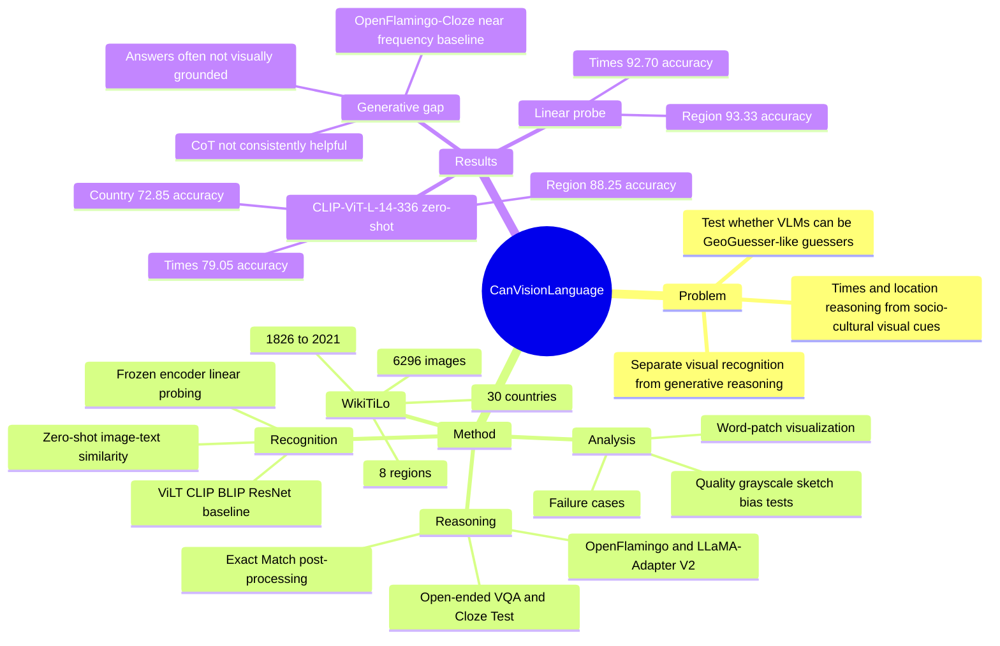

## Summary
这篇论文问的是 VLM 能否像 GeoGuesser 玩家一样，从图像中的 socio-cultural visual cues 推断拍摄时间与地点。作者构建 WikiTiLo，并用 Recognition/Reasoning 两阶段 probing 发现：CLIP/BLIP 等 visual encoders 能保留较强的时间/地点相关特征，但 OpenFlamingo 和 LLaMA-Adapter V2 这类 generative VLM 在开放式推理中不能稳定把视觉线索转成正确答案。

## Problem & Motivation
作者关注的是 VLM 是否具备一种更接近 commonsense 的视觉推理能力：不是识别图中物体，而是根据建筑风格、服饰、语言、社会事件、照片颜色/质量等线索判断图片来自哪个时代、地区或国家。这个问题重要，因为 VLM 预训练使用了大规模 image-text corpus，理论上可能吸收 socio-cultural knowledge；但“视觉编码器能识别相关 cue”和“生成式模型能基于 cue 做理由充分的推断”是两件不同的事。

论文把问题拆成两个 research questions：RQ1 是 discriminative VLMs 是否能从视觉输入中识别 times/location-relevant features；RQ2 是 generative VLMs 是否能基于视觉线索推理时间与地点。这个拆分的价值在于，如果 encoder 层已经有信息而 reasoning 层失败，问题就不应简单归因于“看不见线索”。

## Method
**Dataset: WikiTiLo.** WikiTiLo 来自 Wikimedia Commons，共 6,296 张图片，标注拍摄国家和时间，覆盖 30 个国家、8 个 UNESCO-style regions，以及 1826-2021 年。作者人工筛选图片，标准是人类能从建筑、服装、语言、社会事件、颜色/质量等细粒度线索中分辨时间或地点；同时尝试平衡欧洲/美洲等更常见区域和非洲、中亚等较少被关注区域。线性 probing 设置中，数据按 80% train、10% validation、10% evaluation 划分。

**Recognition stage.** 作者用 discriminative VLM 的 context-agnostic visual feature 做多类分类，任务包括 Times、Location(Region)、Location(Country)。Zero-shot setting 用文本 prompt 与图像 embedding 的相似度取 top-1；linear probing setting 冻结视觉编码器，只训练单层 linear probe，时间类别为 4 类，region 为 8 类，country 为 30 类。模型包括 ViLT、CLIP、BLIP，linear probing 里还加入 ResNet-50 作为 pure vision baseline。

**Reasoning stage.** 作者在 generative VLM 上做开放式 VQA / Cloze Test，让模型回答图片拍摄时间、region 或 country，并用 Exact Match 评估。模型包括 OpenFlamingo 和 LLaMA-Adapter V2，二者都使用 CLIP-ViT-L/14 visual encoder；OpenFlamingo 测试 0/4/8/16/32 shots、VQA、Cloze Test 和 CoT，LLaMA-Adapter V2 测试带候选 label 的 instruction 和简单 question instruction。

**Analysis.** 作者还做了三类辅助分析：用 cross-modal word-patch alignment 可视化模型关注的图像区域；分析 generative VLM 的 failure cases；把 test set 转成 lower quality、grayscale、sketch 三种风格，检查模型是否依赖 image style bias 而非 image details。

## Key Results
- **WikiTiLo / zero-shot Recognition.** CLIP-ViT-L/14@336px 在 Times、Location(Country)、Location(Region) 上分别达到 79.05% / 72.85% / 88.25% accuracy，明显高于 frequency baseline 的 25.07% / 3.33% / 12.53%，也高于 human baseline average 的 67.42% / 48.30% / 62.42%。BLIP 和 ViLT 在 country/location 上明显弱很多，例如 ViLT-Coco 的 country accuracy 只有 3.65%，region accuracy 只有 16.98%。
- **WikiTiLo / linear probing Recognition.** 冻结 visual encoder 后训练 linear probe，CLIP-ViT-L/14@336px 在 Times 上达到 92.70% accuracy、89.64% F1，在 Location(Region) 上达到 93.33% accuracy、93.37% F1。ResNet-50 在 Times 上有 80.63% accuracy，但在 Location(Region) 只有 54.13%；这支持作者的结论：VLM visual encoder 对 socio-cultural location cue 的表征比纯视觉 baseline 更强。
- **WikiTiLo / Reasoning.** Generative VLM 整体没有稳定达到 Recognition 的水平。OpenFlamingo-Cloze Test 几乎退化到 frequency baseline：Times 27.70%、Country 3.89%、Region 4.72% accuracy；OpenFlamingo-VQA 提升到 Times 31.59%、Country 48.88%、Region 22.49%，但仍远低于 CLIP zero-shot Recognition 的 79.05% / 72.85% / 88.25%。CoT 没有带来一致增益：OpenFlamingo-VQA CoT 为 Times 35.21%、Country 40.3%、Region 24.04%。
- **Instruction sensitivity and failure cases.** LLaMA-Adapter V2 对 prompt 很敏感：Instructiona 在 Times 上有 58.02% accuracy，但 Country/Region 只有 23.05% / 19.07%；Instructionb 在 Country 上有 45.62%，但 Region 只有 11.12%。论文的 failure case 显示，OpenFlamingo 可能生成不 grounded 的理由或理由与预测不一致；LLaMA-Adapter V2 有时无法定位人类可用的视觉 cue，甚至回答无法从图片确定国家。
- **Bias analysis.** 风格变换实验显示，grayscale 会明显降低 discriminative VLM 的表现，sketch 会显著破坏模型性能；lower quality 影响不大，因为视觉编码器会 reshape 输入。Generative VLM 对这些 bias 的变化几乎不敏感，作者据此认为其答案更多依赖 context/instruction，暴露出未充分 grounding 到视觉 cue 的问题。

## Strengths & Weaknesses
**已知 Strengths.** 这篇论文最有价值的地方是问题拆分：它没有直接问“VLM 能不能猜地点”，而是先测 visual encoder 是否保留相关 cue，再测 generative VLM 是否能把 cue 用到开放式回答中。Recognition/Reasoning 的 gap 是一个清楚的诊断信号：失败不一定来自视觉信息不存在，也可能来自 context-conditioned visual features 信息损失、projection module 或 LLM reasoning 没有利用视觉证据。

**已知 Strengths.** WikiTiLo 的构造强调 socio-cultural cue，而不是标准 geolocation benchmark 中的经纬度或街景匹配；这让任务更接近“从场景线索做 commonsense inference”。论文也没有只报 main result，而是包含 human baseline、frequency baseline、ResNet-50 baseline、zero-shot vs linear probing、CoT、in-context shot 数、style transfer 和 failure case 分析。

**已知 Weaknesses / Boundaries.** WikiTiLo 只有 6,296 张图、30 个国家，且依赖人工从 Wikimedia Commons 筛选“人类能看出线索”的图片，因此不能代表开放世界 geolocation/time reasoning 的自然分布。人类 baseline 只有 12 名参与者、每人 60 张图，而且作者承认人类表现受背景与教育差异影响很大，所以它更适合作为参考点，不是严格的 human ceiling。

**已知 Weaknesses / Boundaries.** Reasoning 阶段只评估 OpenFlamingo 和 LLaMA-Adapter V2，并且用 Exact Match 过滤 free-form answer；这能避免过度宽松评分，但也可能把部分可解释但不符合关键词抽取的回答判错。论文没有给出更细的 projection-module ablation，因为作者也说明 generative VLM 的 projection module 和 language model 深度耦合，难以像 visual encoder 一样直接 linear probe。

**推测.** 对 GUI-agent / embodied VLM 的启发是：如果 agent 需要从 screenshot 或真实场景中利用文化、文本、服饰、环境布局等间接线索，单纯拥有强 visual encoder 不足以保证高层 reasoning 能用上这些线索。这个推测来自论文的 Recognition/Reasoning gap，但论文没有直接评估 GUI 或 embodied task。

**不知道.** 论文没有回答在更强或更新的 generative VLM、不同 visual encoder、不同 prompt parsing、或更大规模地理/时间覆盖下，这个 gap 是否仍然存在。也不知道错误主要来自 visual-language projection 丢信息，还是 LLM 在候选国家/地区知识和视觉证据之间的绑定失败；论文只给出合理假设和 qualitative failure cases，没有做因果分离。

## Mind Map

## Notes
我的判断是 rating=3：这篇论文不是一个方法 paper，而是一个有用的 probing / benchmark paper；对 VLM scene understanding 和 agent 视觉证据利用有参考价值，但模型覆盖和数据规模有限，不能直接推出当代 VLM 的能力边界。

最值得保留的 mental model 是：视觉表征里的信息存在，不等于生成式多模态模型会在任务上下文中使用它。后续读 GUI grounding、web/mobile agent screenshot reasoning 或 embodied scene reasoning 时，可以把这个拆成三个检查点：encoder 是否识别 cue、bridge/context 是否保留 cue、LLM 是否把 cue 和世界知识绑定成可验证答案。

我不完全买账的地方是，作者把 generative VLM 的失败部分归因于 context-conditioned visual features 不能保留 answer-relevant information 或 LLM 未基于 visual cues reasoning，但实验没有把这两个机制分开。这个解释是合理 hypothesis，不是被 ablation 直接证明的结论。
