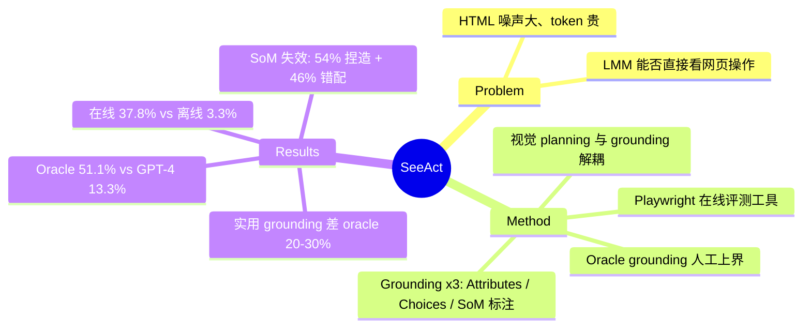

## Summary
SeeAct 把 web agent 拆成 LMM 视觉规划（action generation）与动作落地（grounding）两阶段，在 Mind2Web / 真实网站上证明：GPT-4V 若配 oracle grounding 可完成 51.1% 的在线任务（GPT-4 仅 13.3%），但实用 grounding 方法与 oracle 仍有 20-30% step-SR 差距——grounding 而非 planning 是瓶颈。

## Problem & Motivation
现有 web agent（MindAct 等）主要让 LLM 读 raw HTML，但 HTML 比渲染后的视觉信息更噪、密度更低：文中例子里一张截图的 423 个 HTML 元素需要 186,490 个 GPT-2 文本 token，而 GPT-4V 视觉 tokenizer 只需 1,445 个视觉 token；且 HTML 缺失嵌入图片等语义。作者要回答的问题是：以 GPT-4V 为代表的 LMM 能否直接"看着网页"当 generalist web agent？瓶颈在哪？

## Method
SeeAct 两阶段：
- **Action Generation**：GPT-4V 只看截图（不给 HTML），模仿人类浏览网页，输出自然语言动作描述 ã=(ẽ, õ, ṽ)（目标元素、操作类型 Click/Type/Select、输入值）。
- **Action Grounding**：把 ã 转成可执行的 (e, o, v)。o 和 v 靠字符串解析即可，难点是 element grounding。比较三种策略：
  1. **Element Attributes**：让模型描述目标元素文本+类型，再对 DOM 做启发式匹配；
  2. **Textual Choices**：沿用 MindAct 的 DeBERTa cross-encoder 排 top-50 候选元素，以 HTML 文本做多选题让模型选；
  3. **Image Annotation**（即 Set-of-Mark 风格）：给候选元素叠加 bounding box + 索引 label，让模型报 label。
- **Oracle grounding**：由人工标注者解读模型的文本计划并落地，作为 action generation 能力的上界。
- 评测：Multimodal Mind2Web（作者清洗对齐 HTML+截图后发布）离线评测 + 自建 Playwright 工具在真实网站上做在线评测（90 个任务，人工监督避免有害操作）。

## Key Results
全部来自全文：
- **在线 whole-task SR**：SeeAct_Oracle **51.1%** vs SeeAct_Choice 37.8% vs GPT-4 **13.3%** vs FLAN-T5-XL 8.9%。LMM planning 能力强，grounding 是主要瓶颈。
- **Grounding 策略对比**（step SR，30 任务/split 子集，Cross-Task/Website/Domain）：Attributes 16.1/12.1/19.0，**Annotation（SoM 式）20.3/13.9/23.7**，Choices **39.1/32.7/42.0**，Oracle 61.9/65.0/62.1。最好的实用策略（HTML 文本候选 + 视觉规划的混合）与 oracle 仍差 **20-30%**；SoM 式标注比 Choices 低约 10-19 个点。
- **SoM 失效的负结果**：网页截图元素密集、语义空间关系复杂，GPT-4V 严重幻觉。100 个"规划正确但 grounding 错误"样本分析：**54%** 是凭空捏造 bounding box/label（目标元素本无标注却编一个 label），**46%** 是无法把 bounding box 与其索引 label 正确对应。SoM 在 object/scene-centric 图像上有效的结论不迁移到 webpage。
- **离线全量**（Choices grounding, step SR）：GPT-4V 40.2/32.4/36.8，超 text-only GPT-4（32.3/27.0/29.7），但 Cross-Task 上仍低于 SFT 的 FLAN-T5-XL（53.5）；Cross-Website/Domain 上 ICL 大模型泛化更好。
- **在线 vs 离线差异**：SeeAct_Choice 离线 zero-tolerance SR 仅 3.3%，在线却 37.8%——同一任务往往存在多条可行路径，离线单参考轨迹严重低估真实能力，在线评测更可信。

## Strengths & Weaknesses
**亮点**：
- 用 oracle grounding 把 planning 与 grounding 解耦测量，是该领域最早清晰量化"瓶颈在 grounding 不在 planning"的工作，51.1% vs 13.3% 的对比直接确立了 LMM 路线。
- SoM 对 web agent 无效是高价值负结果（54% 捏造 + 46% box-label 错配的错误分解很有信息量），解释了后续工作转向坐标式 grounding（SeeClick、UGround 等）的动机。
- 指出网页的独特性质——HTML 元素与视觉渲染存在已知对应关系——是 grounding 的可利用结构，最优策略（文本候选多选）正是利用了这一点。
- 在线/离线差异的量化（3.3% vs 37.8%）方法论影响大，是后续社区转向 online/interactive 评测的重要论据。

**局限**：
- Oracle grounding 由人工判读近似，"51.1%"实为 planning 上界的估计而非可复现系统性能；在线评测 90 任务规模小且限非登录任务。
- Textual Choices 依赖 MindAct 的 cross-encoder ranker（需训练数据），并非纯 zero-shot；ranker 召回失败的情况未单独分析。
- 结论绑定 2024 年初的 GPT-4V：SoM 失效归因于当时模型的视觉细节/空间对应能力弱，未必适用于后续模型（推测；论文未验证）。
- 只覆盖 Click/Type/Select 三种操作，无 scroll/drag 等，动作空间较后来的 computer-use 基准简单。

## Mind Map

## Notes
- Multimodal Mind2Web 数据集（HTML+截图对齐清洗版）由本文发布，后成为 GUI grounding 系列工作的标准评测。
- 同组后续工作 UGround（"visual grounding for GUI agents"）正是沿"grounding 是瓶颈"这条线做专用 grounding 模型。
