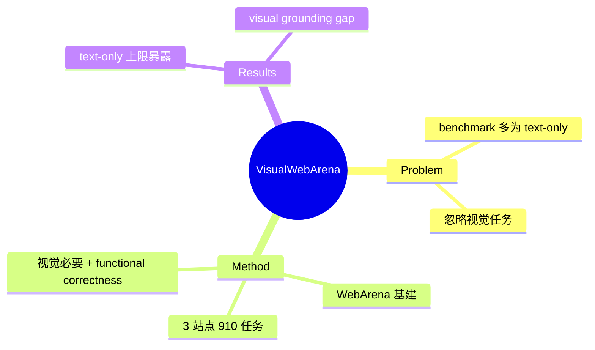

## Summary
VisualWebArena 在 [[Papers/2307-WebArena]] 基础上扩到**多模态视觉 web 任务**：910 个需要理解图像+文本才能完成的任务，跨 Classifieds / Shopping / Reddit 三个 self-hosted 站点，暴露 text-only LLM agent 与 SOTA 多模态 agent 在 visual grounding 上与人类的显著差距。是 visual web agent 的奠基 benchmark。

## Problem & Motivation
既有 web agent benchmark 多为 text-based（依赖 DOM/AXTree），忽略了大量**天然需要视觉信息**的任务（看商品图选购、按图找帖）。要衡量真正像人一样"看网页"的 agent，需要视觉 grounding 是必要条件的任务集。

## Method
构建于 WebArena 的 self-hosted 沙盒基础设施：
- **三站点**：Classifieds、Shopping、OneStopMarket、Reddit（复用 WebArena 可复现环境）。
- **910 任务**：每个任务要求 agent 准确处理 image-text 混合输入、理解自然语言指令、执行动作；相当比例任务的成功**必须依赖视觉理解**（如按参考图找相似商品），text-only 无法完成。
- **观察/动作**：screenshot + Set-of-Marks + DOM/AXTree，动作沿用 WebArena 的 click/type/scroll 等，用 functional correctness 评测。

## Key Results
- 揭示 **text-only LLM agent 的能力上限**：大量任务因缺视觉信息而无法完成。
- SOTA 多模态 agent（如 GPT-4V）仍与人类有明显 **visual grounding gap**——能读文本但在视觉定位/细粒度视觉推理上远不及人。
- 成为 visual web agent 路线的标准评测，后续 [[Papers/2606-WebGym]] 等 pixel-based agent 的重要对照。

## Strengths & Weaknesses
**亮点**：(1) 首个大规模、self-hosted、可复现的多模态 web benchmark，把"视觉是否必要"做成任务设计原则；(2) 复用 WebArena 基建，functional correctness 评测可信；(3) 明确了 visual grounding 是 web agent 的独立瓶颈（与 [[Topics/CUA-Survey]] grounding 结论一致）。

**局限**：(1) 只 3 站点、沙盒环境，真实 live 泛化未测（[[Papers/2504-OnlineMind2Web]] 后来证明沙盒分会崩）；(2) 静态任务集，随模型进步会饱和；(3) 视觉任务占比与难度分布可进一步细化。属 [[Topics/WebAgent-Survey]] 的观察/grounding 与 benchmark 路线。

## Mind Map

## Notes
- 同组（Neubig/Fried/Salakhutdinov）后续产出 [[Papers/2409-AgentWorkflowMemory]]、[[Papers/2504-SkillWeaver]]。
- 与 [[Papers/2412-BrowserGymAgentLab]] 已统一收录，可在 gym 里直接跑。
