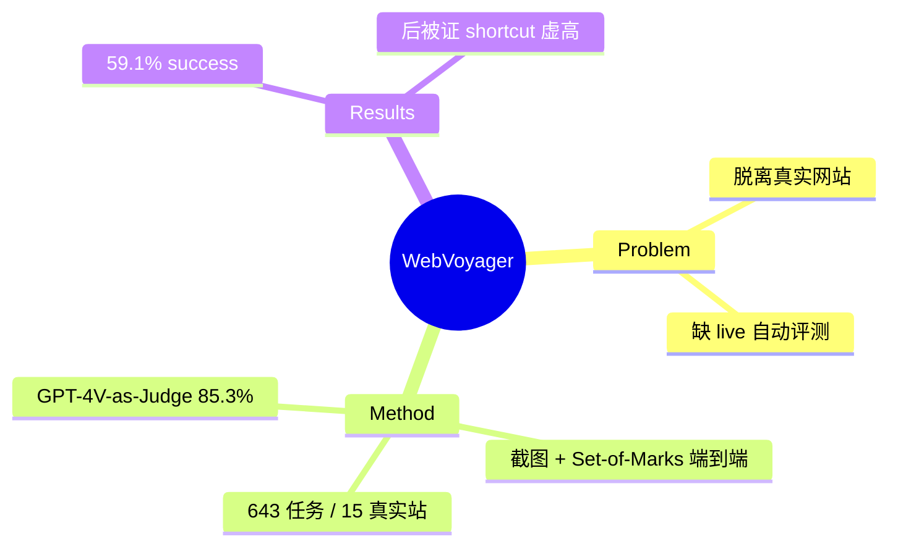

## Summary
WebVoyager 是首批端到端、在**真实 live 网站**上用截图 + Set-of-Marks 操作的多模态 web agent + benchmark：643 个任务跨 15 个热门真实网站，配 GPT-4V-as-Judge 自动评测（85.3% 人工一致），报告 59.1% task success。后被证明任务多 shortcut 可解、分数虚高（见 [[Papers/2504-OnlineMind2Web]]），但作为 live 多模态 web agent 的开创性工作影响深远。

## Problem & Motivation
此前 web agent 多在 sandbox/simulator 或 text-only 设置下评测，脱离真实网页。作者要造一个直接在**真实网站**上、用**视觉截图**端到端操作的多模态 agent，并给出能自动评测 open-ended 真实 web 任务的协议。

## Method
- **端到端多模态 agent**：直接看 rendered screenshot + Set-of-Marks（元素标注）做决策，输出 click/type/scroll 等动作，在真实网站运行。
- **643 任务 / 15 真实网站**：Allrecipes、Amazon、Apple、ArXiv、BBC、Booking、GitHub、Google Flights/Maps/Search、Hugging Face、Wolfram、Cambridge Dictionary、Coursera、ESPN。
- **GPT-4V-as-Judge 自动评测**：用 GPT-4V 多模态理解判断任务是否完成，达 **85.3% 人工一致**——首个可扩展的 live web agent 自动评测协议。

## Key Results
- **Task success rate 59.1%**，显著超过 GPT-4 (All Tools) 与 text-only 变体。
- 证明多模态 + Set-of-Marks 在真实网站可行。
- **重要后续修正**：[[Papers/2504-OnlineMind2Web]] 指出 WebVoyager 任务缺覆盖/多样性、~51% 可被"只用 Google Search"解掉、judge 与人工一致性在更严格审视下偏低，导致后期 agent 报出 ~90% 的虚高分——WebVoyager 成为"进步幻觉"批判的主要对象。

## Strengths & Weaknesses
**亮点**：(1) 开创 live 真实网站 + 截图端到端 + Set-of-Marks 的范式，被产业界（Operator/CUA 等）广泛沿用；(2) GPT-4V-as-Judge 自动评测启发了后续 WebJudge 等；ACL 2024。

**局限**：(1) 任务 shortcut 可解 + 站点少，使其作为能力标尺不再可靠（[[Papers/2504-OnlineMind2Web]] 的核心反例）；(2) live 站点会漂移，复现性差；(3) LLM-judge 一致性在严格协议下不足。属 [[Topics/WebAgent-Survey]] benchmark 路线（"进步幻觉"的反面教材）。

## Mind Map

## Notes
- 与 [[Papers/2504-OnlineMind2Web]] 配对阅读：前者立范式、后者揭其虚高——共同构成 web agent 评测方法学的关键转折。
