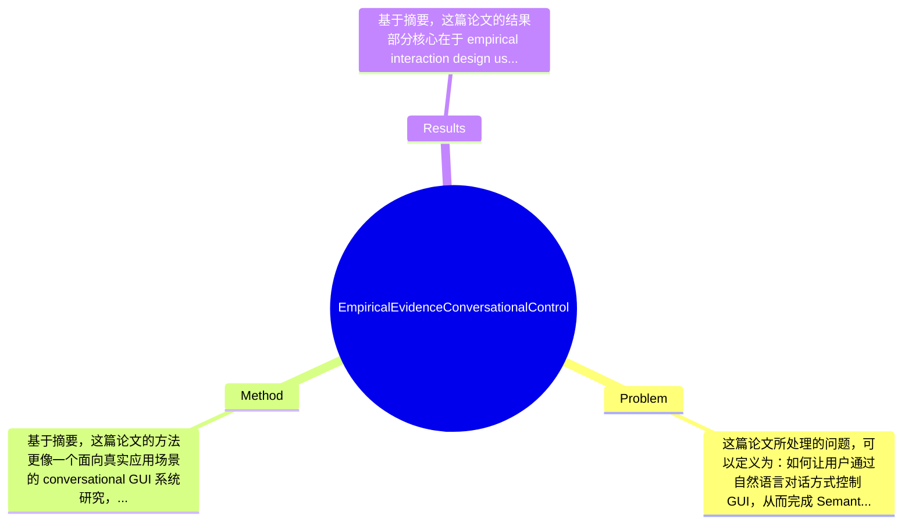

## Summary
该工作面向 Semantic Automation 场景，探索将经过微调的 Large Language Model（LLM）用于对图形用户界面（GUI）进行对话式控制，并结合 In-situ Prompt Engineering 与 Human Feedback 优化自然语言交互体验。论文先从既有 SAL 能力中进行压缩与优先级梳理，再实现原型系统，并通过实证性用户研究评估其可用性与交互效果。基于摘要可知，作者报告了用户参与度、满意度提升，以及用户在使用该 conversational UI 后对 AI 的信任显著增加，但具体量化结果论文摘要未提供。

## Problem & Motivation
这篇论文所处理的问题，可以定义为：如何让用户通过自然语言对话方式控制 GUI，从而完成 Semantic Automation Layer（SAL）中的复杂操作。这属于 Human-Computer Interaction（HCI）、Intelligent User Interfaces（IUI）、以及 LLM 驱动交互系统的交叉领域。其重要性在于，传统企业自动化与语义建模工具往往功能强但门槛高，业务分析师、数据工程师等用户需要理解菜单结构、参数配置与工作流逻辑，学习成本较大；如果能将 GUI 控制转换为 conversational control，就有可能降低使用门槛、提升任务完成效率，并扩大语义自动化系统的可达用户群体。

现实意义上，这类问题直接关系到企业知识管理、数据集成、语义建模、流程自动化等场景。对于业务分析师而言，自然语言交互可以减少对底层系统细节的依赖；对数据工程师而言，则可能加速配置与调试流程；对组织层面，则意味着更低的培训成本与更强的人机协同能力。尤其在 Semantic Automation 这类具有高概念密度的系统中，若界面交互仍然高度依赖手工点击与表单填写，用户价值会被 UI 摩擦严重削弱。

现有方法的局限，摘要虽未系统展开，但可以合理归纳出几类：第一，传统 GUI 操作方式高度显式，要求用户记忆功能入口与操作顺序，不利于复杂任务中的意图表达；第二，纯 chat-based assistant 往往脱离具体界面上下文，难以与实际可操作控件、状态变化、业务约束形成闭环；第三，一般性的 LLM agent 即便能生成操作建议，也未必能在垂直语义自动化场景中稳定工作，因为领域能力、工具能力与提示策略没有针对性设计。论文的动机因此是合理的：作者并非简单地“把聊天框加到界面上”，而是试图把 SAL 的能力做结构化梳理，再通过优先级分析与原型设计，将 conversational control 真正嵌入到 GUI 工作流之中。

这项工作的关键洞察在于：对话式 GUI 控制要有效，不仅依赖底层 LLM，还依赖任务能力边界的整理、界面与语言交互的协同设计，以及基于实际使用过程的提示工程和 human feedback 调整。换句话说，创新点更偏“系统整合 + 交互设计 + 实证评估”，而不只是提出一个全新的模型结构。

## Method
基于摘要，这篇论文的方法更像一个面向真实应用场景的 conversational GUI 系统研究，而不是单一算法论文。整体框架可以概括为：作者先从既有的 Semantic Automation Layer（SAL）中抽取并压缩核心能力，再与业务分析师和数据工程师通过 Kano model 做需求优先级排序，随后实现一个原型 GUI；在此基础上，引入一个经过 fine-tuning 的 LLM 作为 conversational engine，使用户可以通过自然语言发起界面操作，并结合 In-situ Prompt Engineering 和 learn from Human Feedback 来优化交互流畅性，最后通过 empirical interaction design user study 评估系统的有效性与可用性。

关键组件可分为以下几部分：

1. SAL capability condensation（能力压缩与任务抽象）
   该组件的作用是把 prior work 中较为分散或复杂的 SAL 能力整理成一组更适合界面承载、也更适合 LLM 调用的功能单元。这样设计的动机很明确：如果系统能力本身边界不清，LLM 很难稳定地把自然语言意图映射到可执行 UI 操作。与许多直接将通用 LLM 接到现有软件上的工作不同，这里作者先做“能力工程”，相当于先定义可控 action space，再讨论对话式调用。从系统设计角度看，这是提升可靠性的重要前置步骤。

2. Kano model-based prioritization（需求优先级建模）
   作者将业务分析师和数据工程师纳入需求优先级过程，使用 Kano model 区分哪些功能是 must-have、performance、或 delighter 类型。该组件的作用不是提升模型精度，而是确保 conversational UI 优先覆盖真正影响体验和价值感知的功能。设计动机在于：企业软件里的功能很多，但并非都适合优先做对话控制。与常见“技术驱动式原型”不同，这里体现出 user-centered design 思路，即先用需求方法论筛选功能，再构建系统。这个选择提高了原型的现实代表性，也使后续用户研究更有解释力。

3. Prototype UI + conversational engine（原型界面与对话控制引擎）
   原型 UI 是核心载体，LLM 则充当将自然语言命令映射为 GUI 操作的控制器。它的作用是让用户不必完全依赖传统菜单、按钮和配置路径，而可以通过 conversational command 触发、修改或引导界面操作。这里的设计动机在于保留 GUI 的可见性与结构化优势，同时利用对话交互的低门槛和高表达自由度。与纯文本 agent 不同，这种方法强调“对话不是替代界面，而是增强界面”；与传统 command interface 不同，LLM 带来了更强的语义容错和意图理解能力。

4. In-situ Prompt Engineering（情境内提示工程）
   摘要特别提到该部分，说明它是系统效果的重要手段。其作用大概率是在用户真实交互上下文中动态组织 prompt，将当前 UI 状态、可用操作、历史对话、任务目标等注入给模型，以减少歧义并提升响应的可执行性。设计动机是，GUI 控制天然依赖上下文，如果 prompt 不绑定当前界面状态，模型很容易给出泛化但不可操作的回答。与离线静态 prompt 相比，in-situ 方式更贴合 interactive system 的特点，也更适合多轮任务。

5. Learn from Human Feedback（基于人类反馈的迭代优化）
   摘要没有说明具体采用 RLHF、偏好学习、还是人工规则修正，因此技术细节论文未提及。但该组件的作用可以明确理解为：根据真实用户互动中的问题、偏好和失败模式调整系统行为，使对话控制更加顺滑。设计动机是，GUI 交互的成功不仅是“答对”，还包括是否易懂、是否可预期、是否让用户感到被控制而非被误导。与单次部署的 LLM 系统不同，这里强调 interaction refinement，说明作者更关注 usability 而非仅仅 task accuracy。

从技术细节上看，摘要只明确提到“fine-tuned LLM”“In-situ Prompt Engineering”“Human Feedback”，但没有给出模型规模、训练数据、action representation、UI grounding 机制、错误恢复策略、或是否采用 function calling/tool use。因此这些细节均应标注为论文未提及。就设计选择而言，能力压缩、需求优先级排序、上下文感知 prompt 基本属于必要设计；而是否一定要 fine-tune、是否一定采用 Kano model、以及 human feedback 的实现方式，则都存在替代方案，例如 retrieval-augmented prompting、wizard-of-oz 式设计、或更形式化的 GUI action planner。总体评价上，这个方法从摘要看相对务实，强调系统整合与交互闭环，谈不上算法上的“简洁优雅”，但也不像纯堆模块式过度工程化；它更像一篇以设计研究和实证验证为主的 IUI 风格工作。

## Key Results
基于摘要，这篇论文的结果部分核心在于 empirical interaction design user study，而不是标准机器学习 benchmark。作者声称其 findings 提供了证据，表明 conversational control 能增强 user engagement 和 satisfaction，并且在用户体验该 conversational UI 后，对 AI 的 trust 出现了显著提升。这说明论文的主要评价维度更偏 HCI：可用性、主观感知、信任、交互体验，而非传统 NLP 指标如 accuracy、F1、BLEU 等。

但需要明确指出：摘要没有给出任何具体数字，因此无法准确列出样本量、统计显著性水平、效应量、问卷量表、任务完成时间、错误率、SUS 分数、NASA-TLX、或 trust score 的前后对比值。也没有说明 benchmark 名称，因为该工作大概率并未使用标准公开 benchmark，而是在作者设计的 use-case scenarios 下进行用户研究。因此若按严格要求填写实验细节，只能说：benchmark 论文未提及；指标应包括 engagement、satisfaction、trust in AI，但具体测量工具论文摘要未提及；具体数值和提升百分比论文摘要未提及。

从对比分析角度看，可以合理推断作者至少比较了“带 conversational engine 的 UI”与某种传统或较弱交互方式，但摘要没有明确说明 baseline 是纯 GUI、无 prompt 优化版本、还是其他 conversational prototype，因此无法给出精确 baseline 对照。消融实验方面，摘要提到 In-situ Prompt Engineering 和 Human Feedback，但并未说明是否单独测试两者贡献，也未说明是否有 ablation study 来验证哪个组件带来主要收益；这属于论文摘要未提供的信息。

对实验充分性的批判性评价是：如果论文主要依靠用户研究得出正向结论，那么其说服力高度依赖实验设计质量，包括任务设置是否真实、参与者是否代表目标人群、是否有 counterbalancing、是否控制 novelty effect、是否区分“会聊天”与“真能完成工作”的差异。摘要中强调 engagement、satisfaction、trust 的提升，这些结果在 IUI 研究中有价值，但也可能存在新奇性偏差（novelty bias）和场景定制偏差。就 cherry-picking 风险而言，仅从摘要看，作者主要报告了正面发现，而未提及失败案例、误解命令、不可控输出、用户纠错负担等负面结果，因此存在只在摘要中展示好结果的可能性；但是否构成真正 cherry-picking，需要阅读全文才能判断。

## Strengths & Weaknesses
这项工作的亮点首先在于，它没有把 LLM 当作脱离界面的通用聊天机器人，而是面向 Semantic Automation 这一具体应用场景，尝试实现 conversational control of GUI。这个定位很重要，因为许多相关工作停留在“让模型回答问题”，而本工作强调“让模型帮助操控真实 UI”，因此更接近可部署的人机协同系统。第二个亮点是方法路径较完整：从 SAL 能力压缩、Kano model 优先级分析、原型实现，到 prompt engineering、human feedback 和用户研究，形成了从需求到验证的闭环，这在 IUI 论文中具有较强的实践价值。第三个亮点是其评价目标不仅是效率，还包括 engagement、satisfaction、trust in AI，说明作者意识到 conversational UI 的成功标准是多维的，而非仅靠任务完成率衡量。

局限性也很明显。第一，技术创新可能偏系统整合而非算法突破。摘要中没有显示作者提出新的模型结构、GUI grounding 机制或更强的决策算法，因此其贡献更可能是应用与实证层面，而非基础方法层面。第二，适用范围可能受限于 SAL 这类语义自动化任务。该方法是否能迁移到高风险、高实时性、或极其复杂的企业软件环境中，摘要没有给出证据。第三，系统效果可能高度依赖领域定制、prompt 设计和人工反馈流程，意味着可复现性与跨域泛化能力未必强。若换一个行业、换一套 GUI、换一批用户，结果是否依然成立，仍需进一步验证。

潜在影响方面，这篇论文对领域的贡献主要在于提供了一个较早的实证信号：在语义自动化软件中引入对话式 GUI 控制，不只是“炫技”，而可能实实在在改善用户体验，并提高用户对 AI 系统的接受度。这对企业软件、数据平台、知识工具和低代码/自动化系统都有参考意义。

严格区分信息来源：已知：论文基于 fine-tuned LLM、Kano model、原型 UI、In-situ Prompt Engineering、Human Feedback，并做了 empirical user study，且报告 engagement、satisfaction、trust in AI 提升。推测：其用户群体应主要是业务分析师和数据工程师，且 conversational UI 可能与传统 GUI 存在对照评估；系统改进可能来自更好的上下文注入与交互可解释性。不知道：LLM 的具体模型、训练数据、参数规模、样本量、统计方法、实验任务细节、失败案例比例、计算成本、部署方式、隐私与安全考虑，这些摘要均未涉及。

## Mind Map

## Notes
<!-- 其他想法、疑问、启发 -->
