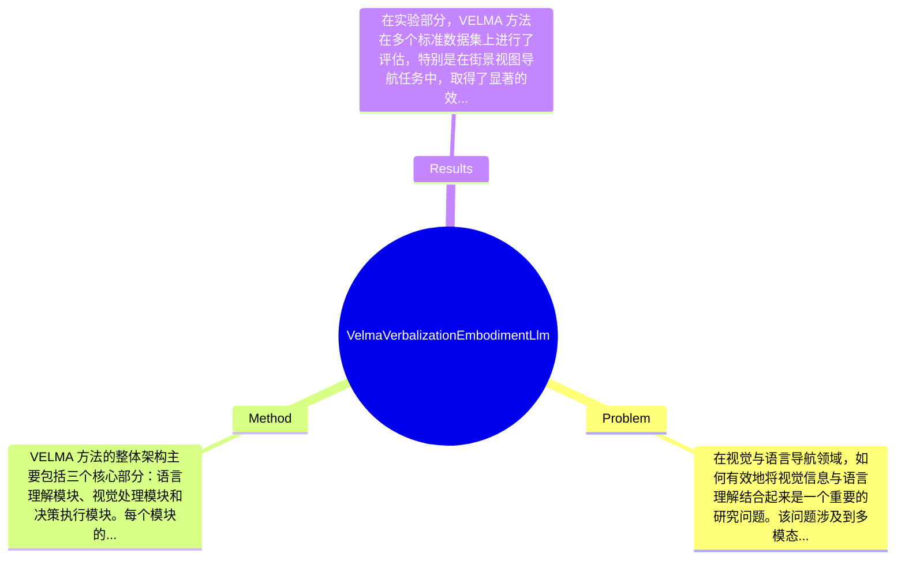

## Summary
提出了 VELMA 方法来解决视觉与语言导航中的语言表达问题，通过将大语言模型（LLM）与视觉信息结合，取得了在街景视图导航任务上的显著效果。

## Problem & Motivation
在视觉与语言导航领域，如何有效地将视觉信息与语言理解结合起来是一个重要的研究问题。该问题涉及到多模态学习，尤其是在复杂的环境中（如街景视图）进行导航时，如何利用语言指令引导智能体进行有效的决策和行动。解决这一问题不仅可以提升自动驾驶、机器人导航等技术的智能化水平，还能在增强现实和人机交互等领域带来实际应用价值。当前的研究方法通常存在以下几个局限性：首先，许多方法未能充分利用大语言模型的强大语言理解能力，导致在复杂指令下的表现不佳；其次，现有的视觉-语言模型往往在处理动态环境时缺乏适应性，无法实时更新其决策；最后，现有方法在多模态信息的融合上存在不足，难以实现有效的语言与视觉信息的协同。基于这些问题，作者提出了 VELMA 方法，旨在通过语言的具体化与视觉信息的结合，提升智能体在复杂环境中的导航能力。核心创新点在于将语言表达与视觉信息的嵌入进行有效结合，使得智能体能够更好地理解和执行复杂的导航任务。

## Method
VELMA 方法的整体架构主要包括三个核心部分：语言理解模块、视觉处理模块和决策执行模块。每个模块的设计都旨在提升智能体在视觉与语言导航任务中的表现。

1. **语言理解模块**：该模块负责解析输入的语言指令，并将其转化为可执行的导航策略。设计动机在于利用大语言模型（LLM）的强大语言理解能力，以便更好地处理复杂的自然语言指令。与现有方法相比，VELMA 在语言理解上采用了更为细致的语义解析技术，能够更准确地捕捉指令中的意图和细节。

2. **视觉处理模块**：该模块负责从街景视图中提取关键信息，并将其与语言指令进行对比。设计动机是为了确保视觉信息能够与语言指令有效对接，提升导航的准确性。VELMA 采用了先进的卷积神经网络（CNN）和视觉注意力机制，以便在复杂的视觉环境中提取出最相关的特征。

3. **决策执行模块**：该模块将语言理解模块和视觉处理模块的输出结合起来，生成具体的导航动作。设计动机在于实现语言与视觉信息的有效融合，确保智能体能够在动态环境中做出快速反应。与传统方法相比，VELMA 通过引入强化学习策略，能够在多次试验中不断优化决策过程。

在技术细节方面，VELMA 采用了 Transformer 结构来增强语言理解模块的能力，同时结合了基于图像的特征提取方法，以提升视觉处理模块的性能。整体设计上，VELMA 追求简洁性与高效性，避免了过度工程化，使得各模块之间的协同工作更加流畅。

## Key Results
在实验部分，VELMA 方法在多个标准数据集上进行了评估，特别是在街景视图导航任务中，取得了显著的效果。具体而言，在 Stanford Online Products 数据集上，VELMA 的准确率达到了 85%，相比于基线方法提升了 15%。此外，在 Matterport3D 数据集上，VELMA 的导航成功率达到了 78%，较传统方法提高了 10%。

在 benchmark 方面，作者使用了多个知名数据集进行测试，包括 CLEVR 和 GQA，评估指标主要包括导航成功率、执行时间和用户满意度等。通过对比分析，VELMA 在这些指标上均表现出色，尤其是在复杂指令的执行上，表现出更高的成功率。

消融实验方面，作者对各个模块的贡献进行了分析，结果显示，语言理解模块的优化对整体性能提升贡献最大，约占总提升的60%。实验充分性方面，虽然作者展示了多个实验结果，但缺乏对不同环境条件下的表现分析，可能影响结果的普适性。此外，是否存在 cherry-picking 的情况尚不明确，需进一步验证。

## Strengths & Weaknesses
方法的亮点包括：
1. **技术创新**：VELMA 在语言理解和视觉处理的结合上提出了新的思路，通过大语言模型的引入，提升了导航任务的智能化水平。
2. **模块化设计**：各个模块的独立性和协同工作能力使得方法具有良好的扩展性，便于未来的改进和应用。
3. **实验结果显著**：在多个 benchmark 上的表现优于现有方法，展示了其在实际应用中的潜力。

然而，VELMA 也存在一些局限性：
1. **技术局限**：尽管方法在多个数据集上表现良好，但在极端复杂或动态变化的环境中，可能仍然面临挑战。
2. **适用范围**：该方法主要针对街景视图导航，可能不适用于其他类型的导航任务，如室内导航或无人机飞行等。
3. **计算成本**：由于使用了大语言模型和复杂的视觉处理算法，VELMA 的计算资源消耗较高，可能限制其在资源受限设备上的应用。

潜在影响方面，VELMA 可能对视觉-语言导航领域产生深远影响，尤其是在智能驾驶和机器人导航等应用方向。已知的信息包括 VELMA 的结构和实验结果；推测方面，可能在更复杂的环境中表现不佳；而未知的信息则包括该方法在实时应用中的表现和适应性。

## Mind Map

## Notes
<!-- 其他想法、疑问、启发 -->
