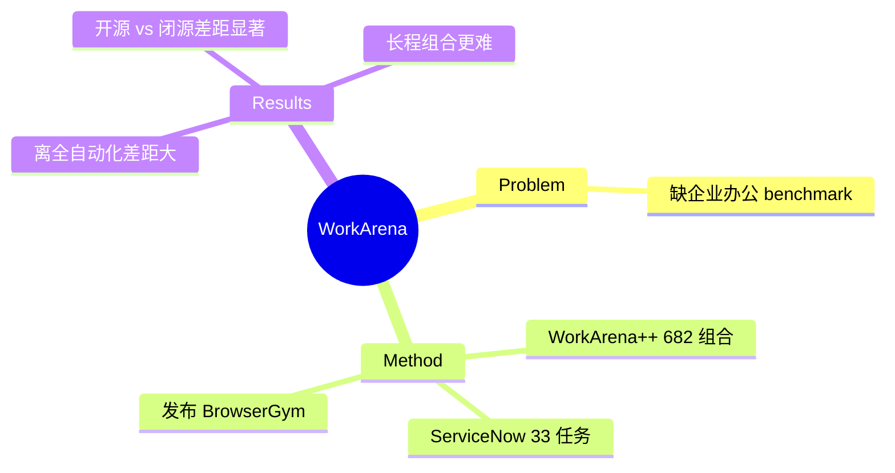

## Summary
WorkArena 测 web agent 在**企业知识工作**任务上的能力：基于 ServiceNow 平台的真实企业软件任务（初版 33 类任务，WorkArena++ 扩到 682 组合任务），并配套发布 [[Papers/2412-BrowserGymAgentLab|BrowserGym]] 环境。发现 agent 有潜力但离全自动化仍有很大 gap，且开源与闭源模型差距显著。

## Problem & Motivation
web agent 的落地大头是**企业办公自动化**（ITSM、HR、CRM 等 SaaS 系统的日常工作），但既有 benchmark 多为消费级网页（购物、检索），缺对企业软件真实工作流的评测。作者用 ServiceNow 这一真实企业平台构建 benchmark，问：agent 到底能不能替知识工作者干活？

## Method
- **ServiceNow 平台真实任务**：初版 33 类任务，覆盖知识工作者日常（表单填写、列表筛选、服务目录下单、知识库检索等）；WorkArena++ 进一步组合成 682 个更长程的复合任务。
- **BrowserGym 环境**：随论文发布的统一 gym 环境（丰富动作 + 多模态观察），后成为 [[Papers/2412-BrowserGymAgentLab]] 生态的核心组成，让不同 agent 可公平评测。
- **评测**：任务级 success rate，程序化校验最终状态。

## Key Results
- 当前 agent 在 WorkArena 上**有 promise 但离全任务自动化差距明显**——企业任务的长程性、精确性要求高。
- **开源 vs 闭源差距显著**：闭源模型（GPT-4 系）明显优于开源，说明企业级复杂交互对 backbone 能力要求高。
- WorkArena++ 的组合长程任务进一步拉低成功率，呼应 vault 的"真实长程/组合工作流远未饱和" validated insight（[[Topics/RealWorldGUIAgent-Reliability-Survey]]）。

## Strengths & Weaknesses
**亮点**：(1) 首个基于真实企业平台（ServiceNow）的 web agent benchmark，补上"企业办公"这一最大落地场景；(2) 随附 BrowserGym 成为领域基础设施（gym 生态源头之一）；(3) WorkArena++ 的长程组合任务对可靠性研究有价值。

**局限**：(1) 绑定 ServiceNow 单一平台，跨企业软件泛化未测；(2) 需 ServiceNow 实例，复现门槛比纯开源沙盒高；(3) 静态任务集会随模型进步饱和。属 [[Topics/WebAgent-Survey]] benchmark 路线（企业/长程子类）。

## Mind Map

## Notes
- BrowserGym 后被 [[Papers/2412-BrowserGymAgentLab]] 扩成统一生态（收录 MiniWoB/WebArena/VisualWebArena/WorkArena/WebLINX/AssistantBench）。
- 与 vault 的 [[Papers/2605-SaaSBench]]（SaaS 长程 resolved 3.8%）同属"企业/SaaS 长程可靠性"证据链。
