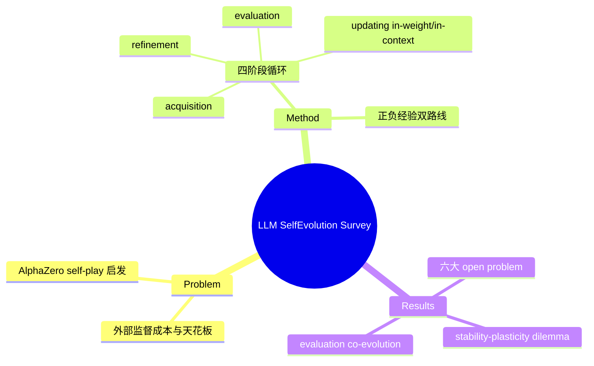

## Summary

领域最早的 self-evolution survey（2024-04，早于 agent 侧两篇一年以上），把 LLM 自演化定义为 **experience acquisition → experience refinement → updating → evaluation** 的四阶段迭代循环，聚焦模型自身（而非 agent 系统组件）如何从自生成经验中学习，是 model-centric self-improvement 谱系（Self-Instruct / STaR / Self-Refine / Self-Rewarding / SPIN）的系统整理。

## Problem & Motivation

依赖人类标注或更强外部模型监督（SFT、RLHF、蒸馏）的训练范式成本高，且随任务复杂度提升面临性能天花板——教师信号的质量上界锁死了学生。受人类经验学习和 AlphaZero self-play 启发，让 LLM 自主获取、精化并学习自身生成的经验，是绕开外部监督上界的候选路径。

## Method

**四阶段循环**（每阶段一个函数抽象）：

1. **Experience Acquisition**（f^T, f^Y, f^F）：
   - *Task evolution*：knowledge-based（Self-Align、UltraChat）、knowledge-free 自举（Self-Instruct、Evol-Instruct、MetaMath、back-translation）、selective 采样（V-STaR、DIVERSE-EVOL）
   - *Solution evolution*：positive 路线——rationale-based（STaR、LMSI）、interactive（SelfEvolve、AutoAct）、self-play（Self-Talk、SOTOPIA-π）、grounded（Self-Align、MemoryBank、MemGPT）；negative 路线——contrastive（**Self-Reward、SPIN**、ETO、Self-Contrast）、perturbative（RLCD、DLMA）
   - *Feedback acquisition*：model feedback（LLM-as-a-Judge 打分、Self-Refine/CAI 式 critique）vs environment feedback（代码执行、工具调用、具身环境、多 agent 交互）
2. **Experience Refinement**（f^R）：filtering（metric-based：ReSTEM；metric-free：Self-Consistency、Self-Verification）+ correcting（critique-based：Self-Refine、CRITIC、RCI；critique-free：STaR hint、Self-Debug）
3. **Updating**（f^U）：**in-weight**（replay：ReST、SSR；regularization：KL penalty、weight averaging/WARM；architecture：LoRA、model soups、weight merging）vs **in-context**（external memory：MemGPT、MemoryBank、TiM；working memory：Reflexion、Agent-Pro、ProAgent）
4. **Evaluation**：quantitative（LLM-as-a-Judge、reward score）vs qualitative（ChatEval 等）

**演化目标分类**：LLM 核心能力（instruction following、reasoning、math、coding、role-play）与 agent 能力（planning、tool use、embodied control、communication）；演化方向：性能提升、feedback 适应、知识扩展、安全去偏。

## Key Results

Survey 无实验数字。提出的六个 open problem 至今仍然成立：演化目标的多样性与层级冲突、自主性 spectrum（human-guided → semi → fully autonomous）、经验获取从启发式到理论基础、updating 的 stability-plasticity dilemma（灾难性遗忘 vs 可塑性）、评估的数据泄漏与随模型共同演化、safety 与 superalignment。

## Strengths & Weaknesses

**Strengths**：
- 四阶段函数化抽象（f^T/f^Y/f^F/f^R/f^U）是三篇 survey 里最干净的过程分解，in-weight vs in-context updating 的二分至今是有效的组织轴
- 把 negative experience（contrastive/perturbative）单列为一等公民，早于后来 failure-driven learning 热潮
- 2024-04 就点出 stability-plasticity 与 evaluation co-evolution 问题，被 2025-2026 的实证工作（如 [[Papers/2509-Misevolution]] 的 safety alignment decay）验证

**Weaknesses**：
- Model-centric：tool / workflow / multi-agent topology 演化几乎缺席——这正是后续 [[Papers/2507-SelfEvolvingAgentsSurvey]] / [[Papers/2508-SelfEvolvingAIAgentsSurvey]] 补上的
- 成文于 RLVR/GRPO 浪潮之前，RL 侧内容明显薄（无 verifiable reward 谱系）
- "self-evolution 能否突破外部监督上界"这一动机命题本身未被批判性检验（后续 Progress-or-Regress、solver-verifier gap 等工作表明 self-improvement 有明确收敛/反转条件）

## Mind Map

## Notes

- 术语考古：**self-evolution**（本篇，2024，model-centric）→ **self-evolving agent**（2025，system-centric）→ **misevolution**（2025-09，safety-centric），"self-improvement" 则一直泛指 STaR/Self-Rewarding 一系的 model-centric 训练方法——两个词的分工在 [[Papers/2507-SelfEvolvingAgentsSurvey]] 中被正式化
