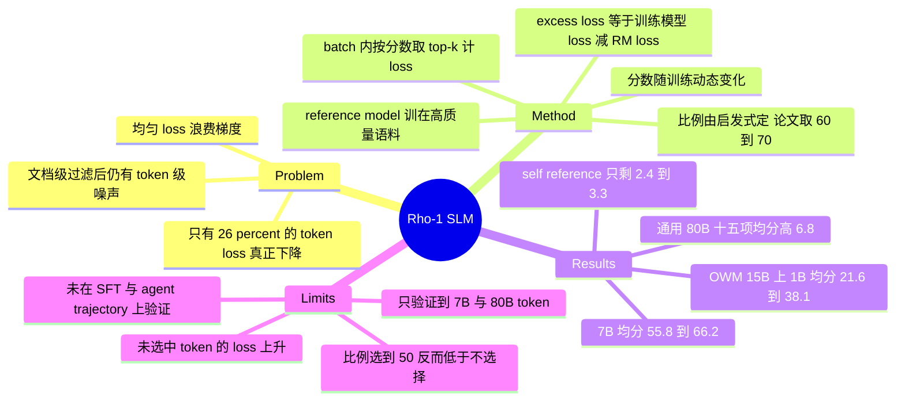

## Summary

Rho-1 提出 Selective Language Modeling（SLM）：先在高质量语料上训一个 reference model，再用「训练模型当前 token loss 减去 reference loss」给语料每个 token 打分，只对 batch 内得分最高的 top-k% token 计算 cross-entropy。在 15B OpenWebMath 上做 continual pretraining，1.1B 模型 9 项数学任务均分从 21.6 升到 38.1、7B 从 55.8 升到 66.2；两侧看过的语料 token 数完全相同，Rho-1 只是把其中 40% / 30% 的 token 从 loss 里去掉。

## Problem & Motivation

document-level 的数据过滤已经做得很细，但过滤后的语料在 token 粒度上仍然含噪：时间戳、乱码 ID、参考文献片段混在正常句子里。删掉整段会破坏文本语义，过严过滤又会引入 bias 并丢掉可用数据。

作者先把这件事量化。把 Tinyllama-1B 在 15B OpenWebMath 上持续预训练，每 1B token 存一个 checkpoint，在约 320,000 token 的验证集上追踪逐 token 的 loss 曲线，按线性拟合首末 loss 差 $\Delta\mathcal{L}$（阈值 ±0.2）与末点 loss 相对均值的位置分成四类。结果是只有 26% 的 token 属于 loss 真正下降的 H→L，51% 是一开始就已学会的 L→L，11% 始终高 loss（H→H），12% 的 loss 反而上升（L→H）。后两类里大量 token 在训练中剧烈震荡，作者抽样可视化后发现它们主要来自混乱语料——自定义符号、无意义字符串、时刻表与文献条目。既然只有四分之一的 token 在贡献有效梯度，对所有 token 施加同样的 loss 就是浪费。

## Method

### Step 1 — 训 reference model

整理一份反映目标分布的高质量语料，用标准 cross-entropy 训 RM。数学域用 0.5B token（GPT 合成数据与人工整理数据的混合），通用域用 1.9B token（Tulu-v2、OpenHermes-2.5 等开源集）。RM 训 3 个 epoch，1B 模型 lr 5e-5、7B 模型 lr 1e-5，cosine decay，序列长度 2048 / 4096。主实验中 **RM 与被持续预训练的模型从同一个 base model 初始化**。

### Step 2 — token 打分

RM 对语料中每个 token 给出 reference loss（Eq. 1）：

$$\mathcal{L}_{\text{RM}}(x_i) = -\log P(x_i \mid x_{<i})$$

作为对照，CLM 的目标是（Eq. 2）：

$$\mathcal{L}_{\text{CLM}}(\theta) = -\frac{1}{N}\sum_{i=1}^{N} \log P(x_i \mid x_{<i};\theta)$$

SLM 的打分函数是 **excess loss**——当前训练模型的 token loss 减去 reference loss（Eq. 3）：

$$\mathcal{L}_{\Delta}(x_i) = \mathcal{L}_{\theta}(x_i) - \mathcal{L}_{\text{RM}}(x_i)$$

这里 $\mathcal{L}_{\theta}$ 是**正在训练的那个模型**的 loss，所以分数随训练过程动态变化，不是预先算好的静态标签。作者的直觉是 excess loss 高的 token「更可学」且更贴近目标分布；RM 自己也预测不好的噪声 token 因为 $\mathcal{L}_{\text{RM}}$ 本身就高，差值被压低而自然出局。

### Step 3 — 选择性计算 loss

引入 token selection ratio $k\%$（Eq. 4、Eq. 5）：

$$\mathcal{L}_{\text{SLM}}(\theta) = -\frac{1}{N * k\%}\sum_{i=1}^{N} I_{k\%}(x_i)\cdot \log P(x_i \mid x_{<i};\theta)$$

$$I_{k\%}(x_i) = \begin{cases} 1 & \text{if } x_i \text{ ranks in the top } k\% \text{ by } S(x_i) \\ 0 & \text{otherwise}\end{cases}$$

默认 $S = \mathcal{L}_{\Delta}$。实现上是在一个 batch 内按 excess loss 排序、保留 top-k%，完整序列照常 forward，只把其余 token 的 loss 置零，因此不增加训练开销。排序是 **batch 内全局**的，不按序列或样本分配名额——每条序列被保留多少 token 完全由它在整个 batch 里的相对排名决定。

### 选择比例怎么定

论文明说 ratio 是启发式定的，类比 MLM 的 mask 比例。主实验 Tinyllama-1.1B 用 60%、Mistral-7B 用 70%。唯一支撑证据是 Figure 9：1B 模型在 5B token 上用 SLM 训练，GSM8K 与 MATH 精度随 ratio 呈倒 U 形，峰值在 60% 附近，40% 与 ≥70% 两侧都下降。

### Self-reference 变体

拿不到高质量目标数据时，改用在语料自身（OpenWebMath）上训的 RM，打分函数换成 $\mathcal{L}_{\text{RM}}$ 本身（loss 越高越不选）或下一 token 的信息熵（Eq. 8，熵越高越不选）：

$$\mathcal{H}_{\text{RM}}(x_i) = -\sum_{k=1}^{V} P(t_k \mid x_{<i})\log P(t_k \mid x_{<i})$$

以及两者选中集合的交集。**这一支不使用 excess loss**，逻辑从「对齐目标分布」退化为「滤掉噪声」。

## Key Results

### 数学域 continual pretraining（15B OpenWebMath，Table 1）

Uniq. Toks 一列两侧都是 14B；Train Toks 一列对 Rho-1 只计入实际参与 loss 的 token（表注 + §3.2「pretrained on only 15 billion tokens (selecting 10.5 billion tokens)」）。因此两组模型看过的语料 token 数与 forward 计算量相同，差别只在有多少 token 进了 loss。

| 模型 | Train Toks | GSM8K | MATH | AVG（9 tasks） |
|:--|:--|:--|:--|:--|
| Tinyllama-CT 1.1B | 15B | 6.4 | 2.4 | 21.6 |
| Rho-1-Math 1.1B | 9B（−40%） | 29.8 | 14.0 | **38.1**（+16.5） |
| Rho-1-Math 1.1B（多 epoch） | 30B | 36.2 | 15.6 | 40.9 |
| Mistral-CT 7B | 15B | 42.9 | 22.2 | 55.8 |
| Rho-1-Math 7B | 10.5B（−30%） | 66.9 | 31.0 | **66.2**（+10.4） |
| DeepSeekMath 7B（外部对照） | 500B | 64.1 | 34.2 | 68.4 |

Figure 1 标注 1B 达到基线终点快 10x、7B 快 5x，最终分别高 16.3% / 16.4%（GSM8K 与 MATH 均分口径）。把 loss token 从 9B 加到 30B（多跑几个 epoch）只再涨 2.8 分，收益递减明显。

### SFT 之后（ToRA-69k，Table 2）

| 模型 | GSM8k | MATH | AVG |
|:--|:--|:--|:--|
| TinyLlama-CT 1B | 51.4 | 38.4 | 50.7 |
| Rho-1-Math 1B | 59.4 | **40.6** | 56.9（+6.2） |
| Mistral-CT 7B | 77.5 | 48.4 | 72.6 |
| Rho-1-Math 7B | 81.3 | **51.8** | 75.3（+2.7） |

SLM 只作用在 pretraining 阶段。SFT 本身对 Rho-1 与基线是同一套标准 SFT，**没有在 SFT 里做任何 token 选择**。预训练阶段 +16.5 的均分差距经过同样的 SFT 后收窄到 +6.2（1B）与 +2.7（7B）。

### 通用域 continual pretraining（80B token，Figure 5）

Tinyllama-1.1B 在 SlimPajama : StarCoderData : OpenWebMath = 6:3:1 的 80B token 上继续训，15 个 benchmark 均分比 CLM 高 6.8%。正文写「code 与 math 的提升超过 10%」，但 Figure 5 的柱标只有 GSM8k（+28.2）与 HumanEval p@10（+10.6）越过 10%，MATH 只有 +5.0，MBPP p@1 / p@10 为 +6.5 / +7.8，HumanEval p@1 为 +6.9。非 code/math 侧收益很不均匀：MMLU +11.3、BoolQ +11.3、TydiQA +8.9、ARC-E +8.6，而 PIQA +0.9、WinoGrande +0.2、HellaSwag +1.4 基本没动。

### Self-reference（Table 3）

| 模型 | Score | 语料 | Train Toks | GSM8K | MATH | AVG |
|:--|:--|:--|:--|:--|:--|:--|
| Tinyllama-CT (RM) | — | OWM | 15B | 6.3 | 2.6 | 21.5 |
| Tinyllama-SLM | $\mathcal{L}_{\text{RM}}$ | OWM | 10.5B | 6.7 | 4.6 | 23.9（+2.4） |
| Tinyllama-SLM | $\mathcal{H}_{\text{RM}}$ | OWM | 10.5B | 7.0 | 4.8 | 23.0 |
| Tinyllama-SLM | $\mathcal{L}_{\text{RM}} \cap \mathcal{H}_{\text{RM}}$ | OWM | 9B | 7.1 | 5.0 | **24.8**（+3.3） |
| Tinyllama-CT | — | PPile | 52B | 8.0 | 6.6 | 24.7 |
| Tinyllama-SLM | $\mathcal{L}_{\text{RM}} \cap \mathcal{H}_{\text{RM}}$ | PPile | 36B | 8.6 | 8.4 | 26.5（+1.8） |

去掉外部高质量语料后，增益从 +16.5 掉到 +2.4 ~ +3.3。

### 选择比例消融与负结果（Table 4，Appendix H）

| Score | Ratio | GSM8K | MATH | AVG |
|:--|:--|:--|:--|:--|
| —（不选择） | 100% | 6.3 | 2.6 | 21.5 |
| $\mathcal{L}_{\text{RM}}$ | 90% / 80% / 70% / 60% | 7.4 / 6.4 / 6.7 / 7.0 | 4.4 / 4.6 / 4.6 / 4.6 | 23.4 / 23.4 / 23.9 / 23.0 |
| $\mathcal{L}_{\text{RM}}$ | **50%** | 5.7 | 4.2 | **20.7** |
| $\mathcal{H}_{\text{RM}}$ | **50%** | 4.7 | 5.8 | **19.8** |

选得太狠会直接跌破「完全不选择」的基线：50% ratio 下两种打分函数分别是 20.7 与 19.8，都低于 100% 的 21.5。Figure 9 在 excess-loss 主设置下也是倒 U 形，40% 明显低于 60%。

### Weak-to-strong（Table 5，Appendix I）

用 Tinyllama-1.1B 当 RM 去给 Llama-2-7B 选 token：AVG 从 43.5（15B，CT）升到 44.4（10.5B）。方向为正但只有 +0.9。

### 机制侧证据

- Figure 6：4B token 训练过程中，Rho-1 在**被选中 token** 上 loss 降得比 CLM 更快，在 MetaMath 这个 downstream 验证集上 loss 也明显更低；但**未被选中 token** 的 loss 从约 2.9 一路升到 3.5 以上，而 CLM 基线在同一批 token 上是下降的。
- Figure 7：downstream 精度与被选中 token 的 loss 呈幂律正相关，与未选中 token 的 loss 呈负相关。作者据此主张「降低全部 token 的 loss 并非必要」。
- Figure 8：不同 checkpoint 选出的 token 集合在漂移，被选中 token 的 PPL 出现 sample-wise double descent（先升后降），说明 excess-loss 打分实际起到了 curriculum 的作用而非静态过滤。

## Evidence Ledger

| Claim ID | Claim | Type | Source locator | Evidence excerpt | Status |
|:--|:--|:--|:--|:--|:--|
| C1 | 打分函数为 excess loss $\mathcal{L}_\Delta(x_i)=\mathcal{L}_\theta(x_i)-\mathcal{L}_{\text{RM}}(x_i)$，SLM 只对 top-k% token 计 loss，归一化分母为 $N*k\%$ | causal-mechanism | §2.2, Eq. 1/3/4/5, p.4–5 | "L_Δ(x_i)=L_θ(x_i)−L_RM(x_i)" … "N∗k% defines the number of tokens that fall within the top k% of excess loss" | source-verified |
| C2 | RM 用标准 CE 训在高质量语料：数学 0.5B token、通用 1.9B token（Tulu-v2 / OpenHermes-2.5），3 epoch，主实验与训练模型同 base model 初始化 | benchmark-setting | §3.1 Reference Model Training, p.5 | "0.5B high-quality, math-related tokens" … "1.9B tokens … We trained the reference models for 3 epochs" | source-verified |
| C3 | 选择比例 1.1B 用 60%、7B 用 70%，由启发式规则确定；Figure 9（1B，5B token）显示约 60% 最优 | number | §3.1 p.6；§3.5 + Fig. 9, p.9 | "we use 60% for the Tinyllama-1.1B model and 70% for the Mistral-7B model" … "suitable for accounting for about 60%" | source-verified |
| C4 | token loss dynamics 分类占比：H→L 26%、L→L 51%、H→H 11%、L→H 12%（Tinyllama-1B / 15B OWM / 约 320,000 token 验证集） | number | §2.1 + Fig. 3(a), p.3 | "a mere 26% of tokens show a notable loss reduction (H→L), while the majority (51%) remain in the L→L category" | source-verified |
| C5 | Tinyllama-CT 1.1B（15B）GSM8K 6.4 / MATH 2.4 / AVG 21.6；Rho-1-Math 1.1B（9B，−40%）29.8 / 14.0 / 38.1，+16.5 | number | Table 1, p.5 | "Tinyllama-CT 1.1B OWM 14B 15B 6.4 2.4 … 21.6" ; "Rho-1-Math … 9B 29.8 14.0 … 38.1" ; "Δ −40% … +16.5" | source-verified |
| C6 | Mistral-CT 7B（15B）42.9 / 22.2 / 55.8；Rho-1-Math 7B（10.5B，−30%）66.9 / 31.0 / 66.2，+10.4 | number | Table 1, p.5 | "Mistral-CT 7B OWM 14B 15B 42.9 22.2 … 55.8" ; "Rho-1-Math 7B … 10.5B 66.9 31.0 … 66.2" ; "Δ −30% … +10.4" | source-verified |
| C7 | Rho-1-Math 1.1B 多 epoch（30B train toks）GSM8K 36.2 / MATH 15.6 / AVG 40.9 | number | Table 1, p.5; §3.2 p.7 | "Rho-1-Math 1.1B OWM 14B 30B 36.2 15.6 52.1 67.0 83.9 29.0 32.5 23.3 28.1 40.9" | source-verified |
| C8 | ToRA-69k SFT 后 MATH：Rho-1-1B 40.6 vs TinyLlama-CT 38.4（+2.2）；Rho-1-7B 51.8 vs Mistral-CT 48.4（+3.4）；AVG 差 +6.2 / +2.7 | comparison | Table 2, p.6 | "TinyLlama-CT 1B … 38.4 … 50.7" ; "Rho-1-Math 1B … 40.6 … 56.9" ; "+2.2 … +6.2" ; "+3.4 … +2.7" | source-verified |
| C9 | DeepSeekMath-7B 用 500B train tokens 得 AVG 68.4；Rho-1-Math 7B 用 15B（选 10.5B）得 66.2 | comparison | Table 1, p.5; §3.2 p.7 | "DeepSeekMath 7B - 120B 500B 64.1 34.2 … 68.4" ; "pretrained on only 15 billion tokens (selecting 10.5 billion tokens)" | source-verified |
| C10 | 80B 通用 token 上 SLM 比 CLM 的 15 benchmark 均分高 6.8%；正文称 code/math 超 10%，但 Figure 5 柱标仅 GSM8k +28.2 与 HumanEval p@10 +10.6 越过 10%，MATH 为 +5.0 | number | §3.3 + Fig. 5, p.7 | "yields an average enhancement of 6.8% across 15 benchmarks … especially pronounced in code and math tasks, exceeding 10%" | source-verified（figure 层面强读法不成立，已在正文写明） |
| C11 | Self-reference：OWM 上 CT 基线 AVG 21.5（15B）→ $\mathcal{L}_{\text{RM}}$ 23.9（10.5B）、$\mathcal{H}_{\text{RM}}$ 23.0、交集 24.8（9B）；PPile 上 24.7（52B）→ 26.5（36B） | number | Table 3 + §3.4, p.8 | "Tinyllama-CT (RM) … 15B … 21.5" ; "L_RM … 10.5B … 23.9" ; "L_RM∩H_RM … 9B … 24.8" ; "PPile … 52B 24.7 / 36B 26.5" | source-verified |
| C12 | 负结果：50% select ratio 低于不做选择的 100% 基线——$\mathcal{L}_{\text{RM}}$ 得 AVG 20.7、$\mathcal{H}_{\text{RM}}$ 得 19.8，对照 21.5 | number | Table 4, p.23 (Appendix H) | "- 100% … 21.5" ; "50% 5.7 4.2 20.7 36.7 46.7 10.3 20.7" ; "50% 4.7 5.8 … 19.8" | source-verified |
| C13 | 纯 SLM 训练会让**未被选中 token** 的 loss 显著上升，作者提出可能需要保留通用 pretraining loss 以防过拟合 | causal-mechanism | Fig. 6(c), p.8；Appendix C Generalizability, p.20 | "accompanied by a significant rise in the loss of unselected tokens" ; "general pretraining loss on text and code may prevent overfitting" | source-verified |
| C14 | 全部 SLM 实验只在（continual）pretraining 阶段；把 SLM 用于 SFT 仅列为 future work；论文没有任何在 agent / tool-use / 多步决策 trajectory 上应用 token 选择的实验 | sota-novelty | Appendix C "Expanding the use of SLM", p.21；§3.2 p.7 | "SLM may be extended to supervised fine-tuning to address the noise and distribution mismatches in many SFT datasets." | source-verified |
| C15 | Weak-to-strong：Llama-2-7B-CT（15B）AVG 43.5 → 用 1B RM 选 token（10.5B）AVG 44.4 | number | Table 5, p.24 (Appendix I) | "Llama-2-7B-CT 15B 28.4 13.6 … 43.5" ; "Llama-2-7B-CT w/ 1B RM 10.5B 29.8 16.0 … 44.4" | source-verified |
| C16 | 作者声明因预算限制只验证了 ≤7B 参数、<100B token 的规模 | benchmark-setting | Appendix C Scalability, p.20 | "we have only verified the effectiveness of our method on smaller models (<=7B parameters) and smaller datasets (<100B tokens)" | source-verified |
| C17 | 论文承认 excess loss 与 RHO-LOSS(Mindermann et al. 2022) 数学上等价，差异在关注点、proxy model 的含义与训练方式、选择尺度与粒度三点 | sota-novelty | Appendix B.2 Data Selection, p.19 | "Although excess loss is mathematically identical to RHO-LOSS, SLM differs in three important ways" | source-verified |
| C18 | 发表于 NeurIPS 2024；arXiv v1 为 2024-04-11；代码 aka.ms/rho → github.com/microsoft/rho；机构为 Xiamen / Tsinghua / Shanghai AI Lab / Microsoft | license-code | p.1 title block & footer；arXiv submission history | "38th Conference on Neural Information Processing Systems (NeurIPS 2024)." ; "https://aka.ms/rho" | source-verified |

## Strengths & Weaknesses

### 亮点

方法本身几乎没有额外成本：完整序列照常 forward，只是把一部分 token 的 loss 置零，因此在同等 wall-clock 和同等语料曝光下拿到 +16.5 / +10.4 的均分差。这是判断「增益来自选择而非来自更多数据或更多计算」的关键对照——两侧的 Uniq. Toks 都是 14B、消耗的语料 token 都是 15B，Rho-1 只是反过来少了 40% / 30% 的梯度承载 token。

打分函数依赖训练模型的当前 loss，这让它成为一个动态 curriculum 而不是静态过滤器。Figure 8 的 token 集合漂移与 sample-wise double descent 是这一点的直接证据，也是它区别于「先跑一遍打分、再离线筛数据」的地方。

论文对自己的机制做了可证伪的检验：Figure 7 把被选中 / 未被选中 token 的 loss 分别与 downstream 精度拟合，两者符号相反。这比只报 main result 更有信息量。

### 局限

**增益来源被两个变量同时改变。** 主设置的 RM 训在 0.5B 精挑的高质量数学语料（GPT-4 合成 + 人工整理）上，而这 0.5B 数据基线从未见过，Train Toks 一栏也没有把 RM 的训练开销计进去。Self-reference 实验去掉外部语料后增益从 +16.5 掉到 +2.4 ~ +3.3，这暗示大部分增益来自 RM 所携带的目标分布信息，而非「选择」这个动作本身。但两组实验同时换了打分函数（excess loss → reference loss / 熵），所以这只是**推测性归因**，不能定量拆分。论文也没有做一个直观的对照——用同一个 RM 做 document-level 过滤再跑 CLM，看 token 级相对文档级到底赢多少。通读全文未见该实验。

**从未在 SFT 或 agent trajectory 上验证。** 所有 SLM 实验都在（continual）pretraining 阶段；Table 2 的 ToRA-69k 微调对 Rho-1 与基线用的是完全相同的标准 SFT，没有 token 选择。把 SLM 用于 SFT 明确列在 future work 里。论文里 "trajectories" 一词只出现在描述 ToRA 语料内容和 "loss trajectory" 上，没有任何一步应用于多步决策数据。**因此，reference model 的判断能否迁移到 agent trajectory 上（哪些 step 该被监督），本文完全没有提供证据。**

**它解的不是 credit assignment 问题。** 这一点对 long-trajectory SFT 尤其重要：excess loss 度量的是「当前模型相对参考分布还有多少可学空间」，是一个 **distribution-matching / learnability** 信号，全程不需要也不使用任何结果奖励。它回答的是"哪些 token 看起来像目标分布"，而不是"哪些 step 导致了成功"。把它搬到 trajectory 上，等价于假设「参考策略在某一步的 likelihood 差」可以代理「该步对最终成败的贡献」——这个假设本文既未提出也未检验。

**batch 内全局 top-k，无序列级自适应。** 保留比例是全局固定的，同一个 batch 里一条完美 trajectory 和一条失败 trajectory 按同一把尺子排名。对于质量在 trajectory 之间差异极大的 agent 数据，这个设计缺少显然需要的一层适配。

**ratio 是敏感的启发式超参。** Figure 9 是倒 U 形，Table 4 显示 50% 时两种打分函数都跌破「完全不选择」的基线（20.7 / 19.8 vs 21.5）。这说明「选得越狠越好」是错的，而最优点如何随语料噪声比例、模型规模变化，论文没有给出任何规律。

**未选中 token 的分布会退化。** Figure 6(c) 里未选中 token 的 loss 从约 2.9 升到 3.5 以上，作者自己提示可能需要保留一份通用 pretraining loss。在 agent 场景里，被判定为"不重要"的 step 往往仍是环境交互的合法组成部分，让它们的 likelihood 塌掉可能直接破坏 rollout 的可执行性。

**规模与统计。** 只验证到 7B / 80B token（作者自陈预算限制），且全部结果都是单次运行，没有 seed 方差。Weak-to-strong 只有 +0.9，与主设置的 +10.4 差一个量级——但两者 base model 不同（Llama-2-7B vs Mistral-7B），不能直接相减。

## Mind Map

## Notes

- 与 [[Papers/2503-ATLaS]] 是同一问题在不同粒度上的两种答案：ATLaS 在 agent trajectory 上挑 critical step，Rho-1 在语料上挑 token。二者共享「只监督一部分」的假设，但打分信号不同——值得对照两者的 selector 是否都退化成「难度/可学性」而非「因果贡献」。
- [[Papers/2412-ImplicitPRM]] 与 [[Papers/2608-PCSD]] 用的也是「训练模型对参考模型的 log-prob 差」，但目标不同：ImplicitPRM 把它当 Q value 读，Rho-1 把它当可学性读，PCSD 把它当 token 权重。同一个量在三条线里承担三种含义，是这一族最值得追问的地方。
- 待查：SLM 是否已有后续工作把它搬到 SFT / trajectory 上（论文自己只列为 future work）。如果有，那是 step-level credit assignment survey 里"reference-model-as-selector"这条线的直接延伸。
- 一个可做的对照实验：把 trajectory-level reward 与 excess-loss 分数在同一批 agent 数据上算出来，看两者的 step 排序相关性有多高。若相关性低，说明 Rho-1 式的 learnability 信号无法替代 outcome-based credit assignment；若高，则 reference model 可以当成免奖励的 credit proxy。
