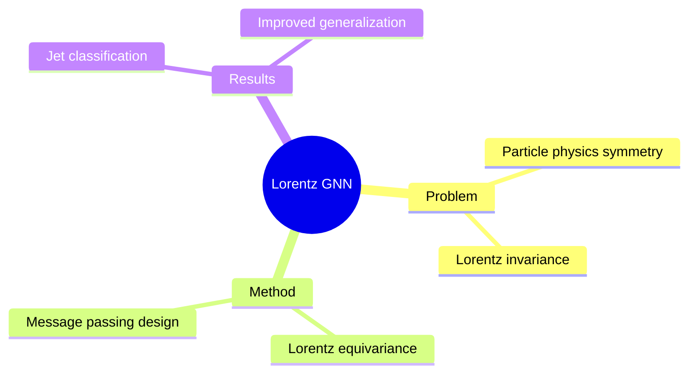

## Summary

Lorentz Graph Neural Networks 将 Lorentz symmetry（相对论的核心对称性）嵌入 GNN 架构，实现 Lorentz-equivariant message passing。特别适用于高能物理中的 particle jet classification。

## Problem & Motivation

物理系统 GNN 问题：
- Particle physics 数据具有 Lorentz symmetry
- 传统 GNN 不保留 physical equivariance
- 需要 respect boosts/rotations 等 Lorentz transformations

## Method

**核心设计**：
1. **Lorentz Equivariance**: 网络对 Lorentz transformations（boosts, rotations）equivariant
2. **Message Passing**: Lorentz-aware aggregation
3. **Architecture**: 适配 particle physics graph structure

**物理背景**：
- Lorentz group: SO(3,1) transformations
- Equivariance: f(ρ(g)x) = ρ'(g)f(x)

## Key Results

- Particle jet classification improved
- Generalization with less training data
- Physical interpretability

## Strengths & Weaknesses

**亮点**：
- Physics-inspired geometric deep learning
- Equivariance 提升泛化
- 减少 training data 需求

**局限**：
- 应用场景窄（particle physics）
- 与 general geometric GNN 的关联有限

## Mind Map

## Notes

> [基于 WebSearch 结果创建]

Physics-inspired equivariant neural network。虽然应用场景窄，但 equivariance 设计思路可借鉴。与 hyperbolic manifold 的关联在于 Lorentz model 是 hyperbolic geometry 的一种表示。