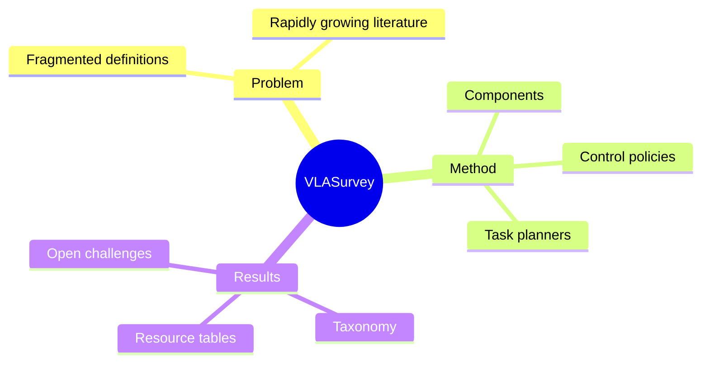

## Summary
该 survey 给出广义 VLA 定义，并按 components、low-level control policies 与 high-level task planners 三条主线整理 embodied AI 中的模型、训练目标、数据集、simulator、benchmark 与开放挑战。

## Problem & Motivation
VLA 从 VLM-to-action、language-conditioned policy 到 modular planner 的边界并不统一，快速增长的论文又跨越 perception、world model、imitation learning、RL 与 robotics 多个传统社区。若只按具体模型罗列，很难比较“谁负责理解目标、谁产生低级 action、谁处理 long horizon”。作者因此把 VLA 广义定义为任何能处理 vision 与 language 并产生 robot actions 以完成 embodied task 的模型，同时把最初基于大 LLM/VLM 的 end-to-end 体系称为 Large VLA（LVLA），试图用 hierarchical robot system 统一 taxonomy。

## Method
综述的第一条线是 VLA components，包括 pretrained visual representation、language/vision alignment、world/dynamics modeling、reasoning 与 action representation 等基础模块；第二条线是 low-level control policy，输入 instruction 与 observation，直接输出 translation、rotation、gripper command 等 action；第三条线是 high-level task planner，把 long-horizon instruction 分解为 control policy 可执行的 subtasks，并讨论 language plan、code/API plan、memory、feedback 和 replanning。

资源侧，论文系统整理 real/sim robot datasets、simulators、manipulation/navigation benchmarks 与 embodied question answering，并比较数据规模、scene source、task type 与 metric。分析框架强调 hierarchical separation 的工程原因：planner 可使用高容量模型承担 reasoning，control policy 则优先 speed 与 precision；同时指出端到端 VLA、modular planner 与 world model 并非互斥，而是可能组合成完整 embodied system。作者还维护 Awesome-VLA repository 作为增量资源索引。

## Key Results
作为 survey，核心产物不是单一 SOTA 数字，而是 taxonomy 与资源对照。论文把相关研究归纳为 components / control policies / task planners 三层，并列出用于 manipulation、navigation 与 EQA 的训练及评测资源；例如 EQA 表覆盖 EmbodiedQA、IQUAD、MT-EQA、MP3D-EQA、EgoVQA、EgoTaskQA、EQA-MX 和 OpenEQA，区分 active exploration、scene source、answer type 与 metric。

作者总结的主要未解问题包括：需要覆盖更多 skill/object/embodiment/environment 且超越 success rate 的 diagnostic benchmark；robot foundation model 的 generalization 仍远逊于 NLP 中的 LLM；不同 modality 的 representation alignment、long-horizon planner 与 low-level skill interface、real-time responsiveness、安全与 explainability 均未成熟。当前 v8 HTML 还补充了 2026 年前后的 latest VLA developments、subsequent surveys 与 beyond-VLA 方向，且正式版本已发表于 IEEE TNNLS。

## Strengths & Weaknesses
**Strengths.** taxonomy 把“直接 action generation”与“先规划再控制”清楚分层，又保留 world model、representation 和 reasoning component 的横向联系，适合作为 VLA 领域入口。资源表覆盖数据、simulator、benchmark 与 EQA，而不是只列 model leaderboard；v8 的持续增补也缓解了首发于 2024 年的时效问题。

**Weaknesses.** 广义定义几乎把所有 vision+language-conditioned robot system 都纳入 VLA，虽然便于覆盖，却会稀释 VLA 作为端到端 action model 的可辨识边界。三分 taxonomy 更接近系统模块划分，难以直接表达 data regime、action tokenization、closed-loop frequency、embodiment transfer 等决定实际能力的轴。综述横跨 2024–2026 的快速变化期，表格不可避免存在版本漂移；大量论文的结果来自不同 benchmark/protocol，也不能横向解释为统一排名。对 scale、failure case 与真实部署成本的批判性比较仍弱于资源汇编。

## Mind Map

## Notes
这篇 survey 适合作为领域索引，但做新研究时应在其 hierarchy 上再加两条轴：action interface 的离散/连续与 control frequency，以及 supervision source 的 robot expert / human video / autonomous play。它们比“是否叫 VLA”更直接决定 scalability 与 failure mode。
