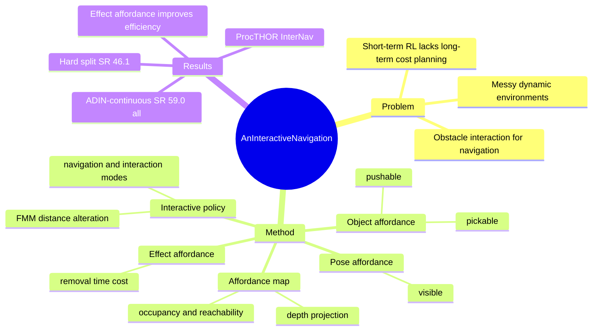

## Summary
ADIN 把 Interactive Navigation 中“是否值得互动清障”建模为 effect-oriented affordance：预测 obstacle 是否 pushable / pickable、当前 pose 是否可交互，以及移除该障碍的 expected time cost，再把这些信号投影成全局 affordance map 用于 FMM-style long-term planning。已知结果是在 ProcTHOR InterNav 上，ADIN-continuous 达到 all split SR 59.0 / SPL 31.3 / STS 16.6，优于 NIE 的 SR 50.0 / SPL 29.1 / STS 14.4；hard split SR 46.1 vs 37.3。论文的核心贡献不是更复杂的 end-to-end policy，而是把 interaction uncertainty 显式转成 planning cost。

## Problem & Motivation
已知：传统 PointNav / ObjectNav 通常假设环境静态、目标可达；Interactive Navigation 则面对更现实的 messy environment，agent 可能被椅子、箱子、狗窝等 obstacle 挡住，需要通过 push / pick / drop 改变环境。已有 InterNav 方法 NIE 主要用 end-to-end RL 学短期交互，但隐式 recurrent memory 不足以规划长程路线：清理最短路径不一定最省时间，有时绕路比推开重物更有效。作者的 problem formulation 是“interact for navigation”，因此关键不是交互本身，而是交互对未来 navigable area 和 time cost 的影响。  

论文把缺失环节定义为 affordance：不仅要知道对象能不能被操作，还要知道在当前 pose 下能不能操作、以及这次操作是否值得为 long-term navigation 付出成本。

## Method
ADIN（Affordance Driven Interactive Navigation）是一个 modular system，由 affordance functions、mapping module 和 interactive policy 三部分组成。

1. **Affordance functions**：从 RGB observation 中检测 object RoI，并用局部 RoI feature 与全局 feature 预测四类 affordance。Object affordance 包含 `pushable` / `pickable`；pose affordance 用 `visible` 表示当前 agent pose 下是否可交互；effect affordance 用归一化的 time cost 表示把 obstacle 从当前位置移除需要多少步。训练标签来自 agent 在 ProcTHOR simulator 中随机 spawn 到 obstacle 周围后执行 `DirectionalPush` 或 `Pick` 的 trial outcome；`pushable`、`pickable`、`visible` 用交互成功/失败标注，time cost 由实际移除 obstacle 所花时间步得到。

2. **Mapping module**：沿用 map-based navigation 的几何投影流程。Depth frame 生成 point cloud，并把预测 affordance 关联到点云，再投影到 3D voxel 和 top-down map。最终 map 包含 multi-level affordance map、reachability / occupancy map、explored area、target location 和 agent location；每个 map cell 对应物理世界 5cm × 5cm。

3. **Interactive policy**：policy 在 navigation mode 和 interaction mode 间切换。当 shortest path 上存在 visible 且 interactable 的 obstacle 时进入 interaction mode，否则沿 map 规划路径导航。核心改动是把 effect affordance 写进 FMM distance computation：ADIN-continuous 用 `m_dist* = m_dist + alpha * m_e * grid_m` 把 expected interaction cost 转换成等价导航距离；ADIN-discrete 则按阈值 `beta` 选择性从 occupancy map 中 erase obstacle。若多轮交互仍无法把 obstacle 移出路径，系统会把它重新加入 occupancy map，让 FMM 把该区域视为 dead end。

实现细节上，实验使用 AllenAct 和 ProcTHOR；RGB / depth observation 为 300 × 300。Object detector 为 COCO-pretrained 并在训练集 150k images 上 finetune 的 Yolov7，覆盖 20 类 obstacle。Affordance functions 用 100k training samples 和 10k validation samples 训练 20 epochs；论文明确说不使用 detection semantic result 作为 affordance prediction 的语义捷径。

## Key Results
**Benchmark / setting**：ProcTHOR InterNav。数据包含 450k training episodes（9k scenes）、5k validation episodes（100 scenes）和 100 testing episodes（100 scenes）；hard split 是测试集中 room 数超过 4 的场景。指标包括 SR、FDT、SPL 和 STS，其中 STS 是 time-step 版本的 SPL，用于计入 interaction 的时间成本。

- **Main comparison**：ADIN-continuous 在 all split 达到 SR 59.0 / FDT 3.46 / SPL 31.3 / STS 16.6；hard split 达到 SR 46.1 / FDT 5.52 / SPL 23.6 / STS 11.3。相比 prior learning-based NIE，SR 分别提升 9.0 points（59.0 vs 50.0）和 8.8 points（46.1 vs 37.3）。相比 Map+RI，all split 上 ADIN-continuous 的 SR 从 18.5 提到 59.0，STS 从 7.93 提到 16.6。
- **Discrete vs continuous effect cost**：ADIN-discrete 在 all split 为 SR 54.3 / SPL 27.3 / STS 14.2，低于 ADIN-continuous 的 SR 59.0 / SPL 31.3 / STS 16.6。已知结论是 fine-grained estimation of interaction effect 比简单 erase obstacle 更有利于 path planning。
- **Ablation**：只用 object affordance 时 all split SR 45.9；加入 pose affordance 后 SR 49.0；加入 time cost 后 SR 55.0；再加入 effect affordance 后 SR 59.0。使用 ground-truth object mask 的上界为 SR 61.2 / SPL 32.3 / STS 17.2，说明 detection / mask 误差仍有影响，但不是全部瓶颈。
- **Interaction metrics**：ADIN-continuous 的 decreased blocked ratio 为 21.2，overall ISR 为 72.9，PuSR 为 83.3，PiSR 为 31.4。Map+OA+PA 虽有 ISR 64.5 / PuSR 86.8，但 decreased blocked ratio 只有 10.7，说明“能成功执行交互”不等于“交互能真正清出有用路径”；effect affordance 对 navigation objective 仍关键。
- **Qualitative case**：论文的 case study 中，ADIN without effect affordance 虽然可能完成任务，但计划了超过 5 个 obstacle interaction 并消耗额外努力；ADIN 借助 effect affordance 用少 45 steps、只做 3 次必要交互完成同一 episode。

## Strengths & Weaknesses
**已知优势**：论文把 affordance 从 object attribute 扩展到 pose feasibility 和 effect on navigation，形式上更贴近“交互是为了改变未来可达性/成本”的任务本质。相比 end-to-end RL，ADIN 的 explicit map memory 对 hard split 长程多房间场景更有利；相比普通 map-based baseline，effect-oriented affordance 让系统能在“推开障碍”和“绕路”之间做成本权衡。模块化设计也让 ablation 很清楚：object、pose、time cost、effect affordance 各自贡献可分辨。

**已知局限**：实验只在 ProcTHOR simulator 中验证，没有 real-world 或 sim-to-real 结果；动作空间也限于固定的 navigation actions、四向 `DirectionalPush`、`PickUp` 和 `Drop`。Affordance prediction 依赖训练集中 20 类 obstacle 的 detector / RoI feature，不是 open-vocabulary setting。论文自己的 interaction analysis 显示 pickable objects 因为通常较小、远距离难识别，PiSR 只有 31.4，显著低于 PuSR 83.3。参数 ablation 还表明系统性能取决于 confidence / TC 与真实 interaction capability 的匹配；作者报告模块化系统的 SR 落在 PI 与 NI 的 40%-65% 区间内，当 TC 约为 5 时与该实验中的 agent capability 最匹配。

**推测**：这篇对 GUI-agent / web-agent 的启发不在 navigation benchmark 本身，而在 affordance 的定义方式：一个 action affordance 不应只表示“能不能点/能不能拖”，还应估计该 action 对未来 state space、路径长度或 recovery cost 的影响。  

**不知道**：论文没有报告跨 simulator 泛化、真实机器人部署、不同 object category 分布下的鲁棒性，也没有给出与 VLM / language-conditioned planner 结合时是否仍保持收益。

## Mind Map

## Notes
这篇论文值得放在“affordance as planning cost”的 mental model 里，而不是只归到 embodied navigation。已知证据支持的核心 insight 是：interaction success rate 本身不足以解释 task success，真正有用的是 interaction 对 blocked ratio、future reachability 和 time-step cost 的影响。后续如果比较 agent-facing affordance / semantic map / runtime tool affordance，可以把 ADIN 作为一个 embodied 侧的清晰例子：affordance 要服务 long-horizon decision，而不是停在局部可执行性分类。
