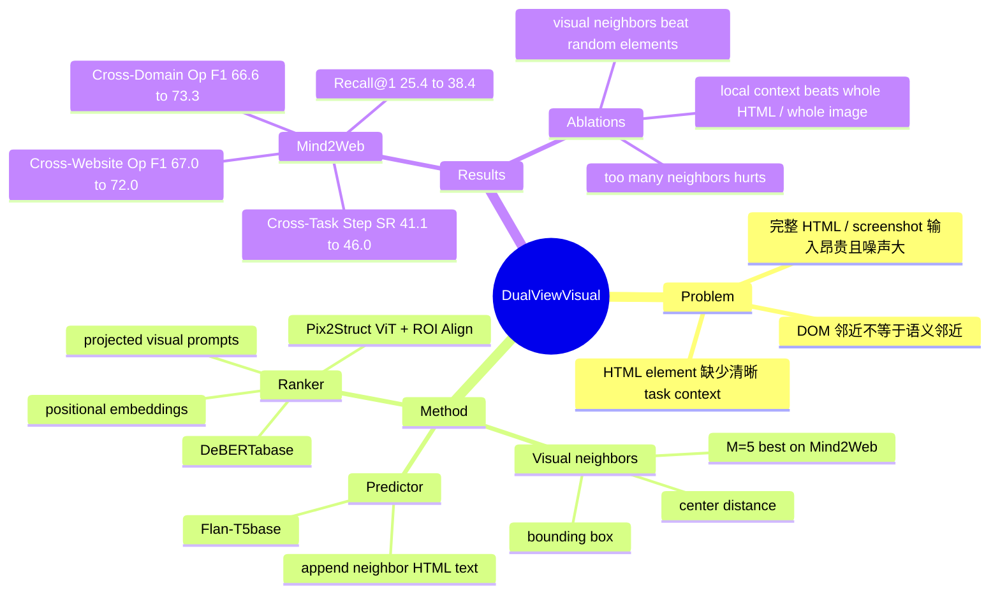

## Summary
这篇论文提出 Dual-View Contextualized Representation (DUAL-VCR)，把 HTML element 在 rendered screenshot 中的 bounding box、视觉内容和邻近元素文本合并进 web navigation 的 element representation。它不是替换 MindAct 的两阶段框架，而是在 ranker 和 action predictor 中为候选元素加入 visual-neighbor context，使 agent 更容易区分语义贫乏或外观相似的网页元素。实验在 Mind2Web 上显示 DUAL-VCR 相对 MindAct baseline 在 Cross-Task、Cross-Website、Cross-Domain 的九个 action prediction 指标上均有提升。

## Problem & Motivation
论文研究的问题是 real-world web navigation：给定自然语言任务、当前 HTML document、历史动作，agent 需要选择下一步要操作的 HTML element 和 operation。现有方法常以 HTML document 为主要输入，因为 HTML 同时提供内容、可操作元素和可行动作空间，但真实网页的 HTML 很长，且语义相关元素在 DOM / 源码里不一定相邻。作者指出一个具体痛点：很多 actionable element 本身文本非常弱，例如单独的 `[combobox]`、多个同名 `[button] Select`，只有结合网页截图中的邻近 label、价格、日期等视觉上下文才能判断其任务含义。该问题对 GUI / web agent 很关键，因为 element selection 错一步会导致后续动作链级联失败，而把完整 HTML 或完整 screenshot 直接塞给 LLM 又昂贵且未必有效。

## Method
DUAL-VCR 的核心假设是：web developers 通常会把语义相关、任务相关的元素安排在网页视觉空间中相近的位置，因此截图中的 visual neighbors 可以为 HTML element 提供比 DOM 邻接更直接的 task-related context。方法先用 web automation tool 从 HTML / rendered page 得到每个 HTML element 的 bounding box，计算 element center 之间的空间距离，并为每个候选元素选取最近的 M 个邻居；Mind2Web 上后续 ablation 显示 M=5 最合适。

在 element ranker 中，DUAL-VCR 基于 MindAct 的 DeBERTabase ranker 做增强。文本侧使用 candidate element 及其 visual neighbors 的 HTML text；视觉侧把整页 screenshot 输入 Pix2Struct ViT，再用 ROI Align 抽取每个 element bounding box 对应的 visual feature。视觉 feature 通过线性投影映射到 LM token embedding 维度，并与对应元素的 text token 一起加入按邻居距离排序的 learnable positional embedding；训练时 ViT 冻结，只训练 projection、positional embedding 和 LM。这个 ranker 的目标仍然是从上千个 HTML elements 中选出 top-K 候选元素。

在 action predictor 中，论文继续沿用 MindAct 的 multiple-choice action prediction 设置，用 Flan-T5base 在 top-K candidates 上预测 target element 和 operation。这里 DUAL-VCR 不把视觉 feature 直接输入 prediction LLM，而是把每个候选元素最近 M 个 visual neighbors 的 HTML text 追加到该候选元素的 HTML snippet 中，并用分隔 token 区分元素。换言之，ranker 用 text + visual dual view，predictor 主要用 visual-neighbor text context；方法贡献在 representation/contextualization，而不是新的 planner、memory 或 online interaction algorithm。

## Key Results
主要 benchmark 是 Mind2Web，包含 2,350 个 open-ended tasks、137 个 real-world websites、31 个 domains；网页平均有 1,135 个 HTML elements 和 44,402 个 HTML tokens。评测沿用 Mind2Web 的 Cross-Task、Cross-Website、Cross-Domain splits，并报告 Recall@K、Element Accuracy、Operation F1、Step Success Rate。

ranker 结果显示，DUAL-VCR 明显改善 target element retrieval。MindAct Rank 的 Recall@1 / @5 / @10 / @50 为 25.4 / 61.0 / 73.5 / 88.9；加入 visual neighbors' HTML text 的 DUAL-VCR VNEI-TXT 提升到 37.3 / 70.8 / 79.3 / 89.2；同时使用 visual neighbors' text + visual features 的 DUAL-VCR VNEI-TXT+VIS 进一步达到 38.4 / 71.6 / 79.7 / 90.1。

action prediction 上，最佳 DUAL-VCR VNEI-TXT+VIS ranker + DUAL-VCR PRED 在 Mind2Web 的九个指标上都超过 MindAct baseline。Cross-Task 从 42.0 Ele. Acc / 74.9 Op. F1 / 41.1 Step SR 提升到 47.0 / 78.7 / 46.0；Cross-Website 从 30.7 / 67.0 / 30.0 提升到 32.7 / 72.0 / 32.5；Cross-Domain 从 31.5 / 66.6 / 31.0 提升到 33.2 / 73.3 / 32.5。论文摘要还总结其相对 MindAct 在九个 action prediction metrics 上平均有 3.7% absolute gain。

消融结果支持“visual neighbor 不是随机噪声”这个 claim。Cross-Task 上，Whole HTML PRED 的 Ele. Acc 只有 38.6，低于 MindAct baseline 的 42.0；Whole Image Rank 为 43.9，低于 DUAL-VCR VNEI-TXT+VIS ranker 的 46.0；随机邻居会降低效果，Random Rank 的 Recall@50 为 86.7 且 Ele. Acc / Op. F1 为 40.6 / 72.0，而 DUAL-VCR VNEI-TXT 的 Recall@50 为 89.2 且 Ele. Acc / Op. F1 为 44.6 / 75.7。邻居数量也不是越多越好：ranker 中 M=5 达到 Recall@50 90.1、Ele. Acc 46.0、Op. F1 78.6，但 M=10 降到 89.5、45.2、77.0；action predictor 中 M=5 的 Ele. Acc 47.0，高于 M=3 的 46.4 和 M=10 的 46.2。

## Strengths & Weaknesses
亮点在于问题 formulation 简洁而有效：作者没有试图让 LLM 直接吞下完整 HTML，也没有把整个 screenshot 当作全局视觉提示，而是抓住“候选元素附近的视觉邻居”这个更局部、更可控的上下文来源。这个设计很贴近 GUI 的交互本质，因为网页视觉布局本来就是为人类操作服务的，很多 label-control、price-button、date-time selector 的语义关系确实以视觉邻近形式出现。实验也不是只报主表，Table 6/7/8/9 分别对 whole input、random elements、neighbor size 做了对照，能较好排除“只是多喂 token 或多喂 image feature”的弱解释。

局限也明确。第一，方法依赖 HTML element 能被映射到可靠 bounding box；对 canvas-heavy、iframe / shadow DOM 复杂、不可见但可操作、或动态遮挡较多的页面，论文没有给出充分验证。第二，DUAL-VCR 的核心归纳偏置是 visual proximity，ablation 已经显示邻居过多会伤害性能，这说明上下文选择仍然脆弱，无法保证所有任务相关元素都在局部邻域内。第三，Mind2Web 的 step-level evaluation 假设 previous ground-truth actions 已成功完成，因此结果主要证明单步 element/action prediction 更强，并不等价于真实在线闭环任务成功率提升。第四，实验只在 Mind2Web 上系统验证，没有展示 WebArena、MiniWoB++、WebShop 或 live web setting 的迁移。

严格区分信息来源：已知——论文明确提出 DUAL-VCR、在 Mind2Web 上报告上述 ranking 和 action prediction 数字，并通过 whole input、random neighbor、neighbor count ablation 支持 visual-neighbor context 的有效性。推测——这种局部 contextualization 可能适合作为后续 multimodal web agent / GUI agent 的 candidate representation 模块，尤其适合与更强 VLM 或 online planner 结合，但论文没有实验验证。未知——是否有公开代码、对现代 closed-source multimodal agents 的增益、在真实在线网页长程执行中的 failure distribution、以及对非标准网页渲染结构的鲁棒性，论文未充分说明。

## Mind Map

## Notes
这篇论文的 research taste 在于把“webpage screenshot”从全局图像输入改成 element-level relational context：不是让模型多看整张图，而是利用 HTML-bbox alignment 把视觉布局转成候选元素的局部语义证据。对后续 GUI agent 研究，一个直接启发是 candidate pruning 不应只看 DOM/text relevance，也应显式建模视觉邻近、视觉强调和可操作元素之间的局部 layout relation。需要警惕的是，这仍然是 offline supervised Mind2Web setting；若把它用于真实 browser agent，下一步应验证闭环错误恢复、页面状态漂移、以及 bbox extraction 失败时的退化路径。
