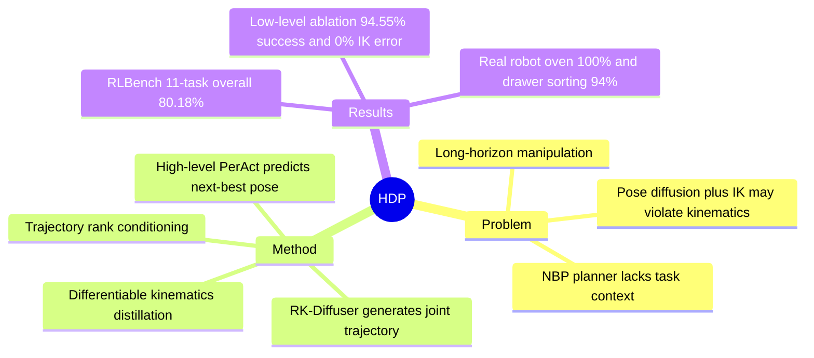

## Summary
HDP 把 language-guided multi-task robotic manipulation 分解为 high-level next-best pose prediction 和 low-level goal-conditioned diffusion control。核心贡献是 RK-Diffuser：同时学习 end-effector pose trajectory 与 joint position trajectory，并用 differentiable kinematics 把准确但不保证可执行的 pose trajectory 蒸馏到 kinematics-aware joint trajectory。实验上，HDP 在 RLBench 11 个任务、low-level ablation 和 Franka real-robot 设置中都显示出强于对照方法的成功率。

## Problem & Motivation
已知：end-to-end continuous control policy 假设少、控制灵活，但在 long-horizon manipulation 中 sample efficiency 和 generalization 较弱。NBP / keyframe agent 能提高样本效率，例如直接预测 distant next-best end-effector pose，再交给 motion planner 生成轨迹；问题是 planner 不理解 task context，遇到 articulated object 或需要特定 curved trajectory 的任务会失败。

这篇论文要解决的是：如何在 multi-task、language-guided manipulation 中，同时保留 high-level agent 的任务理解 / 长程规划能力，以及 low-level controller 对环境约束和机器人运动学约束的细粒度控制。作者的关键假设是 demonstration 数据里有 RGB-D observation、language instruction、end-effector pose、gripper action 和 joint position，且任务可以通过 keyframe / NBP 层级分解。

## Method
HDP 是一个 two-level hierarchical policy。High-level policy 使用 PerAct：输入 calibrated multi-view RGB-D observation 和 language instruction，输出 6-DoF next-best end-effector pose 与 gripper action；训练时只使用 keyframe，并用 behaviour cloning 的 cross-entropy loss 学习离散化的 translation / rotation / gripper action heads。

Low-level policy 是 Robot Kinematics Diffuser (RK-Diffuser)。给定当前 observation、start pose、high-level 预测的 next-best pose、robot state、gripper open amount、point cloud feature 和 trajectory rank，RK-Diffuser 用 diffusion process 生成连续 joint-position trajectory。它不是只在 end-effector pose space 做 diffusion 再跑 IK，而是学习两个扩散模型：一个 pose diffusion 负责生成准确的 end-effector pose trajectory，另一个 joint diffusion 负责生成可直接执行的 joint position trajectory。

关键设计在于 kinematics-aware distillation。作者用 differentiable forward kinematics 将 joint trajectory 映射回 end-effector pose trajectory，并加入 `Ljoint->pose`，让 joint diffusion 从 pose diffusion 的准确目标中获得梯度约束；推理时还可用 gradient-based inverse kinematics 对 joint positions 做 refinement，使预测 pose 接近 pose diffuser 输出，同时避免普通 IK solver 在长轨迹中累积不可行步骤。

另一个实用设计是 trajectory ranking。训练数据来自 sampling-based planner，轨迹可能不是最优；作者定义 `r = dEuclidean / dtravel` 作为轨迹质量条件，推理时设为 1，鼓励生成更短、更接近最优的轨迹。RK-Diffuser 的感知模块使用 point cloud + PointNet++，temporal model 使用 Conv1D UNet；作者还移除了 PerAct 原本用于 RRT collision handling 的 collision action head，因为 low-level RK-Diffuser 被训练为生成 collision-aware trajectory。

## Key Results
- RLBench multi-task simulation：在 11 个任务、每任务 100 demonstrations、训练 100K iterations 的设置下，HDP overall success rate 为 80.18%，高于 ACT 18.36%、Diffusion Policy 15.18%、PerAct + Planner 57.72%、PerAct + Planner + Bezier 56.73%、PerAct + Diffuser 71.27%。
- RLBench articulated / trajectory-sensitive tasks：HDP 在 open box 上达到 90%，而 PerAct + Planner 为 0%、PerAct + Planner + Bezier 为 8%、PerAct + Diffuser 为 82%；在 open oven 上达到 58%，而 PerAct + Diffuser 为 18%、PerAct + Planner 和 ACT / Diffusion Policy 都为 0%。
- RLBench low-level ablation with ground-truth next-best poses：RK-Diffuser overall success / IK error 为 94.55% / 0%，高于 RRT 26.82% / 0%、Pose Diffusion 67.18% / 24.55%、Joint Diffusion 73.64% / 0%、RKD-RGB 72.18% / 0%、RKD-ResNet 83.45% / 0%。
- IK failure analysis：Pose Diffusion 的 overall IK error rate 为 24.55%；作者报告 most IK errors are caused by invalid quaternions，并贡献了 75% 的 failure cases。这支持了论文关于“直接 pose diffusion + IK 在长轨迹中容易不可行”的论点。
- Real robot：在 Franka Panda 7-DoF arm、2 个 RealSense D415 cameras、每个 sub-task 10 demonstrations 的设置下，HDP 在 opening oven task 上达到 100% success rate，在 sorting objects into drawer task 上正文报告 94% success rate；appendix Table 3 给出 real-robot subgoal overall 为 95.71%。

## Strengths & Weaknesses
已知 strengths：论文把 task-level planning 与 low-level trajectory generation 明确解耦，使 PerAct 负责 language-conditioned next-best pose，RK-Diffuser 负责 context-aware motion。这个分解对 articulated objects 很有效，因为固定 planner 只知道目标 pose，不理解 hinge / resistance / turning radius 等 task context；open box、open oven、toilet seat up 等任务的结果直接支持这一点。

已知 strengths：ablation 设计比较完整，覆盖了 flat BC policies、planner-based hierarchy、learned low-level diffuser、RRT、pose diffusion、joint diffusion、RGB-only / ResNet feature ablation。尤其是 Table 2 把 IK error rate 和 success rate 放在一起，使 RK-Diffuser 的动机不是只靠最终性能叙事，而是有 failure mechanism 证据。

已知 weaknesses / failure cases：open microwave 仍然是明显短板，HDP 只有 26% success rate；作者解释为该任务 final end-effector pose distribution 高度多样，导致 high-level PerAct 预测 variance 高，并把错误传播给 low-level agents。Behaviour cloning 的 compounding error 也是作者在 conclusion 中承认的限制：longer-horizon tasks 中 distribution shift 可能累积并导致最终失败。

已知 limitations：方法依赖有 keyframes、joint positions、end-effector poses、RGB-D point cloud 和 language descriptions 的 demonstration 数据；低层虽然用 differentiable kinematics 提升 kinematics-awareness，但没有解决 high-level NBP 预测错误本身。论文还没有给出对不同 robot embodiments、不同视觉表示或更长 horizon real-world task 的系统验证。

推测：这篇对 embodied / agentic hierarchy 的启发在于，把“选择下一个关键状态”和“生成可执行动作轨迹”分开，可能比单一 end-to-end action policy 更适合需要任务语义与连续控制同时成立的场景。不知道：论文脚注说 code and videos are available in the project page，但正文未给出可写入 frontmatter 的具体 URL；因此这里不记录 code link。

## Mind Map

## Notes
这篇的核心价值不是“又一个 diffusion policy”，而是把 failure mode 定位得比较清楚：task-unaware planner 会生成语义上错误的轨迹，pose-space diffusion + IK 会生成运动学上不可行的轨迹，naive joint diffusion 又缺少对 final pose 的强约束。RK-Diffuser 的设计是在这三者之间取一个很工程化但合理的中间点：用 pose trajectory 提供准确目标，用 joint trajectory 保证可执行，用 differentiable kinematics 连接两者。

对后续阅读的检查问题：如果 high-level NBP 本身不稳定，low-level 再强也只是执行错误目标；因此这类 hierarchical manipulation 方法的下一步关键可能不是继续堆 low-level generator，而是让 high-level prediction 具备 uncertainty / multi-hypothesis / recovery 能力。这个判断是基于 open microwave failure analysis 的推测，不是论文实验证明的结论。
