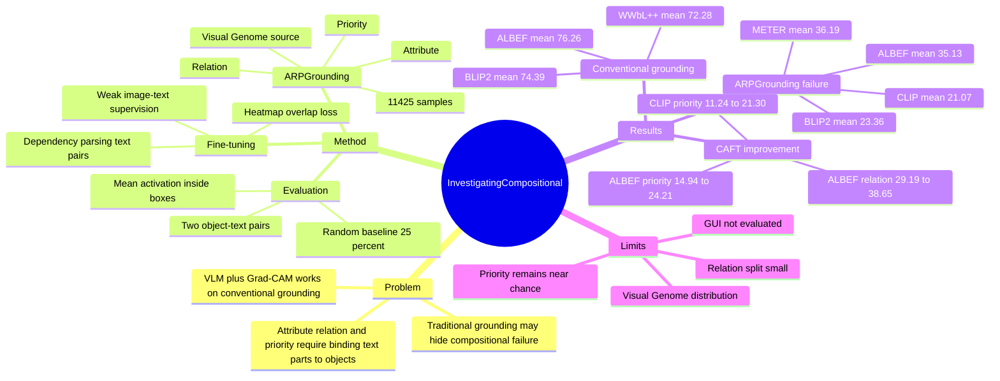

## Summary
这篇论文指出，CLIP、ALBEF、METER、BLIP2 等 VLM 虽然能用 Grad-CAM 在 conventional visual grounding benchmark 上达到或超过既有 weakly supervised 方法，但在需要 attribute、relation、priority compositional reasoning 的 visual grounding 中明显失效。作者构建了 ARPGrounding benchmark，并提出 composition-aware fine-tuning，用 image-text annotations 和 heatmap separation loss 改善 VLM 的 compositional grounding。核心贡献不是新的 grounding head，而是把 VLM grounding 的“表面有效”和“组合理解不足”拆开验证。

## Problem & Motivation
Visual grounding 的目标是根据文本表达定位图像中的对象区域。预训练 VLM 已经学习到大规模 image-text alignment，因此很多工作会用 Grad-CAM 等 explainability method 把 VLM 的 matching score 转成 heatmap，用于 weakly supervised visual grounding。

论文的关键问题是：这种 alignment 是否真的理解了文本中的 compositional structure？作者观察到 CLIP 会把 “brown dog” 激活到另一个颜色的 dog，或者在 “pot behind dog” 中被文本里的 dog 干扰，说明模型可能只抓 object word 或局部视觉相似性，而没有可靠绑定 attribute、relation 和 subject priority。这个问题对 VLM / GUI grounding / embodied scene understanding 都重要，因为真实指令往往依赖“哪个属性属于哪个对象”“哪个对象是目标而不是参照物”。

现有 compositionality 评测多是 text-image matching，而不是细粒度 localization。作者因此把问题具体化为 compositional grounding：同一张图里放两个相互干扰的 object-text pairs，要求模型根据文本把 heatmap 更强地落在正确对象上。

## Method
**ARPGrounding benchmark.** 作者基于 Visual Genome 构建 ARPGrounding，使用其 object bounding boxes、attributes 和 relations。每个 sample 包含一张图、两个对象 bounding boxes，以及对应两个文本描述；两个对象互为 compositional distractor。数据集共 **11,425** 个 samples，其中 **6,632** 个 Attribute、**370** 个 Relation、**4,423** 个 Priority。

**三类 compositionality.**

1. **Attribute**：两个对象同类但属性不同，例如同一类 object 的颜色、材质、大小、状态等不同。作者用 WordNet 检查属性 grand hypernym，避免把语义不等价或不能区分对象的属性误当成有效对比。
2. **Relation**：两个文本仅通过 relation 区分，形式聚焦在 `object1-relation-object2` triplet。作者要求 object1 同类但对应不同实例、object2 相同，并手动过滤语义近似关系，例如 “above” 和 “on top of”。
3. **Priority**：测试模型是否能识别文本中哪个 noun 是主目标，哪个只是参照物。作者从 relation triplets 中构造 object1/object2 位置反转的样本，用来观察模型是否会被文本中的另一个对象吸引。

**Metric.** 对每个 sample，模型为两个文本分别生成 heatmap `H0/H1`，两个候选对象由 bounding box mask `M0/M1` 表示。一个 sample 只有在 `H0` 对 `M0` 的平均激活高于 `M1`，且 `H1` 对 `M1` 的平均激活高于 `M0` 时才计为正确；因此 random baseline 是 **25.00**。

**Gradient-based localization.** 作者把 Grad-CAM 用到 VLM 的 multimodal transformer 中，从 image-text matching / contrastive score 对 intermediate attention map 的 gradient 生成 heatmap。这个部分不引入额外 detector 或 grounding head，核心是把 VLM 的匹配解释图直接作为 localization signal。

**Composition-aware fine-tuning.** 训练数据来自 VG region descriptions，过滤后得到 **83,517** 张 images。作者用 spaCy dependency parsing 从同一图像的多个文本描述中采样 text pairs，尽量让两个文本描述不同对象；然后用新的 pretext loss 最小化两个文本对应 heatmaps 的 overlap，即鼓励同一图像下不同文本产生可区分的 grounding heatmaps。CLIP 和 ALBEF 均 fine-tune **10 epochs**；CLIP 使用 batch size **256**、learning rate **1e-7**、输入 **224x224**，ALBEF 使用 batch size **54**、learning rate **2e-7**、输入 **384x384**。

## Key Results
- **Conventional visual grounding / Table 1**：不用额外训练时，ALBEF 在 VG / Flickr30k Entities / ReferIt 上达到 **75.04 / 84.49 / 69.26**，mean **76.26**；BLIP2 达到 **69.50 / 84.96 / 68.71**，mean **74.39**。二者都超过 weakly supervised baseline WWbL++ 的 mean **72.28**，支持作者“VLM + Grad-CAM 在传统 visual grounding 上很强”的观察。
- **ARPGrounding / Table 1**：同一批 VLM 在 compositional grounding 上显著下降。CLIP 的 Attribute / Relation / Priority 为 **42.78 / 9.19 / 11.24**，mean **21.07**，低于 random **25.00**；ALBEF 为 **61.25 / 29.19 / 14.94**，mean **35.13**；METER 为 **43.70 / 26.49 / 38.39**，mean **36.19**；BLIP2 为 **23.46 / 31.35 / 15.28**，mean **23.36**。
- **Compositional categories**：模型在 Attribute 上相对较好，四个模型的 Attribute 平均约 **42.80**；Relation 平均约 **24.06**，Priority 平均约 **19.96**。论文据此认为 relation 和 subject priority 比 attribute recognition 更难，且 VLM 的 compositional grounding 远未解决。
- **Composition-aware fine-tuning / Table 2**：CLIP caft. 把 CLIP 的 VG / Flickr / ReferIt 从 **57.46 / 75.26 / 56.77** 提升到 **60.43 / 78.07 / 63.75**，并把 ARPGrounding Attribute / Relation / Priority 从 **42.78 / 9.19 / 11.24** 提升到 **44.56 / 13.24 / 21.30**。ALBEF caft. 把 ALBEF 的 Flickr / ReferIt 从 **84.49 / 69.26** 提升到 **85.93 / 74.67**，ARPGrounding 从 **61.25 / 29.19 / 14.94** 提升到 **66.34 / 38.65 / 24.21**；但 VG 从 **75.04** 小幅降到 **74.80**。
- **Against CLIP compositional baselines / Table 2**：TSVLC 和 DAC 在 CLIP 上没有带来同等改善。比如 DAC 的 Priority 是 **8.70**，低于 CLIP baseline **11.24**；CLIP caft. 的 Priority 是 **21.30**，说明 image-text matching compositional training 不一定能直接转化为 grounding compositionality。
- **Ablation on text pair generation / Table 3**：同一对象 text pair 会伤害 grounding，尤其 ALBEF dagger 在 VG / Flickr / ReferIt 降到 **57.36 / 67.93 / 56.46**，ARPGrounding Relation / Priority 也降到 **17.84 / 8.61**。随机 text pair 有帮助，但 dependency parsing 采样最好；ALBEF caft. 在 Relation / Priority 上达到 **38.65 / 24.21**，高于随机 text pair 的 **35.95 / 18.80**。
- **Ablation on pretext task / Table 4**：普通 contrastive / image-text matching fine-tuning 会降低 grounding。ALBEF ft. 在 VG / Flickr / ReferIt 降到 **65.77 / 73.58 / 63.89**，Priority 降到 **8.82**；而 ALBEF caft. 达到 **74.80 / 85.93 / 74.67** 和 Priority **24.21**。这说明关键不只是更多 image-text pairs，而是 heatmap diversity 的训练目标。
- **Fully supervised grounding baselines / Table 5**：GLIP 和 Grounding DINO 在 ARPGrounding 上也不强。Grounding-DINO-B 是表中最好的 fully supervised baseline，但 Attribute / Relation / Priority 只有 **47.03 / 13.78 / 25.68**；它在 Attribute 上低于 ALBEF **61.25**，Relation 上低于 ALBEF **29.19**、METER **26.49**、BLIP2 **31.35**，Priority 上低于 METER **38.39**。

## Strengths & Weaknesses
**已知：Strengths.**

1. **问题 formulation 清楚。** 论文没有只问 VLM 能不能 localize，而是把 grounding 中的 compositional binding 拆成 Attribute、Relation、Priority 三个可测维度。这比普通 text-image matching compositional benchmark 更接近“语言成分是否被定位到正确视觉实体”。
2. **实验有反差，信息量高。** 同一批 VLM 在 VG / Flickr30k Entities / ReferIt 上能达到 WWbL++ 级别甚至更好，但在 ARPGrounding 上接近或低于 random，这个 contrast 支撑了作者的主张：传统 visual grounding 分数可能掩盖 compositional failure。
3. **Ablation 支撑核心设计。** Table 3 说明 text pair 必须尽量描述不同对象，Table 4 说明普通 image-text fine-tuning 不够，必须用 heatmap separation 这样的 grounding-oriented pretext task。
4. **negative result 也有价值。** GLIP / Grounding DINO 的 fully supervised 结果不优，说明问题不是简单换成 detector-style grounding model 就解决；ARPGrounding 确实在测更细的语义绑定。

**已知：Weaknesses / Limitations.**

1. **Relation split 只有 370 samples。** 作者自己解释这是因为同一图中两个同类对象、且能用不同 relation 与同一 object2 区分的样本少。这个 split 的结论方向可信，但统计稳定性和覆盖范围应谨慎看待。
2. **数据来自 Visual Genome，且需要手工过滤。** VG scene graph 的 annotation coverage 和 relation wording 会影响 ARPGrounding 的分布；手工过滤提高质量，但也意味着 benchmark 构造不是完全自动可扩展。
3. **评价依赖 bounding box 内平均 heatmap activation。** 这个 metric 适合比较两个候选对象，但不等同于完整 grounding quality；heatmap 是否形状准确、是否覆盖对象局部、是否有背景噪声，并不完全由该分数反映。
4. **Composition-aware fine-tuning 改善明显但没有解决问题。** ALBEF caft. 的 Priority 仍只有 **24.21**，略低于 random **25.00**；CLIP caft. 的 Relation 也只有 **13.24**。因此它更多证明“方向有效”，不是证明 compositional grounding 已被解决。
5. **Priority 的定义有一定 task-specific 色彩。** 它测的是 triplet 中主目标和参照物的 noun priority，但真实语言中的 salience、syntax、关系方向和 task intent 可能更复杂。

**推测。**

- 对 GUI agent 的启发是，UI grounding benchmark 也可能出现类似 false confidence：模型在普通点击定位上表现好，但遇到 “按钮左侧的图标”“不是标题而是下方列表项” 这类 compositional instruction 时失效。论文没有评估 GUI screenshot，因此这只是跨域假设。
- heatmap separation loss 可能适合作为 screen grounding 的弱监督训练信号，前提是能从 UI metadata / accessibility tree 中构造同屏不同元素的 text pairs。论文没有测试这种迁移。

**不知道。**

- 不知道 ARPGrounding 是否公开了完整样本、过滤规则和人工过滤记录；正文只说 code available at link，但没有给出可解析 URL。
- 不知道更强的后续 LVLM 或 grounding-specific MLLM 在 ARPGrounding 上是否仍有同样 failure pattern。
- 不知道该 benchmark 对 prompt phrasing、text paraphrase、object size imbalance、bounding box annotation noise 的敏感性。

## Mind Map

## Notes
- **我的判断**：rating=4。这篇对 VLM / visual grounding 很重要，因为它提供了一个简洁但锋利的诊断：传统 grounding benchmark 上的强结果不代表模型真正理解 compositional language。
- **和 GUI Agent 的关系**：直接任务不是 GUI，但它对 GUI grounding 有强启发。GUI 指令天然包含 attribute、spatial relation、hierarchy 和 priority，例如 “选择右侧面板里第二个蓝色按钮而不是左侧导航项”；如果 UI grounding 只测单对象点击，很可能重复本文揭示的 blind spot。
- **最值得复用的设计**：同屏放两个可混淆对象，并要求模型在两个文本之间做互斥定位。这种 paired distractor setup 比单独问 “where is X” 更能暴露 shortcut learning。
- **需要后续跟进**：把 ARPGrounding 风格迁移到 screenshots / webpages / mobile UI，尤其是构造 Attribute、Relation、Priority 三类 UI compositional grounding benchmark，并观察 current GUI LVLM 是否也在 priority 上低于 chance。
