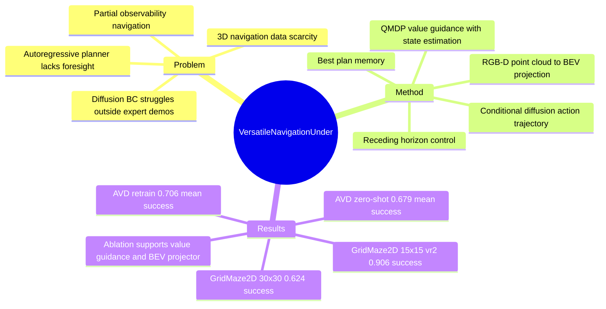

## Summary

这篇论文研究 partial observability 下的 long-horizon navigation，把 diffusion policy 的 multi-step action trajectory generation 和 QMDP-style value guidance 结合起来，用 value function 在多个 diffusion plan candidate 中选计划。方法在 GridMaze2D 和 Active Vision Dataset (AVD) 上优于或接近 CALVIN / Diffusion Policy baselines，并通过 point cloud 到 BEV map 的投影实现 2D policy 到 3D navigation 的 zero-shot transfer。核心价值不在于新视觉表征，而在于把 partial observation、state estimation、trajectory-level generation 和 value-guided plan selection 组合成一个 navigation policy。

## Problem & Motivation

作者要解决的是 partial observability 下的 route planning：agent 只能逐步看到局部环境，却需要在未知 goal / obstacle 分布中做长时程导航。传统 autoregressive planner 每次按上一步状态顺序选 action，作者认为它缺少 foresight，且在 POMDP 下会受到 belief-space 复杂度和实时推理压力影响；diffusion-based policy 虽能一次生成 action trajectory，但已有方法多假设 full observability，或退化为 behavior cloning，遇到 expert demonstration 没覆盖的 dead end / unfamiliar scenario 时容易失败。另一个动机是 3D embodied navigation 数据稀缺，因此作者希望复用大量 2D maze 数据训练出的 policy，通过 RGB-D point cloud 到 2D BEV grid map 的转换迁移到 3D 场景。

## Method

方法包含三个关键部分。

1. **Diffusion-model-based plan generation**：policy 以累计 partial environment map \(e_{(t)}\) 为 condition，生成未来 \(T_h\) 步 action trajectory \(\tau_{a,(t)}\)，并用 receding horizon control 每轮只执行前 \(T_a\) 步后重新规划。离散 action 被 bit encoding 成可用于 continuous diffusion 的表示；plan generator 使用 U-Net-style 1D convolution backbone，环境 encoder 把 partial map 编成低维 embedding，并通过 FiLM 调制 diffusion denoising。

2. **Value-guided exploration-safe planning**：只用 diffusion generator 等价于 partial observability 下的 behavior cloning，容易在 dead end 后无法恢复。作者引入 state estimation module，用 Bayesian filter 更新 belief，并用 QMDP 近似 POMDP 的 optimal value function；value module 还学习 valid action mask / reward function，把 invalid action 赋予较大负值以降低碰撞风险。推理时，diffusion policy 对同一 condition 多次采样，系统用 learned Q value 对每条 action trajectory 求平均 value，选择 value 最高的 plan。

3. **Best plan candidate backtracking 与 2D-to-3D transfer**：为了缓解 receding horizon 重新规划时把原本较优 action 覆盖掉的问题，作者维护 previous best plan memory，把上一轮未执行完的 best trajectory 也放入候选集合。对于 3D navigation，方法从 FPV RGB-D 累积 point cloud，用 Swin3D 做 semantic segmentation，将 floor / ceiling 等映射为 free space、wall / furniture 等映射为 obstacle，再投影成 BEV binary grid map，使 2D GridMaze policy 可以直接处理 AVD 场景；另有 retrain variant 将 RGB feature 与 BEV map embedding 拼接训练。

## Key Results

- **GridMaze2D success rate**：模型在 15x15 maze、view range=2 上训练，并测试不同 observability 和 maze size。标准设置 15x15 (vr=2) 中，Ours 为 **0.906±0.010**，高于 CALVIN **0.855±0.030** 和 Diffusion Policy **0.060±0.022**；在 30x30 (vr=2) generalization 中，Ours 为 **0.624±0.032**，CALVIN 为 **0.326±0.030**，Diffusion Policy 为 **0.000±0.000**。
- **Robustness to observability in GridMaze2D**：15x15 maze 下，Ours 在 vr=1 / 2 / 3 的 success rate 分别为 **0.886±0.011 / 0.906±0.010 / 0.911±0.013**；CALVIN 为 **0.832±0.030 / 0.855±0.030 / 0.900±0.026**；Diffusion Policy 为 **0.024±0.015 / 0.060±0.022 / 0.110±0.031**。
- **AVD embodied navigation / object search**：目标是在 8 个包含 Coca-Cola glass bottle 的 AVD indoor scene 中定位并到达 object。mean success rate 上，CALVIN-2D 为 **0.635±0.032**，CALVIN-3D 为 **0.682±0.047**，Ours zero-shot 为 **0.679±0.040**，Ours retrain 为 **0.706±0.032**；加入 depth noise 后均值分别为 **0.626±0.037 / 0.670±0.052 / 0.675±0.042 / 0.700±0.040**。
- **Ablation**：在 GridMaze2D 15x15 和 AVD Home_001_1 上，full version 达到 **0.906±0.010 / 0.776±0.028**。single-sampling 只有 **0.060±0.022 / 0.024±0.012**；multi-sampling+voting 提升到 **0.114±0.025 / 0.082±0.026**；multi-sampling+value guidance 达到 **0.538±0.010 / 0.542±0.031**；去掉 point cloud to BEV projector 后 AVD 降到 **0.486±0.036**。

## Strengths & Weaknesses

**已知 - Strengths**：论文的核心设计针对 partial observability 下的两个真实 failure mode：CALVIN 这类 autoregressive planner 可能在局部观测下陷入 loop，纯 Diffusion Policy 作为 behavior cloning 在 dead end / goal 未观测到时容易失效。实验和 ablation 都支持 value guidance、best-plan memory、point cloud to BEV projector 是有效组件，而不是只靠更大的 generator；尤其是 GridMaze2D 30x30 的 0.624 vs CALVIN 0.326 / Diffusion Policy 0.000，说明该方法在训练外 maze size 上有更好的 scalability。

**已知 - Weaknesses / limitations**：作者在 supplementary 明确给出两个主要限制。第一，3D 迁移高度依赖 point cloud semantic segmentation 的准确性，floor / wall / furniture 误分会导致 BEV projection 错误并造成 catastrophic planning error。第二，QMDP 假设只在当前 timestep 考虑 partial observability、之后按 full observability 近似，因此 long-term planning 可能 suboptimal；作者指出对于 trajectory-level plan，这种远期 suboptimality 可能被放大。论文还展示了一个失败案例：该方法也可能在 GridMaze2D 中进入较大的 navigation path cycle。

**推测**：对 GUI-agent 的启发不在视觉 grounding 本身，而在“partial observation + accumulated memory + value-guided multi-step action selection”这个 decision-making pattern；GUI/web agent 同样会遇到局部可见页面、隐藏状态和多步动作回退的问题，但本文没有在 GUI 或 web 环境验证。

**不知道**：论文没有报告代码链接、DOI 或真实机器人硬件部署；虽然 supplementary 描述了 parallel plan candidate generation 以保持效率，但没有给出 wall-clock latency 数字，因此无法判断它在严格实时系统中的实际计算预算。

## Mind Map

## Notes

这篇论文和 [[2303-DiffusionPolicy]] 的关系很直接：它不是把 diffusion policy 用作 manipulation BC，而是把 action trajectory diffusion 接到 partial-observable navigation 的 value-based planning 上。值得继续追问的是：value guidance 依赖 QMDP 这个近似，是否能换成 learned belief-space value / world model rollout，减少“未来 full observability”假设带来的 long-horizon suboptimality。
