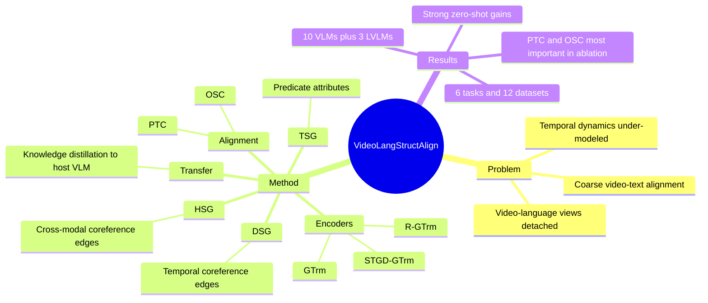

## Summary
这篇论文提出 Finsta，把 text/video 解析成 TSG/DSG/HSG，并通过结构化 spatio-temporal alignment 来增强已有 VLM。核心价值不是重训一个新 VLM，而是把 SG-based fine-grained alignment 作为 plug&play post-training module 蒸馏回 host VLM，在多类 video-language 任务上提升性能。

## Problem & Motivation
现有 VLM 通常依赖整体 video-text 表征或 frame patch 层面的 coarse alignment，难以解释 text 中对象、谓词、动作修饰语与 video 中动态对象轨迹之间的细粒度对应关系。论文指出三个瓶颈：coarse-grained cross-modal aligning、under-modeling of temporal dynamics、detached video-language view。这个问题对 video understanding 很重要，因为 video 的核心不是单帧视觉语义，而是对象在时间维度上的变化；如果 alignment 只停留在全局表示，Video Captioning、Temporal Localization、Video QA、Video-Text Retrieval 都可能错过动作边界和跨模态互补信息。

## Method
Finsta 的输入是 text-video pair 的结构化表示。Text 侧使用 Textual Scene Graph (TSG)，在原始 TSG 基础上显式加入 predicate attribute node 来保留 adverbial modifiers，例如 quickly、hastily 这类动作修饰信息；video 侧使用 Dynamic Scene Graph (DSG)，先抽取 keyframes，再用 FasterRCNN、MOTIFS 和 attribute classifier 生成 object/relation/attribute nodes，并通过 temporal coreference edges 连接跨帧同一对象。论文还用 CLIP 计算 text object 与 visual object/label 的相似度，加入 cross-modal coreference edges，把 TSG 和 DSG 合并成 Holistic Scene Graph (HSG)。

编码器采用 dual-stream-sum architecture：TSG 用 Graph Transformer (GTrm) 编码；DSG 和 HSG 用 Recurrent Graph Transformer (R-GTrm) 建模空间和时间传播；在 R-GTrm 之间插入 Spatial-Temporal Gaussian Differential Graph Transformer (STGD-GTrm)，用 Gaussian kernel 建模相邻帧中对象相对邻域的位置变化，从而区分 moving nodes 和 stationary nodes。

对齐学习分成两部分：Object-centered Spatial Contrasting (OSC) 在 TSG object 与 DSG object 的 high-order neighbor region 之间做 spatial contrastive alignment；Predicate-centered Temporal Contrasting (PTC) 在 TSG predicate 与 DSG 中某个 temporal interval 的 high-order region 之间做 temporal contrastive alignment。最后，Finsta 不直接作为推理时 VLM 使用，而是在 post-training 阶段通过 representation transfer / knowledge distillation，把 TSG/DSG/HSG 中学到的 fine-grained spatio-temporal features 注入 host VLM；下游 fine-tuning 或 inference 时不再需要 SG annotations。

## Key Results
论文在 6 类 VL 任务、12 个数据集上评估，覆盖 10 个 VLM 和 3 个 LVLM backbone。Video Action Recognition 上，Finsta-InternVideo 在 K400 达到 93.7 Top-1 / 99.2 Top-5，相比 InternVideo 提升 +2.6 / +0.3；在 SSV2 达到 80.5 Top-1 / 96.7 Top-5，提升 +3.3 / +1.3。

Video Captioning 上，Finsta-HDVILA 在 YouCook2 达到 18.8 METEOR / 12.7 BLEU@4，相比 HDVILA 提升 +5.3 / +4.5；Finsta-Clover 在 MSR-VTT 达到 38.8 METEOR / 49.3 BLEU@4，提升 +4.7 / +1.8。Video-Text Retrieval 上，Finsta-HDVILA 在 DiDeMo 达到 41.3 R@1 / 70.9 R@5，相比 HDVILA 提升 +12.5 / +13.5；Finsta-Video-LLaVA 在 DiDeMo 达到 73.6 R@1 / 90.3 R@5，提升 +2.4 / +1.6。

Video QA 上，Finsta-Video-LLaVA 在 MSR-VTT-QA 达到 99.4 MC accuracy / 51.7 OE accuracy，相比 Video-LLaVA 提升 +2.6 / +3.7；在 MSVD-QA 达到 72.5 OE accuracy，提升 +6.8；在 TGIF-Frame 达到 83.1 OE accuracy，提升 +5.6。Long-form setting 中，Finsta-LFVILA (L-Vid) 在 How2QA 达到 84.8 accuracy、在 VIOLIN 达到 78.0 accuracy，相比 LFVILA 提升 +8.7 / +7.1；Finsta-Video-LLaVA 在 How2QA 达到 87.8 accuracy，提升 +4.3。

Zero-shot 结果更强地支持其 alignment 价值：Finsta-InternVideo 在 K400 zero-shot Top-1 从 53.3 提升到 68.9，提升 +15.6；在 LSMDC retrieval 上从 11.0 R@1 / 25.8 R@5 提升到 21.9 / 39.3，提升 +10.9 / +13.5；Finsta-Video-LLaVA 在 MSVD zero-shot QA OE 从 25.1 提升到 45.3，提升 +20.2。

Ablation 显示 temporal alignment 是最关键模块：去掉 LPTC 平均下降 -7.9，去掉 LOSC 平均下降 -5.9，去掉 STGD-GTrm 平均下降 -5.1；结构构造上，去掉 DSG temporal coreference edge 平均下降 -3.7，去掉 TSG adverbial modifier 平均下降 -2.9，去掉 HSG cross-modal coreference edge 平均下降 -2.4。效率上，Finsta-HDVILA 参数从 310M 增至 397M (+28.1%)，post-training 数据为 0.05M 而非 HDVILA pre-training 的 136M，GPU hours 从 174K 到 174.35K (+0.2%)，GFLOPs 从 1,750 到 2,036 (+16.3%)。

## Strengths & Weaknesses
**已知**：论文把 video-language alignment 拆到 object、predicate、temporal interval 和 high-order graph neighborhood 层面，比全局 video-text contrastive learning 更贴近 video 的动态语义。实验覆盖面很宽，既有 K400、SSV2、MSR-VTT、DiDeMo、MSVD-QA，也有 How2QA、VIOLIN、ActivityNet 这类更依赖 temporal modeling 的设置；ablation 也直接支持 PTC、OSC、STGD-GTrm 和 coreference edges 的贡献。

**已知**：plug&play 设计有实际吸引力，因为 SG parsing 只在 post-training 需要，下游 inference 不需要额外解析 SG。论文也承认结构不完整会伤害效果：在 Finsta-HDVILA 上，当 SG node missing rate 达到 50% 时，K400 从 high-quality SG 的 83.4 降到 73.3，MSR-VTT METEOR 从 36.9 降到 30.5，DiDeMo R@1 从 49.3 降到 25.1，MSVD-QA accuracy 从 53.3 降到 46.3，部分结果甚至低于 raw HDVILA。

**已知**：论文没有给出系统性的 failure-case taxonomy，更多是用 case study 展示 HDVILA 出错而 Finsta-HDVILA 修正；因此我们知道它在示例中能改善 action boundary、caption detail 和 QA，但不知道在哪些真实错误分布上最容易失败。另一个边界是架构依赖：当 host VLM 缺少 text/video/cross-modal encoder 时，Finsta 仍可工作，但论文显示 All-in-one、VideoCLIP、CLIP4Clip 等缺模块模型通常提升更保守。

**推测**：Finsta 对 GUI Agent 或 web/mobile agent 的潜在价值在于“对象-关系-动作”的结构化 temporal grounding，这可能迁移到 screen recording / interaction trace 理解；但论文没有实验 GUI、web、mobile 或 agent benchmark，因此只能视为研究启发。**不知道**：论文没有明确报告 Finsta 自身代码仓库，也没有给出在更大规模 LVLM instruction tuning 流水线中与 end-to-end video instruction data 混合训练的稳定性。

## Mind Map

## Notes
这篇论文值得放入 “structured video-language grounding” 线索中，而不是只当作一个 video benchmark paper。最有启发的是它把 scene graph 当作 post-training scaffold：训练时用结构提供细粒度监督，推理时把结构蒸馏进 host VLM，避免每个下游样本都依赖 SG parser。

后续可追的问题：1) 对 GUI/video agent trace，能否把 screen element graph + action graph 做成类似 TSG/DSG/HSG 的结构化 alignment；2) 现在的 PTC 仍依赖 parser 产出的 predicate/action 对齐，是否可以用 VLM 自监督 proposal 或 interaction logs 替代；3) Finsta 的 gains 在 zero-shot 上特别大，说明它更像补 alignment prior，而不是只补 downstream fitting，这一点值得和 video instruction tuning 方法对比。
