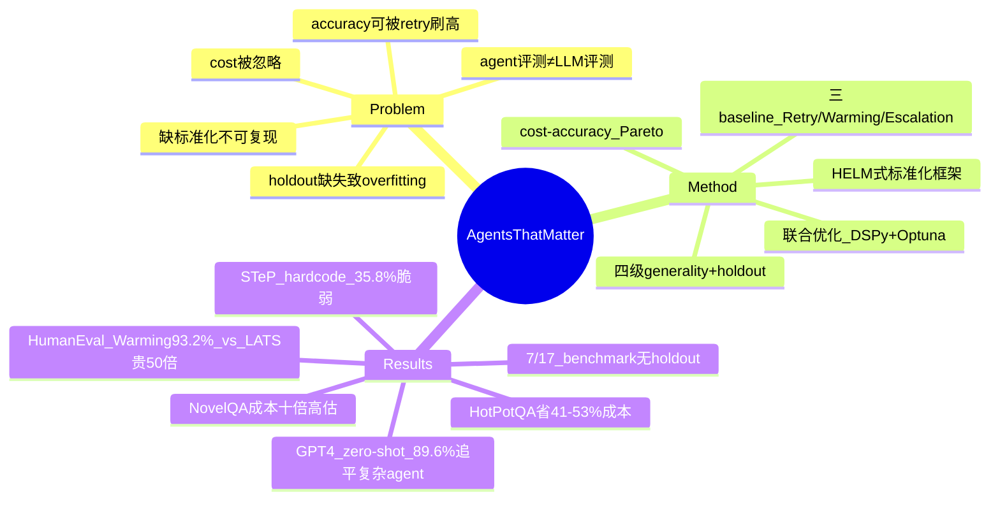

## Summary

指出当前 AI agent 评测只看 accuracy、不控 cost 的根本缺陷——单纯多试几次（retry）就能刷高 accuracy，方法学上毫无进步——主张用 cost–accuracy Pareto frontier、按 generality level 设 holdout、以及标准化评测 harness 来衡量"真正有用"的 agent。

## Problem & Motivation

Agent 研究的评测实践存在系统性问题，导致 leaderboard 上的 SOTA agent 在真实部署中不一定有用。作者归纳出五类缺陷：

1. **只优化 accuracy、忽略 cost**：accuracy 可以被"科学上无意义"的手段（重复调用模型、复杂的 search/reflection 架构）刷高，产出昂贵且复杂的系统，却没有真实算法进步。核心论点是 "accuracy alone cannot identify progress because it can be improved by scientifically meaningless methods such as retrying"。
2. **混淆两类评测需求**：model developer（选模型/研究进步）与 downstream/application developer（选 agent 部署、关心美元成本）的 benchmarking 需求被混为一谈。
3. **holdout 缺失导致 benchmark overfitting**：很多 agent benchmark 只有几百个样本、且没有 held-out test set，agent 可以（有意或无意）走捷径、hardcode 只对特定任务生效的策略。
4. **缺乏标准化、可复现性差**：评测脚本不统一、依赖外部环境状态、实现里有 subtle bug，导致复现困难。
5. **把 agent 评测当成 LLM 评测**：两者在成本结构、环境交互、状态依赖上有本质差异（"differ in fundamental ways"），沿用 LLM benchmark 的做法是错误起点。

## Method

论文本身不提新 agent，而是提出一套**评测方法学**与配套证据。

**(1) 用 cost 一起衡量 accuracy — Pareto frontier。** 主张把 agent 评测呈现为 accuracy 与 inference cost 的 Pareto curve，暴露真实的性能–成本 trade-off；downstream 评测必须用**美元成本**而非 proxy（如参数量），model 评测才用 compute proxy。

**(2) 三个简单 baseline，证明复杂 agent 无实质增益。** 作者设计三个不涉及复杂架构、仅重复/调温/换模型的 baseline：
- **Retry**：temperature=0 下最多重试 5 次，只要通过题目自带 test case 就停。
- **Warming**：逐步升温——首次 0、第 2–3 次 0.3、后续 0.5，通过 test 即停。
- **Escalation**：从便宜模型（Llama-3 8B）起，遇到 test case 失败就升级到更贵的模型（GPT-3.5 → Llama-3 70B → GPT-4）。

**(3) 联合优化 cost 与 accuracy。** 在 DSPy pipeline 上用 Optuna 联合优化，用一次性的 fixed optimization cost 换取更低的 variable runtime cost。

**(4) 四级 generality taxonomy + 对应 holdout 要求。** benchmark 设计者应声明 agent 的适用范围，并按级别保留正确的 holdout：
- distribution-specific → hold out in-distribution samples
- task-specific → hold out out-of-distribution samples
- domain-general → hold out unseen tasks
- fully general → hold out different domains

**(5) 标准化评测框架。** 呼吁建立类似 HELM 的 agent evaluation framework、统一发布 evaluation script 的标准，并区分"研究进步用的 model benchmark"与"采购用的 downstream/procurement benchmark"。

## Key Results

**HumanEval：简单 baseline 追平复杂 agent，成本相差 50 倍。**

| 方法 | Accuracy | Cost |
|:--|:--|:--|
| Warming (GPT-4) | 93.2% | $2.45 |
| LDB (GPT-4 + GPT-3.5) | 91.0% | $2.19 |
| **GPT-4 zero-shot** | **89.6%** | **$1.93** |
| LATS (GPT-4) | 88.0% | **$134.50** |
| Reflexion (GPT-4) | 87.8% | $3.90 |
| GPT-3.5 zero-shot | 73.9% | $0.05 |

关键结论 "there is no significant accuracy difference between our warming strategy and the best-performing agent architecture"，而 LATS 成本比简单策略高 50 多倍。作者强调这类论文"haven't adequately tested simple baselines"——一个正确跑出来的 GPT-4 zero-shot（89.6%）已经追平/接近所有复杂 agent。

**HotPotQA + DSPy 联合优化：省 41–53% 成本，accuracy 不降。** GPT-3.5 上联合优化把 variable cost 降 53%、accuracy 相近；Llama-3-70B 上降 41%。因为省的是 variable cost、代价是一次性 fixed cost，两者在约 **1,350 个任务**后总成本低于 default DSPy。

**WebArena / STeP：holdout 缺失掩盖了 overfitting。** STeP 报 35.8% accuracy（是最强 baseline 的两倍多），但靠 hardcode 策略（如"看当前 base URL 加后缀 `/user/user_name`"），网站 URL 结构一变就崩；没有 held-out test set 就无法发现这种脆弱性。作者还发现复现 bug：LATS 与 STeP 都把部分实际未完成的任务标记为 correct。

**NovelQA：benchmark 设计误导成本判断。** 真实的顺序查询场景下 RAG 比 long-context 便宜 20 多倍，但 NovelQA benchmark 上只显示 RAG 便宜一半——**十倍的成本高估**，会误导 downstream developer 的选型。

**Holdout 审计。** 17 个被调研的 agent benchmark 中，**7 个完全没有 holdout、也没有加 holdout 的迹象**；按四级 generality 统计合规比例极低：distribution-specific 1/1、task-specific 3/6、domain-general 1/8、fully-general 0/2。

**Human-in-the-loop 也缺标准化。** 简单的人类反馈能把 GPT-4 在编程题上的表现从 0% 提到 86% 以上，但没有 benchmark 计入人机协作这一维度。

## Strengths & Weaknesses

**Strengths.**
- 直击 problem formulation：把"agent 评测该测什么"这个被 convention 掩盖的问题挑明，符合 first-principles——accuracy 单指标可被 retry 这类无意义手段刷高，因此**不能识别真实进步**。这是一个 simple 而 generalizable 的判据。
- 证据扎实且可证伪：三个 baseline 的 HumanEval 对照表、STeP 的 hardcode 证据、NovelQA 的十倍成本高估、17 benchmark 的 holdout 统计，都是可核查的具体数字而非口号。
- cost 作为一等公民、Pareto frontier、按 generality level 设 holdout——这三条已成为后续 agent 评测（如 HAL、AgentBench 类工作）反复引用的方法学基线。

**Weaknesses / 边界.**
- cost 用美元度量会随模型定价漂移，Pareto 比较的绝对位置不稳定；论文也承认要记录 token 数以便未来重算，但没给出定价漂移下的规范化方案。
- 三个 baseline 主要在 HumanEval（有 test case 可自检）上强，Retry/Warming 依赖"任务自带可验证信号"这一前提；对没有 cheap verifier 的开放任务（多数 web/GUI agent），"多试几次刷 accuracy"这一批评的可操作性会减弱。
- generality 四级 taxonomy 是**先验分类**，落到具体 benchmark 时归属常有争议；作者用它来评 holdout 合规，但分类本身缺乏独立验证。
- 对"什么才算有意义的算法进步"给的是反例（retry 不是），没给正面的充分判据。

**对领域的影响。** 这是 agent 评测方法学的奠基性批评之一，把"important vs publishable"的分野落到可执行的评测规范上，对我做 agent reliability / 评测设计有直接指导意义：任何 agent 结果都应报 cost–accuracy Pareto，且必须问"这个 benchmark 的 holdout 在哪一级 generality 上"。

## Mind Map

## Notes

- 待验证：原文疑似把某前作报告的 GPT-4 baseline（低于 89.6%）与自己正确跑出的 89.6% zero-shot 对照，以说明"弱 baseline 制造虚假进步"。本次抓取未逐字确认具体的低值数字（如 75.0%），故正文只保留已核实的 89.6% 对照表，未写入未验证数字。
- venue 按任务给定填 TMLR 2025；arXiv abs 页当前标 cs.LG。doi 未核实留空；code（论文提到有 prototype interface / 评测脚本）未拿到确切链接，留空避免捏造。
- 连接点：与 vault 中 agent reliability / evaluation 方向直接相关；下次做 agent 评测设计时应把本文的"Pareto + generality-level holdout + 标准化 harness"作为 checklist。
