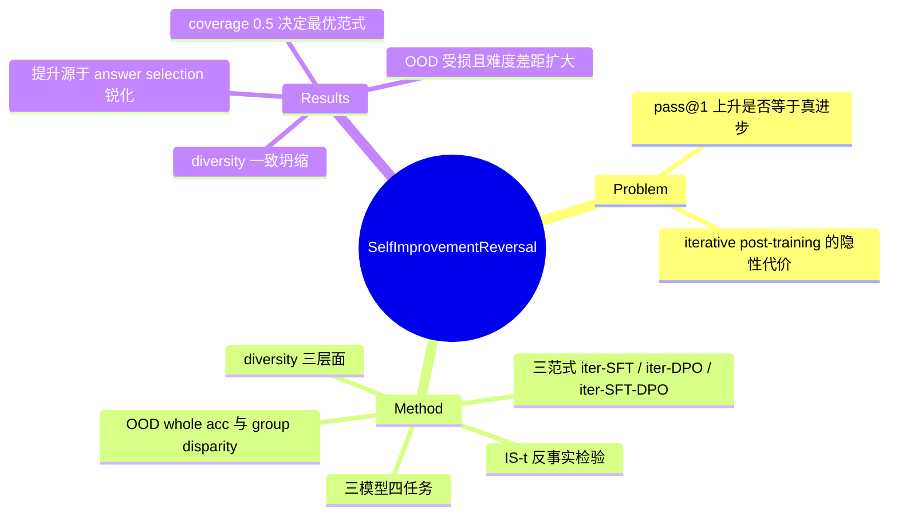

## Summary

提出并命名 **self-improvement reversal** 现象：iterative post-training（SFT / DPO / SFT-DPO）虽让 LLM 的 pass@1 逐轮上升，但 output diversity 与 OOD 泛化同步一致性下降，且"新解决"的问题几乎都本已在初始模型的生成空间内（pass@N near-perfect）——所谓 self-improvement 主要是 correct answer selection 的锐化，而非新解题能力的获得。论文据此构建了超越 pass@1 的多维评估框架（improvement set 分析、三层面 diversity、OOD whole accuracy + group disparity），并给出按 answer coverage 选择 post-training 范式的条件规则。

## Problem & Motivation

Iterative preference learning、self-training 等无人工干预的 post-training self-improvement 在 2024 年前后被广泛用于提升 LLM 数学推理等能力，社区默认 benchmark 分数上升即为"进步"。作者质疑这一默认：pass@1 是表层指标，无法区分"真的学会解更难的问题"与"在已有生成空间内更集中地选出正确答案"。若是后者，迭代自训练可能同时在牺牲更根本的能力（多样性、分布外泛化），即表面 progress 掩盖实质 regress。这一问题对 self-evolving 路线的可行性判断至关重要——如果自改进天然伴随能力收缩，其 scaling 前景需要重新评估。

## Method

**迭代自改进的形式化**（§3, Algorithm 1）：从 M_0 出发，第 t 轮包含三步——(1) *answer sampling*：M_{t-1} 对每个训练 query 采样 N=50 个输出（top-p 0.95、temperature 0.75；此为**训练数据构造与 diversity/coverage 分析**的采样设置）；(2) *training set construction*：以与数据集 ground-truth 答案匹配为正确性判据，SFT 只保留正确答案，DPO 构造 correct-incorrect preference pairs；(3) *post-training* 得到 M_t。**测试评估（pass@1）用 greedy decoding（temperature 0）**——两套解码设置不可混淆（初稿曾误标，已按原文修正）。

**三种范式对比**：iterative SFT（逐轮只做 SFT）、iterative DPO（初始 SFT 后逐轮 DPO）、iterative SFT-DPO（初始 SFT 后交替 SFT 与 DPO）。

**实验设置**：Llama-2-7B、Mistral-7B、Llama-3-8B 三个模型 × CSQA（常识多选）、GSM8K（小学数学）、MATH（竞赛数学，Level 1-5 难度分层）、MBPP（Python 编程）四个任务（Appendix D 另有 LLaMA-2-70B scaling 实验）。

**超越 pass@1 的评估框架**（论文核心贡献）：
- **Improvement problems**（§5.1）：定义 improvement set IS(t) = {x ∈ D_test | M_t 解对 ∧ M_1 解错}，然后用 M_1 的 pass@N（N 从 2¹ 到 2⁶）检验这些"迭代后才解决"的问题是否本已在 M_1 的生成空间内。
- **Output diversity**（§5.2）：三层面测量——distinct n-grams（句法）、1 − 平均 Sentence-BERT cosine similarity（语义）、distinct equations 占比（逻辑）；每题采样 N=50、temperature 0.75。
- **OOD generalization**（§5.3）：GSM8K 训练的模型在 MATH algebra 测试集上评估；报告 whole accuracy 与 **group disparity** = (Pass@1(Level 1) − Pass@1(Level 5)) / Pass@1(Level 1)。
- **Answer coverage**（§4.2）：**M_1（初始 SFT 后模型）**的 correct answer coverage，用于解释不同范式的适用条件。

## Key Results

- **pass@1 层面确有"进步"**：三种范式在各模型上 pass@1 随迭代上升，约 4-5 轮后 plateau（或轻微回落）；CSQA 与 GSM8K 提升显著（GSM8K 上 LLaMA2-7B iterative SFT 五轮累计 +12.31、最优 53.91；LLaMA3-8B 最优 69.06），MATH 与 MBPP 提升有限（Figure 1）。
- **范式选择的条件规则**（Figure 2）：M_1 answer coverage >0.5 时 iterative DPO / SFT-DPO 产出最优模型；coverage ≤0.5 时 iterative SFT 更有效——即偏好学习需要模型已能覆盖正确答案才有效。
- **Reversal 证据一：无新能力获得**（Figure 3, §5.1）：M_1 对 IS(t) 的 pass@N 达 near-perfect，原文结论："iterative self-improvement hardly entails acquisition of new problem-solving abilities, but rather enhancement of model's correct answer selection within its generation space"。
- **Reversal 证据二：diversity 一致坍缩**（Figure 4, §5.2）：三种范式在句法、语义、逻辑三层面 diversity 均随迭代一致下降；iterative DPO 的语义多样性略高于 iterative SFT（原文对比对象仅 SFT，未字面涵盖 SFT-DPO）。退化幅度以图呈现，正文无精确数字。
- **Reversal 证据三：OOD 泛化受损**（Figure 5, §5.3）：iterative SFT 与 SFT-DPO "can significantly harm the OOD generalization"；iterative DPO 的 whole accuracy 虽升，但 group disparity 随迭代扩大——原文归因："improvement... actually stems from fitting simpler problems, at the expense of solving more complex ones"。
- **总结论**：现行 post-training self-improvement 实践 "inadequate for equipping models to tackle more complex problems"；"an increase in a single facet of accuracy does not necessarily represent true self-improvement"。

## Evidence Ledger

| Claim ID | Claim | Type | Source locator | Evidence excerpt | Status |
|:--|:--|:--|:--|:--|:--|
| C1 | 三范式 pass@1 随迭代上升、约 4-5 轮 plateau；CSQA/GSM8K 显著而 MATH/MBPP 有限 | comparison | Figure 1, §4.1 | "rate of improvement tends to plateau or even decline slightly after 4-5 iterations" | source-verified |
| C2 | GSM8K 上 LLaMA2-7B iterative SFT 五轮 +12.31（最优 53.91）；LLaMA3-8B 最优 69.06 | number | §4.1 (Fig.1) | "an improvement of +12.31 after 5 iterations"; "(53.91 vs. 69.06)" | source-verified |
| C3 | M_1（初始 SFT 后）coverage >0.5 时 iterative DPO/SFT-DPO 最优；≤0.5 时 iterative SFT 更有效 | comparison | Figure 2, §4.2 | "coverage is high (>0.5), Iterative DPO and Iterative SFT-DPO produce the best-performing M_t*" | source-verified |
| C4 | M_1 对 IS(t) 的 pass@N（N=2¹~2⁶）near-perfect → 自改进是 answer selection 锐化而非新能力 | causal-mechanism | Figure 3, §5.1 | "hardly entails the acquisition of new problem-solving abilities" | source-verified |
| C5 | 三范式 diversity 在句法/语义/逻辑三层面随迭代一致下降；iterative DPO 语义多样性略高于 iterative SFT | comparison | Figure 4, §5.2 | "consistent decrease in diversity... across all three metrics" | source-verified |
| C6 | GSM8K→MATH algebra OOD：SFT/SFT-DPO 显著损害泛化；DPO whole accuracy 升但 group disparity 扩大（归因于拟合易题） | comparison | Figure 5, §5.3 | "improvement... actually stems from fitting simpler problems" | source-verified |
| C7 | 解码设置双轨：训练循环 sampling 与 diversity/coverage 分析用 N=50/top-p 0.95/T=0.75；**pass@1 测试评估用 greedy decoding（T=0）**；group disparity=(Pass@1(L1)−Pass@1(L5))/Pass@1(L1)（初稿把采样设置误标为评估协议，经 verifier 对照 §4.1 Evaluation 修正） | benchmark-setting | §4.1 Sampling/Evaluation; §5.3 | "We use greedy decoding as the temperature set 0 for testing generation" | source-verified |
| C8 | 论文提出并命名 self-improvement reversal（贡献条目自称 "reveal"；未字面声称 "first"） | sota-novelty | Abstract; §1 | "we reveal the phenomenon of self-improvement reversal" | source-verified |
| C9 | 主实验 Llama-2-7B / Mistral-7B / Llama-3-8B × CSQA/GSM8K/MATH/MBPP（Appendix D 另有 70B scaling） | benchmark-setting | §4.1, App B.2/D | 模型与数据集列表 | source-verified |

## Strengths & Weaknesses

**亮点**：
- 问题提得准：把 "progress or regress" 变成可操作的二分——不是问分数升没升，而是问提升的来源（新能力 vs 生成空间锐化）。IS(t) + M_1 pass@N 的设计是全文最有信息量的实验：一个便宜的反事实检验就拆穿了 pass@1 的表面繁荣。
- 机制性解释优于单纯报退化：diversity 坍缩、OOD 受损、无新能力三条证据互相咬合，共同指向"分布锐化"这一统一机制，而非三个孤立的负面观察。
- coverage >0.5 的条件规则是少见的 actionable 产出：为"什么时候该用 DPO 什么时候该用 SFT"给了可测量的判据。
- 时间点早（2024-07），是 self-evolving 路线能力侧局限的开创性反方证据，先于后续大量 collapse/misevolution 文献。

**局限**：
- 规模受限（作者自认算力约束）：主实验 7-8B、4 任务、5 轮迭代；reversal 是否在更大模型或更多迭代下缓解/加剧未知（70B 仅 appendix 级）。
- OOD 只测了 GSM8K→MATH algebra 一条迁移路径，"OOD 泛化受损"的外推边界不清。
- 退化幅度多以图呈现，正文缺少精确数字，后续文献做量化引用困难。
- 方法谱系停在 2024 年中：只覆盖 SFT/DPO 系 off-policy 自训练，未检验 RLVR / on-policy RL（GRPO 系）是否同样 reversal——这是当前最需要的延伸验证（推测：on-policy + KL 约束可能缓解 diversity 坍缩，但无证据）。

## Mind Map

## Connections

- [[Topics/SelfEvolvingAgents-Survey]]：survey 路线 1（model self-training）此前仅以摘要级引用本文作为核心局限证据；本笔记补齐全文细节——reversal 的操作定义（pass@1 升 / diversity 与 OOD 降）、机制（generation-space 锐化）与适用条件（7-8B、SFT/DPO 系、5 轮内），survey 该处论断可据此加 locator。
- [[Papers/2509-Misevolution]]：safety 侧的平行证据。本文测能力维度（diversity/OOD）的累积退化，Misevolution 测 safety alignment 的累积衰减——两者共同刻画"自训练的隐性代价随迭代单调累积"这一 pattern，且退化维度都不在训练目标的度量范围内。
- [[Papers/2606-VisPlay]]：监督信号侧的呼应。VisPlay 的 majority-voting pseudo-label 准确率逐代 72→65→61 递减，是"自生成监督越训越脏"的第一方量化；与本文"自生成数据锐化分布"的机制同源——都指向 self-improvement 缺外部信息注入时的内在天花板。
- [[Papers/2606-RiseAndCollapse]]：同主题的后续 collapse 分析。本文是 off-policy SFT/DPO 下的渐进 reversal（维度性退化），那篇是 on-policy REINFORCE 下的相变式 collapse（目标指标自身崩塌）——部分回答了本文遗留的 "on-policy RL 是否同样 reversal" 问题：不仅 reversal，且形态更烈（cliff）。
- [[Papers/2606-CodeSelfReviewCollapse]]：递归 SFT 数据闭环侧的对应——其 Prop 2.1（方差谱集中）为本文的 diversity 坍缩观察提供了理论化版本。

## Notes

- **本文在 2024-2026 文献演进中的位置**（vault 内推断）：结合 VisPlay（信号质量衰减）、RiseAndCollapse（时间几何）、CodeSelfReviewCollapse（谁来把关）看，负结果线基本沿本文开出的方向展开——从"是否 reversal"走向"哪个维度、何种监督信号、何种时间结构下 reversal"。
- coverage >0.5 规则与 VisPlay 的 uncertainty targeting（confidence 趋 0.5 出题）有微妙对偶：前者说偏好学习需要模型已覆盖正确答案，后者主动把训练集中在覆盖边界上——值得在 survey 整合时点出。
