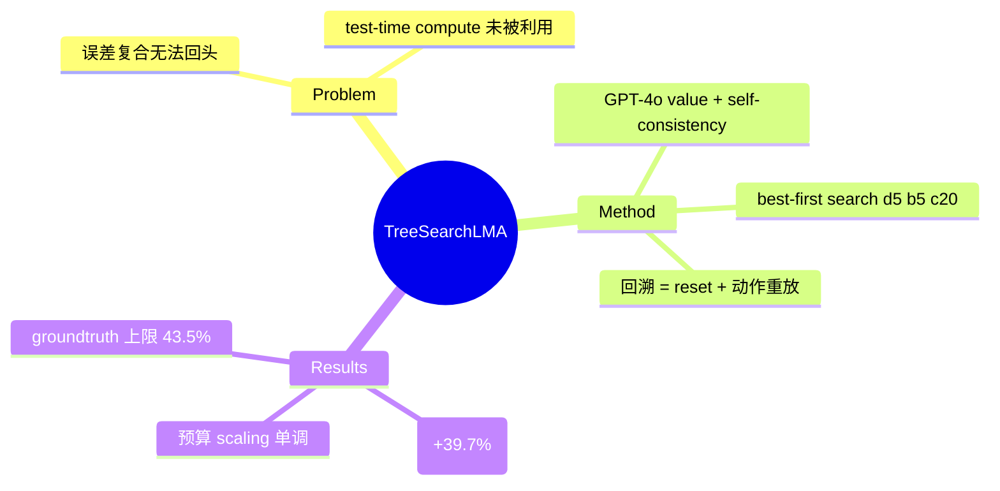

## Summary

首个在真实 web benchmark 上有效的 LM agent inference-time tree search：best-first search + GPT-4o value function（self-consistency n=20），VisualWebArena 18.9%→26.4%（+39.7% 相对）、WebArena 15.0%→19.2%。其 backtracking 实现方式（**reset 环境 + 重放动作序列**）本身就是"环境缺少原生快照/回溯能力"的最直接证据。

## Problem & Motivation

Web 任务的动作空间大、多步误差复合（error compounds with each step），而 LM agent 无法利用 test-time computation 做探索和多步规划——人类在 WebArena/VWA 上 78–89% 成功率，agent 普遍 <20%。借鉴游戏领域 search（AlphaGo）的经验，把经典 best-first search 移植到**真实环境空间**（而非模型想象空间）中执行。

## Method

- **Best-first tree search**（松散类比 A*）：维护 frontier 优先队列，每轮取 value 最高的状态展开，生成 b 个候选动作，结果状态回填 frontier；不满足终止条件则**回溯**到次优状态。默认 d=5（深度）、b=5（分支）、c=20（搜索预算）。
- **Value function**：GPT-4o 输入任务指令 + 轨迹截图 + 历史动作 + URL，输出三分类（Success=1.0 / Progress=0.5 / Failure=0.0），**self-consistency 采样 20 条推理路径取平均**；单次 value 调用比 action 预测便宜 ~2×。
- **Backtracking 实现（关键工程细节）**：环境不提供状态快照，只能"记录到达每个状态的动作序列，回溯时 reset 环境后重放该序列"。不用浏览器 go_back 因为会丢失 scroll offset、已输入文本等页面内状态。依赖环境的 deterministic transition 假设。

## Key Results

- **VWA**: GPT-4o+SoM 18.9%→**26.4%**（SOTA，+39.7% 相对）；**WA**: 15.0%→**19.2%**（+28.0%）。
- **弱模型收益更大**：Llama-3-70B VWA 7.6%→16.7%（**+119.7%**）。
- **搜索预算 scaling**（200 任务子集）：c=0→5→10→15→20 对应 24.5%→32.0%→34.5%→36.0%→37.0%，单调提升未饱和。
- **难度分解**：medium 任务（4–9 步）提升最大（12.7%→22.2%，+75%）。
- **Value function 上限**：groundtruth reward 达 43.5% vs 学到的 37.0%——value 质量是主要 headroom。
- **对比 trajectory reranking**：整轨迹重排 ~7 次后平台在 30%，劣于同预算 tree search——**能剪枝坏分支（回溯）是关键差异**。

## Strengths & Weaknesses

**Strengths**：首次证明 inference-time search 在真实 web 环境可行且随 compute 单调 scaling；value function 的 self-consistency 设计和 groundtruth 上限 ablation 干净；明确暴露了环境端的需求缺口。

**Weaknesses / 边界**：
- **回溯 = reset+replay 是 O(depth) 的昂贵模拟**，且依赖环境确定性——沙盒（WebArena Docker）里勉强可行，live 网站上完全不可行（后被 [[Papers/2411-WebDreamer]] 明确指出）。
- **Destructive actions 未解决**：论文承认下单等不可逆动作"difficult to backtrack from"，只提出分类器/人工规则/value function 惩罚三个方向，均未实现。搜索的额外探索本身放大了危险动作的执行次数。
- c=20 意味着 ~20× LM 调用，wall-clock 代价大（后续 WebDreamer 测得单任务 ~750–970s）。
- 环境需求画像（对 AFE 最有价值的部分）：search 需要 **确定性转移 + 可 reset + 可重放**，而这三者恰是当前 web 环境不原生提供的。

## Mind Map

## Notes

- **对 AFE 的证据价值**：这是"回溯 affordance 需求"的原点论文——agent 侧已证明搜索/回溯有大收益（+39.7%），但只能用 reset+replay 在沙盒里模拟，说明环境端缺一个原生 `checkpoint()/restore()`。[[Papers/2510-WebServ]] 的 block-level snapshot 正是对这个缺口的工程回应；[[Papers/2411-WebDreamer]] 则是绕开缺口的 world-model 路线。
- 后续 WebOperator (2512.12692) 指出本文及 LATS/WebPilot 等都**隐含假设所有动作可逆**，提出 action-aware 安全回溯——需求进一步细化为"环境应显式标注动作可逆性"。
- 与 [[Topics/AgentEnvironment-Survey]] 的 AFE Protocol `recover()` 接口直接对应。
