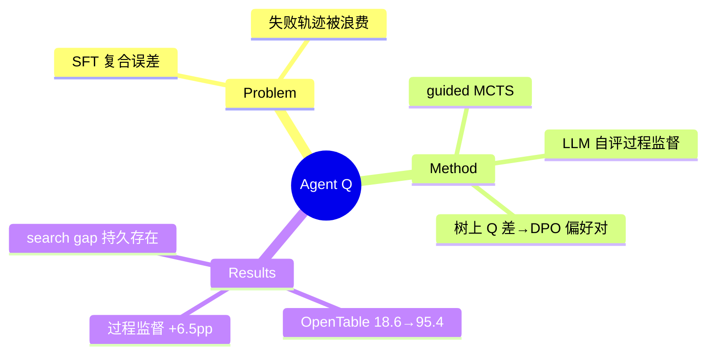

## Summary
guided MCTS（LLM 自评做过程监督）+ 树上 Q 值差构造 step-level 偏好对 + off-policy DPO 训练：WebShop 50.5% 追平人类均值，真实 OpenTable 订位从 18.6% 一天训到 81.7%（+340% 相对），再加 online search 达 95.4%——搜索树既是推理工具也是训练数据工厂的最早完整闭环之一。

## Problem & Motivation
静态专家数据上的 SFT/行为克隆在多步交互环境中复合误差、探索不足。核心思路：让 agent 用 MCTS 自主探索成功与失败轨迹，把树结构里的相对优劣信息转成 DPO 偏好对——同时利用失败轨迹（RFT 只能扔掉失败）。

## Method
- **Guided MCTS over web pages**：节点 = 交互历史 + DOM；base LLM 每节点提 K 个候选动作。**无显式状态恢复机制**——"执行动作后遍历下一页面成为新节点"，前向探索 + 依赖从日志重放轨迹（浏览器可重放假设）。
- **AI 过程监督**：同一 LLM 对候选动作按感知效用排序 → 中间 Q̂ 估计，与 MCTS 经验值线性混合 Q = αQ̃ + (1−α)Q̂。
- **Off-policy DPO**：|Q(h,a^w) − Q(h,a^l)| ≥ θ 的节点级偏好对；replay buffer 存轨迹与生成时 likelihood，免 reference model。

## Key Results
- **WebShop**：xLAM 零样本 28.6% → RFT 31.3% → DPO(outcome) 40.6% → Agent Q 50.5%（+MCTS）≈ 人类均值 50.0%。
- **OpenTable（真实网站）**：LLaMA-3-70B 零样本 18.6% → RFT 67.2% → Agent Q 81.7% → +MCTS 95.4%；GPT-4o 零样本仅 62.6%。
- **过程监督消融**：outcome-only Q 75.2% vs 混合 Q 81.7%（+6.5pp）。
- **搜索开/关的持久 gap**：训练后模型 81.7% vs +搜索 95.4%——蒸馏不完全，test-time search 仍有独立价值。

## Strengths & Weaknesses
**亮点**：(1) MCTS→偏好对→DPO 的完整配方，失败轨迹变成监督信号；(2) 真实网站上的验证 + 数据效率惊人（单日自主数据收集）；(3) "zero-shot vs search 的 gap 训练后依然存在"是关于内化极限的诚实观察（与 [[Papers/2410-ExACT]] EL 恢复 87% 互证）。

**局限**：(1) 作者明确承认 **MCTS 在 live 环境需要大量 risky interaction**，错误可能不可逆（支付、通信、filing），"限制了 Agent Q 能安全部署的网站范围"——live 分支探索的安全天花板自白；(2) critic 冻结；(3) OpenTable 单一站点、评估靠 GPT-4V judge。

对本方向的意义：训练侧用树搜索造数据的开山配方；其安全自白是"为什么需要沙盒/快照引擎支持分支"的最直接证词之一——树搜索的每个分支在真实世界里都是真实副作用。

## Mind Map

## Notes
- 与 [[Papers/2509-TreeGRPO]] 对照：Agent Q 是"离线树→偏好对→DPO"，Tree-GRPO 是"在线树 rollout→组相对优势→GRPO"，隐含同一结构（Tree-GRPO Prop 3.1 证明 intra-tree GRPO ≡ step-DPO）——两代方法的树用法收敛。
