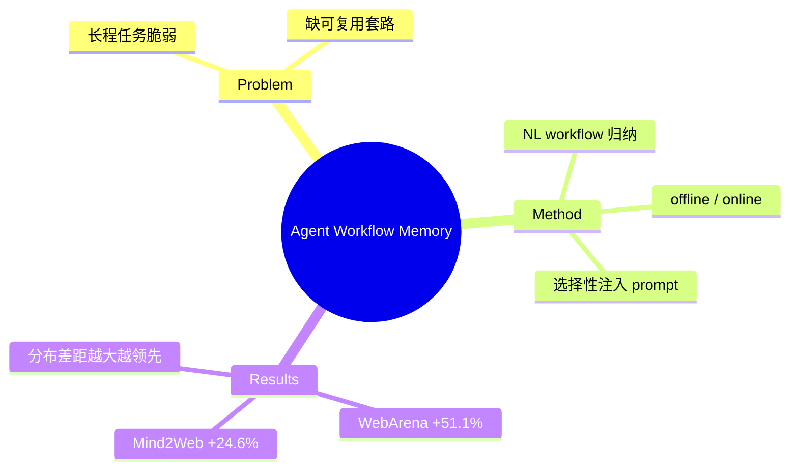

## Summary
AWM 让 web agent 像人一样"从过去经验里归纳可复用的任务 workflow，再用它指导后续动作"——从 agent 轨迹中诱导出自然语言 workflow（常复用的例程），选择性注入 prompt 指导生成，离线/在线均可，在 Mind2Web（+24.6% 相对）和 WebArena（+51.1% 相对）显著提升，且随 train-test 分布差距拉大领先愈明显（+8.9~14.0 绝对点）。

## Problem & Motivation
LLM-based agent 在长程、复杂动作轨迹的任务上仍脆弱。人类能从过往经验中抽出可复用的"任务套路"（workflow）并迁移到新任务，而多数 agent 每次都从零推理。AWM 想给 agent 装上这种"工作流记忆"，把成功经验沉淀为可复用、可选择性调用的中间知识——非参数化的自我改进路线（与 [[Papers/2411-WebRL]] 的参数化 RL 自演化正交互补）。

## Method
**Workflow = 自然语言描述的常复用例程**（"what to do"级别的抽象步骤序列），从 agent 的成功动作轨迹中归纳。

两种模式：
- **Offline AWM**：部署前从 training examples 批量诱导 workflow，构成初始记忆库。
- **Online AWM**：无 labeled 训练数据时，直接从 test queries 的执行中即时诱导 workflow，边做边积累。

运行时按相关性**选择性地**把 workflow 注入 prompt 指导后续 generation，而非把全部记忆塞进上下文——控制 token + 提供针对性引导。

## Key Results
覆盖 Mind2Web + WebArena（1000+ 任务 / 200+ 域，travel/shopping/social）：
- **Mind2Web**：相对成功率 +24.6%。
- **WebArena**：相对成功率 +51.1%，且成功任务步数更少（更高效）。
- **泛化**：online AWM 在 cross-task / cross-website / cross-domain 上稳健，随 train-test 任务分布差距拉大，领先 baseline **+8.9 ~ +14.0 绝对点**——说明 workflow 抽象是可迁移的，而非过拟合。

## Strengths & Weaknesses
**亮点**：(1) 非参数、即插即用、离线在线通吃，工程门槛低；(2) "分布差距越大越领先"是强证据，说明 workflow 记忆真正提升泛化而非记题；(3) 是 web agent memory/self-improvement 路线的奠基工作（ICML 2025），与 [[Papers/2504-SkillWeaver]]（可执行 skill）构成"NL workflow vs executable skill"的经典对照。

**局限**：(1) NL workflow 是"what to do"不可直接执行，与"how to execute"之间仍有 gap（SkillWeaver/ASI 用可执行程序补这端）；(2) workflow 质量依赖底层 agent 的成功轨迹质量，冷启动弱 agent 收益有限；(3) 检索/选择错误的 workflow 可能误导。属 [[Topics/WebAgent-Survey]] 的"Memory 与自我改进"路线。

## Mind Map

## Notes
- 与 [[Papers/2604-GenericAgent]]（context density 记忆）、ReasoningBank（推理记忆）同属非参数记忆家族。
- 关键对照实验设计点：AWM 的"分布差距 vs 领先幅度"曲线可作为衡量"记忆是否提升泛化"的通用诊断。
