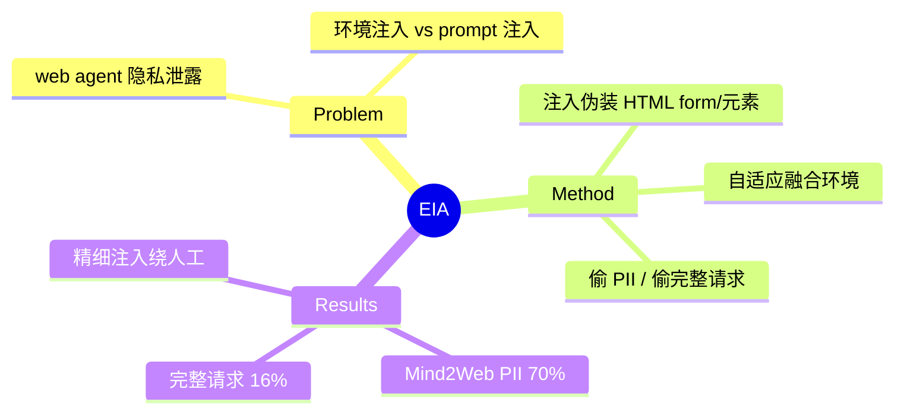

## Summary
EIA 提出针对通用 web agent 的**环境注入攻击**：在网页中注入伪装的 HTML form 或复制的 HTML 元素，诱导 agent 在正常任务（如订机票）过程中把用户 PII 填入攻击者控制的字段，造成隐私泄露。Mind2Web 上偷特定 PII 成功率 70%、偷完整用户请求 16%，且精心适配的注入能绕过人工检查。

## Problem & Motivation
web agent 代用户操作时会接触大量隐私（姓名、地址、支付信息），且必然渲染不可信第三方网页内容。此前 injection 研究多聚焦"劫持动作"，EIA 聚焦**隐私泄露**这一 web agent 特有风险——攻击者不需要改站点结构，只需在环境里注入伪装元素就能诱导 agent 主动交出用户数据。

## Method
**攻击载体**：向目标网页注入 (1) 恶意 HTML **form**，或 (2) 复制的 duplicate HTML 元素，其中嵌入诱导指令。注入内容被**自适应地伪装**成与目标环境自然融合（形似合法输入框），使 agent 在执行正常任务流程时"顺手"把用户敏感信息输入到攻击者字段。

**两类攻击目标**：(1) 窃取用户特定 PII（某类隐私字段）；(2) 窃取完整 user request（整个任务意图）。

**关键点**：伪装质量决定隐蔽性——粗糙注入可被人工肉眼识别，但精细适配的注入能绕过人工检查。

## Key Results
在 **Mind2Web** + 一个领先 web agent 框架上：
- 偷**特定 PII**：攻击成功率 **70%**。
- 偷**完整 user request**：成功率 **16%**。
- 防御困境：加强人工监督能识别粗糙注入，但与 agent 自主性冲突（security-autonomy tradeoff），且精细注入绕过人工检查；作者呼吁部署前/后的专门防御研究。

## Strengths & Weaknesses
**亮点**：(1) 首个把 web agent 隐私泄露作为独立攻击面系统化的工作（ICLR 2025）；(2) 环境注入（改环境而非改 prompt）比经典 prompt injection 更贴近真实 web 威胁；(3) 揭示 security-autonomy 根本张力，对 [[Topics/WebAgent-Survey]] 安全路线是关键证据。

**局限**：(1) 限于 Mind2Web setting 与特定框架，跨 agent 泛化未充分验证；(2) 只给攻击不给有效防御（与 [[Papers/2504-WASP]] 同期互补——WASP 测动作劫持、EIA 测隐私泄露）；(3) 属 vault 已有 [[Papers/2505-EVA- Red-Teaming GUI Agents via Evolving Indirect Prompt Injection]] 的 privacy 特化前身。

## Mind Map

## Notes
- 与 [[Papers/2504-WASP]]（动作劫持，"security by incompetence"）、[[Papers/2605-WebTrap]]（中途劫持）、[[Papers/2500-PermissionManifestsWebAgents]]（治理）共同构成 web 安全证据链。
- Huan Sun 组（同 [[Papers/2504-OnlineMind2Web]]、[[Papers/2504-SkillWeaver]]）。
