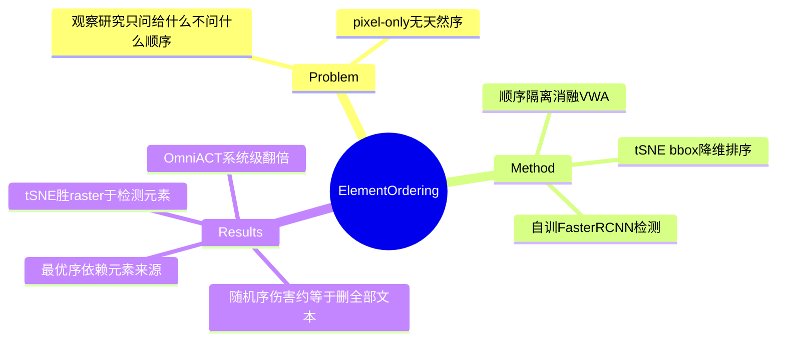

## Summary

证明 UI 元素在文本表示中的**呈现顺序**对 agent 性能有出人意料的巨大影响：随机打乱顺序使 VisualWebArena 成功率近乎腰斩（GPT-4V 74.07→44.44%、Gemini 64.03→37.04%），伤害与删除全部可见 HTML 文本相当——"删除顺序信息比删除任何其他单一属性伤害都大"。无 DOM 的 pixel-only 场景下，对检测元素 bbox 坐标做 t-SNE 2D→1D 降维排序优于 raster 扫描序；配自训 Faster-RCNN 检测器在 OmniACT 上 action score 翻倍（11.60→23.34）。

## Problem & Motivation

Agent 的观察表示研究集中在"给什么内容"（剪枝、压缩、属性选择），"**以什么顺序给**"从未被隔离测量。Web 有 DOM pre-order 天然序，desktop/pixel-only 没有——如果顺序真的重要，无结构环境就需要一个排序方案。这把 observation 设计从内容轴扩展出编排轴：顺序本身携带层级/功能分组信息。

## Method

- **顺序隔离消融**（VisualWebArena "easy" 子集——原 agent 成功的任务，GPT-4V 复现 baseline 74.07%±5.56%）：固定 screenshot+SoM+文本表示，只动文本中元素的排列或单一属性。
- **Pixel-only 排序**（OmniACT，177 截图/2,021 任务）：元素来自自训 Faster-RCNN（ResNet-50，67,530 可交互元素/1,468 Common Crawl 页）+ EasyOCR；对照 random / raster（左→右上→下）/ **t-SNE**（bbox 坐标 ⟨x,y⟩→z 一维化，保留局部结构≈功能分组）。
- 模型：GPT-4V、Gemini 1.5 Pro、Llama3-70B（VWA）/8B（OmniACT）。

## Key Results

- **顺序 > 任何单一内容属性**（Table 2，Gemini）：随机顺序 64.03→**37.04**；删全部可见文本（interactable+static）→35.18（"similar"，删文本略更狠）；删 captions →46.30；删 tag →61.11；删 alt text →68.15（无伤害）。GPT-4V 随机顺序 74.07→44.44。
- **Pixel-only**（Table 4，检测元素）：t-SNE > raster > random 全模型成立（Gemini 47.16/45.21/39.59；GPT-4V 49.18/47.38/44.63；Llama3-8B 24.61/21.58/18.88）。
- **最优序依赖元素来源**：人工标注 bbox 时 raster 反超 t-SNE（Gemini 61.04 vs 59.17，GPT-4V/Llama3 同向）——检测元素多一倍且噪，t-SNE 的局部结构保留才占优。
- **OmniACT**：ours GPT-4V 23.34 / Gemini 22.86 vs 前 SOTA（GPT-4）11.60 action score（>2×）；但 **sequence score 上 baseline 反而更高**（32.75 vs 30.47），且方法与 baseline 有五处同时差异（检测器/顺序/动作空间/可交互标注/多模态）——翻倍不能单独归因 ordering。
- **同设置内上限**：VWA ground-truth DOM 下 t-SNE 排序（44.44/61.11）仍远低于 pre-order（64.03/74.07）——结构信息给出的序无法被几何降维完全恢复。
- 元素数越多（高于中位数）ordering 影响越大。

## Evidence Ledger

| Claim ID | Claim | Type | Source locator | Evidence excerpt | Status |
|:--|:--|:--|:--|:--|:--|
| C1 | VWA easy 子集（baseline 74.07±5.56）+ OmniACT 2,021 任务；GPT-4V/Gemini 1.5/Llama3-70B·8B | benchmark-setting | §Setup | "tasks marked as 'easy'" | source-verified（Llama3 尺寸按 benchmark 分开） |
| C2 | 随机顺序 64.03→37.04 / 74.07→44.44；与删全部文本（→35.18）相当；"harms more than any other attribute" | number | Table 2; Abstract | "similar performance drop to removing all HTML text" | source-verified（"相当"非"更大"：35.18 略低于 37.04） |
| C3 | 属性消融：captions 46.30 / alt 68.15 / tag 61.11 | number | Table 2 | Gemini rows | source-verified（GPT-4V 删 tag 也是 61.11，降幅更大） |
| C4 | Pixel-only：t-SNE/raster/random 九个数字；t-SNE = bbox ⟨x,y⟩→z | number | Table 4 | "g:⟨x,y⟩→z" | source-verified |
| C5 | 人工 bbox 时 raster 反超（61.04 vs 59.17，三模型同向）；因检测元素约 2× 多且噪 | number | Table 4 | "Raster ordering performs the best with human annotated" | source-verified |
| C6 | Faster-RCNN ResNet-50；67,530 元素/1,468 Common Crawl 页 | benchmark-setting | §Detection | "67,530 interactable elements over 1468" | source-verified |
| C7 | OmniACT 23.34/22.86 vs 11.60（>2×）；五处同时差异；sequence score baseline 反高（32.75 vs 30.47） | comparison | Table 6 | "more than two times as many tasks" | source-verified（多因素归因限制已注明） |
| C8 | 元素数越多影响越大；同设置内 t-SNE 仍远低于 DOM pre-order（VWA：44.44/61.11 vs 64.03/74.07） | number | Fig 2/3; Tables 2,4 | "impact … increases with element count" | source-verified（初稿跨数据集比较被 verifier 指出不成立，已改为同设置内对照） |

## Strengths & Weaknesses

**Strengths**：
- 第一个把"顺序"从观察表示中隔离出来的消融，且效应量惊人——顺序扰动 ≈ 删除全部文本，直接证伪"observation reduction/表示设计只是内容与成本问题"（[[Reports/2026-07-27-WebAgent-RL-and-Context-Landscape]] §4 争议行的证据）：**编排本身就是内容**。
- "最优序依赖元素来源质量"（raster vs t-SNE 反转）是超出直觉的二阶发现，说明排序方案不能脱离检测器选型。
- 在 easy 子集上做消融（原 agent 能做对的任务）设计聪明：排除任务本身太难的混淆，观察到的下降全是表示伤害。

**Weaknesses / 边界**：
- OmniACT 翻倍是**系统级**改进（五处同时差异），ordering 的单因素贡献只能从 Table 4 内部对照读出（random→t-SNE 约 +5-8pp），不能引用"2×"归因给 ordering；sequence score 上还输给 baseline。
- 2024 年论文：模型代际旧（GPT-4V/Gemini 1.5），强推理模型对顺序扰动是否同样脆弱未知——与 [[Papers/2604-ReadMoreThinkMore]] 的"能力×表示"交互问题同构，顺序敏感性可能也是 regime 依赖的。
- VWA 消融基于 easy 成功子集，效应量在全难度分布上可能不同。

**对领域**：把 element ordering 确立为观察设计的一等变量；为 pixel-only/desktop 场景给出可用的 t-SNE 排序方案；accessibility tree 的 pre-order 序被证明是其最有价值的隐含资产之一——对 AFE 方向，"环境应暴露结构序"是比"暴露更多属性"更便宜且更关键的 affordance。

## Mind Map

## Notes

- 入队来源：[[Reports/2026-07-27-WebAgent-RL-and-Context-Landscape]] 交叉轴主线 top-10 第 5（"表示编排 vs 内容"）。context 线（本批 5 篇）至此清完。
- 对 CUA-Survey §4.5/§6.7.1（observation 通道选型）：本篇补上"编排轴"——现有小节只讨论通道与内容（AXTree vs screenshot、剪枝与否），顺序作为独立变量未被覆盖；"顺序扰动 ≈ 删全部文本"应作为 observation 表示的基线事实并入。
- 与 [[Papers/2605-A11yCompressor]]（规则重构 AXTree）潜在互动：重构类方法若改变元素顺序，可能在不知情中付出本篇测量的代价——重构方案应报告顺序保持性。
