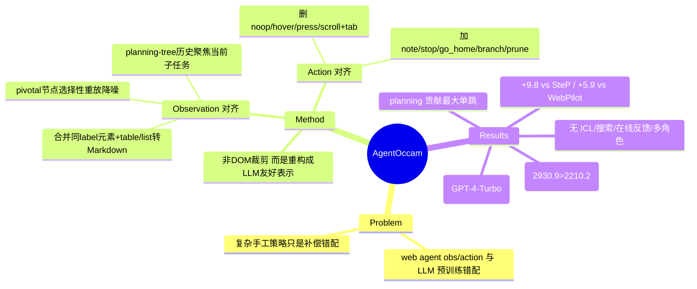

## Summary
AgentOccam 指出既有 LLM web agent 的性能瓶颈在于 observation/action space 与 LLM 预训练分布错配，通过把动作空间对齐到 LLM 擅长的操作、把网页观察重构成 LLM 友好表示（而非仅裁剪 DOM），在不使用 in-context examples、额外 agent 角色、在线反馈或搜索策略的前提下，把 WebArena 成功率做到 43.1%。该分数超过此前 SOTA（SteP 33.3%）9.8 个绝对点（+29.4%）、超过并行工作（WebPilot 37.2%）5.9 点（+15.8%）。

## Problem & Motivation
LLM 主要在语言补全上预训练，缺乏对 embodied 导航动作（scroll、hover 等）与符号化 web 元素的原生表示能力。既有 web agent 把浏览器原始动作集与冗长的 accessibility tree / DOM 直接喂给 LLM，造成表示错配；为弥补错配，社区转向复杂手工策略：任务专用 policy（SteP）、in-context 示例、显式搜索（WebPilot）、多 agent 角色与在线反馈。作者的立论是：这些附加机制是在补偿 representation 层面的错配，如果先把 observation/action space 对齐到 LLM 的能力边界，一个简单 baseline 就能超过这些复杂系统——即“对齐胜过加机器”。

## Method
AgentOccam 的核心不是新增能力，而是两侧对齐（action space + observation space），外加一个轻量规划结构。base LLM 为 GPT-4-turbo-2024-04-09。

**Action space 对齐**（把动作集对齐到 LLM 能可靠推理的操作）：
- 移除 LLM 难以做 embodied 推理的动作：`noop`、`hover`、`press`、`scroll`；以及实际很少有用的 `tab_focus`、`new_tab`、`go_forward`、`goto` 等 tab/导航动作。移除 scroll 意味着一次性加载整页而非分屏滚动。
- 新增贴合 LLM 语言能力的动作：`note [content]`（记录观察）、`stop [answer]`（给出答案收尾）、`go_home`（回主页）、以及规划动作 `branch [id] [intent]` 与 `prune [id] [reason]`。
- 精简后保留一个小核心动作集（click / type / go_back / note / stop / go_home / branch / prune）。

**Observation space 对齐**（关键点：重构成 LLM 友好表示，而不是简单裁剪 DOM）：
1. Web 元素简化——把与交互元素共享同一 label 的 function-descriptive 元素（如 `StaticText 'My Account'` 与 `link 'My Account'`）合并去重；把 table / list 块转成 Markdown，消除重复的结构性 token。目的是让页面表示更接近 LLM 预训练里见过的自然文本/Markdown 形态。
2. Selective replay via pivotal nodes——agent 在行动时标记与任务相关的 pivotal 节点；后续 context 只保留这些 pivotal 节点及其 ancestor（全局层级/位置）、sibling（近邻上下文）、descendant（细节属性）节点，从而降低历史观察的数据量与噪声。
3. Planning-tree history——当 `branch` 创建新子计划时，旧计划下的历史步骤被从当前 context 排除，让 LLM 聚焦当前子任务。

值得强调：这套 observation 优化的目标是**降噪与表示对齐**，不是净 token 压缩。按 Table 4（gpt2 tokenizer 计的每步平均 observation token），单独移除非必要动作会把每步观察从 vanilla 的 2210.2 降到 1652.0，但为去掉 scroll 而整页加载、再叠加规划历史后，最终 AgentOccam 每步观察反而升到 2930.9——高于 vanilla。所以增益来自“喂给 LLM 的是更对齐、更少噪声的表示”，而非“更短的输入”。

## Key Results
- **WebArena（812 任务）主结果**：AgentOccam 43.1%（GPT-4-Turbo）；对比 WebArena 原始 agent 复现 16.5%、SteP 复现 33.3%、WebPilot 37.2%。相对此前 SOTA SteP +9.8 点（+29.4% 相对），相对并行工作 WebPilot +5.9 点（+15.8% 相对）。
- 达成上述成绩**不依赖** in-context examples、新增 agent 角色、在线反馈或搜索策略——这是它与所有对比 baseline 的关键区别。
- **消融（Figure 5）**：从 vanilla 16.5% 逐步叠加对齐组件到 43.1%；其中 planning（branch/prune）带来最大的单步跃升。逐步中间值（约 26.1% → 26.5% → 28.6% → 31.8%，随移除动作 / 禁用滚动 / 简化观察 / 选择性历史递进）为 Figure 5 图读近似，非表格精确值。
- **规划动作使用统计（Table 3）**：全部 WebArena 任务中 branch 被用 34 次、prune 47 次。
- **叠加实验（Table 6）**：AgentOccam + Judge（LLM 评估候选动作）升到 45.7%；AgentOccam + SteP 的任务专用策略反而降到 41.1%（说明 task-specific 策略损害泛化）。
- 代价侧：AgentOccam 平均步数比 vanilla 更多（约 9.0 vs 6.2 步），每步观察 token 也更高（见 Method）。

## Evidence Ledger

| Claim ID | Claim | Type | Source locator | Evidence excerpt | Status |
|:--|:--|:--|:--|:--|:--|
| C1 | AgentOccam（GPT-4-Turbo）在 WebArena 总体成功率 43.1% | number | Table 2 / Abstract | "43.1%" overall WebArena success for AgentOccam | source-verified |
| C2 | 超过此前 SOTA SteP（33.3%）9.8 点（+29.4%） | comparison | Abstract / Table 2 | SteP 33.3%; +9.8 abs, +29.4% rel (43.1−33.3=9.8) | source-verified |
| C3 | 超过并行工作 WebPilot（37.2%）5.9 点（+15.8%） | comparison | Abstract / Table 2 | WebPilot 37.2%; +5.9 abs, +15.8% rel | source-verified |
| C4 | WebArena 原始 agent 复现基线为 16.5% | number | Table 2 / Figure 5 | vanilla WebArena baseline "16.5%" | source-verified |
| C5 | 动作空间移除 noop/hover/press/scroll + tab_focus/new_tab/go_forward/goto，新增 note/stop/go_home/branch/prune | benchmark-setting | Sec. Action space | removed "noop, hover, press, scroll..."; added "note, stop, go_home, branch, prune" | source-verified |
| C6 | 观察对齐：合并共享 label 的描述性+交互元素、table/list→Markdown、pivotal 节点及其 ancestor/sibling/descendant 选择性重放 | causal-mechanism | Sec. Observation space | "merge function-descriptive...share the same label"; "convert table and list...Markdown"; keep pivotal "ancestor...sibling...descendant" | source-verified |
| C7 | Table 4（gpt2 tokenizer）每步平均观察 token：vanilla 2210.2，移除动作后 1652.0，最终 AgentOccam 2930.9（净观察不比 vanilla 短） | number | Table 4 | "Vanilla 2210.2 \| Remove Actions 1652.0 \| AgentOccam 2930.9" | source-verified |
| C8 | 不使用 in-context examples / 新 agent 角色 / 在线反馈 / 搜索策略 | benchmark-setting | Abstract | "without using in-context examples, new agent roles, online feedback or search strategies" | source-verified |
| C9 | base LLM 为 GPT-4-turbo-2024-04-09 | benchmark-setting | Sec. Experimental setup | base LLM "GPT-4-turbo-2024-04-09" | source-verified |
| C10 | +Judge → 45.7%；+SteP → 41.1% | number | Table 6 | "AgentOccam + Judge 45.7 \| AgentOccam + SteP 41.1" | source-verified |
| C11 | branch 用 34 次、prune 用 47 次 | number | Table 3 | "Branch 34 \| Prune 47" | source-verified |
| C12 | 消融从 16.5% 增至 43.1%，planning 带来最大单步跃升（中间逐步值为 Figure 5 图读近似，无编号表精确值） | number | Figure 5 | endpoints "16.5%...43.1%" + stage order confirmed; intermediates graphical, 非精确表值 | source-verified（端点/顺序）；中间值 = 图读边界 |

## Strengths & Weaknesses

**Strengths**
- Taste 上很对：simple, scalable, generalizable。用“对齐 observation/action space”这一简单干预，超过 SteP（任务专用 policy）、WebPilot（搜索）等更复杂系统，且不需要 in-context 示例/搜索/多角色，实证支持了“错配才是瓶颈、加机器是在补偿”的假设。
- 增益归因清晰可拆：移除 LLM 不擅长的 embodied 动作 + 加入 LLM-native 动作（note/branch/prune）+ 把页面重构成 Markdown/降噪表示。消融显示 planning-tree 贡献最大单跳。
- 对“observation 优化 = 省 token”这一常见直觉给出反例：Table 4 显示最终每步观察反而更长（2930.9 > 2210.2），说明真正起作用的是**表示对齐与降噪**，不是压缩长度——这是本 vault“观察表示优化”方向的重要校正性证据。
- 泛化信号：+SteP 的任务专用策略反而掉点，暗示 task-specific 手工策略与泛化对齐是此消彼长。

**Weaknesses / 边界**
- 单一强模型（GPT-4-Turbo）承载大部分结论；换弱模型（如 Gemini-1.5-Flash）成绩显著下滑（附录报告约 33.7% 的开发子集分数，未纳入本核查主结果），方法收益对底座能力的依赖度未充分刻画。
- WebArena 是半合成、可复位的沙盒站点；WebVoyager 等真实站点上的增益相对温和，观察对齐在动态/反爬/视觉密集真实网页上的鲁棒性存疑。
- 代价被主结果弱化：步数更多（约 9.0 vs 6.2）、每步观察 token 更高，效率/成本侧不是净优。
- pivotal-node 选择性重放依赖 agent 自己正确标记关键节点；一旦早期标错，后续 context 会系统性丢失信息，failure mode 未深入分析。
- 消融中间值来自 Figure 5 图读，缺少精确数值表，逐组件贡献的精确量化有不确定性。

**对领域的意义**：为 web/GUI agent 提供了一个“先把表示对齐到 LLM，再谈复杂策略”的强 baseline 与方法论锚点；它把注意力从“更聪明的 search/planning 外挂”拉回到“observation/action representation 本身”，是观察表示优化方向的代表性参照。

## Mind Map

## Notes
- 反直觉点值得记：本 vault“观察表示优化”方向常默认“优化=省 token”，AgentOccam 是明确反例——真正的杠杆是**表示对齐 + 降噪**，长度可以不减甚至增加。后续做 obs 压缩类工作时应把“对齐/降噪”与“长度压缩”两个目标分开评估。
- 待查/可延伸：pivotal-node 标注错误的级联失败率、方法对弱底座（open-source LLM）的迁移、以及在纯视觉（screenshot-only）observation 下同样的“对齐”思路是否成立（本文主要是 accessibility-tree/text observation）。
- venue 仅按 arXiv 元数据填写；如需确认是否有会议接收（ICLR 等）应另行核实，本次未获得来源确认，故未标注。code 链接本次抓取未在来源中确认，留空以免臆造。
