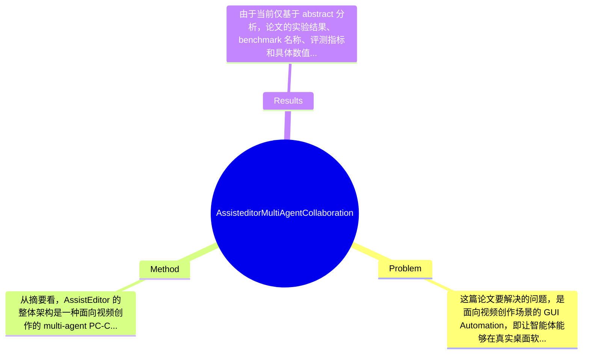

## Summary
AssistEditor 针对视频创作中的 GUI workflow automation 问题，提出了一个由多个 GUI agents 协作的 PC-Copilot 系统，使用户只需描述视频内容与风格并上传素材，系统即可自动将高层需求分解为 storyboard 规划、视频理解模型调用与专业剪辑软件操作等具体步骤；根据摘要，论文的主要贡献在于把传统面向短流程 GUI assistance 的方法扩展到更长链条、更开放式的视频编辑任务，但具体效果数字与 benchmark 指标在当前摘要中未提供。

## Problem & Motivation
这篇论文要解决的问题，是面向视频创作场景的 GUI Automation，即让智能体能够在真实桌面软件环境中完成从需求理解、素材组织到最终剪辑输出的一整套工作流。它属于 Human-AI Interaction、GUI Agent、Multimodal Video Editing 和 Agentic Systems 的交叉领域。这个问题重要的原因在于，视频编辑并不是单一步骤任务，而是一个典型的长程、层级化、强依赖上下文的 workflow：用户需求往往是模糊的高层表达，例如“做一个科技感强、节奏快的产品宣传片”，而真正落地时需要经历脚本拆解、镜头挑选、时间线编排、转场、字幕、风格统一等多个环节。现实中，这类工作既耗时，又高度依赖 Premiere Pro 等专业软件的操作经验，因此自动化价值很高。

现实意义主要体现在三个方面。第一，它能显著降低视频制作门槛，让非专业用户也能借助自然语言完成复杂编辑。第二，它有望提高内容生产效率，适用于短视频营销、教育视频、企业宣传、个人创作等高频场景。第三，相比只回答“怎么做”的辅助型 Copilot，真正能“代做”的 GUI agent 更接近生产力工具的终极形态。

现有方法的局限在摘要中也被点出。其一，已有 GUI Agent 更多处理 short-procedure tasks，例如 element grounding 或局部功能辅助，难以覆盖视频编辑这种多阶段、跨软件、目标不断细化的复杂任务。其二，很多系统仍依赖用户给出明确而细粒度的操作命令，本质上只是把命令接口从按钮换成自然语言，并没有解决从高层创意需求到低层执行动作的鸿沟。其三，传统 GUI automation 往往缺乏多角色协作，难以同时兼顾需求澄清、知识检索、内容规划和软件执行。

论文动机是合理的：如果要让电脑真正成为视频创作助手，就必须把“高层意图理解”与“底层 GUI 执行”连接起来，而单一 agent 很难稳定处理这一长链任务。其关键洞察在于引入 multi-agent collaboration，让不同 GUI agents 分工承担用户交互、storyboard 生成、编辑执行等职责，通过角色分化降低任务复杂度，并把视频理解模型与专业编辑软件共同纳入统一工作流。

## Method
从摘要看，AssistEditor 的整体架构是一种面向视频创作的 multi-agent PC-Copilot。其核心思路不是让一个通用 agent 直接操纵整套视频编辑流程，而是把任务拆成多个具有明确职责的 GUI agents：有的负责与用户对话、补全需求；有的负责检索知识并将模糊创意转化为 storyboard；有的则调用视频理解模型并操作专业软件如 Premiere Pro，最终生成成片。整个系统的本质，是一个“从自然语言创意到 GUI-level executable actions”的层级式任务编排框架。

关键组件可以从摘要中归纳为以下几类：

1. 用户交互与需求收集 agent
该组件的作用是把用户最初的高层描述变成可执行的编辑约束。用户不需要输入诸如“导入素材”“加转场”这类显式命令，只需描述视频内容、风格并上传素材。这一设计动机非常明确：真实用户更擅长表达创作意图，而不是软件操作序列。与以往 command-based GUI assistant 的区别在于，它不是被动执行指令，而是主动澄清需求、补足缺失信息，承担了 task specification 的工作。摘要提到 agents 具备 dialogue 能力，因此这一模块很可能通过多轮对话收集视频主题、目标受众、风格偏好、时长限制等信息，但具体对话策略、prompt 设计和状态管理方式，论文摘要未提及。

2. Storyboard 生成与高层规划 agent
这一组件负责把抽象需求转化为视频结构化规划，例如镜头顺序、叙事节奏、视觉风格、素材分配等。它的作用相当于在“创意层”和“执行层”之间建立中间表示。设计动机在于，视频编辑任务天然具有层级性：如果没有 storyboard 这样的中间规划，agent 很容易直接在 GUI 层面陷入局部决策，导致时间线混乱、风格不一致。与传统 GUI automation 最大的区别是，这里强调先规划再执行，而不是边看界面边反应式点击。摘要没有说明 storyboard 是文本形式、时间线脚本形式，还是带 shot-level annotation 的结构化表示，这属于论文未提及的信息。

3. 知识检索与软件使用 agent
摘要指出每个 agent 都具备 knowledge retrieval 和 software usage 能力，这意味着系统并非只依赖静态模型参数，而是可能在执行前查询软件功能、编辑规范或任务相关知识。这个设计很关键，因为专业视频软件如 Premiere Pro 功能复杂、界面状态多变，纯粹靠语言模型记忆常会出错。加入知识检索的动机，是降低 hallucination 和操作路径错误的概率。它与已有方法的区别在于，不再把 GUI automation 视作单纯的视觉 grounding，而是把外部知识作为完成复杂软件任务的必要支撑。不过，检索源是什么、是 RAG 还是内置知识库、如何与 GUI observation 融合，摘要没有交代。

4. 编辑执行 agent
这是最接近底层操作的一层，负责把 storyboard 和规划转译成对视频理解模型及 Premiere Pro 等软件的实际控制动作。这里的关键在于“双重调用”：一方面控制 video understanding models 处理素材内容，另一方面驱动专业编辑软件完成导入、裁剪、拼接、可能的字幕或风格化操作。设计动机是让 agent 不只是看界面点按钮，而是把内容理解和软件操作结合起来，这一点对视频编辑尤其重要，因为素材选择本身依赖语义理解。与以往只做 element grounding 的系统相比，这里任务更长、更开放，也更依赖跨模块协同。

5. 多 agent 协作机制
摘要中最重要的方法创新点就是 collaborative AI agent framework。其作用是把复杂长流程拆解给多个具有 distinct roles 的 agents，以减少单智能体的上下文负担与决策混乱。设计动机合理：视频编辑工作流涉及需求理解、规划、内容理解、执行四类不同性质的问题，统一在一个 agent 内处理容易导致角色冲突。与现有系统相比，区别不在于“用了 agent”本身，而在于通过角色分工把 open-ended creative task 映射到可管理的子任务链。

从技术细节角度看，摘要只提供了框架层信息，没有给出模型结构、action space、GUI grounding 方法、训练策略、是否使用 closed-source LLM/VLM、是否采用 trajectory imitation 或 reinforcement learning，这些都属于论文未提及。就设计选择而言，多 agent 分工看起来是较为核心且“必须”的，因为这是论文的主要卖点；但 storyboard 形式、检索机制、执行器是否统一为一个 controller，理论上都存在替代方案。简洁性方面，方法概念上是清晰的：高层需求理解—中层规划—低层执行。但也要警惕其可能存在一定程度的系统工程堆叠，因为摘要中同时引入 dialogue、retrieval、software usage、video understanding 与多 agent orchestration，若缺少强有力的模块边界与消融支撑，就可能显得 more engineering-driven than algorithmically elegant。

## Key Results
由于当前仅基于 abstract 分析，论文的实验结果、benchmark 名称、评测指标和具体数值均未获取，因此不能捏造任何数字。严格来说，摘要只声称该方法“significantly streamlines the video editing process, making advanced editing accessible to users with varying levels of expertise”，这是一种定性结论，而非可核验的量化结果。换言之，现阶段我们只能确认作者宣称系统能够显著简化视频编辑流程，并提升不同熟练度用户的可用性，但无法判断其幅度、统计显著性和与 baseline 的差距。

按照正常论文评测范式，这类系统理论上应包含至少三类核心实验。第一类是端到端任务完成实验，例如给定用户需求与素材，比较 AssistEditor 与单 agent、人工脚本 automation 或传统 GUI assistant 在 success rate、task completion time、人工评分上的表现。第二类是模块级评测，例如 storyboard 质量、素材选取准确性、GUI 操作成功率。第三类是用户研究，检验不同技能水平用户在使用系统后的视频制作效率、满意度和学习成本是否改善。但这些是否真正出现在论文中，摘要没有说明。

Benchmark 详情方面，摘要未提及是否构建专用 video editing benchmark，也未说明评估是在真实 Premiere Pro 环境、模拟环境还是录制轨迹环境中进行。指标如 edit quality、workflow success rate、human preference、execution accuracy、latency 等都属于可能但未证实的信息。对比分析方面，摘要提到 previous works 主要处理 short-procedure tasks，因此若正文实验充分，理应会和现有 GUI agent baseline、甚至单智能体版本 AssistEditor 进行比较；但具体提升百分比，论文摘要未提供。

消融实验同样无法确认。一个合理的消融应包括：去掉多 agent 协作、去掉 storyboard 规划、去掉 knowledge retrieval、去掉用户澄清对话，分别观察性能变化。若论文没有这些消融，那么其“多 agent 是必要的”这一主张会比较弱。实验充分性目前无法正面判断，只能批判性指出：在没有量化结果的情况下，摘要更像是系统介绍而不是严格证据展示。是否存在 cherry-picking 也无法定论，因为摘要仅给出正面结论，没有展示 failure cases、难例、长视频场景或复杂多素材场景下的失败情况。

## Strengths & Weaknesses
这篇工作的主要亮点，第一，是它把 GUI Automation 从传统的短步骤桌面操作扩展到视频编辑这种长链、开放式、创意驱动的复杂 workflow。这个问题设定本身就比“找按钮并点击”更有挑战，也更有实际价值。第二，它强调 multi-agent collaboration，而不是单一 agent 暴力解决所有问题；从系统设计上看，这种角色分化符合视频编辑任务天然的层级结构，理论上更利于稳定性和可解释性。第三，它把视频理解模型与专业软件操作结合到同一 pipeline 中，这意味着系统不只是“会点软件”，还尝试“理解素材并做内容决策”，这是与一般 GUI agent 的关键区别。

局限性也很明显。第一，技术上这是一个高度系统化、跨模块依赖极强的方法，任何一个环节——需求澄清错误、storyboard 不合理、GUI 操作失败、素材理解偏差——都可能导致最终视频质量下降。多 agent 并不必然带来鲁棒性，有时也会引入更高的协调成本。第二，适用范围可能受限于特定软件、特定工作流和相对模板化的视频生产任务。对于需要强艺术创造力、精细特效、复杂人工审美判断的场景，这类系统很可能只能做到辅助而非替代。第三，计算与部署成本可能较高，因为系统同时涉及 dialogue、retrieval、video understanding 和 GUI control，实际运行时延、API 成本、桌面环境兼容性都可能成为瓶颈，但摘要没有提供资源消耗数据。

潜在影响方面，这项工作如果做得扎实，可能推动两个方向：一是 GUI agents 从单步操作走向完整生产力工作流；二是 AI video creation 从“生成视频片段”扩展到“自动完成真实剪辑软件中的后期制作”。这对内容生产工具、智能办公和创意软件生态都有启发。

严格区分信息来源：已知信息包括：论文提出了 AssistEditor；它是一个 multi-agent collaborative GUI agent framework；目标是自动化视频编辑 workflow；支持用户仅通过描述需求和上传素材来驱动系统；系统可控制 video understanding models 和 Premiere Pro 等专业软件。推测信息包括：系统可能采用层级任务分解、RAG 式知识检索、多轮澄清对话和某种 GUI grounding/execution pipeline；其适合半结构化视频制作任务。不知道的信息包括：具体模型架构、训练方式、评测数据、失败案例、资源开销、对不同视频类型的泛化能力，以及是否真的显著优于强 baseline。综合来看，这是一篇有参考价值的系统型工作，但在未读全文的前提下，还不足以判断其是否构成该方向的决定性突破。

## Mind Map

## Notes
<!-- 其他想法、疑问、启发 -->
