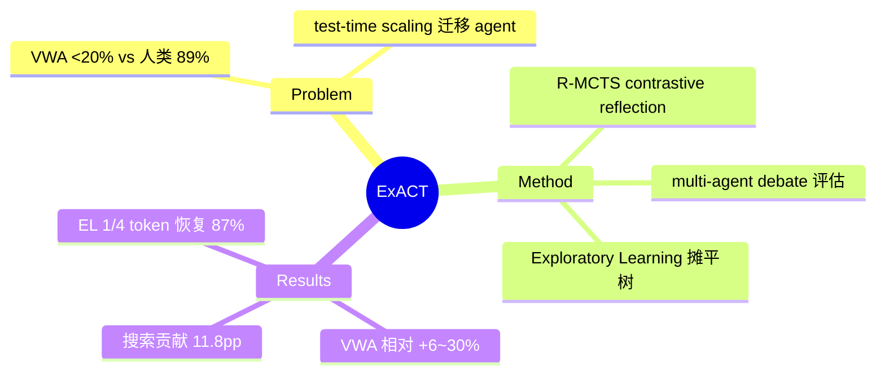

## Summary
R-MCTS（contrastive reflection + multi-agent debate 状态评估）把 VisualWebArena SOTA 相对提升 6-30%，再用 **Exploratory Learning** 把搜索树摊平成单轨迹微调 GPT-4o——教模型在无搜索算法支持下自主 explore/evaluate/backtrack，以 1/4 token 恢复 R-MCTS ~87% 性能。

## Problem & Motivation
GPT-4o 级 VLM 在 VWA 上成功率 <20%（人类 89%）。o1 证明 test-time compute scaling 对长程推理有效，本文问：该原理能否经由搜索算法迁移到 agentic 任务？以及能否把搜索能力**内化**进模型，摆脱对外部搜索基建的依赖？

## Method
**R-MCTS**（test-time）：
- **Contrastive reflection**：用 |V(o_{t+1}) − Q(o_t,a_t)| 定位最错误的动作 → prompt VLM 对比预期与实际结果归因 → 反思存入向量库，未来相似任务检索复用。跨任务持续改进搜索质量。
- **Multi-Agent Debate 状态评估**：多个 VLM 生成对立论证，judge VLM 聚合——替代单点 value 估计。
- 环境状态处理：论文未显式解决状态恢复——MCTS 作用于 observation 序列，reflection 阶段重放 trajectory 而非状态回滚（沙盒 VWA 里 reset+replay 可行）。

**Exploratory Learning**（training-time，本文最独特贡献）：
- Imitation Learning：只在搜索选出的最终动作上微调（丢弃搜索树）。
- EL：重放整个搜索过程，把树遍历（观察、探索/回退的动作、value 估计）**摊平成单条轨迹** a←(v,a)，训练模型学会"探索→评估状态→发现死路→回退到可行状态"的完整行为模式。

## Key Results
- **R-MCTS-MAD on VWA**：Classifieds 41.0%（前 SOTA Search Agent 33.8%）、Reddit 28.7%（21.9%）、Shopping 32.3%（30.3%）；代价 7.4-10.1× token。
- **消融**（910 任务全量）：full 33.7% → 去 value reflection 32.9% → 去 policy reflection 30.2% → 去搜索（ReAct）21.9%。**搜索本身贡献 ~11.8pp**，reflection 合计 ~3.5pp。
- **EL**（234 Classifieds 任务）：IL 31.2%（恢复 97.2%）、EL 27.8% 总体 / unseen 任务恢复 ~87%，token 减至 1/4；**EL 的 test-time scaling 曲线优于 IL**——允许更多步数时 EL 持续提升（学会了搜索行为），IL 平缓。
- 训练侧 scaling：搜索预算 2→15 节点，R-MCTS 相对 ReAct 增益单调升至 66%。

## Strengths & Weaknesses
**亮点**：(1) 首个系统验证"**搜索行为可以被蒸馏进模型**"的 web agent 工作——backtracking 从运行时算法变成模型内化能力，开辟第三条路线（引擎支持 / agent 模拟之外：模型自带）；(2) reflection 数据库让 test-time search 有跨任务记忆；(3) 搜索 vs reflection 的贡献分解干净。

**局限**：(1) ~10× token 成本，作者自己把出路指向"用搜索造训练数据"；(2) 长轨迹训练难（长树遍历 costly & hard to learn）；(3) 错误主要来自 VLM 看不懂截图（视觉瓶颈），搜索救不了感知；(4) EL 恢复的是 87% 而非超越——**内化的搜索上限仍是外部搜索**。

对本方向的意义：EL 是"training-time trajectory generation 受益于 branching"的直接证据（搜索树 → 训练数据），且给出内化路线的收益/天花板刻度。与 [[Papers/2511-DreamGym]]（合成经验替代真实分支）、[[Papers/2606-SRC]]（rollback 造数据）构成 training-time 三种用法。

## Mind Map

## Notes
- EL 训练后模型"允许更多 action 时表现更好"——说明学到的是**探索策略**而非记住答案；这是评估"内化搜索"是否成功的关键信号。
- 未解决 live 环境的状态恢复；EL 若在不可 reset 环境部署，backtrack 动作本身仍需环境支持——内化路线与引擎路线并非互斥而是互补。
