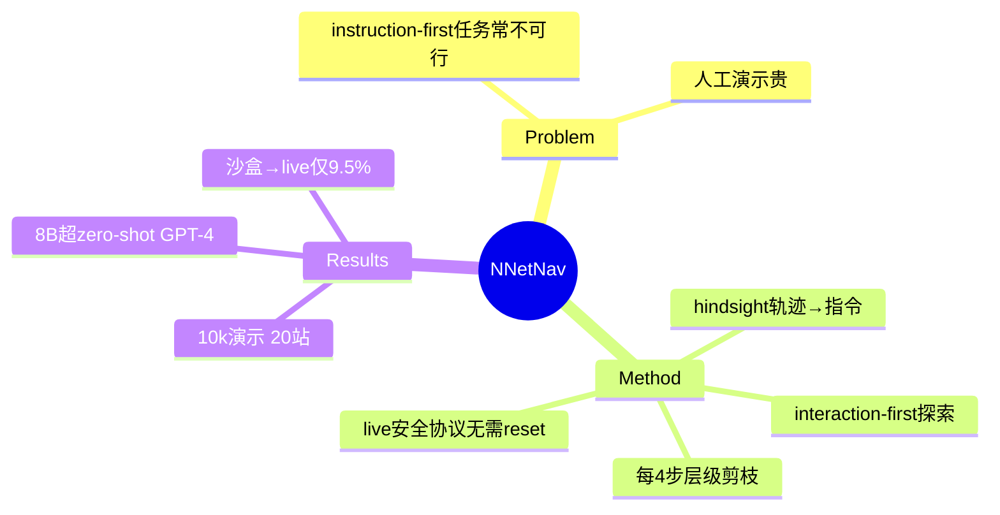

## Summary

NNetNav 把 web agent 数据合成从"instruction-first"倒转为"**interaction-first**"：先让探索策略在网站上随便交互，再**事后（retroactively）给轨迹标注指令**——指令描述的是已经发生的轨迹，天然可行。配合层级剪枝（每 4 步检查轨迹前缀能否标注成有意义的子任务，不能则立即终止探索），在 20 个网站（15 live + 5 WebArena）无监督收集 1 万条演示，Llama-3.1-8B 微调后 WebArena 16.3% / WebVoyager 35.2%，双双超 zero-shot GPT-4。

## Problem & Motivation

人工演示昂贵；instruction-first 合成（先生成指令再让 agent 执行）的问题是指令可能不可行、只引用表面可见功能、复杂度不可控。倒转顺序后可行性问题消失——但探索空间指数大，需要剪枝机制。

## Method

四组件共用一个 base LLM（收集时用 Llama-3.1-70B）：
1. **探索策略 π_explore**：persona-conditioned prompt 模拟多样用户行为，采样长轨迹（t_max=40）；
2. **状态变化摘要 ΔLM**：把状态转移转成自然语言变化描述；
3. **轨迹标注器**：retroactively 生成与轨迹匹配的指令（hindsight relabeling）；
4. **Outcome reward model**：0/1 判断指令-轨迹对齐，过滤低质样本。

**层级剪枝（关键创新）**：每 4 步（{4,8,...,40}）尝试给轨迹前缀标注子任务语言，标不出有意义子任务就砍掉——利用"复杂任务可分解为可命名子任务"的语言层级结构控制搜索。WebArena 上 >60% episode 在 16 步内被剪掉，MiniWoB++ 65% 在 4 步内剪掉。

**live 站点安全协议**：≤10 并发实例、动作间 0.5s 延迟、禁止登录与内容提交；live 环境是连续世界、**无需 reset**。

## Key Results

- 数据：10k+ 演示 / ~100k state-action 转移 / 20 站；难度分布 easy 1946 / medium 4901 / hard 2368 / very hard 1057——**hindsight 能采到 20+ 步的超长任务**。
- **Llama-8B 微调**：WebArena 16.3%（zero-shot GPT-4 14.1%）；WebVoyager 35.2%（GPT-4 33.5%；超此前最佳开源组合 LLaVa-34B+Claude 的 33.0%）。
- **自训练可行**：8B 用自己生成的数据训练，WebArena 1%→5.3%。
- 迁移警示：WebArena 训的模型在 live 站只有 9.5%——**沙盒→live 域差距显著**。

## Strengths & Weaknesses

**Strengths**：interaction-first + hindsight relabeling 从机制上消灭"任务不可行"问题；层级剪枝把无监督探索的成本控制住（60%+ 提前终止）；无需 reward/reset 即可在 live 站点工作——对环境要求最低的任务合成路线。

**Weaknesses / 边界**：
- 任务分布受探索策略能发现什么限制——低频功能采不到（自认）；persona prompt 只是弱多样性先验。
- 事后标注的指令天然偏"描述做了什么"，与真实用户意图分布有偏差（无外部校准）。
- WebArena→live 9.5% 的迁移失败说明合成数据强绑定采集环境。
- 8B 自生成数据质量明显低于 70B（自训练只到 5.3%）。

## Mind Map

## Notes

- **对环境引擎（任务供给轴）的定位**：NNetNav 是对环境要求最低的极点——不要 reset、不要 verifier、不要任务库，只要能交互；代价是任务分布不可控 + 指令-意图偏差。与 [[Papers/2502-InSTA]]（LLM proposer + judge）、[[Papers/2506-GoBrowse]]（结构化图探索）、[[Papers/2412-PAE]]（proposer-evaluator RL）构成任务供给家族的四种设计。
- hindsight relabeling 与 vault 的 [[Papers/2606-GUIAgentExploration]]（HER 式 relabeling + TDHAF）是同一 pattern 在数据合成 vs RL 训练两端的实例——"把任何轨迹变成某个任务的成功轨迹"值得升为 cross-paper pattern。
- 层级剪枝 = 用语言可命名性当探索 value function，无需环境 reward——环境不提供 verify affordance 时的聪明替代，但也再次印证：**有可靠 verifier 的环境能把这套间接机制全部换成直接监督**。
