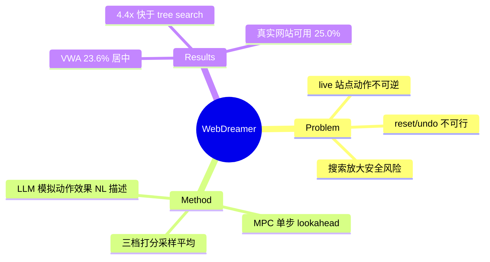

## Summary

WebDreamer 用 GPT-4o 同时充当 world model 和 value function，在执行前对每个候选动作做自然语言"梦境模拟"（想象点击后会发生什么）再择优执行——**因为 live 网站上动作不可逆、reset/undo 不可行，真实环境里的 tree search 不可用**。VWA 上 23.6%（reactive 17.7%，tree search 26.4%）但 wall-clock 只有 tree search 的 ~1/4，且能用于 tree search 完全无法运行的真实网站（Mind2Web-live 25.0% vs reactive 22.1%）。

## Problem & Motivation

Tree search（[[Papers/2407-TreeSearchLMAgents]]）已证明规划有大收益，但在 live 网站上有两个根本障碍：(1) **安全**——搜索的穷举式探索放大了误提交表单、误触发交易等不可逆副作用；(2) **回溯不可行**——"resetting the environment or undoing action sequences is not feasible on live websites"；Koh et al. 的 reset+replay 只在 sandbox 成立。因此把探索从真实环境搬进 LLM 的参数化世界知识里。

## Method

- **LLM as world model**：prompt GPT-4o 生成动作效果的**简洁自然语言描述**（只描述状态变化，如"点击 Electronics 后会展开三个子类目"），而非预测完整 HTML/截图——绕开高维状态预测。
- **MPC（Model Predictive Control）循环**：每步 (1) top-k 候选动作生成 + self-refinement 过滤；(2) 对每个候选模拟 H 步；(3) 三档打分（complete 1.0 / on track 0.5 / incorrect 0）多次采样平均；(4) 执行最高分动作，重复。
- **规划深度 H=1 最优**：H=3 时所有状态表示的性能都下降，state-change 描述甚至低于 reactive baseline——**LLM 模拟误差随步数复合**，长 horizon 模拟不可靠。

## Key Results

- **VWA (910 任务)**：reactive 17.7% / tree search 26.4% / **WebDreamer 23.6%**（+33.3% 相对 reactive，达到 tree search 收益的 ~70%）。medium 难度上 24.1% 反超 tree search 的 22.2%。
- **Mind2Web-live (104 任务, 69 个真实网站)**：reactive 22.1%→**25.0%**（tree search 无法运行）。
- **效率**：wall-clock（VWA Shopping）reactive 87.7s / tree search 785.7s / WebDreamer 179.4s——**~4.4× 快于 tree search**；动作步数 4.1–5.2 vs tree search 9.9–13.6（真实执行的动作更少 = 副作用更少）。
- 成本：~\$1/任务（GPT-4o API）。

## Strengths & Weaknesses

**Strengths**：问题定位极准——把"环境不支持回溯"从工程抱怨提升为范式选择的依据；模拟发生在模型内 → 真实环境零副作用；natural-language state delta 的状态表示设计聪明（避开像素/HTML 预测）。

**Weaknesses / 边界**：
- 模拟保真度受限：H>1 即退化，hard 任务（需要深规划的）恰恰是模拟最不可靠的地方——world model 是回溯的**替代品而非等价物**。
- 依赖 GPT-4o 的网站先验，长尾/内部网站（LLM 没见过的）模拟质量存疑（论文未测）。
- 与 tree search 的差距（23.6% vs 26.4%）就是"想象探索 vs 真实探索"的代价。
- v1 未做 world model 微调（Dreamer-7B 是后续版本工作）。

## Mind Map

## Notes

- **对 AFE 的证据价值（核心）**：WebDreamer 与 [[Papers/2407-TreeSearchLMAgents]] 构成一对**因果对照**——同样的规划需求，环境提供回溯（沙盒）时用真实搜索（26.4%），不提供（live）时只能退化为想象模拟（23.6%，且 H=1 封顶）。这 2.8pp + 深度受限的 gap 正是"环境原生 fork/rollback affordance"的价值下界估计。
- 派生路线证明这是共性需求而非孤例：WMA、WAC (2602.15384)、DynaWeb (2601.22149)、R-WoM 都在做"用模拟补环境回溯缺失"。
- 反向推论：若环境像 [[Papers/2510-WebServ]] 那样提供 block-level snapshot/branch，这条 world-model 模拟路线的必要性就大幅下降——两条路线在竞争同一个需求。
