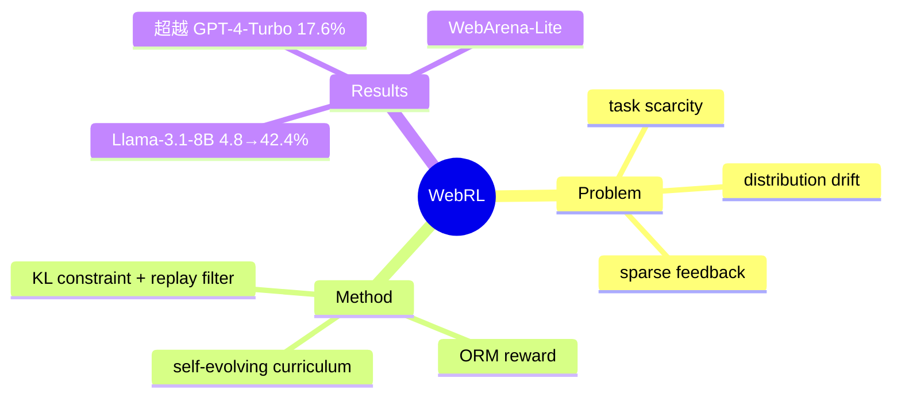

## Summary
针对"开源 LLM web agent 缺乏决策能力、且训练任务稀缺/反馈稀疏/在线学习分布漂移"三大问题，提出 self-evolving online curriculum RL 框架 WebRL——用失败经历自动生成新任务形成课程、用 outcome-supervised reward model (ORM) 提供可靠奖励、用 KL 约束 + 置信度过滤的经验回放稳定在线更新，把 Llama-3.1-8B 在 WebArena-Lite 上从 4.8% 提到 42.4%，超越 GPT-4-Turbo (17.6%)。

## Problem & Motivation
LLM 有潜力作为自主 web agent，但现状是：强能力方案依赖昂贵的闭源 API（GPT-4），开源模型决策能力不足。要用开源模型做 online RL 训练又撞上三堵墙——(1) **训练任务稀缺**：web 任务标注昂贵，可用于 RL 的 task 池太小；(2) **反馈稀疏**：长程 web 任务只有终局成败信号，中间无 dense reward；(3) **分布漂移**：online 学习中 policy 不断变化，新旧数据分布不一致，容易 catastrophic forgetting 或训练发散。WebRL 的核心判断是——这三件事必须一起解，否则开源 web agent 的 RL 无法 scale。

## Method
WebRL 是一套 **online curriculum RL 训练配方**，三大组件：

1. **Self-evolving curriculum（自演化课程）**：从 agent 的 *失败* 轨迹里自动生成新的、难度适配的训练任务，动态扩充 task 池，无需人工标注。核心思想是把"做不到的任务"转成"下一轮的学习材料"，让任务难度随能力自动爬升，缓解 task scarcity + 保证课程始终落在 agent 的 ZPD（最近发展区）。

2. **Outcome-Supervised Reward Model (ORM)**：训练一个稳健的结果监督奖励模型，判断 trajectory 是否真正完成任务目标，替代脆弱的规则化终局检查，为稀疏反馈的 web 任务提供可靠学习信号。

3. **Adaptive RL strategies（自适应更新）**：针对 online 分布漂移设计两个稳定器——(a) 对 policy 更新加 **KL-divergence 约束**，限制每步策略移动幅度；(b) **actor 置信度过滤的经验回放 buffer**，只回放高质量成功经验，防止灾难性遗忘、保证单调改进。

整体是"生成任务 → rollout → ORM 打分 → 约束更新 + 过滤回放 → 用新失败继续生成任务"的自演化闭环。

## Key Results
在 **WebArena-Lite**（5 类网站）上：

| 模型 | 训练前 | WebRL 后 |
|:--|:--|:--|
| Llama-3.1-8B | 4.8% | **42.4%** |
| GLM-4-9B | 6.1% | **43.0%** |

对照基线：GPT-4-Turbo 17.6%、GPT-4o 13.9%、AutoWebGLM（此前开源 SOTA）18.2%。WebRL 训练的开源 8B/9B 模型相对 GPT-4-Turbo 提升 >160%，且显著超过此前所有开源 web agent。核心 takeaway：**开源模型做 web agent 的瓶颈不在 backbone，而在训练范式——自演化课程 + 可靠 reward + 稳定在线更新三件套齐备时，8B 模型即可反超闭源大模型**。

## Strengths & Weaknesses
**亮点**：(1) 把"失败即课程"做成自动化闭环，直击 web RL 的 task scarcity 痛点，是后续 WebGym / InfiniteWeb 等"环境/任务 scaling"路线的重要先声；(2) 证明 online curriculum RL 可以让小开源模型在 WebArena 系达到实用水平，成为 web agent RL 的奠基工作之一（ICLR 2025）。

**局限**：(1) 评测集中在 WebArena-Lite（self-hosted 沙盒），未验证真实 live web 的泛化（后续 [[Papers/2504-OnlineMind2Web]] 表明沙盒分数会在真实站点崩塌）；(2) ORM 的可靠性上限决定 reward 质量，reward hacking 风险未系统评估；(3) 自演化课程生成的任务多样性/真实性依赖 seed 任务分布。与 [[Papers/2606-WebGym]]（rubric-based 大规模任务）、[[Papers/2606-AsyncWebRL]]（async 系统 + step normalizer 诊断）形成"RL 训练"路线的演进链。

## Mind Map

## Notes
- 与 vault 的"造失败→学恢复"范式（[[Topics/CUA-Survey]]）同源但更早：WebRL 是"造失败→当课程"，二者都把失败轨迹当一等训练资源。
- 属 Zhipu/THUDM 系（与 [[Papers/2508-ComputerRL]] 同门），可视为 desktop ComputerRL 的 web 前身。
