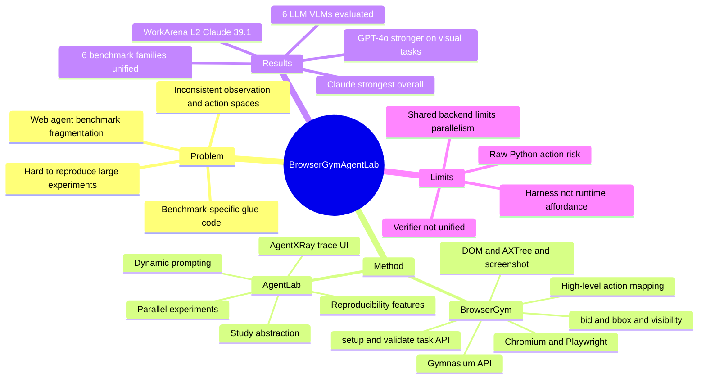

## Summary

BrowserGym / AgentLab 提出一个 web agent 研究生态：BrowserGym 统一多个 web benchmark 的 observation/action API，AgentLab 提供 agent 构建、并行实验、可复现管理和 trace 可视化工具。它的贡献不是新 agent 或新任务，而是把碎片化 web-agent benchmark 变成可复用、可比较、可扩展的实验基础设施。

## Problem & Motivation

Web agent 研究在 2024 年已经有很多 benchmark：MiniWoB、WebArena、VisualWebArena、WorkArena、WorkArena++、WebLINX、AssistantBench 等，但每个 benchmark 都有自己的安装方式、action space、observation format、reset 逻辑和评估脚本。这会导致两个问题：第一，不同 agent 结果难以公平比较；第二，新 agent / 新 benchmark 都要重复做大量 glue code。

BrowserGym 的动机是把 web agent evaluation 抽象成 gym-like environment，让不同 benchmark 暴露相同的 `reset()` / `step()` loop、统一 observation space 和可配置 action mapping。AgentLab 则解决实验层问题：如何快速实现 agent、并行跑大量 episodes、保存 traces、复现实验并分析失败。

## Method

### BrowserGym

BrowserGym 把 web interaction 形式化为 POMDP，并通过 `gymnasium` API 暴露给 agent。内部使用 Chromium 和 Playwright 驱动浏览器。

Observation space 包含：

- task goal / chat messages；
- open tabs 的 URL、title 和 active tab index；
- raw screenshot；
- DOM object 和 AXTree object；
- 注入到 DOM / AXTree 中的唯一 element id `bid`；
- element bbox、visibility ratio、Set-of-Marks 信息；
- 上一步 action 的 error feedback，例如 Playwright click timeout 或元素不可见。

Action space 设计有两层：

- raw executable Python / Playwright code：表达力强，但安全风险高；
- high-level action mapping：把 `click(bid)`、`fill(bid, value)`、`scroll(dx, dy)`、`new_tab()`、`send_msg_to_user()`、`report_infeasible(reason)` 等受控 action 编译到 Playwright。

BrowserGym 也定义了 benchmark 接入方式：每个 task 实现 `setup()` 和 `validate()`。`setup()` 负责初始化页面、登录或构造状态，`validate()` 在每步后检查任务是否完成，并返回 reward / done / message。

### Benchmark unification

论文把 6 类 web benchmark 统一进 BrowserGym：

| Benchmark | 规模 / 特点 | Backend |
|:--|:--|:--|
| MiniWoB(++) | 125 task templates | self-hosted single HTML pages |
| WebArena | 812 deterministic tasks | self-hosted Docker |
| VisualWebArena | 910 deterministic visual tasks | self-hosted Docker |
| WorkArena L1 | 33 templates, high seed diversity | ServiceNow demo instance |
| WorkArena L2 | 341 templates, max 50 steps | ServiceNow demo instance |
| WorkArena L3 | 341 templates, max 50 steps | ServiceNow demo instance |

BrowserGym 还提供 `prepare_backend()`，自动检查 server URL、credentials，并对 WebArena / VisualWebArena 这类会被 agent 改写后端状态的环境执行 reset/setup。

### AgentLab

AgentLab 是 BrowserGym 上的实验框架，不是独立 paper。它提供：

- `make_study()` / `study.run(n_jobs=...)`：管理多 benchmark、多 agent config、多 seed 的大规模实验。
- 并行执行：支持 joblib / ray。论文说单机 laptop 可跑约 20 个并行 task，服务器可跑 50-100；但 WebArena / VisualWebArena 因 task dependency 和 shared backend，实际并行会被限制到 2-4。
- AgentXRay：Gradio trace inspection UI，展示 goal、observation、action、prompt、profiling，定位具体失败 step。
- Reproducibility features：处理 Playwright/package 版本、API model 变更、live website drift、stochasticity、leaderboard reproduction range。
- Agent building blocks：统一 `Agent` / `AgentArgs` / LLM/VLM API，提供 dynamic prompting 和 token fitting 工具，避免 AXTree / HTML 过长时简单截断掉关键信息。

## Key Results

论文用 AgentLab 的 GenericAgent 在 BrowserGym 统一环境上评估 6 个 LLM/VLM：GPT-4o、GPT-4o-mini、o1-mini、Claude-3.5-Sonnet、Llama-3.1-70B、Llama-3.1-405B。

关键结果：

- Claude-3.5-Sonnet 在多数 benchmark 上领先，尤其 WorkArena L2 达到 39.1% task success，显著高于 GPT-4o 的 8.5%。
- GPT-4o 在视觉相关任务上更强，VisualWebArena 排名优于 Claude。
- Llama-3.1-405B 在多个 benchmark 上超过 GPT-4o-mini，说明开源模型在 web agent 上有一定潜力，但整体仍落后强闭源模型。
- AssistantBench 表现很低，作者认为 BrowserGym API 更适合 action-oriented web tasks，而不一定适合纯 web QA / information seeking。
- 论文强调这次实验的价值不只是分数，而是证明统一 benchmark ecosystem 可以大规模比较模型、agent config 和 observation/action choices。

## Strengths & Weaknesses

**Strengths**：

- **基础设施贡献清楚**：BrowserGym 解决 benchmark fragmentation，AgentLab 解决 experiment management。对后续 web agent 研究非常实用。
- **observation/action 抽象扎实**：DOM、AXTree、screenshot、bbox、visibility、bid、last_action_error 都被统一起来，方便比较 text-only、vision、SoM、high-level action 等设计选择。
- **可扩展性强**：新 benchmark 只需实现 setup/validate，新 agent 只需实现 action generation 和可序列化 AgentArgs。
- **过程分析能力好**：AgentXRay 对失败诊断很有价值，和我们近期关注的 trajectory-aware evaluation / failure anatomy 一致。
- **明确暴露 reproducibility 难点**：live website drift、API model silently changing、task collisions、backend reset 和 robot detection 都是 web agent 环境的真实问题。

**Weaknesses**：

- **不是 agent-friendly runtime**：BrowserGym 标准化 observation/action，但不主动给 agent 暴露 app-level state diff、rollback、semantic workflow map、verifier probe 或 provenance。它是 unified harness，不是 dual-interface environment。
- **verification 仍依赖各 benchmark 自己实现**：WebArena、WorkArena、MiniWoB 的 validation 逻辑差异很大，BrowserGym 只是统一调用层，没有统一 verifier abstraction。
- **安全边界不足**：raw Python action space 表达力强但风险高，high-level action mapping 是缓解，但没有系统讨论 untrusted web content 与 action synthesis 的边界。
- **并行受后端状态约束**：WebArena / VisualWebArena 这类会改 shared backend 的任务只能低并行，说明 reset/session isolation 仍是环境设计硬瓶颈。
- **实验数字受模型版本影响**：论文自己也指出 API model 可能 silent update，leaderboard 需要 reproduction range；这使得历史分数比较需要谨慎。

**Impact**：

BrowserGym / AgentLab 是 web agent 环境研究的关键基础设施。它让“比较 agent”从多个不可兼容 benchmark glue code 转向同一 gym-like API。对 Agent-Facing Environment Protocol 来说，它是一个好的 lower-level harness，但不是最终答案：我们仍需要在 BrowserGym 之上定义哪些 state / verifier / rollback / provenance capability 可以进入 agent runtime。

## Mind Map

## Notes

- AgentLab 不是独立论文；它是 BrowserGym Ecosystem 论文中的 companion framework。因此本笔记合并记录 BrowserGym / AgentLab。
- 和 [[Papers/2601-WebGym]] 的区别：BrowserGym 是 evaluation/harness unification，WebGym 是 large-scale web RL training environment。
- 和 [[Papers/2600-WebHarbor]] 的关系：BrowserGym 标准化接口，WebHarbor 提供可 reset、视觉更真实的 local website mirrors。两者可以互补：WebHarbor mirror 可以接入 BrowserGym，BrowserGym 负责 agent API 和实验管理。
- 和 [[Papers/2606-CUAGym]] 的关系：CUA-Gym 更重 task-state-reward tuple 生成和 RLVR；BrowserGym 更重 benchmark / agent experiment infrastructure。
- 对 [[Reports/2026-06-23-AgentFriendlyEnvironment-Proposal]] 的启发：Agent-facing protocol 不应重复 BrowserGym 的 observation/action standardization，而应补上 BrowserGym 缺少的 state diff、verifier probe、rollback、guard、trace provenance。
