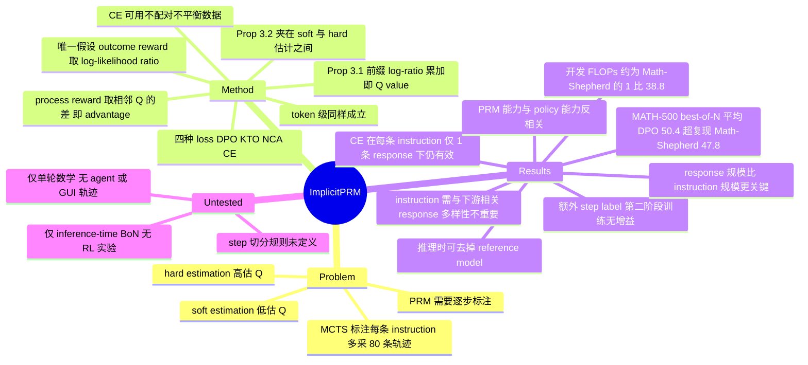

## Summary

只要把 outcome reward 参数化成 policy 与 reference model 的 log-likelihood ratio `r_θ(y) := β log(π_θ(y)/π_ref(y))`，再用 response-level 的对错标签按常规流程训一个 ORM，逐 token 的 log-ratio 累加就恰好是该前缀的 Q value，process reward 因此从 outcome-only 数据里"免费"得到，不需要任何 step 标注。在 MATH-500 的 best-of-N 上，DPO 变体平均 50.4，超过作者自己复现的 MCTS 标注 baseline Math-Shepherd（47.8），而开发开销（数据采集 + 训练 FLOPs）只有后者的约 1/38.8。更反直觉的是，把 Math-Shepherd 的 step label 再喂回去做第二阶段训练，没有带来任何增益。

## Problem & Motivation

Outcome reward 太稀疏：ORM 只在最后一个 token 之后给一个分数，用于 rerank 时效果次优，用于 RL 时稳定性和效率都差。PRM 逐步打分能提供更密的信号，但训练它需要每一个中间步的标注——这正是瓶颈所在。

为绕开人工标注，主流做法是 MCTS 式自动标注：从 instruction 加前 t 步的前缀出发采样 N 条 look-ahead 轨迹，用轨迹终点的对错估计这一步的 Q value。论文给的量化例子是 10 步、每步 8 条后续轨迹，即每条 instruction 要额外生成 10 × 8 = 80 条轨迹，是训 ORM 的 80 倍。除了贵，这种标注还有系统性偏差：hard estimation（任一 rollout 对就记 1）取的是 max 而非期望，高估 Q；soft estimation（对的比例）在难题上因为 policy 采不出正确解而有 false negative，低估 Q。

作者的问题因此是：能不能不额外付这笔钱，就得到 step-level 信号？

## Method

**核心假设（原文表述）**：把 outcome reward 参数化为两个 causal LM 的 log-likelihood ratio

`r_θ(y) := β log(π_θ(y) / π_ref(y))`

这正是 DPO 及其一众变体里的 implicit reward 形式，β 是超参。论文强调 "The only assumption is to parameterize the outcome reward as the log-likelihood ratios of the policy and reference models, which can be optimized regardless of the specific choice of loss objectives."

**Proposition 3.1（免费 process reward 的来源）**：定义

`q_θ^t(y_<t, y_t) := Σ_{i=1..t} β log(π_θ(y_i | y_<i) / π_ref(y_i | y_<i))`

则 `q_θ^t` 是 `r_θ` 在第 t 步上的 exponential average，即 `q_θ^t = β log E_{π_ref(y | y_≤t)} exp(r_θ(y)/β)`，因而是 outcome reward 在该前缀条件下的确切期望——Q value。证明用对 token 位置的数学归纳（Appendix A）。

关键在于：这个量**只是 ORM 前向计算的副产品**。训 ORM 时你唯一要做的就是把 `r_θ(y)` 换成上面的 log-ratio 形式；训完之后，把 log-ratio 在前缀上截断累加，就读出了每个前缀的 Q。没有第二次训练，没有 step 标注。

**process reward 的定义**：论文跟随 Lu et al. 2024，把 process reward 定义为 advantage 而非 Q 本身，即 `r_θ^t := q_θ^t − q_θ^{t-1}`。由于 q 是逐 token 累加，第 t 步的 process reward 就等于该步内所有 token 的 β log-ratio 之和。论文明确指出 "this conclusion still holds when y_t represents the t-th token rather than step t"——所以这套推导天然给出 token-level 而不止 step-level 的信号，step 只是 token 的一种聚合方式。

**Proposition 3.2（相对 MCTS 标注的精度论证）**：`q_θ^t` 被 MCTS 的 soft-estimated 与 hard-estimated Q 夹在中间，`q_θs^t ≤ q_θ^t ≤ q_θh^t`，左端等号在 β → ∞ 时取到、右端在 β → 0 时取到。由于 hard 高估、soft 低估，落在中间的 `q_θ^t` 有可能同时缓解两侧偏差。注意这是一个 bound 论证而不是精度证明，且 Proposition 3.2 在正文与附录都没有给出证明。

**实例化的 loss**：DPO、KTO、NCA、CE 四种。DPO 和 NCA 需要成对数据，做法是把每条正确 rollout 与一条错误 rollout 配对；KTO 和 CE 直接在不配对、不平衡的 rollout 上训，更贴近实际。CE 变体额外做了两种平衡设置（Dataset-wise Balanced / Instruction-wise Balanced）用于观察配对性的影响。

**训练与评测配置**：instruction 取自 UltraInteract 的数学部分（intro 称 33K 条），每条用 Llama-3.1-8B-Instruct 采 8 条 rollout，用 ground truth 判对错；PRM 从 Llama-3.1-8B-Instruct 初始化，β = 0.05。评测是 MATH-500 上的 best-of-N，N ∈ {4, 16, 64}，三个生成模型 Mistral-7B-Instruct-v0.2 / Llama-3.1-8B-Instruct / Llama-3.1-70B-Instruct（温度 0.5 下 Pass@1 分别 9.6 / 44.6 / 63.2）。**一条 response 的总分取其所有 step reward 的最小值**。

## Key Results

**主表（Table 1，九个 cell 的平均）**

| Reward Model | Avg. |
|:--|--:|
| Implicit PRM (DPO) | **50.4** |
| Implicit PRM (NCA) | 49.4 |
| Implicit PRM (CE, Inst.-wise Balanced) | 49.0 |
| Implicit PRM (CE) | 48.4 |
| Implicit PRM (CE, Dataset-wise Balanced) | 47.8 |
| Implicit PRM (KTO) | 45.7 |
| Math-Shepherd（作者复现，同一批数据） | 47.8 |
| AutoPSV（作者复现，同一批数据） | 45.7 |
| RLHFlow-8B-Mistral-Data / RLHFlow-8B-DS-Data | 49.1 / 49.1 |
| Math-Shepherd-7B（官方发布） | 45.6 |

四个变体都能提升三个生成模型的准确率。CE 虽然训在不配对、不平衡数据上，48.4 仍比复现的 Math-Shepherd 高 0.6、比 AutoPSV 高 2.7。DPO 相对复现 Math-Shepherd 是 +2.6。配上 majority voting 做 weighted best-of-N 后，CE 反而成为最强变体，KTO 和 CE 都是从"单独用不如 majority voting"变成"超过 majority voting"。

**"1/38" 到底在数什么（重要）**。摘要写的是 "using less than 1/38 of the training data"，但正文量的是 **FLOPs**，且口径明确包含数据采集与 PRM 训练两部分。Figure 2 caption：CE 比 Math-Shepherd 省 38.6× 到 38.8×；正文 §4.2 说 Math-Shepherd 一般比 implicit PRM (CE) 多花 38.8× FLOPs。所以这个 38.8× 是**开发算力比**，不是训练样本条数比。两点必须同时记住：

1. 两个复现 baseline 与 implicit PRM 训在**同一批 instruction 和 response** 上，省下来的是为了标 step label 而多采的 look-ahead rollout 算力（§2 的口径是 80× 轨迹数），不是 instruction 变少了。
2. 这个比值随数据规模变化：对 DPO 变体，Math-Shepherd 的 FLOPs 倍数在不同 responses-per-instruction 下分别是 146.5× / 49.9× / 21.3×。"38×" 是 CE 变体在该配置下的一个点，不是常数。

**反直觉的负结果：额外 step label 没用（Table 2）**。作者在已训好的 implicit PRM (DPO) 上做第二阶段训练，用自家复现的 Math-Shepherd 产生的 step label，把 KTO 改成 step-level 版本显式优化 implicit reward：

`L_θ = −(1/n) Σ_{t=1..n} log σ( l^t · |r_θ^t| )`

结果 Avg 从 49.3 变成 49.2，逐格看九个 cell 也没有一致提升。同表其它因子同样无效：加 UltraFeedback 通用 instruction 降到 49.2、加 UltraInteract 代码 instruction 降到 49.2、按 8-gram 去重降到 47.6、把四条 rollout 换成 base model 生成的降到 48.7。

> **数值对账警告**：Table 2 的 Avg 列与它自己的 cell 不自洽。"Implicit PRM" 那一行九个 cell（18.6 / 24.4 / 28.8 / 54.0 / 55.4 / 57.0 / 71.8 / 71.2 / 72.2）与 Table 1 的 DPO 行**逐格相同**，Table 1 印 50.4、Table 2 印 49.3，而算术均值是 50.38。Table 1、Table 4、Table 5 的 Avg 都与 cell 均值精确吻合，只有 Table 2 整列系统性偏低 0.6–1.2。按 cell 重算，"+ Step Label" 是 50.13，相对 base 的 50.38 是 −0.25。**两种口径下"没有增益"这个方向性结论都成立**，但"差多少"取决于用哪个 Avg，引用具体数字时应注明是论文印出值。

作者自己对这条负结果做了两点免责：MCTS 标注不可避免有噪声；他们选的 step-level KTO 算法未必最优。因此这条结果的正确读法是"在这套标注质量与这套算法下，step label 提供不了 implicit PRM 尚未获得的信息"，不是"step 标注一般性无用"。

**scaling（Figure 4/5）**。instruction 与 response 两个维度上 scale 都有正收益，但 **response 的影响更大**（min/max 设置之间的性能跨度更大）。DPO 在每条 instruction 只有 2 条 response 时明显欠训——因为 2 条不一定能凑出一正一负的 pair，很多 instruction 直接被丢弃；CE 在数据不足时更稳，**即使每条 instruction 只有 1 条 response（不配对的极端情形）仍能持续提升生成模型**。这是 CE 相对 DPO 的实用优势。

同时，**instruction 必须与下游任务相关**，掺入无关领域反而有害；而 **response 多样性不重要**——去重反而掉点，说明重复 response 在模型饱和前仍在贡献梯度。

**PRM 能力与 policy 能力脱钩（Table 3）**。把 implicit PRM 当 policy 直接做 MATH500：Llama-3.1-8B-Inst 45.2，+DPO 25.8，+KTO 46.6，+NCA 35.6，+CE 28.6。唯一提升 policy 的 KTO 恰恰是最差的 PRM，而最强的两个 PRM（DPO、CE）掉得最狠。两种能力之间存在权衡。

**reference model 可以在推理时去掉（Table 5）**。因为 best-of-N 只看相对分数，常数 `log π_ref` 会被消掉。实测：DPO 训练时带 ref，推理带 ref 是 50.4、不带 ref 是 50.6；直接拿未经任何 RM 训练的 Llama-3.1-8B-Instruct 当 reward model 也有 45.8。作者的解释是好步骤在 π_θ 和 π_ref 下都概率高，比值反而被压低，对 inference-time 选择有害，但在 RL 训练中这种"已优化动作给小梯度"的行为是有益的。Table 4 另给了实际开销：相对生成模型成本，baseline 总开销 200.9 / 171.1 / 111.1，implicit PRM 是 301.6 / 241.7 / 122.2，生成模型越大额外开销越可忽略。

## Evidence Ledger

| Claim ID | Claim | Type | Source locator | Evidence excerpt | Status |
|:--|:--|:--|:--|:--|:--|
| C1 | 唯一假设是把 outcome reward 参数化为 policy 与 reference model 的 log-likelihood ratio | causal-mechanism | Abstract | "The only assumption is to parameterize the outcome reward as the log-likelihood ratios of the policy and reference models" | source-verified |
| C2 | Prop 3.1：q_θ^t 是 r_θ 在第 t 步的 exponential average，即确切的 Q value | causal-mechanism | §3, Proposition 3.1 + Eq. 2 | "qθt is the exponential average of rθ at step t... represents an exact expectation of outcome reward rθ at step t, i.e., the Q value" | source-verified |
| C3 | process reward 定义为 advantage，q 的相邻差，跟随 Lu et al. 2024 | causal-mechanism | §2 Preliminaries | "we follow Lu et al. 2024 and define process reward as advantages, namely the difference between Q values: rθt:=qθt−qθt−1" | source-verified |
| C4 | 结论在 y_t 为 token 而非 step 时同样成立 | causal-mechanism | §3, after Eq. 3 | "this conclusion still holds when yt represents the t-th token rather than step t" | source-verified |
| C5 | Prop 3.2：q_θ^t 被 MCTS soft/hard 估计夹住，左端 β→∞、右端 β→0 取等 | causal-mechanism | §3, Proposition 3.2 + Eq. 4 | "The left-hand equality is attained as β→∞ and the right-hand one is attained as β→0" | source-verified |
| C6 | 四种 loss：DPO/NCA 用配对数据，KTO/CE 用不配对不平衡数据 | benchmark-setting | §4.1 Implicit PRM instantiation | "For DPO and NCA, we pair each correct rollout with an incorrect counterpart... for KTO and CE loss, we directly train on the unpaired and imbalanced rollouts" | source-verified |
| C7 | 训练数据 33K UltraInteract 数学 instruction × 8 rollout；base 与 ref 均为 Llama-3.1-8B-Instruct，β = 0.05 | benchmark-setting | §1; §4.1 Training dataset | "We use math instructions from UltraInteract... eight rollouts per instruction using Llama-3.1-8B-Instruct... β=0.05" | source-verified |
| C8 | 评测为 MATH-500 上 best-of-N，N ∈ {4,16,64}，三生成模型 Pass@1 9.6/44.6/63.2（T=0.5），response 得分取最小 step reward | benchmark-setting | §4.1 Evaluation；Table 1 caption 与列头 | "pick the lowest step reward as the score for overall responses"; "accuracies are 9.6%, 44.6%, and 63.2%" | source-verified |
| C9 | Table 1 Avg：DPO 50.4 / NCA 49.4 / CE 48.4 / KTO 45.7；复现 Math-Shepherd 47.8、AutoPSV 45.7；RLHFlow 两者均 49.1 | number | Table 1, Avg. 列 | "DPO ... 50.4 ... NCA ... 49.4 ... CE ... 48.4"; "Math-Shepherd ... 47.8"; "AutoPSV ... 45.7" | source-verified |
| C10 | 摘要的 "1/38 of the training data" 在正文对应的是含数据采集与训练的 FLOPs 比，Figure 2 给 38.6×–38.8× | number | Abstract; §4.2; Figure 2 caption | "with CE being 38.6× to 38.8× more efficient than Math-Shepherd across different dataset scales" | source-verified |
| C11 | 对 DPO 变体，Math-Shepherd 的 FLOPs 倍数随数据规模在 146.5× / 49.9× / 21.3× 之间变化 | number | §4.2 | "Compared to implicit PRM (DPO), the number becomes 146.5x, 49.9x, and 21.3x under different number of responses per instruction" | source-verified |
| C12 | MCTS 标注成本口径：10 步 × 8 rollout = 每条 instruction 80 条轨迹，为 ORM 的 80 倍 | number | §2 | "a total of 10×8=80 trajectories need to be generated to get step labels for each instruction, which is 80 times more than ORMs" | source-verified |
| C13 | 负结果：第二阶段 step-level KTO 用 Math-Shepherd step label 无增益，Table 2 印出 49.3 → 49.2 | number | §5.3 Results (3); Table 2 | "Conducting step-level KTO with extra process labels does not bring gains" | source-verified |
| C14 | Table 2 的 Avg 列与自身 cell 不自洽：base 行 9 格与 Table 1 DPO 行相同却印 49.3 vs 50.4，真实均值 50.38 | number | Table 1 DPO 行 vs Table 2 "Implicit PRM" 行 | Table 2: 18.6 24.4 28.8 54.0 55.4 57.0 71.8 71.2 72.2 → "49.3"; Table 1 同 cell → "50.4" | source-verified |
| C15 | Table 2 其余因子：+UltraFeedback 49.2、+UltraInteract(Code) 49.2、+Dedup 47.6、+Base Resp 48.7，均无一致增益 | number | Table 2; §5.3 | "none of these factors brings consistent gains"; "training instructions deviating from the downstream task could undermine the performance" | source-verified |
| C16 | 作者自设两条免责：MCTS 标注有噪声、算法选择可能非最优 | causal-mechanism | §5.3 Results (3) | "the MCTS-based approach inevitably introduces noises...; Secondly, our choice of algorithm may not be optimal" | source-verified |
| C17 | scaling response 比 scaling instruction 影响更大；DPO 在 2 response/instruction 下欠训；CE 在 1 response/instruction 下仍能提升生成模型 | number | §5.2 takeaways (1)(2)(3); Figure 5 caption | "scaling up responses seems to be more influential"; "DPO is under-trained with two responses per instruction" | source-verified |
| C18 | Table 3 直接当 policy 解 MATH500：base 45.2，+DPO 25.8、+KTO 46.6、+NCA 35.6、+CE 28.6，仅 KTO 提升 | number | Table 3; §5.4 | "only trainiing with KTO leads to an improvement on MATH500, compared to Llama-3.1-8B-Instruct" | source-verified |
| C19 | Table 5：DPO w/ Ref 训练下，推理带 ref 50.4、不带 ref 50.6；未训练的 Llama-3.1-8B-Instruct 直接当 RM 得 45.8 | number | Table 5 | "+ DPO w/ Ref" w/ Ref Avg 50.4, w/o Ref Avg 50.6; "Llama-3.1-8B-Instruct / w/o Ref ... 45.8" | source-verified |
| C20 | Table 4 相对生成模型的 GPU 时间：baseline 总计 200.9/171.1/111.1，implicit PRM 301.6/241.7/122.2 | number | Table 4 + caption; §5.5.1 | "overall inference overhead of baselines on three test sets are 66.6%, 70.8%, and 90.9% of that of ours" | source-verified |
| C21 | 内部命名不一致：§4.1 写 "Mistral-Instruct-v0.3"，但 Table 1/2/4/5 与 Figure 1/4 caption 一律写 "Mistral-7B-Instruct-v0.2" | benchmark-setting | §4.1 Evaluation vs Table 1 / Figure 1 caption | §4.1: "Mistral-Instruct-v0.3 (Jiang et al. 2023)"; Fig. 1: "Mistral-7B-Instruct-v0.2" | source-verified |
| C22 | 模型与数据开源于 github.com/lifan-yuan/ImplicitPRM | license-code | Footnote 1 / arXiv Comments | "Models and data are available at: https://github.com/lifan-yuan/ImplicitPRM" | source-verified |
| C23 | arXiv 仅 v1，2024-12-02 提交，无 journal reference 或会议 venue | benchmark-setting | arXiv abs 提交历史；/abs/2412.01981v2 返回 404 | "v1 submitted Monday, December 2, 2024"; "Journal Reference: None listed" | source-verified |
| C24 | 全文唯一评测 benchmark 是 MATH / MATH-500；无 agent trajectory、GUI、tool-use、code agent 评测；无 RL 实验，全部为 inference-time best-of-N | benchmark-setting | §4.1, §5.4, Tables 1–5, Appendix A | "we evaluate PRMs with best-of-N (BoN) on MATH-500"; "we test on MATH500" | source-verified |

## Strengths & Weaknesses

**Strengths**

推导简洁到近乎不像一篇论文的主要贡献，而这正是它的价值所在。整套方法没有新模块、新架构、新标注管线，只是换了 reward 的参数化形式；"免费"不是修辞，因为 process reward 确实是 ORM 前向计算的副产品。这属于典型的 simple, scalable, generalizable。

论证结构也扎实：Prop 3.1 给出为什么 log-ratio 累加恰好是 Q，Prop 3.2 给出为什么它可能比 MCTS 标注更准（夹在高估与低估之间），两者共同解释了"为什么 work"，而不只是报一个更好的数。

实验里最有信息量的是负结果而非主表。"额外 step label 无增益"直接反过来支撑了主张——如果 implicit PRM 还缺少 step 层面的信息，喂 label 就该有收益；没有收益说明 outcome-only 训练已经把这部分信息学到了。作者还主动给了两条免责，没有把它包装成"step 标注一般性无用"。

CE 在 1 response/instruction 下仍有效，是被低估的实用结论：它把这套方法的适用范围从"有配对偏好数据"扩到"只有零散的对/错记录"。对只能拿到稀疏成败信号的场景，这比 DPO 变体高的那 2 个点重要得多。

**Weaknesses**

摘要口径不精确。"less than 1/38 of the training data" 在正文实际是 FLOPs 比而非数据条数比，而且这个比值随规模在 21.3×–146.5× 间摆动。省下的是"为标 step label 多采的 rollout 算力"，instruction 与 response 两侧数据量是一样的。引用这个数字时应当直接说"约 1/38.8 的开发 FLOPs"。

Table 2 的 Avg 列存在明确的数值错误（见 C14），而承载全文最反直觉结论的正是这张表。方向性结论不受影响，但一篇以"数值对比"为核心论据的论文出现这种未修正的错误，且 v1 至今（arXiv 无 v2）没有更新，是可靠性上的减分项。§4.1 与所有表格之间 Mistral 版本号 v0.3/v0.2 的矛盾同属一类。

复现信息不足。v1 的附录只有 Prop 3.1 的证明，Prop 3.2 没有证明；learning rate、epoch、batch size 一律缺失；**"step" 的切分规则全文未定义**——而 response 总分取的是"最小 step reward"，切分粒度会直接改变这个 min 的取值，这是一个未受控的变量。

论断范围窄于表面。这是**单轮数学解题、inference-time best-of-N** 的结果，全文没有 RL 实验（把 implicit reward 拿去做 policy 优化是后续工作 PRIME 的事，本文没做）。Prop 3.2 的"更准"是一个 bound 论证，不是精度证明；论文自己也承认真正的经验优越性证据来自并发工作（Zhang et al. 2024a）。

Table 3 揭示的 PRM 能力与 policy 能力反相关值得警惕：最强的 PRM（DPO 50.4）当 policy 只有 25.8，比 base 掉 19.4 个点。这意味着 implicit PRM 的训练在把模型往一个"会判分但不会解题"的方向推。论文只是观察到这个现象，没有解释机制，也没有讨论它对"用同一个模型既做 policy 又做 reward"这类方案意味着什么。

**未被验证的范围（对跨域引用尤其重要）**

以下都**没有**在本文中测过，不应据此外推：多步 agent trajectory；GUI / computer-use 轨迹；tool-use 或 code agent；任何非数学的评测集（UltraFeedback 与 UltraInteract-code 只作为**训练数据**消融出现，评测始终在 MATH）；用 implicit reward 做 RL 训练；step 定义不明确或步与步之间强耦合的场景；以及"轨迹级信号本身就带噪声"的场景（本文 outcome label 由 ground-truth 精确判定，不是学出来的 verifier）。

## Mind Map

## Notes

**为什么这篇是"outcome-only 拿 step credit"的 canonical 结果**

它把问题从"如何更便宜地标注中间步"转成"中间信号是否需要显式标注"。答案是不需要——只要 reward 的参数化本身是逐 token 可分解的，credit 的分解就是免费的。这条思路与靠额外 rollout（[[Papers/2312-MathShepherd]]）、额外 verifier（AutoPSV）、额外 judge 做角色归因（见 [[Papers/2606-TRIAGE]]）的路线正交：后三者都在**估计**每一步的价值，而这里是让 reward 的形式**天然携带**每一步的价值。

值得注意的是 Rafailov et al. 2024 已经指出 DPO 训练会隐式学到 Q function；本文的增量是证明这个性质与 loss 无关，只与参数化有关，因而可以扩到 CE 这类不需要配对数据的目标上。这个"从 DPO 特例推广到参数化通例"的动作，正是让它能覆盖"只有零散成败记录"场景的关键。

**迁移到 agent / GUI 轨迹时会在哪里断**

- **step 的定义**。数学解题里 step 是自然的文本片段，本文甚至没有定义切分规则也能 work。agent 轨迹里一个 step 是一次 action，与前后强耦合，且 action 的文本表示（函数调用、坐标）token 数极少——β log-ratio 在几个 token 上累加，信噪比是否够是完全未知的。
- **outcome label 的来源**。本文的 outcome label 由 ground-truth 答案精确判定，零噪声。agent 任务的成败判定往往来自一个学出来的 verifier，本身有误差。Prop 3.1 保证的是"q 是 r 的确切期望"，r 有偏时 q 同样有偏，这层误差传播本文完全没有讨论。
- **多轮与环境反馈**。轨迹中间穿插 observation（页面截图、工具返回），这些 token 不是 policy 生成的，π_θ 与 π_ref 在其上的 log-ratio 是否应计入 Q，本文的推导没有覆盖（其归纳证明假设整条 y 由 π 自回归生成）。
- **reference model 的选择**。§5.5.2 的结论"可以去掉 ref"依赖 ref 已是强 instruct 模型且下游是 inference-time 选择。若要在 RL 训练中用这个 reward，作者明确说保留 ref 的"已优化动作给小梯度"行为是**有益**的——两个场景的最优做法相反。

**相关笔记**：[[Papers/2605-BetaPRM]]（给 process reward 加可靠性估计，正好对本文未处理的"reward 本身有噪声"补位）、[[Papers/2606-TRIAGE]]（用外部 judge 做角色化 credit，与本文的"免费分解"是两条路线）、[[Papers/2607-SEED]] 与 [[Papers/2608-PCSD]]（把 policy/参考模型的 log-prob 差直接当 token 权重，是本文思路在 SFT 侧的近亲）、[[Papers/2500-GuiPraProcessReward]] 与 [[Papers/2602-ADMIRE]]（GUI 场景的 process reward，可用于对照本文假设在 GUI 上是否成立）。

**待查**：本文只到 inference-time BoN 为止；把 implicit reward 用于 online RL 是后续 PRIME 工作的内容，若 survey 需要覆盖"从 outcome-only 信号做训练时 credit assignment"，应单独消化 PRIME 而不要从本文外推。
