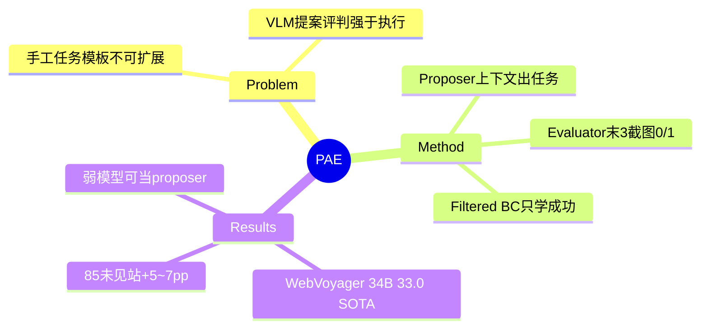

## Summary

PAE 提出 web agent 自主技能发现的闭环三角：**Proposer**（基于网站上下文自动提任务）→ **Agent**（rollout）→ **Evaluator**（VLM 看最后三张截图给 0/1 reward）→ Filtered BC 训练，全程无人工任务与 ground-truth reward。核心洞察是 VLM 的**能力不对称**：构思任务和评判结果远易于执行——所以弱 VLM 也能给强 agent 当 proposer/evaluator。LLaVa-34B PAE 在 WebVoyager 33.0%（超 SFT +10.8pp、超此前开源 SOTA Qwen2VL-72B +10.4pp），且零样本泛化到 85 个未见网站（+5~7pp）。

## Problem & Motivation

手工定义任务模板不可扩展、限制技能多样性。核心问题："agent 能否自主发现并练习潜在有用的技能？"利用 VLM 提任务/判结果强于执行的不对称性 bootstrap。

## Method

- **Context-aware task proposer**：仅凭网站名（知名站）或用户演示截图（长尾/自定义站，10 条/站）生成多样可行任务；Claude-3-Sonnet 或 Qwen2VL-7B/72B 皆可。
- **Agent**：LLaVa-1.6-7B/34B；截图 + set-of-marks 观察；输出 CoT 再动作（CoT 对泛化关键）；horizon 10 步。
- **Evaluator**：VLM 看**最后三张截图 + agent 回复**给 outcome 0/1——刻意不用 step-based evaluator（幻觉太多）；与人一致性差 system-level 1.7% / instance-level 8.6%。
- **RL = Filtered BC**：只对成功轨迹的思考+动作做 NLL 模仿——0/1 稀疏 reward 下不需要复杂 RL 基建。
- 环境：WebVoyager 13 个真实网站（557 任务）+ WebArena 3 个自托管域（208 任务）；训练期任务分布与真 reward 全程隐藏（用估计量 Ĉ、R̂）。

## Key Results

- **WebVoyager**：LLaVa-7B SFT 14.9 → PAE **22.3**（追平 34B SFT，5× 少参数）；LLaVa-34B SFT 22.2 → PAE **33.0**（开源 SOTA，此前最佳 Qwen2VL-72B 22.6；Claude 3.5 Sonnet 50.5 仍遥遥领先）。
- **WebArena Easy**：7B 18.0→24.6；34B 22.2→26.0。
- **零样本泛化（85 个未见网站 / 500 合成任务）**：7B 9.1→16.3、34B 16.1→21.4——自主发现的技能可迁移。
- **不对称性实证**：用能力更弱的 Qwen2VL-7B（自身只有 7.5%）当 proposer/evaluator，7B agent 仍达 23.1%（SFT 18.0%）。
- 失败模式改善：7B 视觉幻觉 37%→23%，34B 低层技能错误 45%→21%。

## Strengths & Weaknesses

**Strengths**：proposer-agent-evaluator 三角成为后续 self-improving 工作的模板范式（WebRL 的课程、InSTA 的三角色都可视为变体）；"提案/评判 ≪ 执行"的不对称性有跨模型实证；零样本泛化实验设计（85 未见站）在 2024 年是超前的。

**Weaknesses / 边界**：
- evaluator instance-level 8.6% 误差直接进 Filtered BC 训练集——与 InSTA/Explorer 同款 judge 噪声问题，且 outcome-only（放弃过程信号换鲁棒性）。
- Filtered BC 只学成功轨迹——失败轨迹信息全弃（对照后续 WebRL/DUDE 对失败的利用，这是代际差距）。
- 10 步 horizon 上限使复杂任务系统性超时；每站 ~200 任务的规模上限未探索。
- 长尾网站仍需 10 条人工演示当 proposer 上下文——"自主"有一个小的人工引导底座。

## Mind Map

## Notes

- **对环境引擎（任务供给轴）的定位**：PAE 是任务供给家族的"RL 闭环极点"——任务生成 + reward 全部由模型自给，环境只需可交互。四种设计的谱系就此完整：NNetNav（hindsight，零结构）→ Explorer（流水线，半结构）→ Go-Browse（图结构 + 沙盒 reset）→ PAE（proposer-evaluator 闭环 + RL）→ InSTA（规模化到 15 万站）。共同瓶颈都是 **evaluator/judge 噪声**（8.6%~19%），再次收敛到 survey 轴 2 的结论：可验证性是任务供给的真瓶颈。
- "能力不对称"（propose/evaluate ≪ execute）是个值得记的 pattern：它解释了为什么 LLM-as-judge 系统能自举，也预示 verifier 特化小模型可行（后被 [[Papers/2606-OpenWebRL]] 的 8B judge 89.8% 证实）。
- 与 [[Papers/2411-WebRL]] 互补：PAE 证明"任务从哪来"，WebRL 证明"课程怎么排"——两者合起来是 self-evolving 训练环境的雏形。
