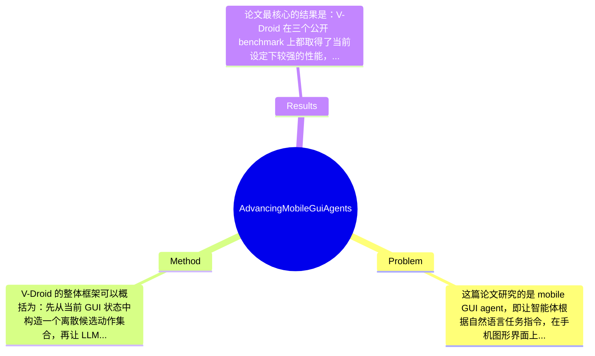

## Summary
该论文针对移动端 GUI agent 在真实部署中成功率不足、推理延迟过高的问题，提出了一个 verifier-driven 框架 V-Droid，用 LLM 先评估候选动作再决策而不是直接生成动作；方法上结合离散化 action space、prefilling-only 加速验证、pairwise progress preference training 与 human-agent joint annotation，最终在 AndroidWorld、AndroidLab、MobileAgentBench 上分别达到 59.5%、38.3%、49% 的成功率，并将单步延迟降到 4.3s。

## Problem & Motivation
这篇论文研究的是 mobile GUI agent，即让智能体根据自然语言任务指令，在手机图形界面上像人一样点击、输入、滑动，从而完成多步操作任务。这属于 embodied agent / GUI automation / LLM agent 的交叉方向，核心难点在于：系统既要理解当前屏幕的视觉与结构信息，又要在动态、长程、多分支的交互流程中做出正确决策。这个问题非常重要，因为它比 API agent 更通用，不依赖 app 开发者提供接口，理论上可以覆盖大量真实移动应用场景，例如表单填写、信息检索、设置调整、电商操作和无障碍辅助等。

现实意义上，若 mobile GUI agent 能稳定工作，就意味着“自然语言即操作系统”的交互范式可能真正落地。但现有方法距离实用部署仍然有明显差距。第一类不足是决策方式过于依赖 LLM 直接生成动作，输出空间连续且开放，容易生成不存在、坐标不准或语义模糊的动作，导致一步错步步错。第二类不足是 latency 高，尤其当系统需要复杂 reasoning、调用大型 VLM 或多轮规划时，单步耗时可超过 25 秒，这对实际手机交互几乎不可接受。第三类不足是训练数据难获取，GUI 任务带状态依赖与多步过程属性，单纯 imitation learning 很难学到“哪个动作更推进任务”，而人工逐步标注代价又极高。

因此，作者提出新方法的动机是合理的：既然直接生成动作不稳定，不如把问题改写为“候选动作验证与排序”；既然验证多个动作可能带来额外开销，就必须同步设计高效推理机制；既然 verifier 需要过程偏好数据，就要构建可扩展的数据采集方式。论文的关键洞察在于，把 mobile agent 的核心瓶颈从“生成能力”转化为“判别能力”，并利用 GUI 环境天然可离散化的 action space，使 LLM 更像一个 scorer / verifier，而不是 free-form generator。这一范式转换是本文最核心的贡献。

## Method
V-Droid 的整体框架可以概括为：先从当前 GUI 状态中构造一个离散候选动作集合，再让 LLM-based verifier 对每个候选动作进行逐一打分，选择最可能推进任务完成的动作执行；与此同时，通过针对“过程偏好”的训练和半自动数据标注机制，让 verifier 学会比较动作优劣，并通过推理加速策略降低多候选验证带来的额外时延。这个框架的本质不是让模型‘想出一个动作’，而是让模型‘在有限动作中选出最好一个’，因此把开放式生成问题转成了受约束排序问题。

1. 离散化 action space 构建
- 作用：把当前屏幕上可执行的动作枚举出来，形成 verifier 可评估的候选集合。候选通常应包括点击某个可交互 UI 元素、输入文本、滑动、返回等。
- 设计动机：移动 GUI 与开放网页环境相比，元素边界和操作类型相对更结构化，适合离散化。这样可显著降低生成空间复杂度，减少 hallucinated action。
- 与现有方法区别：很多 prior work 让 LLM 直接输出坐标、元素描述或自然语言动作，存在表述歧义和 grounding 误差；V-Droid 则先做 candidate construction，再做 ranking，更接近 classical search + neural scoring 的范式。

2. Scoring with verifier
- 作用：对每个候选动作估计其对当前任务进展的贡献，并输出最终决策。
- 设计动机：在 GUI 多步任务中，关键不是局部语义匹配，而是“这个动作是否真正推进了任务”。因此 verifier 学习的是 progress-aware preference，而不是简单 relevance matching。
- 与现有方法区别：现有 generator-based agent 常让模型一次性输出 reasoning + action，容易把语言流畅性误当成决策正确性。V-Droid 明确把语言生成退居次位，把判别式比较作为主任务。
- 技术细节：论文摘要与目录显示其采用 pair-wise progress preference training，说明训练目标不是绝对监督某个动作唯一正确，而是学习在动作对之间比较哪一个更优。这比单点分类更适合多路径完成任务的 GUI 场景。

3. Prefilling-only workflow 与 verification acceleration
- 作用：缓解“要验证多个动作就会更慢”的天然问题，使 verifier-driven 方法不仅更准，而且足够快。
- 设计动机：如果每个候选动作都走完整 LLM decoding，成本会线性爆炸，因此必须复用前缀计算、减少生成过程。
- 与现有方法区别：很多 agent 把耗时花在长 chain-of-thought 或多模型级联上；V-Droid 则强调 verification 应尽可能转化为高吞吐、低生成量的 scoring 过程。
- 技术细节：根据文中表述，作者提出 prefilling-only workflow，意味着更多依赖 prefill 阶段表征而非长文本解码，从而把单次 decision latency 压到 0.7s、单步 4.3s。具体缓存机制、批处理方式或打分头形式，给定摘录中未完全展开，论文完整正文应有更细节说明。

4. Pairwise process preference training
- 作用：增强 verifier 的决策与自纠错能力。
- 设计动机：GUI 自动化任务的监督信号天然稀疏，最终成功/失败难以指导每一步；而过程级 preference 可以告诉模型“哪个动作更接近目标”。
- 与现有方法区别：不同于 imitation learning 只模仿单一路径，也不同于 outcome-only reward；这里直接针对 stepwise progress 建模，更贴近 agent 决策本身。
- 目录还显示训练分为 Decision-Making Training 和 Self-Correcting Training，说明作者不仅训练模型选对动作，也训练其在历史错误后重新回到正确轨迹。这一点对真实部署尤其关键，因为移动任务中恢复能力往往比单步精度更重要。

5. Human-Agent-Joint-Annotation
- 作用：以可扩展方式构造 verifier 训练数据。
- 设计动机：纯人工标注每一步候选动作偏好成本极高，而完全自动标注又可能噪声过大。
- 与现有方法区别：论文提出 Verifier-As-Annotator 和 iterative annotation and training，意味着先用已有 verifier 辅助产生或筛选标注，再由人类参与校正，形成闭环提升。
- 这是一个很实际的系统设计，因为 verifier-driven 方法成功与否很依赖高质量 preference data，而这恰恰是很多 agent 论文容易轻描淡写的部分。

整体看，V-Droid 的方法设计是相对简洁且有工程理性的：它不是堆叠复杂 planner、memory、toolchain，而是围绕“生成改验证”这一主线展开，并在 action space、训练信号、数据采集和推理效率上形成闭环。优点是问题分解清楚；潜在代价则是系统高度依赖候选动作构造质量，如果 candidate set 漏掉关键动作，再强的 verifier 也无能为力。

## Key Results
论文最核心的结果是：V-Droid 在三个公开 benchmark 上都取得了当前设定下较强的性能，同时显著降低了时延。具体来说，在 AndroidWorld 上任务成功率达到 59.5%，相比现有 agent 提升 5.2%；在 AndroidLab 上达到 38.3%，提升 2.1%；在 MobileAgentBench 上达到 49.0%，提升 9.0%。从绝对值看，AndroidWorld 上接近 60% 说明其在相对成熟 benchmark 上已有明显进展，但与文中提到的人类 80% 仍存在约 20 个百分点差距，说明距离“实用可靠”仍有距离。

时延方面，V-Droid 的单步 latency 为 4.3s，比 existing mobile agents 快 6.1×；同时摘要还给出 per decision latency 为 0.7s，达到 32.1× 的加速。这个结果很关键，因为 verifier-driven 方案表面上看会更慢——毕竟需要对多个候选动作打分——但论文证明通过 prefilling-only workflow 等设计，验证式范式反而能比生成式范式更快。这一点是本文非常有说服力的实验支撑。

Benchmark 方面，论文明确使用 AndroidWorld、AndroidLab、MobileAgentBench，指标至少包括 task success rate 和 latency。Baselines 目录中有专门章节，但给定摘录未列出完整 baseline 名单；文中提及 Agent-S2，以及使用 GPT-4o、UI-TARS-72B 的现有系统作为对照。若按 AndroidWorld 的数字反推，之前最好结果约为 54.3%，与引言中的描述一致。

论文还包含 training scaling law、design alternatives、system overhead、failure study 等章节，说明作者不只展示主结果，也尝试分析训练数据规模、设计取舍与系统成本，这是优点。消融层面，从目录推断至少比较了 verifier-driven 与 alternative designs、加速模块、训练策略的贡献，但摘录中未给出具体 ablation 数字，因此这里不能捏造，只能说“论文有相关章节，具体数值在提供材料中未提及”。批判性地看，实验虽然覆盖三个 benchmark，已比很多单 benchmark 工作更扎实，但仍可能缺少跨设备、跨语言、长任务长度分层、失败恢复成功率等更细粒度分析。是否存在 cherry-picking？从摘要看作者报告了全部主 benchmark 而非单一最佳集，初步不像明显 cherry-picking，但由于未看到完整表格，不能完全排除对某些困难子集披露不足的可能。

## Strengths & Weaknesses
这篇论文最突出的亮点有三点。第一，范式创新明确：它不是在 generator-based mobile agent 上做小修小补，而是把问题重写为 verifier-driven decision making。对 GUI 任务这种天然可离散操作空间，这种转化非常合理，也比开放式动作生成更贴近工程可控性。第二，方法链条完整：作者不只提出 verifier 的概念，还补齐了 action space construction、inference acceleration、pairwise preference training、human-agent annotation pipeline，说明其目标不是论文概念验证，而是部署导向系统。第三，结果兼顾效果与速度。很多 agent 论文只强调成功率，忽略实用 latency；V-Droid 同时把成功率和单步时延都往前推进，这是其相对有价值之处。

局限性也很明显。第一，方法高度依赖候选动作空间质量。若 GUI 解析不完整、关键控件未被纳入 candidate set、文本输入候选生成不足，那么 verifier 只能在错误集合里选“最不差”的动作，这是一种上界受限问题。第二，适用范围可能受限于结构化、可感知的移动 GUI 场景。对于高度动态内容、canvas 渲染、复杂手势、多模态输入、登录验证码等环境，离散化与验证式评分未必同样有效。第三，虽然论文显著降低了 latency，但 4.3s/step 对真实用户交互仍不算“即时”，长任务累计等待时间可能依旧偏高。再者，训练需要 process preference data 与联合标注流程，这虽然比纯人工更可扩展，但数据构建成本仍然不可忽视。

潜在影响上，这项工作可能推动 GUI agent 社区从“更强生成模型”转向“更可靠的动作评估与搜索”，也可能影响 web agent、desktop agent、embodied agent 的决策框架设计。尤其在高风险操作场景中，verification-first 往往比 direct generation 更符合部署逻辑。

严格区分信息来源：已知——论文报告了三个 benchmark 的成功率提升、4.3s 单步时延、0.7s 单次决策时延，并提出 pairwise preference training 与 human-agent-joint-annotation。推测——其 verifier 训练很可能显著受益于高质量候选对构造，且在长程任务中恢复能力优于纯生成 agent，但具体增益需看正文。不知道——不同模型规模的具体影响、annotation 人力成本、跨设备泛化能力、对 OCR/grounding 误差的敏感性，以及在真实用户数据上的长期稳定性，提供材料中均未充分说明。

综合评分给 3 分：有参考价值。它提出了值得重视的新范式，也有不错实验支撑，但从当前信息看仍未到领域里程碑级别，且不少关键能力边界需要结合完整正文与后续复现进一步验证。

## Mind Map

## Notes
<!-- 其他想法、疑问、启发 -->
